# Review: gh_trinodb_trino_18111

**Fetching all Hive metadata tables fails after upgrading Trino**

- source: https://github.com/trinodb/trino/issues/18111
- kind: LLM draft (needs review)
- reviewed: `True`
- graph: `data/github_v0/graphs/gh_trinodb_trino_18111.json` · raw thread: `data/github_v0/raw/gh_trinodb_trino_18111.json`

```mermaid
flowchart LR
    N0["<b>N0 cross-schema metadata query regression reported</b><br/><small>info: 5</small>"]
    N1["<b>N1 deployment and Trino failure trace collected</b><br/><small>info: 7</small>"]
    N2["<b>N2 Hive metastore failure recorded</b><br/><small>info: 8</small>"]
    N3["<b>N3 all-schema trigger and upgrade constraint established</b><br/><small>info: 11</small>"]
    N4["<b>N4 candidate compatibility change verified</b><br/><small>info: 12</small>"]
    N_terminal["<b>terminal query succeeds with compatibility fallback</b><br/><small>info: 13</small>"]
    N0 -.->|"❓ hive_metastore_is_aws_emr_6_7_0, trino_stack_trace_reports_socket_closed_by_peer_in_get_all_tables"| N1
    linkStyle 0 stroke:#3b82f6,stroke-width:2px
    N1 -.->|"❓ hms_log_reports_failed_mtable_and_no_such_database_row"| N2
    linkStyle 1 stroke:#3b82f6,stroke-width:2px
    N2 -.->|"❓ failure_only_occurs_for_unfiltered_all_tables_query, schema_filtered_information_schema_query_works, emr_upgrade_does_not_offer_newer_hive_version"| N3
    linkStyle 2 stroke:#3b82f6,stroke-width:2px
    N3 -.->|"❓ candidate_change_18274_executes_query_successfully"| N4
    linkStyle 3 stroke:#3b82f6,stroke-width:2px
    N4 ==>|"⚡ Provide and ship a compatibility kill switch that avoids the new cross-schema batch table-fetch path, allowing affected Hive metastores to use the earlier per-schema listing behavior."| N_terminal
    linkStyle 4 stroke:#f97316,stroke-width:2px
    class N0 start
    class N1 normal
    class N2 normal
    class N3 normal
    class N4 normal
    class N_terminal terminal
    classDef start fill:#fee2e2,stroke:#b91c1c,color:#000
    classDef terminal fill:#dcfce7,stroke:#15803d,color:#000
    classDef normal fill:#fef3c7,stroke:#a16207,color:#000
```

## Opening (body)

> I'm using Trino 419 with Hive 2.3.3 or 3.1.3 and `hive.metastore-timeout=5m`. Running `select * from hive.information_schema.tables` fails with a Hive metastore timeout, while Trino 417 completed it in about 3–4 minutes. We have around 500,000 tables. Starting with Trino 418, the metadata logic changed from listing tables separately for each schema to fetching all tables at once, and I suspect that puts too much load on the metastore. Is there a solution?

## Satisfaction conditions

1. Must identify the accepted root cause: Trino's newer cross-schema all-tables fetch exposed a Hive metastore defect, evidenced by the peer closing the socket and the HMS `No such database row` failure; the reporter's initial load or memory theory alone is not sufficient.
2. Must ground the diagnosis in the collected Trino stack trace, Hive metastore log, and the fact that schema-filtered metadata queries still work.
3. Must recommend the Trino-side compatibility kill switch or equivalent fallback to the earlier per-schema table-listing path for environments where the Hive metastore cannot be upgraded.
4. Must not present merely increasing the metastore timeout as the established fix, because the metastore closes the connection and logs an object lookup failure.
5. Must have the reporter verify the unrestricted query on a build containing the compatibility change before treating the original issue as resolved.

## Edges

| edge | type | gates / info | payload |
|---|---|---|---|
| `e1_N0__N1` | clarification_only | asks: hive_metastore_is_aws_emr_6_7_0, trino_stack_trace_reports_socket_closed_by_peer_in_get_all_tables | We are using the Hive metastore supplied with AWS EMR 6.7.0. / The stack trace says `Error listing tables for catalog hive` and `Socket is closed by peer`. The cause is in ` |
| `e2_N1__N2` | clarification_only | asks: hms_log_reports_failed_mtable_and_no_such_database_row | At the time of the failure, my Hive metastore log shows `FailedObject ... MTable`, then `NucleusObjectNotFound |
| `e3_N2__N3` | clarification_only | asks: failure_only_occurs_for_unfiltered_all_tables_query, schema_filtered_information_schema_query_works, emr_upgrade_does_not_offer_newer_hive_version | It only happens when I execute `select * from hive.information_schema.tables`. If I add a condition for a spec / A query restricted to an example schema completes successfully. / We are on EMR 6.7.0, and even moving to the latest EMR release available to us, 6.11.0, would not upgrade the  |
| `e4_N3__N4` | clarification_only | asks: candidate_change_18274_executes_query_successfully | I've tested #18274 and confirmed that the full query executed successfully. |
| `e5_N4__N_terminal` | solution_only | req_info: trino_419_all_hive_tables_query_fails, trino_417_completed_query_in_3_4_minutes, reporter_links_regression_to_cross_schema_all_tables_change, metastore_contains_around_500k_tables, hive_metastore_is_aws_emr_6_7_0, trino_stack_trace_reports_socket_closed_by_peer_in_get_all_tables, hms_log_reports_failed_mtable_and_no_such_database_row, failure_only_occurs_for_unfiltered_all_tables_query, schema_filtered_information_schema_query_works, emr_upgrade_does_not_offer_newer_hive_version, candidate_change_18274_executes_query_successfully elements: identifies_hms_defect_exposed_by_cross_schema_batch_fetch, provides_kill_switch_or_fallback_to_per_schema_listing, grounds_diagnosis_in_peer_closed_socket_and_hms_missing_row_log, uses_reporter_verification_on_a_build_containing_the_change_before_declaring_resolution | Provide and ship a compatibility kill switch that avoids the new cross-schema batch table-fetch path, allowing affected Hive metastores to use the earlier per-schema listing behavior. |

## Nodes

| node | terminal | volunteered | images | symptoms |
|---|---|---|---|---|
| `N0` |  | 0 | 0 | On Trino 419, `select * from hive.information_schema.tables` fails with a Hive metastore timeout; on Trino 417, the same query completed in  |
| `N1` |  | 0 | 0 | My Trino query fails while listing tables because the connection to the Hive metastore is closed by the peer during `getAllTables`. |
| `N2` |  | 0 | 0 | When the query fails, my Hive metastore log contains a failed `MTable` access and `NucleusObjectNotFoundException: No such database row` fro |
| `N3` |  | 0 | 0 | The failure occurs when I query all rows from `hive.information_schema.tables`; adding a schema filter makes the query work. Upgrading my EM |
| `N4` |  | 0 | 0 | With the linked candidate change, my full `hive.information_schema.tables` query executes successfully. |
| `N_terminal` | ✓ | 0 | 0 | The full Hive information-schema tables query completes on a build containing the compatibility change. |

## Machine review (audit pass, adversarially verified)

Auditor verdict: **n/a** · 0 of 0 findings survived independent refutation.

__

## Review checklist

> The graph is the case's ANSWER KEY, not a transcript: edge order need
> not mirror thread chronology. Do not file chronology mismatch as a
> defect; what must be faithful is who knew what, when.

Structural (machine-checked by `scripts/validate.py`, re-verify after edits):

- [ ] validates: schema + info-containment + terminal reachability

Semantic (the defect catalog — check each against the source thread):

- [ ] **Faithful blind paths** — every `is_known_blind_path` edge corresponds
  to an attempt actually falsified in the thread (or a brush-off the
  reporter rejected). No invented failures; no ACCEPTED fix mislabeled as
  a blind path (the most common LLM defect class).
- [ ] **Gettable required info** — every id in any `solution.required_info`
  is obtainable: a clarification on some edge, or in the start node's
  info_state, or volunteered (with matching `volunteered_info` text).
  Engineer-only inference belongs in `info_inferred_by_engineer` /
  `inference_hint`, not in hard required_info.
- [ ] **Measurement-class rule** — handler-initiated measurements the user
  executed (bisections, test builds, config probes, version checks) are
  clarification edges, not solutions; their answers state what the
  measurement showed.
- [ ] **No logistics gates** — `required_elements_for_full_match` encode the
  technical diagnostic→fix chain, not release/packaging/scheduling
  remarks the engineer merely mentioned.
- [ ] **Coherent reveals** — each `user_answer_in_this_oncall` is consistent
  with the thread, delivers what it promises, and stays in the user's
  voice (no future knowledge, no diagnosis the user never made).
- [ ] **Symptoms are observations** — `symptoms_visible` contains only what
  the user can see; no causes or advice.
- [ ] **Terminal semantics** — satisfaction_conditions demand root cause +
  evidence grounding + prohibition of falsified moves + user verification;
  the terminal node is the verified-resolved state.
- [ ] **Image assignment** — referenced attachments exist and sit on the
  right hook (opening / node symptom / clarification evidence).
- [ ] **Persona** — matches the reporter's actual expertise and style.

## How to sign off

1. Edit the graph JSON if needed (authored fields only; keep
   `concrete_example` as the factual record).
2. `uv run scripts/validate.py '<graph path>'`
3. Set `metadata.hitl_reviewed: true` in the graph JSON.
4. Re-run `uv run scripts/make_review_docs.py` to refresh this page.
