# Review: gh_trinodb_trino_24572

**Regression: Coordinator crashes with OOM in 468**

- source: https://github.com/trinodb/trino/issues/24572
- kind: LLM draft (needs review)
- reviewed: `True`
- graph: `data/github_v0/graphs/gh_trinodb_trino_24572.json` · raw thread: `data/github_v0/raw/gh_trinodb_trino_24572.json`

```mermaid
flowchart LR
    N0["<b>N0 coordinator native memory growth reported</b><br/><small>info: 4</small>"]
    N1["<b>N1 Java heap does not explain RSS</b><br/><small>info: 5</small>"]
    N2["<b>N2 deployment details collected</b><br/><small>info: 7</small>"]
    N2_x["<b>N2_x Python plugin removal aftermath</b><br/><small>info: 8</small>"]
    N3["<b>N3 native Other allocation isolated</b><br/><small>info: 9</small>"]
    N3_x["<b>N3_x dependency downgrade aftermath</b><br/><small>info: 10</small>"]
    N4["<b>N4 regression narrowed and rollback verified</b><br/><small>info: 12</small>"]
    N5["<b>N5 candidate fix verified by reporter</b><br/><small>info: 13</small>"]
    N_terminal["<b>terminal memory leak resolved</b><br/><small>info: 13</small>"]
    N0 -.->|"❓ visualvm_comparison_heap_under_2gb_despite_rss_growth"| N1
    linkStyle 0 stroke:#3b82f6,stroke-width:2px
    N1 -.->|"❓ connectors_postgres_mysql_hive_orc_csv_gzip, jvm_xmx_16gb_on_32gb_host"| N2
    linkStyle 1 stroke:#3b82f6,stroke-width:2px
    N2 ==>|"💥 blind: Remove or disable the functions-python plugin in case PythonEngine or its per-thread function instances are retaining native resources."| N2_x
    linkStyle 2 stroke:#ef4444,stroke-width:2px
    N2_x -.->|"❓ native_memory_other_468_grows_to_6586mb_vs_63mb_on_467"| N3
    linkStyle 3 stroke:#3b82f6,stroke-width:2px
    N3 ==>|"💥 blind: Rebuild 468 with the Netty and AWS SDK versions used by 467, on the theory that one of those third-party upgrades introduced the native allocation growth."| N3_x
    linkStyle 4 stroke:#ef4444,stroke-width:2px
    N3_x -.->|"❓ bisection_airbase204_commit_bad_previous_commit_good, rollback_to_airbase203_stops_memory_leak"| N4
    linkStyle 5 stroke:#3b82f6,stroke-width:2px
    N4 -.->|"❓ provided_airlift_fix_build_stops_leak"| N5
    linkStyle 6 stroke:#3b82f6,stroke-width:2px
    N5 ==>|"⚡ Keep the required Jetty generation but update Airlift so Jetty HTTP/1 response buffers are bounded and reused instead of allowing direct native allocations to grow without an effective bound."| N_terminal
    linkStyle 7 stroke:#f97316,stroke-width:2px
    class N0 start
    class N1 normal
    class N2 normal
    class N2_x normal
    class N3 normal
    class N3_x normal
    class N4 normal
    class N5 normal
    class N_terminal terminal
    classDef start fill:#fee2e2,stroke:#b91c1c,color:#000
    classDef terminal fill:#dcfce7,stroke:#15803d,color:#000
    classDef normal fill:#fef3c7,stroke:#a16207,color:#000
```

## Opening (body)

> My coordinator on Trino 468 consumes much more memory than the same workload on 467 and is eventually killed by the OS OOM killer. With the same queries, 467 used about 23 GB RSS after 1.5 hours on a 61 GB host, while 468 had already reached about 42–44 GB and continued growing. The 468 process was eventually killed at about 63 GB anonymous RSS. The same behavior occurs on an r6a.2xlarge with twice the memory.

## Satisfaction conditions

1. Must identify the final root cause as unbounded native direct-buffer growth in the Jetty HTTP/1 path introduced through the airbase 204 dependency update, rather than a Java heap leak.
2. Diagnosis must be grounded in the small VisualVM heap, the multi-gigabyte Native Memory Tracking Other category on 468, the good/bad dependency bisection, and the successful airbase 203 rollback.
3. The permanent fix must update Airlift to bound and reuse the Jetty buffer allocations while retaining the required newer Jetty generation; merely increasing host memory or reducing Xmx is not a root-cause fix.
4. Must not present removal of functions-python or downgrading Netty and AWS SDK as the solution, because both directions were tested in case and the OS OOM or high Other allocation remained.
5. Must have the affected reporter verify a build containing the allocation fix under the reproducing workload before declaring the issue resolved.

## Edges

| edge | type | gates / info | payload |
|---|---|---|---|
| `e1_N0__N1` | clarification_only | asks: visualvm_comparison_heap_under_2gb_despite_rss_growth | I ran the same exact test queries for about one hour on both 467 and 468 and created a VisualVM trace comparis |
| `e2_N1__N2` | clarification_only | asks: connectors_postgres_mysql_hive_orc_csv_gzip, jvm_xmx_16gb_on_32gb_host | I'm using PostgreSQL, MySQL, and Hive tables with ORC and gzip-compressed CSV file formats. / I'm using 16G for Xmx on an r6a.xlarge instance with 32G of memory. |
| `e3_N2__N2_x` | solution_only **BLIND** | req_info: trino468_coordinator_rss_growth_and_os_oom, visualvm_comparison_heap_under_2gb_despite_rss_growth, connectors_postgres_mysql_hive_orc_csv_gzip elements: suggests_disabling_or_removing_functions_python | Remove or disable the functions-python plugin in case PythonEngine or its per-thread function instances are retaining native resources. |
| `e4_N2_x__N3` | clarification_only | asks: native_memory_other_468_grows_to_6586mb_vs_63mb_on_467 | I enabled -XX:NativeMemoryTracking=detail and captured jcmd output from both versions after about one hour of  |
| `e5_N3__N3_x` | solution_only **BLIND** | req_info: trino468_coordinator_rss_growth_and_os_oom, visualvm_comparison_heap_under_2gb_despite_rss_growth, native_memory_other_468_grows_to_6586mb_vs_63mb_on_467 elements: suggests_rolling_back_netty_or_aws_sdk_versions | Rebuild 468 with the Netty and AWS SDK versions used by 467, on the theory that one of those third-party upgrades introduced the native allocation growth. |
| `e6_N3_x__N4` | clarification_only | asks: bisection_airbase204_commit_bad_previous_commit_good, rollback_to_airbase203_stops_memory_leak | I tested snapshots with the same queries. Commit a7e72d424f was good with Other at 95 MB, while 4718011a39 was / I built 468 after rolling airbase back to version 203, and that solves the memory leak issue. |
| `e7_N4__N5` | clarification_only | asks: provided_airlift_fix_build_stops_leak | I can confirm that the provided Airlift fix solves the issue. With it in place, the coordinator no longer show |
| `e8_N5__N_terminal` | solution_only | req_info: trino468_coordinator_rss_growth_and_os_oom, same_load_trino467_remains_lower_memory, visualvm_comparison_heap_under_2gb_despite_rss_growth, native_memory_other_468_grows_to_6586mb_vs_63mb_on_467, bisection_airbase204_commit_bad_previous_commit_good, rollback_to_airbase203_stops_memory_leak, provided_airlift_fix_build_stops_leak elements: identifies_jetty_http1_direct_buffer_allocation_growth_as_root_cause, updates_airlift_to_bound_and_reuse_jetty_buffers, retains_the_required_newer_jetty_generation, asks_user_to_verify_on_a_build_containing_the_fix | Keep the required Jetty generation but update Airlift so Jetty HTTP/1 response buffers are bounded and reused instead of allowing direct native allocations to grow without an effective bound. |

## Nodes

| node | terminal | volunteered | images | symptoms |
|---|---|---|---|---|
| `N0` |  | 2 | 0 | With the same coordinator workload, Trino 468 grows from roughly 42 GB RSS toward the host limit while 467 is around 23 GB after the same ru |
| `N1` |  | 0 | 0 | After about one hour of the same queries on 467 and 468, the Java heap shown by VisualVM is under 2 GB even though the 468 process RSS keeps |
| `N2` |  | 0 | 0 | The 468 coordinator continues consuming memory outside the small Java heap while running queries against PostgreSQL, MySQL, and Hive tables. |
| `N2_x` |  | 1 | 0 | After I removed the functions-python plugin directory and reran the same tests, the 468 coordinator still reached an OS OOM. |
| `N3` |  | 0 | 0 | For the same one-hour query run, Native Memory Tracking reports the Other category at 63 MB on 467 but 6586 MB on 468. |
| `N3_x` |  | 1 | 0 | A custom 468 build using the previous Netty and AWS SDK versions still leaks memory, and the Native Memory Tracking Other value remains just |
| `N4` |  | 1 | 0 | The build immediately before the airbase 204 update keeps Native Memory Tracking Other near 95 MB, while the build with that update grows in |
| `N5` |  | 0 | 0 | With the provided Airlift fix in place, the same workload no longer causes the coordinator memory leak. |
| `N_terminal` | ✓ | 0 | 0 | On a build containing the verified Airlift change, coordinator native memory remains stable under the workload and the OS OOM no longer occu |

## Machine review (audit pass, adversarially verified)

Auditor verdict: **n/a** · 0 of 0 findings survived independent refutation.

__

## Review checklist

> The graph is the case's ANSWER KEY, not a transcript: edge order need
> not mirror thread chronology. Do not file chronology mismatch as a
> defect; what must be faithful is who knew what, when.

Structural (machine-checked by `scripts/validate.py`, re-verify after edits):

- [ ] validates: schema + info-containment + terminal reachability

Semantic (the defect catalog — check each against the source thread):

- [ ] **Faithful blind paths** — every `is_known_blind_path` edge corresponds
  to an attempt actually falsified in the thread (or a brush-off the
  reporter rejected). No invented failures; no ACCEPTED fix mislabeled as
  a blind path (the most common LLM defect class).
- [ ] **Gettable required info** — every id in any `solution.required_info`
  is obtainable: a clarification on some edge, or in the start node's
  info_state, or volunteered (with matching `volunteered_info` text).
  Engineer-only inference belongs in `info_inferred_by_engineer` /
  `inference_hint`, not in hard required_info.
- [ ] **Measurement-class rule** — handler-initiated measurements the user
  executed (bisections, test builds, config probes, version checks) are
  clarification edges, not solutions; their answers state what the
  measurement showed.
- [ ] **No logistics gates** — `required_elements_for_full_match` encode the
  technical diagnostic→fix chain, not release/packaging/scheduling
  remarks the engineer merely mentioned.
- [ ] **Coherent reveals** — each `user_answer_in_this_oncall` is consistent
  with the thread, delivers what it promises, and stays in the user's
  voice (no future knowledge, no diagnosis the user never made).
- [ ] **Symptoms are observations** — `symptoms_visible` contains only what
  the user can see; no causes or advice.
- [ ] **Terminal semantics** — satisfaction_conditions demand root cause +
  evidence grounding + prohibition of falsified moves + user verification;
  the terminal node is the verified-resolved state.
- [ ] **Image assignment** — referenced attachments exist and sit on the
  right hook (opening / node symptom / clarification evidence).
- [ ] **Persona** — matches the reporter's actual expertise and style.

## How to sign off

1. Edit the graph JSON if needed (authored fields only; keep
   `concrete_example` as the factual record).
2. `uv run scripts/validate.py '<graph path>'`
3. Set `metadata.hitl_reviewed: true` in the graph JSON.
4. Re-run `uv run scripts/make_review_docs.py` to refresh this page.
