# Review: gh_triton-lang_triton_1098

**TypeError: dot() got an unexpected keyword argument 'trans_b'**

- source: https://github.com/triton-lang/triton/issues/1098
- kind: LLM draft (needs review)
- reviewed: `True`
- graph: `data/github_v0/graphs/gh_triton-lang_triton_1098.json` · raw thread: `data/github_v0/raw/gh_triton-lang_triton_1098.json`

```mermaid
flowchart LR
    N0["<b>N0 trans_b API error reported</b><br/><small>info: 3</small>"]
    N1["<b>N1 packaged builds lack explicit transpose API</b><br/><small>info: 6</small>"]
    N2_x["<b>N2_x source build failure aftermath</b><br/><small>info: 8</small>"]
    N3["<b>N3 compiler environment collected</b><br/><small>info: 10</small>"]
    N_terminal["<b>terminal source build and Flash Attention working</b><br/><small>info: 11</small>"]
    N0 ==>|"🔀 ❓stable_and_nightly_lack_tl_trans + ⚡Update the outdated Flash Attention kernel syntax by replacing the removed `trans_b` argument with an explicit transpose of the second dot operand."| N1
    linkStyle 0 stroke:#a855f7,stroke-width:2px
    N1 ==>|"💥 blind: Install the current Triton master from source because the available stable and nightly packages are too old to provide the explicit transpose API."| N2_x
    linkStyle 1 stroke:#ef4444,stroke-width:2px
    N2_x -.->|"❓ ubuntu1804_gcc_environment"| N3
    linkStyle 2 stroke:#3b82f6,stroke-width:2px
    N3 ==>|"⚡ Use a compiler with C++17 support, then install current Triton from source and keep the Flash Attention kernel's explicit `tl.trans` form."| N_terminal
    linkStyle 3 stroke:#f97316,stroke-width:2px
    class N0 start
    class N1 normal
    class N2_x normal
    class N3 normal
    class N_terminal terminal
    classDef start fill:#fee2e2,stroke:#b91c1c,color:#000
    classDef terminal fill:#dcfce7,stroke:#15803d,color:#000
    classDef normal fill:#fef3c7,stroke:#a16207,color:#000
```

## Opening (body)

> I am integrating the Triton version of Flash Attention into a GPT-like model. Calling flash_attn_triton.flash_attn_func with half-precision CUDA query, key, and value tensors fails with `TypeError: dot() got an unexpected keyword argument 'trans_b'`. The attention code and a complete test example are included.

## Satisfaction conditions

1. Must identify the original failure as an API mismatch in the Flash Attention kernel: its `tl.dot` call uses the obsolete `trans_b` keyword and should use an explicit transpose with current Triton source.
2. Must distinguish the later source-build failure from the original runtime error: Ubuntu 18.04's old default GCC lacks the C++17 support needed to compile the current source.
3. Must recommend a C++17-capable compiler, installation of current Triton source, and the explicit `tl.trans` dot form rather than claiming the old stable or stale nightly package supports it.
4. Must not merely repeat `pip install -e .` under the unchanged old compiler, because that attempt already stopped at the missing `<filesystem>` header.
5. Must ask the reporter to rerun the Flash Attention example after rebuilding and only treat the issue as resolved once it runs successfully.

## Edges

| edge | type | gates / info | payload |
|---|---|---|---|
| `e1_N0__N1` | mixed | req_info: triton_dot_rejects_trans_b_keyword, flash_attention_reproduction_code_shared elements: replaces_trans_b_with_explicit_tl_trans, recognizes_that_the_flash_attention_source_uses_an_outdated_dot_api | Update the outdated Flash Attention kernel syntax by replacing the removed `trans_b` argument with an explicit transpose of the second dot operand. |
| `e2_N1__N2_x` | solution_only **BLIND** | req_info: stable_and_nightly_lack_tl_trans elements: installs_current_triton_source_instead_of_the_old_packaged_builds | Install the current Triton master from source because the available stable and nightly packages are too old to provide the explicit transpose API. |
| `e3_N2_x__N3` | clarification_only | asks: ubuntu1804_gcc_environment | I am pretty sure it is GCC on Ubuntu 18.04. I will have to check the exact compiler version when I get back. |
| `e4_N3__terminal` | solution_only | req_info: triton_dot_rejects_trans_b_keyword, flash_attention_reproduction_code_shared, stable_and_nightly_lack_tl_trans, source_build_filesystem_header_error, ubuntu1804_gcc_environment elements: identifies_the_old_flash_attention_trans_b_call_as_incompatible_with_the_current_dot_api, uses_explicit_tl_trans_with_current_triton_source, upgrades_to_a_cpp17_capable_gcc_or_clang_before_rebuilding, asks_user_to_rerun_the_flash_attention_example_and_verify_success | Use a compiler with C++17 support, then install current Triton from source and keep the Flash Attention kernel's explicit `tl.trans` form. |

## Nodes

| node | terminal | volunteered | images | symptoms |
|---|---|---|---|---|
| `N0` |  | 1 | 0 | Running the Triton Flash Attention call in my GPT-like attention module raises `TypeError: dot() got an unexpected keyword argument 'trans_b |
| `N1` |  | 2 | 0 | After changing the Flash Attention source to `qk += tl.dot(q, tl.trans(k))`, both the latest stable package and the available nightly raise  |
| `N2_x` |  | 2 | 0 | Installing the cloned Triton source with `pip install -e .` stops while compiling `LLVMIRTranslation.cpp` because `<filesystem>` cannot be f |
| `N3` |  | 1 | 0 | The source build still stops at the missing `<filesystem>` header on my Ubuntu 18.04 GCC environment. The installation has also repeatedly s |
| `N_terminal` | ✓ | 1 | 0 | With gcc/g++ 9, I can install Triton from source and run the Triton version of Flash Attention successfully. |

## Machine review (audit pass, adversarially verified)

Auditor verdict: **n/a** · 0 of 0 findings survived independent refutation.

__

## Review checklist

> The graph is the case's ANSWER KEY, not a transcript: edge order need
> not mirror thread chronology. Do not file chronology mismatch as a
> defect; what must be faithful is who knew what, when.

Structural (machine-checked by `scripts/validate.py`, re-verify after edits):

- [ ] validates: schema + info-containment + terminal reachability

Semantic (the defect catalog — check each against the source thread):

- [ ] **Faithful blind paths** — every `is_known_blind_path` edge corresponds
  to an attempt actually falsified in the thread (or a brush-off the
  reporter rejected). No invented failures; no ACCEPTED fix mislabeled as
  a blind path (the most common LLM defect class).
- [ ] **Gettable required info** — every id in any `solution.required_info`
  is obtainable: a clarification on some edge, or in the start node's
  info_state, or volunteered (with matching `volunteered_info` text).
  Engineer-only inference belongs in `info_inferred_by_engineer` /
  `inference_hint`, not in hard required_info.
- [ ] **Measurement-class rule** — handler-initiated measurements the user
  executed (bisections, test builds, config probes, version checks) are
  clarification edges, not solutions; their answers state what the
  measurement showed.
- [ ] **No logistics gates** — `required_elements_for_full_match` encode the
  technical diagnostic→fix chain, not release/packaging/scheduling
  remarks the engineer merely mentioned.
- [ ] **Coherent reveals** — each `user_answer_in_this_oncall` is consistent
  with the thread, delivers what it promises, and stays in the user's
  voice (no future knowledge, no diagnosis the user never made).
- [ ] **Symptoms are observations** — `symptoms_visible` contains only what
  the user can see; no causes or advice.
- [ ] **Terminal semantics** — satisfaction_conditions demand root cause +
  evidence grounding + prohibition of falsified moves + user verification;
  the terminal node is the verified-resolved state.
- [ ] **Image assignment** — referenced attachments exist and sit on the
  right hook (opening / node symptom / clarification evidence).
- [ ] **Persona** — matches the reporter's actual expertise and style.

## How to sign off

1. Edit the graph JSON if needed (authored fields only; keep
   `concrete_example` as the factual record).
2. `uv run scripts/validate.py '<graph path>'`
3. Set `metadata.hitl_reviewed: true` in the graph JSON.
4. Re-run `uv run scripts/make_review_docs.py` to refresh this page.
