# Review: gh_triton-lang_triton_2042

**MatMul tutorial fails for float32 inputs**

- source: https://github.com/triton-lang/triton/issues/2042
- kind: LLM draft (needs review)
- reviewed: `True`
- graph: `data/github_v0/graphs/gh_triton-lang_triton_2042.json` · raw thread: `data/github_v0/raw/gh_triton-lang_triton_2042.json`

```mermaid
flowchart LR
    N0["<b>N0 float32 tutorial mismatch reported</b><br/><small>info: 4</small>"]
    N1["<b>N1 numerical differences measured</b><br/><small>info: 6</small>"]
    N1_x["<b>N1_x TF32-only workaround aftermath</b><br/><small>info: 7</small>"]
    N2["<b>N2 mismatch scales with larger reduction</b><br/><small>info: 8</small>"]
    N3["<b>N3 patched non-TF32 comparison verified</b><br/><small>info: 10</small>"]
    N4["<b>N4 remaining TF32 difference characterized</b><br/><small>info: 11</small>"]
    N_terminal["<b>terminal precision behavior explained and verified</b><br/><small>info: 12</small>"]
    N0 -.->|"❓ repro_environment_a100_triton_2_1_cuda_12_1, max_differences_at_512_by_precision_mode"| N1
    linkStyle 0 stroke:#3b82f6,stroke-width:2px
    N1 ==>|"💥 blind: Treat TF32 as the entire cause and only disable it in the Triton dot operation."| N1_x
    linkStyle 1 stroke:#ef4444,stroke-width:2px
    N1_x -.->|"❓ max_differences_at_1024_by_precision_mode"| N2
    linkStyle 2 stroke:#3b82f6,stroke-width:2px
    N2 -.->|"❓ provided_patch_makes_float32_non_tf32_match"| N3
    linkStyle 3 stroke:#3b82f6,stroke-width:2px
    N3 -.->|"❓ tf32_enabled_outputs_remain_nonidentical"| N4
    linkStyle 4 stroke:#3b82f6,stroke-width:2px
    N4 ==>|"⚡ Preserve float32 output throughout the tutorial when testing float32 inputs, rather than converting the FP32 accumulator to float16; compare with TF32 disabled when seeking close agreement, and treat small TF32-enabled differences as expected when Torch and Triton use different reduction orders."| N_terminal
    linkStyle 5 stroke:#f97316,stroke-width:2px
    class N0 start
    class N1 normal
    class N1_x normal
    class N2 normal
    class N3 normal
    class N4 normal
    class N_terminal terminal
    classDef start fill:#fee2e2,stroke:#b91c1c,color:#000
    classDef terminal fill:#dcfce7,stroke:#15803d,color:#000
    classDef normal fill:#fef3c7,stroke:#a16207,color:#000
```

## Opening (body)

> I ran the matrix multiplication tutorial successfully with torch 2.0.0+cu118 and Triton 2.0.0 using half-precision inputs. When I changed both 512x512 inputs to torch.float32, the tutorial printed “❌ Triton and Torch differ”. Why would higher-precision inputs produce worse numerical agreement?

## Satisfaction conditions

1. Must identify the main cause of the surprising float32 mismatch: the tutorial converts its FP32 accumulator/output to float16, so merely supplying float32 inputs does not preserve a float32 result.
2. Must ground the diagnosis in the measured evidence and the reporter's successful patch test, including that disabling TF32 alone still left a float32 difference in the later measurements.
3. Must recommend preserving a float32 output for float32 inputs and rerunning the Torch comparison before declaring the issue resolved.
4. Must not present disabling TF32 alone as the complete fix; it does not remove the tutorial's float16 output downcast.
5. Must distinguish the remaining TF32-enabled discrepancy from the downcast bug: Torch and Triton may reduce in a different order, so exact equality is not required.
6. Must treat the local precision issue as resolved only after the reporter confirms that the updated non-TF32 float32 comparison matches.

## Edges

| edge | type | gates / info | payload |
|---|---|---|---|
| `e1_N0__N1` | clarification_only | asks: repro_environment_a100_triton_2_1_cuda_12_1, max_differences_at_512_by_precision_mode | I'm running on an NVIDIA A100 with driver 530.30.02, CUDA 12.1, torch==2.0.0+cu118, and Triton 2.1.0 built fro / For 512x512 inputs, float16 matches with a maximum difference of 0. With float32 and allow_tf32=False, the max |
| `e2_N1__N1_x` | solution_only **BLIND** | req_info: tutorial_matmul_float32_fails_allclose, max_differences_at_512_by_precision_mode elements: disables_tf32_without_changing_output_precision | Treat TF32 as the entire cause and only disable it in the Triton dot operation. |
| `e3_N1_x__N2` | clarification_only | asks: max_differences_at_1024_by_precision_mode | With 1024x1024 inputs, float16 still matches with a maximum difference of 0. Float32 with TF32 disabled differ |
| `e4_N2__N3` | clarification_only | asks: provided_patch_makes_float32_non_tf32_match | They do match now! I think I was missing that downcast of the accumulator to f16. |
| `e5_N3__N4` | clarification_only | asks: tf32_enabled_outputs_remain_nonidentical | That is the last case that still doesn't match for me. With the accelerated float32 mode enabled in both Torch |
| `e6_N4__N_terminal` | solution_only | req_info: tutorial_matmul_float16_matches, tutorial_matmul_float32_fails_allclose, reporter_identifies_accumulator_downcast, max_differences_at_512_by_precision_mode, max_differences_at_1024_by_precision_mode, provided_patch_makes_float32_non_tf32_match, tf32_enabled_outputs_remain_nonidentical elements: identifies_the_tutorial_float16_output_downcast_as_the_main_float32_mismatch, preserves_float32_output_for_float32_inputs, distinguishes_tf32_rounding_from_the_output_downcast, explains_that_tf32_enabled_reduction_order_can_produce_small_differences, asks_user_to_rerun_the_comparison_after_preserving_output_precision | Preserve float32 output throughout the tutorial when testing float32 inputs, rather than converting the FP32 accumulator to float16; compare with TF32 disabled when seeking close agreement, and treat small TF32-enabled differences as expected when Torch and Triton use different reduction orders. |

## Nodes

| node | terminal | volunteered | images | symptoms |
|---|---|---|---|---|
| `N0` |  | 0 | 0 | The tutorial reports that Triton and Torch match with float16 inputs but differ when I change the same 512x512 inputs to float32. |
| `N1` |  | 0 | 0 | On 512x512 inputs, float16 matches exactly, while float32 differs by 0.0312 with TF32 disabled and by 0.1061 with TF32 enabled. |
| `N1_x` |  | 1 | 0 | With allow_tf32=False, the float32 tutorial output still differs from torch.matmul by a maximum absolute difference of 0.0312. |
| `N2` |  | 0 | 0 | At matrix size 1024, float16 still matches exactly, but float32 differs by 0.1706 with TF32 disabled and by 0.1889 with TF32 enabled. |
| `N3` |  | 1 | 0 | After applying the provided tutorial patch, the float32 comparison with TF32 disabled matches. |
| `N4` |  | 0 | 0 | With TF32 enabled in both Torch and Triton, the patched outputs still do not match exactly. |
| `N_terminal` | ✓ | 0 | 0 | The tutorial's float32 output matches torch.matmul when the result remains float32 and TF32 is disabled; with TF32 enabled, small difference |

## Machine review (audit pass, adversarially verified)

Auditor verdict: **n/a** · 0 of 0 findings survived independent refutation.

__

## Review checklist

> The graph is the case's ANSWER KEY, not a transcript: edge order need
> not mirror thread chronology. Do not file chronology mismatch as a
> defect; what must be faithful is who knew what, when.

Structural (machine-checked by `scripts/validate.py`, re-verify after edits):

- [ ] validates: schema + info-containment + terminal reachability

Semantic (the defect catalog — check each against the source thread):

- [ ] **Faithful blind paths** — every `is_known_blind_path` edge corresponds
  to an attempt actually falsified in the thread (or a brush-off the
  reporter rejected). No invented failures; no ACCEPTED fix mislabeled as
  a blind path (the most common LLM defect class).
- [ ] **Gettable required info** — every id in any `solution.required_info`
  is obtainable: a clarification on some edge, or in the start node's
  info_state, or volunteered (with matching `volunteered_info` text).
  Engineer-only inference belongs in `info_inferred_by_engineer` /
  `inference_hint`, not in hard required_info.
- [ ] **Measurement-class rule** — handler-initiated measurements the user
  executed (bisections, test builds, config probes, version checks) are
  clarification edges, not solutions; their answers state what the
  measurement showed.
- [ ] **No logistics gates** — `required_elements_for_full_match` encode the
  technical diagnostic→fix chain, not release/packaging/scheduling
  remarks the engineer merely mentioned.
- [ ] **Coherent reveals** — each `user_answer_in_this_oncall` is consistent
  with the thread, delivers what it promises, and stays in the user's
  voice (no future knowledge, no diagnosis the user never made).
- [ ] **Symptoms are observations** — `symptoms_visible` contains only what
  the user can see; no causes or advice.
- [ ] **Terminal semantics** — satisfaction_conditions demand root cause +
  evidence grounding + prohibition of falsified moves + user verification;
  the terminal node is the verified-resolved state.
- [ ] **Image assignment** — referenced attachments exist and sit on the
  right hook (opening / node symptom / clarification evidence).
- [ ] **Persona** — matches the reporter's actual expertise and style.

## How to sign off

1. Edit the graph JSON if needed (authored fields only; keep
   `concrete_example` as the factual record).
2. `uv run scripts/validate.py '<graph path>'`
3. Set `metadata.hitl_reviewed: true` in the graph JSON.
4. Re-run `uv run scripts/make_review_docs.py` to refresh this page.
