# Review: gh_triton-lang_triton_2398

**`realloc(): invalid pointer` when parsing when Triton is built with clang**

- source: https://github.com/triton-lang/triton/issues/2398
- kind: LLM draft (needs review)
- reviewed: `True`
- graph: `data/github_v0/graphs/gh_triton-lang_triton_2398.json` · raw thread: `data/github_v0/raw/gh_triton-lang_triton_2398.json`

```mermaid
flowchart LR
    N0["<b>N0 flaky parser crash reported</b><br/><small>info: 4</small>"]
    N1["<b>N1 sanitizer localizes invalid access</b><br/><small>info: 8</small>"]
    N2["<b>N2 mixed compiler boundary established</b><br/><small>info: 11</small>"]
    N3["<b>N3 cross-compiler lambda mismatch explained</b><br/><small>info: 13</small>"]
    N_terminal["<b>terminal fix merged without reporter retest</b><br/><small>info: 15</small>"]
    N0 -.->|"❓ asan_reports_stack_buffer_overflow_in_parse_type_list"| N1
    linkStyle 0 stroke:#3b82f6,stroke-width:2px
    N1 -.->|"❓ llvm_built_with_gcc_while_triton_built_with_clang, llvm_and_triton_use_same_standard_library"| N2
    linkStyle 1 stroke:#3b82f6,stroke-width:2px
    N2 -.->|"❓ reporter_traces_lambda_from_clang_header_code_into_gcc_parser_dso"| N3
    linkStyle 2 stroke:#3b82f6,stroke-width:2px
    N3 ==>|"⚡ Use the merged upstream change that avoids this problematic cross-compiler parser callback instance; until that source is available, avoid combining GCC-built LLVM artifacts with a clang-built Triton for this configuration, then rebuild and ask the reporter to verify the reproducer."| N_terminal
    linkStyle 3 stroke:#f97316,stroke-width:2px
    class N0 start
    class N1 normal
    class N2 normal
    class N3 normal
    class N_terminal terminal
    classDef start fill:#fee2e2,stroke:#b91c1c,color:#000
    classDef terminal fill:#dcfce7,stroke:#15803d,color:#000
    classDef normal fill:#fef3c7,stroke:#a16207,color:#000
```

## Opening (body)

> I built Triton with Debian clang/LLD 14.0.6 using `TRITON_BUILD_WITH_CLANG_LLD=true`. Running `triton-opt` on the supplied MLIR file with `-split-input-file -canonicalize -triton-combine` flakily aborts with `realloc(): invalid pointer`; sometimes it exits successfully. The stack dump is in the MLIR parser and reaches the custom parser for `tt.reduce.return`, so this is not necessarily just a generic MLIR parser failure.

## Satisfaction conditions

1. Must identify the final accepted root cause as an ODR/ABI-like incompatibility involving GCC- and clang-generated lambda callback code across the LLVM/Triton compiler boundary, rather than merely blaming malformed MLIR or the `tt.reduce.return` parser.
2. The diagnosis must be grounded in the sanitizer location, the generated parser and public-header callback path, and the fact that LLVM was built with GCC while Triton was built with clang.
3. Must recommend rebuilding from source containing the merged upstream change; using a consistent compiler for LLVM and Triton is an acceptable interim avoidance strategy.
4. Must not present the reporter's explicit pointer-capture experiment as the complete accepted project-wide resolution.
5. Must ask the reporter to rerun the original parser reproducer on a build containing the change and must not claim the reporter's system is resolved, because the thread ends with a maintainer reporting the merge and no reporter retest.

## Edges

| edge | type | gates / info | payload |
|---|---|---|---|
| `e1_N0__N1` | clarification_only | asks: asan_reports_stack_buffer_overflow_in_parse_type_list | With LLVM built using ASan, the test fails with `AddressSanitizer: stack-buffer-overflow`. The first frames ar |
| `e2_N1__N2` | clarification_only | asks: llvm_built_with_gcc_while_triton_built_with_clang, llvm_and_triton_use_same_standard_library | No. I compiled LLVM with GCC and built Triton with clang. / They use the same standard library. |
| `e3_N2__N3` | clarification_only | asks: reporter_traces_lambda_from_clang_header_code_into_gcc_parser_dso | The generated `Ops.cpp.inc` translation unit is built by clang and includes `OpImplementation.h`, where the la |
| `e4_N3__terminal` | solution_only | req_info: triton_built_with_clang_lld_14, reporter_identifies_odr_like_cross_compiler_lambda_mismatch, reporter_traces_lambda_from_clang_header_code_into_gcc_parser_dso, generated_reduce_return_parser_calls_header_parse_type_list, asan_reports_stack_buffer_overflow_in_parse_type_list, llvm_built_with_gcc_while_triton_built_with_clang, llvm_and_triton_use_same_standard_library elements: identifies_cross_compiler_lambda_abi_or_odr_mismatch_as_root_cause, recommends_using_the_merged_upstream_change_or_a_consistent_compiler_toolchain, asks_user_to_verify_on_a_build_containing_the_fix, does_not_declare_the_reporters_system_resolved_without_retest | Use the merged upstream change that avoids this problematic cross-compiler parser callback instance; until that source is available, avoid combining GCC-built LLVM artifacts with a clang-built Triton for this configuration, then rebuild and ask the reporter to verify the reproducer. |

## Nodes

| node | terminal | volunteered | images | symptoms |
|---|---|---|---|---|
| `N0` |  | 1 | 0 | My clang-built `triton-opt` flakily aborts while parsing the supplied MLIR with `realloc(): invalid pointer`; other runs exit successfully.  |
| `N1` |  | 3 | 0 | With an AddressSanitizer LLVM build, the test reports a stack-buffer-overflow while `ReduceReturnOp::parse` calls `AsmParser::parseTypeList` |
| `N2` |  | 1 | 0 | The crash occurs when LLVM was compiled with GCC but Triton, including the generated operation code and included parser header, was compiled |
| `N3` |  | 1 | 0 | The same parser callback can be compiled on both sides of the GCC/clang boundary, and the crash occurs when the type-erased callback is invo |
| `N_terminal` | ✓ | 0 | 0 | A maintainer reports that the upstream change addressing this instance is now included in Triton, but I have not reported rebuilding and ret |

## Machine review (audit pass, adversarially verified)

Auditor verdict: **n/a** · 0 of 0 findings survived independent refutation.

__

## Review checklist

> The graph is the case's ANSWER KEY, not a transcript: edge order need
> not mirror thread chronology. Do not file chronology mismatch as a
> defect; what must be faithful is who knew what, when.

Structural (machine-checked by `scripts/validate.py`, re-verify after edits):

- [ ] validates: schema + info-containment + terminal reachability

Semantic (the defect catalog — check each against the source thread):

- [ ] **Faithful blind paths** — every `is_known_blind_path` edge corresponds
  to an attempt actually falsified in the thread (or a brush-off the
  reporter rejected). No invented failures; no ACCEPTED fix mislabeled as
  a blind path (the most common LLM defect class).
- [ ] **Gettable required info** — every id in any `solution.required_info`
  is obtainable: a clarification on some edge, or in the start node's
  info_state, or volunteered (with matching `volunteered_info` text).
  Engineer-only inference belongs in `info_inferred_by_engineer` /
  `inference_hint`, not in hard required_info.
- [ ] **Measurement-class rule** — handler-initiated measurements the user
  executed (bisections, test builds, config probes, version checks) are
  clarification edges, not solutions; their answers state what the
  measurement showed.
- [ ] **No logistics gates** — `required_elements_for_full_match` encode the
  technical diagnostic→fix chain, not release/packaging/scheduling
  remarks the engineer merely mentioned.
- [ ] **Coherent reveals** — each `user_answer_in_this_oncall` is consistent
  with the thread, delivers what it promises, and stays in the user's
  voice (no future knowledge, no diagnosis the user never made).
- [ ] **Symptoms are observations** — `symptoms_visible` contains only what
  the user can see; no causes or advice.
- [ ] **Terminal semantics** — satisfaction_conditions demand root cause +
  evidence grounding + prohibition of falsified moves + user verification;
  the terminal node is the verified-resolved state.
- [ ] **Image assignment** — referenced attachments exist and sit on the
  right hook (opening / node symptom / clarification evidence).
- [ ] **Persona** — matches the reporter's actual expertise and style.

## How to sign off

1. Edit the graph JSON if needed (authored fields only; keep
   `concrete_example` as the factual record).
2. `uv run scripts/validate.py '<graph path>'`
3. Set `metadata.hitl_reviewed: true` in the graph JSON.
4. Re-run `uv run scripts/make_review_docs.py` to refresh this page.
