# Review: gh_triton-lang_triton_2483

**Accuracy failure in reduction kernel**

- source: https://github.com/triton-lang/triton/issues/2483
- kind: LLM draft (needs review)
- reviewed: `True`
- graph: `data/github_v0/graphs/gh_triton-lang_triton_2483.json` · raw thread: `data/github_v0/raw/gh_triton-lang_triton_2483.json`

```mermaid
flowchart LR
    N0["<b>N0 reduction accuracy failure reported</b><br/><small>info: 5</small>"]
    N1_x["<b>N1_x malformed-layout explanation rejected as complete cause</b><br/><small>info: 7</small>"]
    N1["<b>N1 current standalone reproducer established</b><br/><small>info: 8</small>"]
    N2["<b>N2 failure reduced to vectorized lowering case</b><br/><small>info: 11</small>"]
    N3["<b>N3 LLVM lowering defect identified</b><br/><small>info: 13</small>"]
    N_terminal["<b>terminal fix integrated without reporter retest</b><br/><small>info: 15</small>"]
    N_terminal_x["<b>terminal shortcut after malformed-layout detour</b><br/><small>info: 9</small>"]
    N0 -.->|"❓ updated_eager_comparison_reproducer_shared, updated_reproducer_confirmed_reproducible"| N1
    linkStyle 0 stroke:#3b82f6,stroke-width:2px
    N0 ==>|"💥 blind: Treat the reported failures as malformed layout configurations because the layouts request eight warps while the test launches four, and add verifier coverage for that mismatch."| N1_x
    linkStyle 1 stroke:#ef4444,stroke-width:2px
    N1 -.->|"❓ removing_convert_layout_or_reduction_avoids_failure"| N2
    linkStyle 2 stroke:#3b82f6,stroke-width:2px
    N2 -.->|"❓ full_failing_and_working_llir_ptx_shared"| N3
    linkStyle 3 stroke:#3b82f6,stroke-width:2px
    N3 ==>|"⚡ Correct the LLVM NVPTX lowering for legal v8f16 extending loads, integrate the upstream LLVM fix into Triton, and ask the reporter to verify the original accuracy reproducer on a build containing it."| N_terminal
    linkStyle 4 stroke:#f97316,stroke-width:2px
    N1_x ==>|"🚀 Move past the malformed-layout detour and apply the actual LLVM NVPTX v8f16 load-extension correction, then request verification with the original PyTorch accuracy comparison. (skip 7)"| N_terminal_x
    linkStyle 5 stroke:#0ea5e9,stroke-width:2px
    class N0 start
    class N1_x normal
    class N1 normal
    class N2 normal
    class N3 normal
    class N_terminal terminal
    class N_terminal_x terminal
    classDef start fill:#fee2e2,stroke:#b91c1c,color:#000
    classDef terminal fill:#dcfce7,stroke:#15803d,color:#000
    classDef normal fill:#fef3c7,stroke:#a16207,color:#000
```

## Opening (body)

> I minimized an accuracy failure encountered while updating PyTorch's Triton pin. The reproducer runs a Triton reduction kernel on an NVIDIA A10G with CUDA 12.1 and compares its output with the equivalent PyTorch computation. I can also trigger reduction-layout test failures by adding two BlockedLayout encodings to test_reduce_layouts. I initially saw implausibly large printed intermediate values, although that may be a separate tt.print issue.

## Satisfaction conditions

1. Must identify the final accepted root cause: LLVM NVPTX treated v8f16 as legal without configuring the required extending-load lowering, allowing vectorized shared-memory f16 loads to be handled as float-register loads without the correct half-to-float conversions.
2. The diagnosis must be grounded in the reduced case and failing-versus-working LLIR/PTX evidence, including that removing convert_layout or the reduction prevented the problematic vectorized load.
3. Must not treat the invalid eight-warp BlockedLayout examples as the complete cause; they explain a separate malformed test configuration, while the valid PyTorch reduction reproducer still failed.
4. The technical fix must correct the LLVM NVPTX v8f16 load-extension behavior and integrate that correction into Triton.
5. Must ask the affected reporter to rerun the original standalone eager comparison on a build containing the fix before declaring the accuracy issue resolved; maintainer test success alone is not reporter verification.

## Edges

| edge | type | gates / info | payload |
|---|---|---|---|
| `e1_N0__N1` | clarification_only | asks: updated_eager_comparison_reproducer_shared, updated_reproducer_confirmed_reproducible | Here is an updated reproducer. It does not call torch.compile; it runs the Triton kernel and compares its outp / Yes, the revised script still shows that the Triton output does not match the eager result. |
| `e2_N0__N1_x` | solution_only **BLIND** | req_info: additional_blocked_layout_tests_fail elements: identifies_eight_warp_layout_used_with_four_warp_launch, suggests_rejecting_malformed_layouts | Treat the reported failures as malformed layout configurations because the layouts request eight warps while the test launches four, and add verifier coverage for that mismatch. |
| `e3_N1__N2` | clarification_only | asks: removing_convert_layout_or_reduction_avoids_failure | For example, removing convert_layout operation %66 or removing the reduction makes the expected result come ba |
| `e4_N2__N3` | clarification_only | asks: full_failing_and_working_llir_ptx_shared | Here are the full failing.ptx, failing.llir, working.ptx, and working.llir files. |
| `e5_N3__N_terminal` | solution_only | req_info: reduction_kernel_accuracy_failure, v8f16_legal_type_missing_load_ext_action_identified, failure_correlates_with_vectorized_shared_load_in_llir, updated_eager_comparison_reproducer_shared, removing_convert_layout_or_reduction_avoids_failure, full_failing_and_working_llir_ptx_shared elements: identifies_missing_v8f16_load_extension_lowering_as_root_cause, explains_that_shared_f16_values_were_loaded_or_interpreted_in_f32_registers_without_correct_conversion, integrates_the_upstream_llvm_correction_into_triton, asks_user_to_verify_on_a_build_containing_the_llvm_lowering_fix | Correct the LLVM NVPTX lowering for legal v8f16 extending loads, integrate the upstream LLVM fix into Triton, and ask the reporter to verify the original accuracy reproducer on a build containing it. |
| `e6_N1_x__N_terminal_x` | solution_only | req_info: reduction_kernel_accuracy_failure, pytorch_reproducer_still_fails_independently elements: does_not_treat_illegal_test_layouts_as_complete_root_cause, identifies_v8f16_extending_load_lowering_as_actual_fix, asks_user_to_verify_on_a_build_containing_the_llvm_lowering_fix | Move past the malformed-layout detour and apply the actual LLVM NVPTX v8f16 load-extension correction, then request verification with the original PyTorch accuracy comparison. |

## Nodes

| node | terminal | volunteered | images | symptoms |
|---|---|---|---|---|
| `N0` |  | 2 | 0 | The Triton reduction kernel produces output that fails the accuracy comparison with the equivalent PyTorch computation. Adding the two Block |
| `N1_x` |  | 1 | 0 | The two added test layouts do not match the test's four-warp configuration, but my PyTorch reduction reproducer still fails. |
| `N1` |  | 1 | 0 | The updated standalone kernel output still differs from the equivalent PyTorch eager output. |
| `N2` |  | 2 | 0 | The reduced case gives the wrong reduction result as written, while removing the convert_layout operation or the reduction makes the result  |
| `N3` |  | 1 | 0 | In the failing output, the reduction result is incorrect; the working variant produces the expected result. |
| `N_terminal` | ✓ | 0 | 0 | The LLVM correction has been integrated into Triton, and a maintainer no longer reproduces failures in test_reduce_layouts; I have not repor |
| `N_terminal_x` | ✓ | 0 | 0 | The LLVM correction has been integrated into Triton, but I have not reported rerunning the original PyTorch accuracy reproducer on the integ |

## Machine review (audit pass, adversarially verified)

Auditor verdict: **n/a** · 0 of 0 findings survived independent refutation.

__

## Review checklist

> The graph is the case's ANSWER KEY, not a transcript: edge order need
> not mirror thread chronology. Do not file chronology mismatch as a
> defect; what must be faithful is who knew what, when.

Structural (machine-checked by `scripts/validate.py`, re-verify after edits):

- [ ] validates: schema + info-containment + terminal reachability

Semantic (the defect catalog — check each against the source thread):

- [ ] **Faithful blind paths** — every `is_known_blind_path` edge corresponds
  to an attempt actually falsified in the thread (or a brush-off the
  reporter rejected). No invented failures; no ACCEPTED fix mislabeled as
  a blind path (the most common LLM defect class).
- [ ] **Gettable required info** — every id in any `solution.required_info`
  is obtainable: a clarification on some edge, or in the start node's
  info_state, or volunteered (with matching `volunteered_info` text).
  Engineer-only inference belongs in `info_inferred_by_engineer` /
  `inference_hint`, not in hard required_info.
- [ ] **Measurement-class rule** — handler-initiated measurements the user
  executed (bisections, test builds, config probes, version checks) are
  clarification edges, not solutions; their answers state what the
  measurement showed.
- [ ] **No logistics gates** — `required_elements_for_full_match` encode the
  technical diagnostic→fix chain, not release/packaging/scheduling
  remarks the engineer merely mentioned.
- [ ] **Coherent reveals** — each `user_answer_in_this_oncall` is consistent
  with the thread, delivers what it promises, and stays in the user's
  voice (no future knowledge, no diagnosis the user never made).
- [ ] **Symptoms are observations** — `symptoms_visible` contains only what
  the user can see; no causes or advice.
- [ ] **Terminal semantics** — satisfaction_conditions demand root cause +
  evidence grounding + prohibition of falsified moves + user verification;
  the terminal node is the verified-resolved state.
- [ ] **Image assignment** — referenced attachments exist and sit on the
  right hook (opening / node symptom / clarification evidence).
- [ ] **Persona** — matches the reporter's actual expertise and style.

## How to sign off

1. Edit the graph JSON if needed (authored fields only; keep
   `concrete_example` as the factual record).
2. `uv run scripts/validate.py '<graph path>'`
3. Set `metadata.hitl_reviewed: true` in the graph JSON.
4. Re-run `uv run scripts/make_review_docs.py` to refresh this page.
