# Review: gh_triton-lang_triton_2921

**Missing native Arm64 LLVM binaries on Linux**

- source: https://github.com/triton-lang/triton/issues/2921
- kind: LLM draft (needs review)
- reviewed: `True`
- graph: `data/github_v0/graphs/gh_triton-lang_triton_2921.json` · raw thread: `data/github_v0/raw/gh_triton-lang_triton_2921.json`

```mermaid
flowchart LR
    N0["<b>N0 official Arm64 archive contains x64 tools</b><br/><small>info: 3</small>"]
    N1_x["<b>N1_x custom LLVM bundle does not repair official artifact</b><br/><small>info: 4</small>"]
    N1["<b>N1 failure reproduced through pip on Arm64</b><br/><small>info: 5</small>"]
    N2["<b>N2 workflow fixed but stale official archive still served</b><br/><small>info: 7</small>"]
    N3["<b>N3 native binaries published with wrong default triple</b><br/><small>info: 9</small>"]
    N_terminal["<b>terminal official Arm64 build verified</b><br/><small>info: 11</small>"]
    N0 ==>|"💥 blind: Avoid the broken official artifact by building LLVM from source on Arm64 or substituting a privately built Arm64 tarball."| N1_x
    linkStyle 0 stroke:#ef4444,stroke-width:2px
    N0 -.->|"❓ building_or_using_custom_arm64_llvm_works_but_official_archive_remains_broken, second_arm64_user_pip_build_fails_invoking_downloaded_mlir_tblgen"| N1
    linkStyle 1 stroke:#3b82f6,stroke-width:2px
    N1_x -.->|"❓ second_arm64_user_pip_build_fails_invoking_downloaded_mlir_tblgen"| N1
    linkStyle 2 stroke:#3b82f6,stroke-width:2px
    N1 ==>|"⚡ Correct Triton's LLVM build workflow so the Ubuntu Arm64 job produces runnable native Arm64 tools and the required GPU targets rather than packaging x86-64 tools."| N2
    linkStyle 3 stroke:#f97316,stroke-width:2px
    N2 ==>|"⚡ Regenerate and publish the official Ubuntu Arm64 archive from the corrected workflow, removing the unnecessary X86 target configuration that prevents the Arm build from linking."| N3
    linkStyle 4 stroke:#f97316,stroke-width:2px
    N3 ==>|"⚡ Set the LLVM Arm64 build's default target triple to AArch64, regenerate the official archive, and have the reporter verify both the binaries and the Ubuntu Arm64 Triton build."| N_terminal
    linkStyle 5 stroke:#f97316,stroke-width:2px
    class N0 start
    class N1_x normal
    class N1 normal
    class N2 normal
    class N3 normal
    class N_terminal terminal
    classDef start fill:#fee2e2,stroke:#b91c1c,color:#000
    classDef terminal fill:#dcfce7,stroke:#15803d,color:#000
    classDef normal fill:#fef3c7,stroke:#a16207,color:#000
```

## Opening (body)

> The prebuilt Arm64 LLVM archive for Ubuntu used by setup.py actually contains x64 binaries. For example, after downloading https://<redacted-host>/llvm-builds/llvm-f22cde10-ubuntu-arm64.tar.gz, `objdump -h mlir-tblgen` reports `file format elf64-x86-64`. Native Linux Arm64 support had previously been added, but changing the binary location to windows.net appears to have broken it.

## Satisfaction conditions

1. Must identify the accepted root cause: Triton's official Ubuntu Arm64 LLVM build and publication path had produced or retained x86-64 tools, and the regenerated native archive still carried an x86-64 default target triple.
2. Must ground the diagnosis in the reported evidence: objdump identified `mlir-tblgen` as x86-64, pip reproduced the failure through the downloaded Arm64-named archive, and the later native `llc` reported an `x86_64-unknown-linux-gnu` target.
3. Must repair and republish the official prebuilt Arm64 archive, including an AArch64 default target triple; a private tarball or local source build is not a resolution of the reported issue.
4. Must not treat merely changing setup.py to a contributor's temporary custom archive as the final fix.
5. Must ask the reporter to verify the newly generated official binaries and Ubuntu Arm64 Triton build before declaring the issue resolved.

## Edges

| edge | type | gates / info | payload |
|---|---|---|---|
| `e1_N0__N1_x` | solution_only **BLIND** | req_info: official_ubuntu_arm64_archive_contains_x86_64_mlir_tblgen elements: uses_custom_or_locally_built_llvm_instead_of_repairing_official_archive | Avoid the broken official artifact by building LLVM from source on Arm64 or substituting a privately built Arm64 tarball. |
| `e2_N0__N1` | clarification_only | asks: building_or_using_custom_arm64_llvm_works_but_official_archive_remains_broken, second_arm64_user_pip_build_fails_invoking_downloaded_mlir_tblgen | Building LLVM from source on Arm64 works, but that does not repair the prebuilt Arm64 LLVM binaries provided f / On another Arm64 machine, a pip build from current main fails while invoking `/home/<user>/.triton/llvm/llvm-4 |
| `e3_N1_x__N1` | clarification_only | asks: second_arm64_user_pip_build_fails_invoking_downloaded_mlir_tblgen | Yes. A pip build from current main fails when it invokes the downloaded `llvm-4017f04e-ubuntu-arm64/bin/mlir-t |
| `e4_N1__N2` | solution_only | req_info: official_ubuntu_arm64_archive_contains_x86_64_mlir_tblgen, building_or_using_custom_arm64_llvm_works_but_official_archive_remains_broken, setup_py_uses_official_prebuilt_llvm_archive, second_arm64_user_pip_build_fails_invoking_downloaded_mlir_tblgen elements: fixes_official_llvm_build_workflow, produces_native_arm64_tools, retains_required_gpu_targets | Correct Triton's LLVM build workflow so the Ubuntu Arm64 job produces runnable native Arm64 tools and the required GPU targets rather than packaging x86-64 tools. |
| `e5_N2__N3` | solution_only | req_info: corrected_candidate_archive_is_arm64_but_setup_py_still_fetches_old_archive, llvm_build_workflow_corrected_for_native_arm64_tools elements: regenerates_the_official_archive, replaces_stale_downloaded_artifact, removes_unnecessary_x86_target_from_arm_build | Regenerate and publish the official Ubuntu Arm64 archive from the corrected workflow, removing the unnecessary X86 target configuration that prevents the Arm build from linking. |
| `e6_N3__N_terminal` | solution_only | req_info: official_ubuntu_arm64_archive_contains_x86_64_mlir_tblgen, native_archive_llc_defaults_to_x86_64_triple, official_archive_regenerated_with_native_arm64_binaries elements: sets_default_target_triple_to_aarch64, regenerates_official_prebuilt_archive, asks_user_to_verify_on_a_build_containing_the_fix | Set the LLVM Arm64 build's default target triple to AArch64, regenerate the official archive, and have the reporter verify both the binaries and the Ubuntu Arm64 Triton build. |

## Nodes

| node | terminal | volunteered | images | symptoms |
|---|---|---|---|---|
| `N0` |  | 0 | 0 | The Ubuntu Arm64 LLVM archive used by setup.py contains an `mlir-tblgen` whose objdump format is `elf64-x86-64`. |
| `N1_x` |  | 1 | 0 | LLVM built on Arm64 can run there, but the official prebuilt Arm64 archive used by setup.py still contains the wrong binaries. |
| `N1` |  | 0 | 0 | Building LLVM natively on Arm64 works, but installing Triton through pip still invokes the downloaded `llvm-4017f04e-ubuntu-arm64/bin/mlir-t |
| `N2` |  | 1 | 0 | The newly built candidate tarball has the appropriate Arm64 binaries, but `pip install` still downloads the old official archive. |
| `N3` |  | 1 | 0 | The new LLVM binaries run on Ubuntu 22.04 Arm64, but `llc` defaults to `x86_64-unknown-linux-gnu` and reports that it cannot get a target fo |
| `N_terminal` | ✓ | 1 | 0 | I confirmed that the official Arm64 LLVM binaries work and the Triton Ubuntu Arm64 build completes successfully. |

## Machine review (audit pass, adversarially verified)

Auditor verdict: **n/a** · 0 of 0 findings survived independent refutation.

__

## Review checklist

> The graph is the case's ANSWER KEY, not a transcript: edge order need
> not mirror thread chronology. Do not file chronology mismatch as a
> defect; what must be faithful is who knew what, when.

Structural (machine-checked by `scripts/validate.py`, re-verify after edits):

- [ ] validates: schema + info-containment + terminal reachability

Semantic (the defect catalog — check each against the source thread):

- [ ] **Faithful blind paths** — every `is_known_blind_path` edge corresponds
  to an attempt actually falsified in the thread (or a brush-off the
  reporter rejected). No invented failures; no ACCEPTED fix mislabeled as
  a blind path (the most common LLM defect class).
- [ ] **Gettable required info** — every id in any `solution.required_info`
  is obtainable: a clarification on some edge, or in the start node's
  info_state, or volunteered (with matching `volunteered_info` text).
  Engineer-only inference belongs in `info_inferred_by_engineer` /
  `inference_hint`, not in hard required_info.
- [ ] **Measurement-class rule** — handler-initiated measurements the user
  executed (bisections, test builds, config probes, version checks) are
  clarification edges, not solutions; their answers state what the
  measurement showed.
- [ ] **No logistics gates** — `required_elements_for_full_match` encode the
  technical diagnostic→fix chain, not release/packaging/scheduling
  remarks the engineer merely mentioned.
- [ ] **Coherent reveals** — each `user_answer_in_this_oncall` is consistent
  with the thread, delivers what it promises, and stays in the user's
  voice (no future knowledge, no diagnosis the user never made).
- [ ] **Symptoms are observations** — `symptoms_visible` contains only what
  the user can see; no causes or advice.
- [ ] **Terminal semantics** — satisfaction_conditions demand root cause +
  evidence grounding + prohibition of falsified moves + user verification;
  the terminal node is the verified-resolved state.
- [ ] **Image assignment** — referenced attachments exist and sit on the
  right hook (opening / node symptom / clarification evidence).
- [ ] **Persona** — matches the reporter's actual expertise and style.

## How to sign off

1. Edit the graph JSON if needed (authored fields only; keep
   `concrete_example` as the factual record).
2. `uv run scripts/validate.py '<graph path>'`
3. Set `metadata.hitl_reviewed: true` in the graph JSON.
4. Re-run `uv run scripts/make_review_docs.py` to refresh this page.
