# Review: gh_triton-lang_triton_8328

**B200 flex_attention_fwd 18% performance regression after compiler change**

- source: https://github.com/triton-lang/triton/issues/8328
- kind: LLM draft (needs review)
- reviewed: `True`
- graph: `data/github_v0/graphs/gh_triton-lang_triton_8328.json` · raw thread: `data/github_v0/raw/gh_triton-lang_triton_8328.json`

```mermaid
flowchart LR
    N0["<b>N0 B200 performance regression reported</b><br/><small>info: 6</small>"]
    N1["<b>N1 compiler outputs and NCU traces compared</b><br/><small>info: 9</small>"]
    N2["<b>N2 alternate lowering benchmarked</b><br/><small>info: 10</small>"]
    N3["<b>N3 responsible pass isolated</b><br/><small>info: 11</small>"]
    N4["<b>N4 pattern isolated and fix proposed</b><br/><small>info: 13</small>"]
    N_terminal["<b>terminal performance restored</b><br/><small>info: 15</small>"]
    N0 -.->|"❓ ttgir_unchanged_between_good_and_bad, ptx_lowering_and_smem_traffic_differ, good_bad_ttgit_and_ptx_artifacts_shared"| N1
    linkStyle 0 stroke:#3b82f6,stroke-width:2px
    N1 -.->|"❓ forced_ldst_lowering_hack_reaches_442_tflops"| N2
    linkStyle 1 stroke:#3b82f6,stroke-width:2px
    N2 -.->|"❓ disabling_optimize_tmem_layouts_reaches_435_tflops"| N3
    linkStyle 2 stroke:#3b82f6,stroke-width:2px
    N3 -.->|"❓ tmem_load_reduce_pattern_isolated"| N4
    linkStyle 3 stroke:#3b82f6,stroke-width:2px
    N4 ==>|"⚡ Apply the linked compiler fix for the tmem-layout problem that leaves a costly conversion in the flex_attention_fwd loop, then rerun the same B200 TritonBench cases on a build containing the fix before declaring the regression resolved."| N_terminal
    linkStyle 4 stroke:#f97316,stroke-width:2px
    class N0 start
    class N1 normal
    class N2 normal
    class N3 normal
    class N4 normal
    class N_terminal terminal
    classDef start fill:#fee2e2,stroke:#b91c1c,color:#000
    classDef terminal fill:#dcfce7,stroke:#15803d,color:#000
    classDef normal fill:#fef3c7,stroke:#a16207,color:#000
```

## Opening (body)

> We are seeing an approximately 18% regression in flex_attention_fwd compiled TFLOPs on an NVIDIA B200 after b3b9931cb7ed07a6d7a3833c8dcb7b7b519e882f. TritonBench averaged 440.059 compiled TFLOPs on ea4bdaf9d662e36a52ea422a37daa4e2e1abad30, immediately before that change, and 361.888 TFLOPs on b3b9931cb7ed07a6d7a3833c8dcb7b7b519e882f. Individual noop attention cases at sequence lengths 2048, 4096, and 8192 all regress. I also shared a standalone script containing the generated flex_attention_fwd kernel.

## Satisfaction conditions

1. Must identify the accepted root cause as a poor tmem_load layout choice associated with TMemLoadReducePattern, leaving a costly convert_layout in the attention loop whose bad lowering uses more ldmatrix/stmatrix operations and greatly increases shared-memory traffic.
2. The diagnosis must be grounded in the unchanged TTGIR, changed PTX lowering, NCU shared-memory traffic, and the benchmark results from the alternate-lowering and pass-isolation tests.
3. Must apply or recommend the linked tmem-layout fix; forcing all such conversions through ld/st or disabling the whole optimization pass may be cited as diagnostic evidence, but must not be presented as the merged resolution.
4. No completed revert or failed fix was established in the thread, so the response must not invent a falsified revert branch or claim that a revert resolved the issue.
5. Must ask the reporter to rerun the B200 TritonBench cases on a build containing the fix and must not declare resolution until that verification restores performance.

## Edges

| edge | type | gates / info | payload |
|---|---|---|---|
| `e1_N0__N1` | clarification_only | asks: ttgir_unchanged_between_good_and_bad, ptx_lowering_and_smem_traffic_differ, good_bad_ttgit_and_ptx_artifacts_shared | I compared the TTGIR from the commit before the regression and the commit with it. The TTGIR is unchanged. / The PTX differs mainly around a conversion: the good version lowers it to ld.shared/st.shared, while the bad v / Yes. I shared one TTGIR gist and separate PTX gists for the good and bad builds. |
| `e2_N1__N2` | clarification_only | asks: forced_ldst_lowering_hack_reaches_442_tflops | I made a local change in GenericSwizzling.cpp that forces this case through ld/st rather than ldmatrix/stmatri |
| `e3_N2__N3` | clarification_only | asks: disabling_optimize_tmem_layouts_reaches_435_tflops | Disabling optimize_tmem_layouts gives me 435 TFLOPs. With that pass disabled, the benchmark is back at the goo |
| `e4_N3__N4` | clarification_only | asks: tmem_load_reduce_pattern_isolated | TMemLoadReducePattern is the one. |
| `e5_N4__N_terminal` | solution_only | req_info: b200_flex_attention_compiled_tflops_regression, regression_begins_at_b3b9931, fix_pr_8353_available, ttgir_unchanged_between_good_and_bad, ptx_lowering_and_smem_traffic_differ, forced_ldst_lowering_hack_reaches_442_tflops, disabling_optimize_tmem_layouts_reaches_435_tflops, tmem_load_reduce_pattern_isolated elements: identifies_poor_tmem_load_layout_and_loop_conversion_as_root_cause, addresses_the_tmem_layout_pattern_instead_of_treating_broad_diagnostic_toggles_as_the_final_fix, asks_user_to_verify_on_a_build_containing_the_fix, uses_the_same_b200_attention_benchmark_for_verification | Apply the linked compiler fix for the tmem-layout problem that leaves a costly conversion in the flex_attention_fwd loop, then rerun the same B200 TritonBench cases on a build containing the fix before declaring the regression resolved. |

## Nodes

| node | terminal | volunteered | images | symptoms |
|---|---|---|---|---|
| `N0` |  | 1 | 0 | On my B200, flex_attention_fwd averages 440.059 compiled TFLOPs on the commit immediately before b3b9931 and 361.888 TFLOPs on b3b9931. The  |
| `N1` |  | 0 | 0 | My comparison shows unchanged TTGIR, but the bad build has more shared-memory traffic and more load/store instructions. In the generated PTX |
| `N2` |  | 0 | 0 | With a local hack that forces the conversion to lower through ld/st instead of ldmatrix/stmatrix, I measure 442 TFLOPs, versus 435 for the g |
| `N3` |  | 0 | 0 | Disabling the optimize_tmem_layouts pass gives me 435 TFLOPs instead of the approximately 359 TFLOPs from the regressed build. |
| `N4` |  | 1 | 0 | The installed regressed build still runs around 359 TFLOPs, and I narrowed the pass-level behavior to TMemLoadReducePattern. |
| `N_terminal` | ✓ | 1 | 0 | After testing the merged fix on my B200, the three compiled cases reach 458.404, 502.710, and 523.399 TFLOPs, averaging 494.838 TFLOPs. |

## Machine review (audit pass, adversarially verified)

Auditor verdict: **n/a** · 0 of 0 findings survived independent refutation.

__

## Review checklist

> The graph is the case's ANSWER KEY, not a transcript: edge order need
> not mirror thread chronology. Do not file chronology mismatch as a
> defect; what must be faithful is who knew what, when.

Structural (machine-checked by `scripts/validate.py`, re-verify after edits):

- [ ] validates: schema + info-containment + terminal reachability

Semantic (the defect catalog — check each against the source thread):

- [ ] **Faithful blind paths** — every `is_known_blind_path` edge corresponds
  to an attempt actually falsified in the thread (or a brush-off the
  reporter rejected). No invented failures; no ACCEPTED fix mislabeled as
  a blind path (the most common LLM defect class).
- [ ] **Gettable required info** — every id in any `solution.required_info`
  is obtainable: a clarification on some edge, or in the start node's
  info_state, or volunteered (with matching `volunteered_info` text).
  Engineer-only inference belongs in `info_inferred_by_engineer` /
  `inference_hint`, not in hard required_info.
- [ ] **Measurement-class rule** — handler-initiated measurements the user
  executed (bisections, test builds, config probes, version checks) are
  clarification edges, not solutions; their answers state what the
  measurement showed.
- [ ] **No logistics gates** — `required_elements_for_full_match` encode the
  technical diagnostic→fix chain, not release/packaging/scheduling
  remarks the engineer merely mentioned.
- [ ] **Coherent reveals** — each `user_answer_in_this_oncall` is consistent
  with the thread, delivers what it promises, and stays in the user's
  voice (no future knowledge, no diagnosis the user never made).
- [ ] **Symptoms are observations** — `symptoms_visible` contains only what
  the user can see; no causes or advice.
- [ ] **Terminal semantics** — satisfaction_conditions demand root cause +
  evidence grounding + prohibition of falsified moves + user verification;
  the terminal node is the verified-resolved state.
- [ ] **Image assignment** — referenced attachments exist and sit on the
  right hook (opening / node symptom / clarification evidence).
- [ ] **Persona** — matches the reporter's actual expertise and style.

## How to sign off

1. Edit the graph JSON if needed (authored fields only; keep
   `concrete_example` as the factual record).
2. `uv run scripts/validate.py '<graph path>'`
3. Set `metadata.hitl_reviewed: true` in the graph JSON.
4. Re-run `uv run scripts/make_review_docs.py` to refresh this page.
