# Review: gh_triton-lang_triton_9433

**RAW hazard with pipelined wgmma and LHS in register**

- source: https://github.com/triton-lang/triton/issues/9433
- kind: LLM draft (needs review)
- reviewed: `True`
- graph: `data/github_v0/graphs/gh_triton-lang_triton_9433.json` · raw thread: `data/github_v0/raw/gh_triton-lang_triton_9433.json`

```mermaid
flowchart LR
    N0["<b>N0 register-LHS RAW hazard reported</b><br/><small>info: 7</small>"]
    N1["<b>N1 complete generated IR and PTX supplied</b><br/><small>info: 8</small>"]
    N2_x["<b>N2_x landed after-fence MOV attempt aftermath</b><br/><small>info: 10</small>"]
    N3["<b>N3 correct PTX still miscompiled by ptxas 13.1</b><br/><small>info: 13</small>"]
    N4["<b>N4 safe serialized workaround retained</b><br/><small>info: 14</small>"]
    N_terminal["<b>terminal reporter verified fixed toolchain</b><br/><small>info: 17</small>"]
    N0 -.->|"❓ full_repro_ir_and_ptx_show_direct_ldmatrix_register_use"| N1
    linkStyle 0 stroke:#3b82f6,stroke-width:2px
    N1 ==>|"💥 blind: Always materialize explicit temporary-register MOV instructions while lowering register-source WGMMA so LLVM cannot optimize away the intended separation between the computed LHS and WGMMA input registers."| N2_x
    linkStyle 1 stroke:#ef4444,stroke-width:2px
    N2_x ==>|"⚡ Place the explicit LHS register MOV instructions before the WGMMA fence so the PTX itself defines the required input-register lifetime and ordering."| N3
    linkStyle 2 stroke:#f97316,stroke-width:2px
    N3 ==>|"⚡ Use a zero-pending WGMMA wait as a conservative temporary workaround on toolchains whose ptxas can still reorder register definitions across the pipeline."| N4
    linkStyle 3 stroke:#f97316,stroke-width:2px
    N4 ==>|"⚡ Keep Triton's explicit pre-fence WGMMA input-register copies and update to a ptxas release with corrected WGMMA input-register liveness and scheduling, then have the reporter retest the original reproduction before removing the serialized workaround."| N_terminal
    linkStyle 4 stroke:#f97316,stroke-width:2px
    class N0 start
    class N1 normal
    class N2_x normal
    class N3 normal
    class N4 normal
    class N_terminal terminal
    classDef start fill:#fee2e2,stroke:#b91c1c,color:#000
    classDef terminal fill:#dcfce7,stroke:#15803d,color:#000
    classDef normal fill:#fef3c7,stroke:#a16207,color:#000
```

## Opening (body)

> We hit a RAW hazard when the `wgmma.mma_async` LHS operand is passed in registers directly from `ldmatrix`. Triton inserts `warp_group_dot_wait`, but using `properlyAsyncDots.size() - 1` only guarantees that the first asynchronous WGMMA has finished during the next loop iteration. The dot prologue can therefore overwrite input registers still needed by later WGMMA instructions from the previous iteration. We see this with an empty prologue where `ldmatrix` results feed WGMMA directly, including real workloads where an `if` comes from a concat. Changing the pending count to zero fixes correctness but has a significant performance impact because the wait follows the WGMMA immediately.

## Satisfaction conditions

1. Must identify the final two-part root cause: Triton needed explicit WGMMA LHS register copies before the fence because LLVM could eliminate incidental copies, while the older ptxas could still violate those input lifetimes when scheduling physical registers around DEPBAR.
2. Must ground the diagnosis in the supplied full PTX and the comparison showing correct pre-fence PTX but hazardous SASS from the older ptxas, rather than attributing the entire issue only to Triton or only to ptxas.
3. Must not present the first landed MOV placement after the fence as sufficient; the reporter tested it and the RAW hazard remained.
4. Must not present a nonzero pipelined wait with the affected older ptxas as safe merely because MOVs are present.
5. A zero-pending wait may be recommended only as a conservative temporary workaround with a performance cost, not as the final performance-preserving resolution.
6. Must ask the reporter to verify the original reproduction using a build containing the corrected Triton lowering and corrected ptxas before declaring the issue resolved.

## Edges

| edge | type | gates / info | payload |
|---|---|---|---|
| `e1_N0__N1` | clarification_only | asks: full_repro_ir_and_ptx_show_direct_ldmatrix_register_use | My earlier pseudo-PTX was trimmed down and hypothetical. Here are the TTIR, TTGIR, and full PTX from the repro |
| `e2_N1__N2_x` | solution_only **BLIND** | req_info: lhs_passed_directly_from_ldmatrix, raw_hazard_with_register_lhs_wgmma, full_repro_ir_and_ptx_show_direct_ldmatrix_register_use elements: materializes_explicit_wgmma_lhs_register_copies, does_not_rely_on_llvm_to_preserve_incidental_copies | Always materialize explicit temporary-register MOV instructions while lowering register-source WGMMA so LLVM cannot optimize away the intended separation between the computed LHS and WGMMA input registers. |
| `e3_N2_x__N3` | solution_only | req_info: raw_hazard_with_register_lhs_wgmma, landed_manual_movs_were_placed_after_fence, head_with_after_fence_movs_still_has_raw_hazard elements: places_lhs_movs_before_the_wgmma_fence, checks_generated_ptx_and_sass_ordering | Place the explicit LHS register MOV instructions before the WGMMA fence so the PTX itself defines the required input-register lifetime and ordering. |
| `e4_N3__N4` | solution_only | req_info: wait_group_zero_fixes_correctness_with_performance_cost, ptxas_13_1_sass_still_reorders_inputs_before_depbar elements: uses_wait_group_zero_only_as_a_temporary_workaround, acknowledges_the_performance_cost | Use a zero-pending WGMMA wait as a conservative temporary workaround on toolchains whose ptxas can still reorder register definitions across the pipeline. |
| `e5_N4__N_terminal` | solution_only | req_info: raw_hazard_with_register_lhs_wgmma, wait_group_zero_fixes_correctness_with_performance_cost, before_fence_movs_make_ptx_correct, full_repro_ir_and_ptx_show_direct_ldmatrix_register_use, ptxas_13_1_sass_still_reorders_inputs_before_depbar elements: retains_explicit_lhs_movs_before_the_wgmma_fence, requires_a_ptxas_with_correct_wgmma_input_register_liveness, treats_wait_group_zero_as_a_temporary_fallback_not_the_permanent_fix, asks_user_to_verify_on_a_build_containing_both_sides_of_the_fix | Keep Triton's explicit pre-fence WGMMA input-register copies and update to a ptxas release with corrected WGMMA input-register liveness and scheduling, then have the reporter retest the original reproduction before removing the serialized workaround. |

## Nodes

| node | terminal | volunteered | images | symptoms |
|---|---|---|---|---|
| `N0` |  | 1 | 0 | The reproduction produces incorrect matrix-multiplication results when `ldmatrix` output registers are passed directly as the LHS of pipelin |
| `N1` |  | 0 | 0 | The complete generated PTX for my reproduction uses the `ldmatrix` result registers directly as WGMMA inputs, and the reproduction still com |
| `N2_x` |  | 2 | 0 | At HEAD, the new register `mov` instructions appear after the WGMMA fence rather than before it. My reproduction still has a RAW hazard in t |
| `N3` |  | 3 | 0 | After moving the register copies before the fence, the PTX ordering looks correct. When that PTX is compiled with ptxas 13.1.115, the SASS s |
| `N4` |  | 1 | 0 | With our temporary zero-pending wait patch, the reproduction computes correctly with the older toolchain, although the WGMMA pipeline is ser |
| `N_terminal` | ✓ | 1 | 0 | My reproduction is fixed with the updated ptxas: the register MOVs are staggered around the DEPBAR instructions instead of being moved ahead |

## Machine review (audit pass, adversarially verified)

Auditor verdict: **n/a** · 0 of 0 findings survived independent refutation.

__

## Review checklist

> The graph is the case's ANSWER KEY, not a transcript: edge order need
> not mirror thread chronology. Do not file chronology mismatch as a
> defect; what must be faithful is who knew what, when.

Structural (machine-checked by `scripts/validate.py`, re-verify after edits):

- [ ] validates: schema + info-containment + terminal reachability

Semantic (the defect catalog — check each against the source thread):

- [ ] **Faithful blind paths** — every `is_known_blind_path` edge corresponds
  to an attempt actually falsified in the thread (or a brush-off the
  reporter rejected). No invented failures; no ACCEPTED fix mislabeled as
  a blind path (the most common LLM defect class).
- [ ] **Gettable required info** — every id in any `solution.required_info`
  is obtainable: a clarification on some edge, or in the start node's
  info_state, or volunteered (with matching `volunteered_info` text).
  Engineer-only inference belongs in `info_inferred_by_engineer` /
  `inference_hint`, not in hard required_info.
- [ ] **Measurement-class rule** — handler-initiated measurements the user
  executed (bisections, test builds, config probes, version checks) are
  clarification edges, not solutions; their answers state what the
  measurement showed.
- [ ] **No logistics gates** — `required_elements_for_full_match` encode the
  technical diagnostic→fix chain, not release/packaging/scheduling
  remarks the engineer merely mentioned.
- [ ] **Coherent reveals** — each `user_answer_in_this_oncall` is consistent
  with the thread, delivers what it promises, and stays in the user's
  voice (no future knowledge, no diagnosis the user never made).
- [ ] **Symptoms are observations** — `symptoms_visible` contains only what
  the user can see; no causes or advice.
- [ ] **Terminal semantics** — satisfaction_conditions demand root cause +
  evidence grounding + prohibition of falsified moves + user verification;
  the terminal node is the verified-resolved state.
- [ ] **Image assignment** — referenced attachments exist and sit on the
  right hook (opening / node symptom / clarification evidence).
- [ ] **Persona** — matches the reporter's actual expertise and style.

## How to sign off

1. Edit the graph JSON if needed (authored fields only; keep
   `concrete_example` as the factual record).
2. `uv run scripts/validate.py '<graph path>'`
3. Set `metadata.hitl_reviewed: true` in the graph JSON.
4. Re-run `uv run scripts/make_review_docs.py` to refresh this page.
