# Review: gh_vitessio_vitess_14765

**PITR from timestamp or position fails in a Kubernetes operator deployment**

- source: https://github.com/vitessio/vitess/issues/14765
- kind: LLM draft (needs review)
- reviewed: `False`
- graph: `data/github_v0/graphs/gh_vitessio_vitess_14765.json` · raw thread: `data/github_v0/raw/gh_vitessio_vitess_14765.json`

```mermaid
flowchart LR
    N0["<b>N0 PITR restore failure reported</b><br/><small>info: 4</small>"]
    N1["<b>N1 failure reproduced and binary located</b><br/><small>info: 6</small>"]
    N2["<b>N2 mysqlbinlog stderr exposed</b><br/><small>info: 7</small>"]
    N3["<b>N3 container filesystem visibility established</b><br/><small>info: 10</small>"]
    N4["<b>N4 candidate fix verified</b><br/><small>info: 11</small>"]
    N_terminal["<b>terminal PITR restore succeeds</b><br/><small>info: 12</small>"]
    N0 -.->|"❓ maintainer_short_backup_flow_reproduces_same_failure, mysqlbinlog_present_in_mysqld_and_vttablet_containers"| N1
    linkStyle 0 stroke:#3b82f6,stroke-width:2px
    N1 -.->|"❓ enhanced_restore_output_reports_missing_staged_binlog"| N2
    linkStyle 1 stroke:#3b82f6,stroke-width:2px
    N2 -.->|"❓ container_listing_shows_no_restore_files_in_tmp, vt_directory_shared_between_mysqld_and_vttablet"| N3
    linkStyle 2 stroke:#3b82f6,stroke-width:2px
    N3 -.->|"❓ candidate_build_applies_incremental_binlogs_successfully"| N4
    linkStyle 3 stroke:#3b82f6,stroke-width:2px
    N4 ==>|"⚡ Use the tablet data root shared by the vttablet and mysqld containers for staging incremental-restore files, rather than a container-local /tmp directory, so mysqlbinlog can open and apply the extracted binlogs."| N_terminal
    linkStyle 4 stroke:#f97316,stroke-width:2px
    class N0 start
    class N1 normal
    class N2 normal
    class N3 normal
    class N4 normal
    class N_terminal terminal
    classDef start fill:#fee2e2,stroke:#b91c1c,color:#000
    classDef terminal fill:#dcfce7,stroke:#15803d,color:#000
    classDef normal fill:#fef3c7,stroke:#a16207,color:#000
```

## Opening (body)

> I am using Vitess v18.0.1 with the latest Vitess operator in Kubernetes. I take full backups with xtrabackup and incremental backups with the built-in method, with regular writes between backups. RestoreFromBackup fails when I try point-in-time recovery using a timestamp or position. I included a log gist from a failed timestamp restore.

## Satisfaction conditions

1. Must identify the accepted root cause: the built-in incremental restore staged binlogs under a container-local /tmp/restore-incremental-* path that was not visible to the separate mysqld container in the Kubernetes pod.
2. The diagnosis must be grounded in the collected evidence: mysqlbinlog was present, its raw stderr named a missing staged file, /vt was shared while /tmp was not, and the candidate build successfully applied binlogs from /vt/vtdataroot.
3. The fix must stage incremental-restore files under the tablet data root or another path shared by vttablet and mysqld, so mysqlbinlog can read them.
4. Must not treat the xtrabackup tmpdir setting as the fix; the failing path is generated by the built-in backup engine rather than the xtrabackup engine.
5. Must not conflate this restore visibility bug with the separate official-MySQL-image problem where mysqlbinlog is absent.
6. Must require successful PITR verification on the reporter's Kubernetes deployment using a build containing the shared-path change before treating the issue as resolved.

## Edges

| edge | type | gates / info | payload |
|---|---|---|---|
| `e1_N0__N1` | clarification_only | asks: maintainer_short_backup_flow_reproduces_same_failure, mysqlbinlog_present_in_mysqld_and_vttablet_containers | I tried the shorter flow as well and got the same error. Restore fails while applying a binlog file and ends w / In both the mysqld and vttablet containers, whereis reports mysqlbinlog at /usr/bin/mysqlbinlog. Their PATH in |
| `e2_N1__N2` | clarification_only | asks: enhanced_restore_output_reports_missing_staged_binlog | I retried on my v19.0.0 Kubernetes setup. The output says: "mysqlbinlog: File '/tmp/restore-incremental-348796 |
| `e3_N2__N3` | clarification_only | asks: container_listing_shows_no_restore_files_in_tmp, vt_directory_shared_between_mysqld_and_vttablet | There is no restore-incremental folder or binlog file under /tmp in either container by the time I inspect it. / The mysqld and vttablet containers share /vt, so /vt/vtdataroot has the same content in both. Their /tmp direc |
| `e4_N3__N4` | clarification_only | asks: candidate_build_applies_incremental_binlogs_successfully | I built the image with the proposed changes and deployed it. I ran backups and then restored successfully. The |
| `e5_N4__terminal` | solution_only | req_info: pitr_restore_fails_in_kubernetes_v18, full_xtrabackup_and_builtin_incremental_chain, maintainer_short_backup_flow_reproduces_same_failure, mysqlbinlog_present_in_mysqld_and_vttablet_containers, enhanced_restore_output_reports_missing_staged_binlog, container_listing_shows_no_restore_files_in_tmp, vt_directory_shared_between_mysqld_and_vttablet, candidate_build_applies_incremental_binlogs_successfully elements: identifies_container_local_tmp_as_the_visibility_problem, stages_incremental_binlogs_under_a_path_shared_with_mysqld, applies_the_change_to_the_builtin_incremental_restore_flow, uses_the_successful_candidate_build_test_before_declaring_resolution | Use the tablet data root shared by the vttablet and mysqld containers for staging incremental-restore files, rather than a container-local /tmp directory, so mysqlbinlog can open and apply the extracted binlogs. |

## Nodes

| node | terminal | volunteered | images | symptoms |
|---|---|---|---|---|
| `N0` |  | 1 | 0 | RestoreFromBackup fails when I try to restore to a timestamp or position from my full and incremental backup chain in Kubernetes. |
| `N1` |  | 0 | 0 | The shorter full-and-incremental backup flow fails during restore with 'mysqlbinlog command failed: exit status 1'. Both my mysqld and vttab |
| `N2` |  | 0 | 0 | On the v19.0.0 cluster, restore still fails, and the expanded output says mysqlbinlog cannot find the requested file under /tmp/restore-incr |
| `N3` |  | 1 | 0 | After the failed restore, neither container contains the restore-incremental directory under /tmp. The mysqld and vttablet containers share  |
| `N4` |  | 0 | 0 | With the image I built from the proposed changes, restore applies six incremental backups from paths under /vt/vtdataroot/restore-incrementa |
| `N_terminal` | ✓ | 0 | 0 | Point-in-time restore successfully applies the incremental binlogs on a Kubernetes deployment using a build containing the restore-directory |

## Review checklist

> The graph is the case's ANSWER KEY, not a transcript: edge order need
> not mirror thread chronology. Do not file chronology mismatch as a
> defect; what must be faithful is who knew what, when.

Structural (machine-checked by `scripts/validate.py`, re-verify after edits):

- [ ] validates: schema + info-containment + terminal reachability

Semantic (the defect catalog — check each against the source thread):

- [ ] **Faithful blind paths** — every `is_known_blind_path` edge corresponds
  to an attempt actually falsified in the thread (or a brush-off the
  reporter rejected). No invented failures; no ACCEPTED fix mislabeled as
  a blind path (the most common LLM defect class).
- [ ] **Gettable required info** — every id in any `solution.required_info`
  is obtainable: a clarification on some edge, or in the start node's
  info_state, or volunteered (with matching `volunteered_info` text).
  Engineer-only inference belongs in `info_inferred_by_engineer` /
  `inference_hint`, not in hard required_info.
- [ ] **Measurement-class rule** — handler-initiated measurements the user
  executed (bisections, test builds, config probes, version checks) are
  clarification edges, not solutions; their answers state what the
  measurement showed.
- [ ] **No logistics gates** — `required_elements_for_full_match` encode the
  technical diagnostic→fix chain, not release/packaging/scheduling
  remarks the engineer merely mentioned.
- [ ] **Coherent reveals** — each `user_answer_in_this_oncall` is consistent
  with the thread, delivers what it promises, and stays in the user's
  voice (no future knowledge, no diagnosis the user never made).
- [ ] **Symptoms are observations** — `symptoms_visible` contains only what
  the user can see; no causes or advice.
- [ ] **Terminal semantics** — satisfaction_conditions demand root cause +
  evidence grounding + prohibition of falsified moves + user verification;
  the terminal node is the verified-resolved state.
- [ ] **Image assignment** — referenced attachments exist and sit on the
  right hook (opening / node symptom / clarification evidence).
- [ ] **Persona** — matches the reporter's actual expertise and style.

## How to sign off

1. Edit the graph JSON if needed (authored fields only; keep
   `concrete_example` as the factual record).
2. `uv run scripts/validate.py '<graph path>'`
3. Set `metadata.hitl_reviewed: true` in the graph JSON.
4. Re-run `uv run scripts/make_review_docs.py` to refresh this page.
