# Review: gh_vllm-project_vllm_188

**CUDA out-of-memory error loading OPT-125M with vLLM under WSL2**

- source: https://github.com/vllm-project/vllm/issues/188
- kind: LLM draft (needs review)
- reviewed: `False`
- graph: `data/github_v0/graphs/gh_vllm-project_vllm_188.json` · raw thread: `data/github_v0/raw/gh_vllm-project_vllm_188.json`

```mermaid
flowchart LR
    N0["<b>N0 small model fails during cache initialization</b><br/><small>info: 5</small>"]
    N1["<b>N1 utilization and synchronous-launch probe completed</b><br/><small>info: 7</small>"]
    N2["<b>N2 model-specific failure ruled out</b><br/><small>info: 9</small>"]
    N3["<b>N3 external GPU contention ruled out</b><br/><small>info: 11</small>"]
    N_terminal["<b>terminal resolved with WSL pin-memory workaround</b><br/><small>info: 13</small>"]
    N0 -.->|"❓ lower_gpu_utilization_and_cuda_blocking_same_oom"| N1
    linkStyle 0 stroke:#3b82f6,stroke-width:2px
    N1 -.->|"❓ official_opt125m_loads_in_other_runtime"| N2
    linkStyle 1 stroke:#3b82f6,stroke-width:2px
    N2 -.->|"❓ gpu_idle_before_run_with_load_time_vram_burst"| N3
    linkStyle 2 stroke:#3b82f6,stroke-width:2px
    N3 ==>|"⚡ Treat the misleading CUDA OOM as a WSL pinned-host-memory limit hit while vLLM allocates its CPU cache; temporarily disable pinned memory for that allocation and have the user rerun the sample to verify initialization."| N_terminal
    linkStyle 3 stroke:#f97316,stroke-width:2px
    class N0 start
    class N1 normal
    class N2 normal
    class N3 normal
    class N_terminal terminal
    classDef start fill:#fee2e2,stroke:#b91c1c,color:#000
    classDef terminal fill:#dcfce7,stroke:#15803d,color:#000
    classDef normal fill:#fef3c7,stroke:#a16207,color:#000
```

## Opening (body)

> I successfully installed vLLM in WSL2, but the sample code fails while initializing `LLM` with a local `facebook_opt-125m` model. It reports `# GPU blocks: 37375, # CPU blocks: 7281`, then raises `RuntimeError: CUDA error: out of memory` from `cache_engine.py` while `allocate_cpu_cache()` calls `torch.empty`. I am using Python 3.10.11, an RTX 3090 with 24 GB, and Ubuntu 20.04.6 LTS under WSL2. Can anyone help?

## Satisfaction conditions

1. Must identify the original case's root cause as WSL's pinned host-memory limitation being hit by vLLM's `pin_memory=True` CPU-cache allocation, with the CUDA OOM message being misleading rather than evidence that OPT-125M exhausted the RTX 3090's VRAM.
2. The diagnosis must be grounded in the collected evidence: the traceback reaches `allocate_cpu_cache()` and `torch.empty`, lowering `gpu_memory_utilization` changes the GPU block count but not the failure, the model works in another runtime, and no competing process is using the GPU.
3. Must recommend removing or commenting out `pin_memory=True` in the CPU-cache allocation in `vllm/worker/cache_engine.py` as the temporary fix for this WSL2 case.
4. Must not present lowering `gpu_memory_utilization`, setting `CUDA_LAUNCH_BLOCKING=1`, changing the model, or merely closing other GPU processes as the resolution; those directions did not eliminate the reported failure or were ruled out by collected evidence.
5. Must ask the user to rerun the original sample after disabling pinned memory and verify successful initialization before declaring the issue resolved.

## Edges

| edge | type | gates / info | payload |
|---|---|---|---|
| `e1_N0__N1` | clarification_only | asks: lower_gpu_utilization_and_cuda_blocking_same_oom | I set `CUDA_LAUNCH_BLOCKING=1` and used `gpu_memory_utilization=0.50`. It now reports 19899 GPU blocks and 728 |
| `e2_N1__N2` | clarification_only | asks: official_opt125m_loads_in_other_runtime | Yes, I can load `facebook/opt-125m` in text-generation-webui and use it successfully. |
| `e3_N2__N3` | clarification_only | asks: gpu_idle_before_run_with_load_time_vram_burst | I'm pretty sure no other process is using my GPU. Before the run it is idle; while the code tries to load the  |
| `e4_N3__N_terminal` | solution_only | req_info: environment_wsl2_ubuntu_2004_python310, gpu_rtx3090_24gb, trace_fails_during_allocate_cpu_cache_torch_empty, vllm_opt125m_initialization_cuda_oom, lower_gpu_utilization_and_cuda_blocking_same_oom, official_opt125m_loads_in_other_runtime, gpu_idle_before_run_with_load_time_vram_burst elements: identifies_wsl_pinned_host_memory_limit_as_root_cause, explains_failure_occurs_while_allocating_cpu_cache_not_because_opt125m_exhausts_24gb_vram, directs_user_to_disable_pin_memory_in_cache_engine_cpu_cache_allocation, asks_user_to_verify_by_rerunning_the_original_sample | Treat the misleading CUDA OOM as a WSL pinned-host-memory limit hit while vLLM allocates its CPU cache; temporarily disable pinned memory for that allocation and have the user rerun the sample to verify initialization. |

## Nodes

| node | terminal | volunteered | images | symptoms |
|---|---|---|---|---|
| `N0` |  | 3 | 0 | When I initialize vLLM with OPT-125M under WSL2, startup reports 37375 GPU blocks and 7281 CPU blocks, then `allocate_cpu_cache()` raises `R |
| `N1` |  | 1 | 0 | With `CUDA_LAUNCH_BLOCKING=1` and `gpu_memory_utilization=0.50`, vLLM reports 19899 GPU blocks and 7281 CPU blocks but still raises the CUDA |
| `N2` |  | 1 | 0 | OPT-125M works through text-generation-webui, while vLLM still fails during cache initialization. I see the same vLLM OOM on another WSL2 ma |
| `N3` |  | 1 | 0 | Nothing else is using my GPU before the run; GPU activity and VRAM spike only while vLLM tries to load the model, and then initialization cr |
| `N_terminal` | ✓ | 0 | 0 | After disabling `pin_memory` for the CPU cache allocation, vLLM initializes OPT-125M under WSL2 without the previous CUDA out-of-memory erro |

## Review checklist

> The graph is the case's ANSWER KEY, not a transcript: edge order need
> not mirror thread chronology. Do not file chronology mismatch as a
> defect; what must be faithful is who knew what, when.

Structural (machine-checked by `scripts/validate.py`, re-verify after edits):

- [ ] validates: schema + info-containment + terminal reachability

Semantic (the defect catalog — check each against the source thread):

- [ ] **Faithful blind paths** — every `is_known_blind_path` edge corresponds
  to an attempt actually falsified in the thread (or a brush-off the
  reporter rejected). No invented failures; no ACCEPTED fix mislabeled as
  a blind path (the most common LLM defect class).
- [ ] **Gettable required info** — every id in any `solution.required_info`
  is obtainable: a clarification on some edge, or in the start node's
  info_state, or volunteered (with matching `volunteered_info` text).
  Engineer-only inference belongs in `info_inferred_by_engineer` /
  `inference_hint`, not in hard required_info.
- [ ] **Measurement-class rule** — handler-initiated measurements the user
  executed (bisections, test builds, config probes, version checks) are
  clarification edges, not solutions; their answers state what the
  measurement showed.
- [ ] **No logistics gates** — `required_elements_for_full_match` encode the
  technical diagnostic→fix chain, not release/packaging/scheduling
  remarks the engineer merely mentioned.
- [ ] **Coherent reveals** — each `user_answer_in_this_oncall` is consistent
  with the thread, delivers what it promises, and stays in the user's
  voice (no future knowledge, no diagnosis the user never made).
- [ ] **Symptoms are observations** — `symptoms_visible` contains only what
  the user can see; no causes or advice.
- [ ] **Terminal semantics** — satisfaction_conditions demand root cause +
  evidence grounding + prohibition of falsified moves + user verification;
  the terminal node is the verified-resolved state.
- [ ] **Image assignment** — referenced attachments exist and sit on the
  right hook (opening / node symptom / clarification evidence).
- [ ] **Persona** — matches the reporter's actual expertise and style.

## How to sign off

1. Edit the graph JSON if needed (authored fields only; keep
   `concrete_example` as the factual record).
2. `uv run scripts/validate.py '<graph path>'`
3. Set `metadata.hitl_reviewed: true` in the graph JSON.
4. Re-run `uv run scripts/make_review_docs.py` to refresh this page.
