# Review: gh_vllm-project_vllm_188

**CUDA error: out of memory**

- source: https://github.com/vllm-project/vllm/issues/188
- kind: LLM draft (needs review)
- reviewed: `True`
- graph: `data/github_v0/graphs/gh_vllm-project_vllm_188.json` · raw thread: `data/github_v0/raw/gh_vllm-project_vllm_188.json`

```mermaid
flowchart LR
    N0["<b>N0 small model fails during cache initialization</b><br/><small>info: 5</small>"]
    N1["<b>N1 memory-utilization probe reproduces OOM</b><br/><small>info: 7</small>"]
    N2["<b>N2 model works outside vLLM</b><br/><small>info: 8</small>"]
    N3["<b>N3 competing GPU use ruled out</b><br/><small>info: 10</small>"]
    N_terminal["<b>terminal workaround accepted</b><br/><small>info: 13</small>"]
    N0 -.->|"❓ lower_utilization_and_launch_blocking_same_oom"| N1
    linkStyle 0 stroke:#3b82f6,stroke-width:2px
    N1 -.->|"❓ opt125m_loads_in_text_generation_webui"| N2
    linkStyle 1 stroke:#3b82f6,stroke-width:2px
    N2 -.->|"❓ no_other_process_using_gpu"| N3
    linkStyle 2 stroke:#3b82f6,stroke-width:2px
    N3 ==>|"⚡ Treat the misleading CUDA OOM as a WSL pinned-host-memory limitation during vLLM CPU-cache allocation, and temporarily disable pinned memory for that allocation."| N_terminal
    linkStyle 3 stroke:#f97316,stroke-width:2px
    class N0 start
    class N1 normal
    class N2 normal
    class N3 normal
    class N_terminal terminal
    classDef start fill:#fee2e2,stroke:#b91c1c,color:#000
    classDef terminal fill:#dcfce7,stroke:#15803d,color:#000
    classDef normal fill:#fef3c7,stroke:#a16207,color:#000
```

## Opening (body)

> I successfully installed vLLM in WSL2, but initializing the sample with a local facebook_opt-125m model fails while allocating the CPU cache with `RuntimeError: CUDA error: out of memory`. The log reports 37375 GPU blocks and 7281 CPU blocks. I am using Python 3.10.11 on Ubuntu 20.04.6 LTS under WSL2 with an RTX 3090 24GB.

## Satisfaction conditions

1. Must identify the accepted root cause for the opening reporter: WSL limits pinned host memory, and vLLM's pinned CPU-cache allocation triggers the misleading CUDA out-of-memory error.
2. Diagnosis must be grounded in the collected evidence: the failure is in CPU-cache allocation, OPT-125M works outside vLLM, lowering `gpu_memory_utilization` to 0.50 leaves the same error, and no other process is occupying the GPU.
3. Must recommend disabling or removing `pin_memory=True` for the CPU-cache allocation as the temporary workaround, rather than treating the 125M model itself as too large.
4. Must not present lowering `gpu_memory_utilization` or setting `CUDA_LAUNCH_BLOCKING=1` as the resolution; both were tried in the reporter's case and the same OOM remained.
5. Must ask the reporter to rerun after changing the cache allocation before claiming a successful clean run; the thread establishes reporter acceptance and closure but does not contain a separately posted generation result.

## Edges

| edge | type | gates / info | payload |
|---|---|---|---|
| `e1_N0__N1` | clarification_only | asks: lower_utilization_and_launch_blocking_same_oom | I set `CUDA_LAUNCH_BLOCKING=1` and used `gpu_memory_utilization=0.50`, but the error is the same. It still end |
| `e2_N1__N2` | clarification_only | asks: opt125m_loads_in_text_generation_webui | Yes, I can load `facebook/opt-125m` with text-generation-webui and get it working. |
| `e3_N2__N3` | clarification_only | asks: no_other_process_using_gpu | I'm pretty sure no other process is using my GPU. The GPU 3D and VRAM graphs are quiet beforehand, then both s |
| `e4_N3__N_terminal` | solution_only | req_info: environment_wsl2_ubuntu2004_python310, vllm_opt125m_initialization_cuda_oom, oom_occurs_during_cpu_cache_allocation, lower_utilization_and_launch_blocking_same_oom, opt125m_loads_in_text_generation_webui, no_other_process_using_gpu elements: identifies_wsl_pinned_host_memory_limit_as_root_cause, distinguishes_cpu_cache_pin_memory_failure_from_model_vram_size, temporarily_disables_pin_memory_in_cpu_cache_allocation, asks_reporter_to_rerun_after_the_source_change | Treat the misleading CUDA OOM as a WSL pinned-host-memory limitation during vLLM CPU-cache allocation, and temporarily disable pinned memory for that allocation. |

## Nodes

| node | terminal | volunteered | images | symptoms |
|---|---|---|---|---|
| `N0` |  | 3 | 0 | Initializing vLLM with my local OPT-125M model in WSL2 reaches cache initialization and then throws `RuntimeError: CUDA error: out of memory |
| `N1` |  | 1 | 0 | With `CUDA_LAUNCH_BLOCKING=1` and `gpu_memory_utilization=0.50`, initialization still throws the same CUDA out-of-memory error from CPU cach |
| `N2` |  | 0 | 0 | vLLM still fails during cache initialization, while text-generation-webui can load and run `facebook/opt-125m` on the same machine. |
| `N3` |  | 1 | 0 | Nothing else is using my GPU before the run; when vLLM tries to load the model, the GPU and VRAM graphs briefly spike and then initializatio |
| `N_terminal` | ✓ | 1 | 0 | After pair-debugging the WSL2-specific cache-allocation problem, I accepted the temporary source workaround and closed the issue. |

## Machine review (audit pass, adversarially verified)

Auditor verdict: **n/a** · 0 of 0 findings survived independent refutation.

__

## Review checklist

> The graph is the case's ANSWER KEY, not a transcript: edge order need
> not mirror thread chronology. Do not file chronology mismatch as a
> defect; what must be faithful is who knew what, when.

Structural (machine-checked by `scripts/validate.py`, re-verify after edits):

- [ ] validates: schema + info-containment + terminal reachability

Semantic (the defect catalog — check each against the source thread):

- [ ] **Faithful blind paths** — every `is_known_blind_path` edge corresponds
  to an attempt actually falsified in the thread (or a brush-off the
  reporter rejected). No invented failures; no ACCEPTED fix mislabeled as
  a blind path (the most common LLM defect class).
- [ ] **Gettable required info** — every id in any `solution.required_info`
  is obtainable: a clarification on some edge, or in the start node's
  info_state, or volunteered (with matching `volunteered_info` text).
  Engineer-only inference belongs in `info_inferred_by_engineer` /
  `inference_hint`, not in hard required_info.
- [ ] **Measurement-class rule** — handler-initiated measurements the user
  executed (bisections, test builds, config probes, version checks) are
  clarification edges, not solutions; their answers state what the
  measurement showed.
- [ ] **No logistics gates** — `required_elements_for_full_match` encode the
  technical diagnostic→fix chain, not release/packaging/scheduling
  remarks the engineer merely mentioned.
- [ ] **Coherent reveals** — each `user_answer_in_this_oncall` is consistent
  with the thread, delivers what it promises, and stays in the user's
  voice (no future knowledge, no diagnosis the user never made).
- [ ] **Symptoms are observations** — `symptoms_visible` contains only what
  the user can see; no causes or advice.
- [ ] **Terminal semantics** — satisfaction_conditions demand root cause +
  evidence grounding + prohibition of falsified moves + user verification;
  the terminal node is the verified-resolved state.
- [ ] **Image assignment** — referenced attachments exist and sit on the
  right hook (opening / node symptom / clarification evidence).
- [ ] **Persona** — matches the reporter's actual expertise and style.

## How to sign off

1. Edit the graph JSON if needed (authored fields only; keep
   `concrete_example` as the factual record).
2. `uv run scripts/validate.py '<graph path>'`
3. Set `metadata.hitl_reviewed: true` in the graph JSON.
4. Re-run `uv run scripts/make_review_docs.py` to refresh this page.
