# Review: gh_vllm-project_vllm_19483

**Docker vLLM 0.9.1 intermittently crashes with CUDA illegal memory access near sampled_token_ids.tolist()**

- source: https://github.com/vllm-project/vllm/issues/19483
- kind: LLM draft (needs review)
- reviewed: `False`
- graph: `data/github_v0/graphs/gh_vllm-project_vllm_19483.json` · raw thread: `data/github_v0/raw/gh_vllm-project_vllm_19483.json`

```mermaid
flowchart LR
    N0["<b>N0 intermittent CUDA crash reported</b><br/><small>info: 6</small>"]
    N1["<b>N1 synchronous CUDA trace collected</b><br/><small>info: 7</small>"]
    N1_x["<b>N1_x FlashInfer update aftermath</b><br/><small>info: 8</small>"]
    N2["<b>N2 stable with FlashInfer sampler disabled</b><br/><small>info: 9</small>"]
    N3["<b>N3 affected environment and workload bounded</b><br/><small>info: 12</small>"]
    N_terminal["<b>terminal sampling crash resolved</b><br/><small>info: 15</small>"]
    N0 -.->|"❓ cuda_launch_blocking_trace_shared"| N1
    linkStyle 0 stroke:#3b82f6,stroke-width:2px
    N1 ==>|"⚡ Avoid the implicated FlashInfer sampling path by setting VLLM_USE_FLASHINFER_SAMPLER=0, while treating this as a stability workaround rather than the permanent upstream fix."| N2
    linkStyle 1 stroke:#f97316,stroke-width:2px
    N1 ==>|"💥 blind: Rebuild the container with the newer FlashInfer package associated with the earlier dependency-update candidate and see whether that alone removes the crash."| N1_x
    linkStyle 2 stroke:#ef4444,stroke-width:2px
    N2 -.->|"❓ crash_seen_with_cuda_129_and_124_drivers, a100_high_load_affected_but_l40s_test_not_observed, failure_occurs_only_under_unreproducible_live_load"| N3
    linkStyle 3 stroke:#3b82f6,stroke-width:2px
    N3 ==>|"⚡ Move to a vLLM build or official Docker image containing merged PR 24734, retain the sampler-disable setting only as a temporary fallback, and verify the corrected build under the affected workload before declaring the incident resolved."| N_terminal
    linkStyle 4 stroke:#f97316,stroke-width:2px
    N1_x ==>|"⚡ Do not stop at the falsified FlashInfer package update; move to a build containing merged PR 24734 and verify it under the workload that previously crashed."| N_terminal
    linkStyle 5 stroke:#f97316,stroke-width:2px
    class N0 start
    class N1 normal
    class N1_x normal
    class N2 normal
    class N3 normal
    class N_terminal terminal
    classDef start fill:#fee2e2,stroke:#b91c1c,color:#000
    classDef terminal fill:#dcfce7,stroke:#15803d,color:#000
    classDef normal fill:#fef3c7,stroke:#a16207,color:#000
```

## Opening (body)

> I run the official vLLM 0.9.1 Docker image with Qwen/Qwen2.5-72B-Instruct using tensor parallelism across 4 A100 SXM GPUs. It frequently crashes with `CUDA error: an illegal memory access was encountered`, with the traceback appearing at `valid_sampled_token_ids = sampled_token_ids.tolist()`. Version 0.9.0.1 also crashed, though less frequently, while 0.8.4 was stable on the same setup. Our traffic mixes normal requests and guided JSON sampling, but I do not have a request that reliably reproduces the crash.

## Satisfaction conditions

1. Must identify that `sampled_token_ids.tolist()` is generally where the asynchronous CUDA error becomes visible at a GPU/CPU synchronization point, not evidence that `.tolist()` itself is the root cause.
2. Diagnosis must be grounded in the CUDA_LAUNCH_BLOCKING trace and the original deployment's stabilization when `VLLM_USE_FLASHINFER_SAMPLER=0`; similarly worded reports where that setting has no effect may be separate kernel failures.
3. Must recommend moving to a vLLM build or official Docker image containing merged PR 24734, with `VLLM_USE_FLASHINFER_SAMPLER=0` treated only as a temporary stability workaround.
4. Must not present upgrading only to flashinfer 0.2.6.post1 or the earlier PR 19297 dependency update as the fix, because that rebuilt image was tested in-thread and still crashed.
5. Must ask the user to verify the affected workload on a build containing PR 24734 before declaring the issue resolved.

## Edges

| edge | type | gates / info | payload |
|---|---|---|---|
| `e1_N0__N1` | clarification_only | asks: cuda_launch_blocking_trace_shared | We enabled CUDA_LAUNCH_BLOCKING=1. It crashed again during a normal chat request and produced a long worker tr |
| `e2_N1__N2` | solution_only | req_info: vllm_091_docker_crashes_with_cuda_illegal_access, sampled_token_ids_tolist_is_visible_traceback_location, cuda_launch_blocking_trace_shared elements: sets_vllm_use_flashinfer_sampler_to_zero, labels_sampler_disable_as_workaround, asks_user_to_monitor_the_affected_workload | Avoid the implicated FlashInfer sampling path by setting VLLM_USE_FLASHINFER_SAMPLER=0, while treating this as a stability workaround rather than the permanent upstream fix. |
| `e3_N1__N1_x` | solution_only **BLIND** | req_info: vllm_091_docker_crashes_with_cuda_illegal_access, cuda_launch_blocking_trace_shared elements: updates_flashinfer_to_026_post1, retests_with_flashinfer_sampler_enabled | Rebuild the container with the newer FlashInfer package associated with the earlier dependency-update candidate and see whether that alone removes the crash. |
| `e4_N2__N3` | clarification_only | asks: crash_seen_with_cuda_129_and_124_drivers, a100_high_load_affected_but_l40s_test_not_observed, failure_occurs_only_under_unreproducible_live_load | We had it with both Driver 575.51.03 / CUDA 12.9 and Driver 550.163.01 / CUDA 12.4. / We have the problem with Qwen2.5-72B on 4 A100 SXM. We haven't triggered it on our 4 L40S test system, althoug / Sorry, I have no benchmark that triggers it reliably. It happens in real live-load scenarios, and we don't hav |
| `e5_N3__terminal` | solution_only | req_info: qwen25_72b_on_four_a100_sxm_tensor_parallel, flashinfer_sampler_disabled_stabilizes_original_setup, sampled_token_ids_tolist_is_visible_traceback_location, cuda_launch_blocking_trace_shared, crash_seen_with_cuda_129_and_124_drivers, failure_occurs_only_under_unreproducible_live_load elements: identifies_sampled_token_ids_tolist_as_error_reporting_sync_point_not_root_cause, recommends_a_build_containing_pr24734, keeps_flashinfer_sampler_disable_only_as_temporary_fallback, asks_user_to_verify_on_a_build_containing_the_fix | Move to a vLLM build or official Docker image containing merged PR 24734, retain the sampler-disable setting only as a temporary fallback, and verify the corrected build under the affected workload before declaring the incident resolved. |
| `e6_N1_x__terminal` | solution_only | req_info: vllm_091_docker_crashes_with_cuda_illegal_access, sampled_token_ids_tolist_is_visible_traceback_location, cuda_launch_blocking_trace_shared, flashinfer_026_post1_update_still_crashes elements: rejects_flashinfer_026_post1_as_sufficient_fix, recommends_a_build_containing_pr24734, asks_user_to_verify_on_a_build_containing_the_fix | Do not stop at the falsified FlashInfer package update; move to a build containing merged PR 24734 and verify it under the workload that previously crashed. |

## Nodes

| node | terminal | volunteered | images | symptoms |
|---|---|---|---|---|
| `N0` |  | 0 | 0 | The vLLM 0.9.1 container frequently stops serving after a CUDA illegal-memory-access error, and the log displays the exception while convert |
| `N1` |  | 0 | 0 | With CUDA launch blocking enabled, the server still crashes during live requests and produces a much longer worker traceback. |
| `N1_x` |  | 1 | 0 | The illegal-memory-access crash still occurs in a rebuilt Docker image using flashinfer 0.2.6.post1. |
| `N2` |  | 1 | 0 | After setting VLLM_USE_FLASHINFER_SAMPLER=0, the container remains stable under our real production load and the crashes no longer occur. |
| `N3` |  | 0 | 0 | The A100 deployment remains stable only with the FlashInfer sampler disabled; without that setting, the crash can appear under live load on  |
| `N_terminal` | ✓ | 1 | 0 | After moving to a build containing PR 24734 and exercising the affected workload, the CUDA illegal-memory-access crash no longer occurs. |

## Review checklist

> The graph is the case's ANSWER KEY, not a transcript: edge order need
> not mirror thread chronology. Do not file chronology mismatch as a
> defect; what must be faithful is who knew what, when.

Structural (machine-checked by `scripts/validate.py`, re-verify after edits):

- [ ] validates: schema + info-containment + terminal reachability

Semantic (the defect catalog — check each against the source thread):

- [ ] **Faithful blind paths** — every `is_known_blind_path` edge corresponds
  to an attempt actually falsified in the thread (or a brush-off the
  reporter rejected). No invented failures; no ACCEPTED fix mislabeled as
  a blind path (the most common LLM defect class).
- [ ] **Gettable required info** — every id in any `solution.required_info`
  is obtainable: a clarification on some edge, or in the start node's
  info_state, or volunteered (with matching `volunteered_info` text).
  Engineer-only inference belongs in `info_inferred_by_engineer` /
  `inference_hint`, not in hard required_info.
- [ ] **Measurement-class rule** — handler-initiated measurements the user
  executed (bisections, test builds, config probes, version checks) are
  clarification edges, not solutions; their answers state what the
  measurement showed.
- [ ] **No logistics gates** — `required_elements_for_full_match` encode the
  technical diagnostic→fix chain, not release/packaging/scheduling
  remarks the engineer merely mentioned.
- [ ] **Coherent reveals** — each `user_answer_in_this_oncall` is consistent
  with the thread, delivers what it promises, and stays in the user's
  voice (no future knowledge, no diagnosis the user never made).
- [ ] **Symptoms are observations** — `symptoms_visible` contains only what
  the user can see; no causes or advice.
- [ ] **Terminal semantics** — satisfaction_conditions demand root cause +
  evidence grounding + prohibition of falsified moves + user verification;
  the terminal node is the verified-resolved state.
- [ ] **Image assignment** — referenced attachments exist and sit on the
  right hook (opening / node symptom / clarification evidence).
- [ ] **Persona** — matches the reporter's actual expertise and style.

## How to sign off

1. Edit the graph JSON if needed (authored fields only; keep
   `concrete_example` as the factual record).
2. `uv run scripts/validate.py '<graph path>'`
3. Set `metadata.hitl_reviewed: true` in the graph JSON.
4. Re-run `uv run scripts/make_review_docs.py` to refresh this page.
