# Review: gh_vllm-project_vllm_19483

**Docker vLLM 0.9.1 crashes with CUDA illegal memory access on 4× A100 SXM**

- source: https://github.com/vllm-project/vllm/issues/19483
- kind: LLM draft (needs review)
- reviewed: `True`
- graph: `data/github_v0/graphs/gh_vllm-project_vllm_19483.json` · raw thread: `data/github_v0/raw/gh_vllm-project_vllm_19483.json`

```mermaid
flowchart LR
    N0["<b>N0 intermittent CUDA crash reported</b><br/><small>info: 8</small>"]
    N1["<b>N1 crash reproduced with synchronous CUDA trace</b><br/><small>info: 9</small>"]
    N2["<b>N2 sampler toggle verified on reporter deployment</b><br/><small>info: 10</small>"]
    N3["<b>N3 environment and verification limits established</b><br/><small>info: 14</small>"]
    N_terminal["<b>terminal interim stabilization pending official-image verification</b><br/><small>info: 17</small>"]
    N0 -.->|"❓ cuda_launch_blocking_reproduction_trace"| N1
    linkStyle 0 stroke:#3b82f6,stroke-width:2px
    N1 -.->|"❓ flashinfer_sampler_disabled_stabilizes_reporter_deployment"| N2
    linkStyle 1 stroke:#3b82f6,stroke-width:2px
    N2 -.->|"❓ crash_seen_with_cuda_129_and_cuda_124_hosts, not_observed_on_lower_load_four_l40s"| N3
    linkStyle 2 stroke:#3b82f6,stroke-width:2px
    N3 ==>|"⚡ Treat this reporter's captured failure as an illegal access in the FlashInfer sampling path rather than a fault in `sampled_token_ids.tolist()`: retain the sampler-disable setting as an interim production workaround, then test an official Docker image containing the merged correction under the same A100 workload before declaring the default-image problem resolved."| N_terminal
    linkStyle 3 stroke:#f97316,stroke-width:2px
    class N0 start
    class N1 normal
    class N2 normal
    class N3 normal
    class N_terminal terminal
    classDef start fill:#fee2e2,stroke:#b91c1c,color:#000
    classDef terminal fill:#dcfce7,stroke:#15803d,color:#000
    classDef normal fill:#fef3c7,stroke:#a16207,color:#000
```

## Opening (body)

> I run the official vLLM 0.9.1 Docker image with Qwen/Qwen2.5-72B-Instruct on 4× A100 SXM GPUs using tensor parallel size 4. The server frequently crashes with `CUDA error: an illegal memory access was encountered`, often reported at `sampled_token_ids.tolist()` and by the NCCL watchdog. The same setup was stable on vLLM 0.8.4, while 0.9.0.1 also crashed but less frequently. Our traffic mixes normal sampling and guided JSON sampling, and I do not have a single request that reliably reproduces it.

## Satisfaction conditions

1. Must identify the accepted diagnosis for the opening deployment: its synchronous traceback and successful sampler-disable probe implicate the FlashInfer sampling path; `sampled_token_ids.tolist()` is an asynchronous CUDA error-reporting synchronization point, not itself the demonstrated faulty operation.
2. Must ground that diagnosis in the collected synchronous traceback and the reporter's sustained stability with the sampler disabled, rather than inferring a cause from the original stack frame alone.
3. Must present disabling the FlashInfer sampler as an interim workaround for this specific A100 workload, not as a universal fix for every illegal-memory-access report in the long thread.
4. Must not merge the later H100/H200, FP8, structured-output, special-character, V1 or other deployments into the reporter's causal chain; the thread explicitly indicates that several unrelated kernel failures may surface at the same synchronization line.
5. Must recommend retesting an official Docker build containing the merged correction under the reporter's normal 4× A100 load, and must not declare the underlying default-container issue resolved before that user verification.

## Edges

| edge | type | gates / info | payload |
|---|---|---|---|
| `e1_N0__N1` | clarification_only | asks: cuda_launch_blocking_reproduction_trace | We enabled `CUDA_LAUNCH_BLOCKING=1`. It reproduced during a normal chat request with temperature 0.2, top_p 0. |
| `e2_N1__N2` | clarification_only | asks: flashinfer_sampler_disabled_stabilizes_reporter_deployment | We set `VLLM_USE_FLASHINFER_SAMPLER=0`. That stabilized the container for us: the recurring crashes stopped un |
| `e3_N2__N3` | clarification_only | asks: crash_seen_with_cuda_129_and_cuda_124_hosts, not_observed_on_lower_load_four_l40s | We had it with both `Driver Version: 575.51.03, CUDA Version: 12.9` and `Driver Version: 550.163.01, CUDA Vers / We have not triggered it on our 4× L40S test system, but that system never sees super-high load, so I cannot s |
| `e4_N3__terminal` | solution_only | req_info: vllm_091_frequent_illegal_memory_access, qwen25_72b_on_four_a100_sxm, vllm_084_stable_same_setup, mixed_normal_and_guided_json_sampling, error_reported_at_sampled_token_ids_tolist_and_nccl_watchdog, cuda_launch_blocking_reproduction_trace, flashinfer_sampler_disabled_stabilizes_reporter_deployment, crash_seen_with_cuda_129_and_cuda_124_hosts elements: attributes_the_reporter_case_to_the_flashinfer_sampling_path, explains_sampled_token_ids_tolist_as_an_async_error_report_site_not_the_root_cause, uses_sampler_disable_only_as_an_interim_workaround, does_not_generalize_the_workaround_to_every_illegal_memory_access_case, recommends_testing_an_official_image_containing_the_merged_correction, asks_user_to_verify_on_a_build_containing_the_fix | Treat this reporter's captured failure as an illegal access in the FlashInfer sampling path rather than a fault in `sampled_token_ids.tolist()`: retain the sampler-disable setting as an interim production workaround, then test an official Docker image containing the merged correction under the same A100 workload before declaring the default-image problem resolved. |

## Nodes

| node | terminal | volunteered | images | symptoms |
|---|---|---|---|---|
| `N0` |  | 3 | 0 | The vLLM 0.9.1 Docker server frequently exits with `CUDA error: an illegal memory access was encountered`; the traceback points at `sampled_ |
| `N1` |  | 0 | 0 | With synchronous CUDA launching enabled, the server still crashes during an ordinary chat-completion request and prints the worker traceback |
| `N2` |  | 0 | 0 | With `VLLM_USE_FLASHINFER_SAMPLER=0`, our A100 container no longer suffers the recurring crashes under its real production load. |
| `N3` |  | 2 | 0 | The crash occurred on our 4× A100 SXM deployment with both tested host driver/CUDA combinations, while we did not trigger it on a much less  |
| `N_terminal` | ✓ | 0 | 0 | Our production A100 deployment is stable with `VLLM_USE_FLASHINFER_SAMPLER=0`, although this may reduce sampling performance. We have not ye |

## Machine review (audit pass, adversarially verified)

Auditor verdict: **n/a** · 0 of 0 findings survived independent refutation.

__

## Review checklist

> The graph is the case's ANSWER KEY, not a transcript: edge order need
> not mirror thread chronology. Do not file chronology mismatch as a
> defect; what must be faithful is who knew what, when.

Structural (machine-checked by `scripts/validate.py`, re-verify after edits):

- [ ] validates: schema + info-containment + terminal reachability

Semantic (the defect catalog — check each against the source thread):

- [ ] **Faithful blind paths** — every `is_known_blind_path` edge corresponds
  to an attempt actually falsified in the thread (or a brush-off the
  reporter rejected). No invented failures; no ACCEPTED fix mislabeled as
  a blind path (the most common LLM defect class).
- [ ] **Gettable required info** — every id in any `solution.required_info`
  is obtainable: a clarification on some edge, or in the start node's
  info_state, or volunteered (with matching `volunteered_info` text).
  Engineer-only inference belongs in `info_inferred_by_engineer` /
  `inference_hint`, not in hard required_info.
- [ ] **Measurement-class rule** — handler-initiated measurements the user
  executed (bisections, test builds, config probes, version checks) are
  clarification edges, not solutions; their answers state what the
  measurement showed.
- [ ] **No logistics gates** — `required_elements_for_full_match` encode the
  technical diagnostic→fix chain, not release/packaging/scheduling
  remarks the engineer merely mentioned.
- [ ] **Coherent reveals** — each `user_answer_in_this_oncall` is consistent
  with the thread, delivers what it promises, and stays in the user's
  voice (no future knowledge, no diagnosis the user never made).
- [ ] **Symptoms are observations** — `symptoms_visible` contains only what
  the user can see; no causes or advice.
- [ ] **Terminal semantics** — satisfaction_conditions demand root cause +
  evidence grounding + prohibition of falsified moves + user verification;
  the terminal node is the verified-resolved state.
- [ ] **Image assignment** — referenced attachments exist and sit on the
  right hook (opening / node symptom / clarification evidence).
- [ ] **Persona** — matches the reporter's actual expertise and style.

## How to sign off

1. Edit the graph JSON if needed (authored fields only; keep
   `concrete_example` as the factual record).
2. `uv run scripts/validate.py '<graph path>'`
3. Set `metadata.hitl_reviewed: true` in the graph JSON.
4. Re-run `uv run scripts/make_review_docs.py` to refresh this page.
