# Review: gh_vllm-project_vllm_2248

**Recent vLLM versions report no available memory for cache blocks on models that fit with vLLM 0.2.4**

- source: https://github.com/vllm-project/vllm/issues/2248
- kind: LLM draft (needs review)
- reviewed: `False`
- graph: `data/github_v0/graphs/gh_vllm-project_vllm_2248.json` · raw thread: `data/github_v0/raw/gh_vllm-project_vllm_2248.json`

```mermaid
flowchart LR
    N0["<b>N0 cache-block regression reported</b><br/><small>info: 5</small>"]
    N1["<b>N1 dedicated-GPU regression confirmed</b><br/><small>info: 8</small>"]
    N2["<b>N2 profiling measurements collected</b><br/><small>info: 10</small>"]
    N3_x["<b>N3_x profiling-revert aftermath</b><br/><small>info: 11</small>"]
    N4["<b>N4 eager mode and shared-GPU behavior verified</b><br/><small>info: 13</small>"]
    N_terminal["<b>terminal resolved</b><br/><small>info: 13</small>"]
    N0 -.->|"❓ four_a10g_case_uses_clean_dedicated_gpus, single_70b_sharded_model_is_primary_failure, vllm_024_runs_same_workload_with_headroom"| N1
    linkStyle 0 stroke:#3b82f6,stroke-width:2px
    N1 -.->|"❓ profile_run_free_memory_drops_from_22gb_to_026gb"| N2
    linkStyle 1 stroke:#3b82f6,stroke-width:2px
    N2 ==>|"💥 blind: Revert PR 2031 and restore the pre-0.2.5 torch-only peak-memory calculation so startup allocates cache blocks as it did in vLLM 0.2.4."| N3_x
    linkStyle 2 stroke:#ef4444,stroke-width:2px
    N3_x -.->|"❓ enforce_eager_allows_four_a10g_70b_awq_to_run"| N4
    linkStyle 3 stroke:#3b82f6,stroke-width:2px
    N4 ==>|"⚡ Keep the corrected memory accounting and avoid the problematic graph-capture startup footprint for the four-A10G deployment by running with --enforce-eager; treat shared-GPU instances separately by starting them sequentially and making each later gpu_memory_utilization value cumulative with memory already occupied."| N_terminal
    linkStyle 4 stroke:#f97316,stroke-width:2px
    class N0 start
    class N1 normal
    class N2 normal
    class N3_x normal
    class N4 normal
    class N_terminal terminal
    classDef start fill:#fee2e2,stroke:#b91c1c,color:#000
    classDef terminal fill:#dcfce7,stroke:#15803d,color:#000
    classDef normal fill:#fef3c7,stroke:#a16207,color:#000
```

## Opening (body)

> Since vLLM 0.2.5, I can no longer run a Llama 2 70B 4-bit AWQ model on 4 A10G GPUs even though it worked with older vLLM versions. I also see similar problems when starting two 7B models on one 80GB A100. For example, two instances can start when the first uses gpu_memory_utilization=0.4 and the second uses 0.6, but setting the second to 0.4 raises "No available memory for the cache blocks. Try increasing gpu_memory_utilization" despite GPU memory still being available.

## Satisfaction conditions

1. Must identify the clean multi-GPU failure as a vLLM 0.2.5+ cache-profiling/startup-memory regression: the newer total-minus-free accounting observes tensor-parallel/profile-run and non-torch allocations, while CUDA graph capture adds enough startup overhead for the four-A10G 70B AWQ case to yield zero cache blocks.
2. The diagnosis must be grounded in the version comparison, clean dedicated GPUs, the raw free-memory drop around profile_run, and the successful --enforce-eager test.
3. Must recommend --enforce-eager for the reporter's four-A10G 70B AWQ deployment and verify both startup and the representative long-context workload.
4. Must not recommend reverting PR 2031 or restoring the old torch-only peak-memory calculation as the final fix, because that bypassed the cache-block error but produced GPU OOM on the same long-context query.
5. Must distinguish the shared-GPU case: start instances sequentially and set a later instance's gpu_memory_utilization cumulatively to account for memory already occupied, rather than assigning both instances the same independent fraction.
6. Must treat the issue as resolved only after the reporter verifies the deployment behavior.

## Edges

| edge | type | gates / info | payload |
|---|---|---|---|
| `e1_N0__N1` | clarification_only | asks: four_a10g_case_uses_clean_dedicated_gpus, single_70b_sharded_model_is_primary_failure, vllm_024_runs_same_workload_with_headroom | The four A10G GPUs are clean. Nothing else is using them. / The primary issue is one 70B AWQ model sharded across the four A10Gs. Forget the two-model case for now: that  / vLLM 0.2.4 and lower work perfectly on the same four A10Gs, leave plenty of room, and have handled heavy use f |
| `e2_N1__N2` | clarification_only | asks: profile_run_free_memory_drops_from_22gb_to_026gb | On my 70B BF16 test across eight A100 40GB GPUs, I see about 22GB free per GPU before model_runner.profile_run |
| `e3_N2__N3_x` | solution_only **BLIND** | req_info: vllm_024_runs_same_workload_with_headroom, profile_run_free_memory_drops_from_22gb_to_026gb elements: reverts_pr_2031_or_restores_old_peak_memory_calculation | Revert PR 2031 and restore the pre-0.2.5 torch-only peak-memory calculation so startup allocates cache blocks as it did in vLLM 0.2.4. |
| `e4_N3_x__N4` | clarification_only | asks: enforce_eager_allows_four_a10g_70b_awq_to_run | Adding --enforce-eager works for my four-A10G 70B AWQ setup. The model starts and runs instead of failing with |
| `e5_N4__N_terminal` | solution_only | req_info: single_70b_sharded_model_is_primary_failure, vllm_024_runs_same_workload_with_headroom, shared_gpu_instances_work_when_started_sequentially_with_cumulative_utilization, four_a10g_case_uses_clean_dedicated_gpus, profile_run_free_memory_drops_from_22gb_to_026gb, enforce_eager_allows_four_a10g_70b_awq_to_run, reverting_pr2031_avoids_cache_error_but_long_query_ooms elements: uses_enforce_eager_for_the_four_a10g_70b_awq_case, does_not_revert_pr_2031_as_the_final_fix, distinguishes_clean_multi_gpu_case_from_shared_gpu_instances, starts_shared_gpu_instances_sequentially_with_cumulative_utilization, asks_user_to_verify_startup_and_the_long_context_workload | Keep the corrected memory accounting and avoid the problematic graph-capture startup footprint for the four-A10G deployment by running with --enforce-eager; treat shared-GPU instances separately by starting them sequentially and making each later gpu_memory_utilization value cumulative with memory already occupied. |

## Nodes

| node | terminal | volunteered | images | symptoms |
|---|---|---|---|---|
| `N0` |  | 1 | 0 | Since vLLM 0.2.5, my Llama 2 70B 4-bit AWQ deployment no longer starts on four A10G GPUs even though it worked with older vLLM. When I start |
| `N1` |  | 2 | 0 | A single sharded 70B AWQ model fails to start with vLLM 0.2.5 or later on four otherwise-empty A10G GPUs. The same model and GPUs run normal |
| `N2` |  | 1 | 0 | The large tensor-parallel model still reaches zero available GPU cache blocks during startup. |
| `N3_x` |  | 1 | 0 | With PR 2031 temporarily reverted, the server gets past the cache-block check, but the same long-context query ends in a GPU out-of-memory e |
| `N4` |  | 1 | 0 | The 70B AWQ model starts and runs on my four A10G GPUs when I add --enforce-eager. For two 7B servers sharing one GPU, I can start them sequ |
| `N_terminal` | ✓ | 0 | 0 | The 70B AWQ service starts and handles the long-context workload on four A10G GPUs with eager execution enabled. Both 7B services can run on |

## Review checklist

> The graph is the case's ANSWER KEY, not a transcript: edge order need
> not mirror thread chronology. Do not file chronology mismatch as a
> defect; what must be faithful is who knew what, when.

Structural (machine-checked by `scripts/validate.py`, re-verify after edits):

- [ ] validates: schema + info-containment + terminal reachability

Semantic (the defect catalog — check each against the source thread):

- [ ] **Faithful blind paths** — every `is_known_blind_path` edge corresponds
  to an attempt actually falsified in the thread (or a brush-off the
  reporter rejected). No invented failures; no ACCEPTED fix mislabeled as
  a blind path (the most common LLM defect class).
- [ ] **Gettable required info** — every id in any `solution.required_info`
  is obtainable: a clarification on some edge, or in the start node's
  info_state, or volunteered (with matching `volunteered_info` text).
  Engineer-only inference belongs in `info_inferred_by_engineer` /
  `inference_hint`, not in hard required_info.
- [ ] **Measurement-class rule** — handler-initiated measurements the user
  executed (bisections, test builds, config probes, version checks) are
  clarification edges, not solutions; their answers state what the
  measurement showed.
- [ ] **No logistics gates** — `required_elements_for_full_match` encode the
  technical diagnostic→fix chain, not release/packaging/scheduling
  remarks the engineer merely mentioned.
- [ ] **Coherent reveals** — each `user_answer_in_this_oncall` is consistent
  with the thread, delivers what it promises, and stays in the user's
  voice (no future knowledge, no diagnosis the user never made).
- [ ] **Symptoms are observations** — `symptoms_visible` contains only what
  the user can see; no causes or advice.
- [ ] **Terminal semantics** — satisfaction_conditions demand root cause +
  evidence grounding + prohibition of falsified moves + user verification;
  the terminal node is the verified-resolved state.
- [ ] **Image assignment** — referenced attachments exist and sit on the
  right hook (opening / node symptom / clarification evidence).
- [ ] **Persona** — matches the reporter's actual expertise and style.

## How to sign off

1. Edit the graph JSON if needed (authored fields only; keep
   `concrete_example` as the factual record).
2. `uv run scripts/validate.py '<graph path>'`
3. Set `metadata.hitl_reviewed: true` in the graph JSON.
4. Re-run `uv run scripts/make_review_docs.py` to refresh this page.
