# Review: gh_vllm-project_vllm_2248

**Recent vLLMs ask for too much memory: ValueError: No available memory for the cache blocks**

- source: https://github.com/vllm-project/vllm/issues/2248
- kind: LLM draft (needs review)
- reviewed: `True`
- graph: `data/github_v0/graphs/gh_vllm-project_vllm_2248.json` · raw thread: `data/github_v0/raw/gh_vllm-project_vllm_2248.json`

```mermaid
flowchart LR
    N0["<b>N0 cache-block startup failures reported</b><br/><small>info: 6</small>"]
    N1["<b>N1 clean multi-GPU regression established</b><br/><small>info: 10</small>"]
    N2["<b>N2 profiling memory measurements collected</b><br/><small>info: 13</small>"]
    N2_x["<b>N2_x profiling revert aftermath</b><br/><small>info: 15</small>"]
    N_terminal["<b>terminal reporter-confirmed eager-mode workaround</b><br/><small>info: 16</small>"]
    N0 -.->|"❓ four_a10g_gpus_are_clean"| N1
    linkStyle 0 stroke:#3b82f6,stroke-width:2px
    N1 -.->|"❓ profile_run_reduces_free_memory_from_22gb_to_0_26gb"| N2
    linkStyle 1 stroke:#3b82f6,stroke-width:2px
    N2 ==>|"💥 blind: Revert the newer GPU-memory profiling calculation so cache sizing again uses the older torch-allocation-based peak measurement."| N2_x
    linkStyle 2 stroke:#ef4444,stroke-width:2px
    N2_x ==>|"⚡ Keep the complete GPU-memory accounting rather than the unsafe local revert, and run the affected four-A10G 70B AWQ deployment with eager execution enforced to avoid the extra non-eager startup memory overhead."| N_terminal
    linkStyle 3 stroke:#f97316,stroke-width:2px
    class N0 start
    class N1 normal
    class N2 normal
    class N2_x normal
    class N_terminal terminal
    classDef start fill:#fee2e2,stroke:#b91c1c,color:#000
    classDef terminal fill:#dcfce7,stroke:#15803d,color:#000
    classDef normal fill:#fef3c7,stroke:#a16207,color:#000
```

## Opening (body)

> Since vLLM 0.2.5, I can no longer run a 4-bit AWQ Llama 2 70B model on four A10G GPUs, although older vLLM versions work. I also see problems when starting two 7B models on one A100 80GB GPU. For example, the second 7B model starts with gpu-memory-utilization 0.6 but fails at 0.4 with `ValueError: No available memory for the cache blocks`, even though substantial GPU memory appears to remain. The two model configurations use maximum model lengths and maximum batched-token counts of 8192 and 4096.

## Satisfaction conditions

1. Must identify the accepted primary diagnosis at the level established by the thread: cache initialization measures a profiling/non-eager execution peak that leaves no safely calculated KV-cache blocks on the clean multi-GPU large-model setup; this is not evidence that the model weights themselves became larger.
2. Must recommend enforcing eager execution for the reporter's four-A10G 70B AWQ deployment, thereby avoiding the extra non-eager startup memory overhead.
3. Must ground the recommendation in the clean-GPU version regression and the measured drop in free memory across the profiling pass, rather than treating the visible cache-block error as proof that the GPUs are genuinely full.
4. Must not recommend retaining the local profiling revert as the final fix: it removed the cache-block message but caused GPU OOM on the same long-context workload, and the newer accounting includes real non-torch allocations.
5. Must ask the reporter to verify both successful startup and the original workload with eager execution before treating the issue as resolved.

## Edges

| edge | type | gates / info | payload |
|---|---|---|---|
| `e1_N0__N1` | clarification_only | asks: four_a10g_gpus_are_clean | The four A10G GPUs are clean. Nothing else is running on them. |
| `e2_N1__N2` | clarification_only | asks: profile_run_reduces_free_memory_from_22gb_to_0_26gb | On my affected 70B deployment, I logged about 22 GB free on each 40 GB GPU before `profile_run()`. Immediately |
| `e3_N2__N2_x` | solution_only **BLIND** | req_info: large_awq_model_stopped_fitting_since_vllm_0_2_5, four_a10g_gpus_are_clean, profile_run_reduces_free_memory_from_22gb_to_0_26gb elements: recommends_reverting_the_newer_memory_profiling_calculation | Revert the newer GPU-memory profiling calculation so cache sizing again uses the older torch-allocation-based peak measurement. |
| `e4_N2_x__N_terminal` | solution_only | req_info: large_awq_model_stopped_fitting_since_vllm_0_2_5, vllm_0_2_4_handles_same_long_running_workload, revert_avoids_cache_blocks_error_but_long_context_query_ooms, primary_failure_is_single_model_sharded_across_gpus, four_a10g_gpus_are_clean, profile_run_reduces_free_memory_from_22gb_to_0_26gb elements: adds_the_enforce_eager_flag, does_not_keep_the_unsafe_profiling_revert, explains_that_eager_execution_avoids_extra_non_eager_startup_memory_overhead, asks_the_user_to_verify_startup_and_the_original_workload | Keep the complete GPU-memory accounting rather than the unsafe local revert, and run the affected four-A10G 70B AWQ deployment with eager execution enforced to avoid the extra non-eager startup memory overhead. |

## Nodes

| node | terminal | volunteered | images | symptoms |
|---|---|---|---|---|
| `N0` |  | 1 | 0 | Since vLLM 0.2.5, my Llama 2 70B 4-bit AWQ deployment no longer starts on four A10G GPUs, although it worked with older vLLM. When I put two |
| `N1` |  | 3 | 0 | The single 70B AWQ model still cannot start across four otherwise empty A10G GPUs on vLLM 0.2.5 or newer. The same deployment starts on vLLM |
| `N2` |  | 2 | 0 | On an affected large tensor-parallel deployment, I see about 22 GB free per GPU before the profiling forward pass and only about 0.26 GB fre |
| `N2_x` |  | 2 | 0 | After I reverted the newer memory-profiling change, the cache-block startup message no longer appeared, but the same long-context query ran  |
| `N_terminal` | ✓ | 1 | 0 | With eager execution enforced, my 70B AWQ model starts successfully across the four A10G GPUs without the no-cache-blocks error. |

## Machine review (audit pass, adversarially verified)

Auditor verdict: **n/a** · 0 of 0 findings survived independent refutation.

__

## Review checklist

> The graph is the case's ANSWER KEY, not a transcript: edge order need
> not mirror thread chronology. Do not file chronology mismatch as a
> defect; what must be faithful is who knew what, when.

Structural (machine-checked by `scripts/validate.py`, re-verify after edits):

- [ ] validates: schema + info-containment + terminal reachability

Semantic (the defect catalog — check each against the source thread):

- [ ] **Faithful blind paths** — every `is_known_blind_path` edge corresponds
  to an attempt actually falsified in the thread (or a brush-off the
  reporter rejected). No invented failures; no ACCEPTED fix mislabeled as
  a blind path (the most common LLM defect class).
- [ ] **Gettable required info** — every id in any `solution.required_info`
  is obtainable: a clarification on some edge, or in the start node's
  info_state, or volunteered (with matching `volunteered_info` text).
  Engineer-only inference belongs in `info_inferred_by_engineer` /
  `inference_hint`, not in hard required_info.
- [ ] **Measurement-class rule** — handler-initiated measurements the user
  executed (bisections, test builds, config probes, version checks) are
  clarification edges, not solutions; their answers state what the
  measurement showed.
- [ ] **No logistics gates** — `required_elements_for_full_match` encode the
  technical diagnostic→fix chain, not release/packaging/scheduling
  remarks the engineer merely mentioned.
- [ ] **Coherent reveals** — each `user_answer_in_this_oncall` is consistent
  with the thread, delivers what it promises, and stays in the user's
  voice (no future knowledge, no diagnosis the user never made).
- [ ] **Symptoms are observations** — `symptoms_visible` contains only what
  the user can see; no causes or advice.
- [ ] **Terminal semantics** — satisfaction_conditions demand root cause +
  evidence grounding + prohibition of falsified moves + user verification;
  the terminal node is the verified-resolved state.
- [ ] **Image assignment** — referenced attachments exist and sit on the
  right hook (opening / node symptom / clarification evidence).
- [ ] **Persona** — matches the reporter's actual expertise and style.

## How to sign off

1. Edit the graph JSON if needed (authored fields only; keep
   `concrete_example` as the factual record).
2. `uv run scripts/validate.py '<graph path>'`
3. Set `metadata.hitl_reviewed: true` in the graph JSON.
4. Re-run `uv run scripts/make_review_docs.py` to refresh this page.
