# Review: gh_vllm-project_vllm_29595

**Qwen3-VL grounding accuracy degrades in vLLM 0.11.1 and later**

- source: https://github.com/vllm-project/vllm/issues/29595
- kind: LLM draft (needs review)
- reviewed: `False`
- graph: `data/github_v0/graphs/gh_vllm-project_vllm_29595.json` · raw thread: `data/github_v0/raw/gh_vllm-project_vllm_29595.json`

```mermaid
flowchart LR
    N0["<b>N0 grounding degradation reported</b><br/><small>info: 4</small>"]
    N1["<b>N1 backend and hardware scope collected</b><br/><small>info: 6</small>"]
    N2["<b>N2 encoder backend and tensor parallel probes completed</b><br/><small>info: 8</small>"]
    N3["<b>N3 eager execution isolates compiled path</b><br/><small>info: 10</small>"]
    N4["<b>N4 corrected Triton build verified</b><br/><small>info: 11</small>"]
    N_terminal["<b>terminal grounding accuracy restored</b><br/><small>info: 12</small>"]
    N0 -.->|"❓ startup_uses_flash_attention_on_v1, hopper_bad_ampere_good_version_comparisons"| N1
    linkStyle 0 stroke:#3b82f6,stroke-width:2px
    N1 -.->|"❓ torch_sdpa_encoder_probe_same_output, single_gpu_tp1_probe_same_output"| N2
    linkStyle 1 stroke:#3b82f6,stroke-width:2px
    N2 -.->|"❓ enforce_eager_restores_grounding_on_0_11_1_and_0_11_2"| N3
    linkStyle 2 stroke:#3b82f6,stroke-width:2px
    N3 -.->|"❓ triton_3_4_or_9035_patched_build_restores_accuracy"| N4
    linkStyle 3 stroke:#3b82f6,stroke-width:2px
    N4 ==>|"⚡ Replace the buggy TorchInductor/Triton compiled-kernel path with a Triton build containing the compiler correction, while retaining compiled vLLM execution, and have the user rerun the grounding benchmark before declaring resolution."| N_terminal
    linkStyle 4 stroke:#f97316,stroke-width:2px
    class N0 start
    class N1 normal
    class N2 normal
    class N3 normal
    class N4 normal
    class N_terminal terminal
    classDef start fill:#fee2e2,stroke:#b91c1c,color:#000
    classDef terminal fill:#dcfce7,stroke:#15803d,color:#000
    classDef normal fill:#fef3c7,stroke:#a16207,color:#000
```

## Opening (body)

> I am seeing a grounding accuracy issue with Qwen3-VL-235B-A22B-Instruct on vLLM versions starting with v0.11.1. Bounding-box grounding results are inaccurate compared with the expected locations. My server uses Ubuntu 22.04, PyTorch 2.9.0+cu129, Python 3.12, and eight NVIDIA H20 GPUs. I attached examples of the grounding output.

## Satisfaction conditions

1. Must identify the root cause as incorrect kernels generated through the TorchInductor/torch.compile Triton path, associated with the affected Triton compiler behavior corrected by triton-lang/triton PR 9035.
2. The diagnosis must be grounded in the collected contrasts: TORCH_SDPA for the multimodal encoder and TP=1 do not change the output, eager execution restores accuracy, and Triton 3.4 or a PR-9035-patched Triton build restores accuracy.
3. Must not blame Flash Attention, the multimodal encoder backend, tensor parallelism, or CUDA-graph capture itself as the final cause; the in-case probes do not support those directions.
4. Must recommend a corrected Triton runtime, such as Triton 3.4.0 or a compatible build containing PR 9035, rather than treating full --enforce-eager as the preferred permanent solution because eager execution significantly reduces inference speed.
5. Must ask the user to rerun the same grounding example or benchmark on a runtime containing the correction and confirm accurate coordinates before treating the issue as resolved.

## Edges

| edge | type | gates / info | payload |
|---|---|---|---|
| `e1_N0__N1` | clarification_only | asks: startup_uses_flash_attention_on_v1, hopper_bad_ampere_good_version_comparisons | My startup log says that I am using the Flash Attention backend on the V1 engine. / Yes. I am using 8 H20 Hopper GPUs and see the degradation. In our combined tests, vLLM 0.11.1 or 0.11.2 gives  |
| `e2_N1__N2` | clarification_only | asks: torch_sdpa_encoder_probe_same_output, single_gpu_tp1_probe_same_output | I launched with `--mm-encoder-attn-backend TORCH_SDPA`. There was no change; the result was the same as before / I ran Qwen3-VL-30B-A3B-Thinking on one H100 with `--tensor-parallel-size 1 --pipeline-parallel-size 1 --max-mo |
| `e3_N2__N3` | clarification_only | asks: enforce_eager_restores_grounding_on_0_11_1_and_0_11_2 | Yes. Adding `--enforce-eager` restores the grounding result for qwen3-vl-235b-a22b-instruct-fp8 on both vLLM 0 |
| `e4_N3__N4` | clarification_only | asks: triton_3_4_or_9035_patched_build_restores_accuracy | I tested the alternatives. Downgrading Triton from 3.5.0 to 3.4.0 restored accuracy. Rebuilding Triton 3.5 wit |
| `e5_N4__N_terminal` | solution_only | req_info: qwen3_vl_235b_grounding_inaccurate_from_vllm_0_11_1, hopper_bad_ampere_good_version_comparisons, startup_uses_flash_attention_on_v1, torch_sdpa_encoder_probe_same_output, single_gpu_tp1_probe_same_output, enforce_eager_restores_grounding_on_0_11_1_and_0_11_2, triton_3_4_or_9035_patched_build_restores_accuracy elements: identifies_torchinductor_triton_compiled_kernel_path_as_root_cause, distinguishes_buggy_compilation_from_flash_attention_and_cuda_graph_capture, recommends_triton_3_4_or_a_triton_build_containing_pr_9035, does_not_present_full_enforce_eager_as_the_preferred_permanent_fix, asks_user_to_verify_on_a_runtime_containing_the_triton_correction | Replace the buggy TorchInductor/Triton compiled-kernel path with a Triton build containing the compiler correction, while retaining compiled vLLM execution, and have the user rerun the grounding benchmark before declaring resolution. |

## Nodes

| node | terminal | volunteered | images | symptoms |
|---|---|---|---|---|
| `N0` |  | 3 | 0 | Qwen3-VL-235B-A22B-Instruct returns grounding boxes at the wrong locations on vLLM 0.11.1 and later. |
| `N1` |  | 0 | 0 | The grounding boxes remain inaccurate on the H20 server with the default Flash Attention backend. Comparable tests on H100, H200, and H20 sh |
| `N2` |  | 0 | 0 | The same misplaced grounding result appears with TORCH_SDPA selected for the multimodal encoder. The same misplaced grounding result appears |
| `N3` |  | 1 | 0 | With --enforce-eager, the grounding locations are correct on both vLLM 0.11.1 and 0.11.2. With the normal compiled execution path, the groun |
| `N4` |  | 0 | 0 | The same grounding test returns accurate locations after using Triton 3.4.0 or rebuilding Triton 3.5 with pull request 9035 cherry-picked. |
| `N_terminal` | ✓ | 0 | 0 | Qwen3-VL returns grounding coordinates at the expected image locations with compiled vLLM execution after installing a Triton build containi |

## Review checklist

> The graph is the case's ANSWER KEY, not a transcript: edge order need
> not mirror thread chronology. Do not file chronology mismatch as a
> defect; what must be faithful is who knew what, when.

Structural (machine-checked by `scripts/validate.py`, re-verify after edits):

- [ ] validates: schema + info-containment + terminal reachability

Semantic (the defect catalog — check each against the source thread):

- [ ] **Faithful blind paths** — every `is_known_blind_path` edge corresponds
  to an attempt actually falsified in the thread (or a brush-off the
  reporter rejected). No invented failures; no ACCEPTED fix mislabeled as
  a blind path (the most common LLM defect class).
- [ ] **Gettable required info** — every id in any `solution.required_info`
  is obtainable: a clarification on some edge, or in the start node's
  info_state, or volunteered (with matching `volunteered_info` text).
  Engineer-only inference belongs in `info_inferred_by_engineer` /
  `inference_hint`, not in hard required_info.
- [ ] **Measurement-class rule** — handler-initiated measurements the user
  executed (bisections, test builds, config probes, version checks) are
  clarification edges, not solutions; their answers state what the
  measurement showed.
- [ ] **No logistics gates** — `required_elements_for_full_match` encode the
  technical diagnostic→fix chain, not release/packaging/scheduling
  remarks the engineer merely mentioned.
- [ ] **Coherent reveals** — each `user_answer_in_this_oncall` is consistent
  with the thread, delivers what it promises, and stays in the user's
  voice (no future knowledge, no diagnosis the user never made).
- [ ] **Symptoms are observations** — `symptoms_visible` contains only what
  the user can see; no causes or advice.
- [ ] **Terminal semantics** — satisfaction_conditions demand root cause +
  evidence grounding + prohibition of falsified moves + user verification;
  the terminal node is the verified-resolved state.
- [ ] **Image assignment** — referenced attachments exist and sit on the
  right hook (opening / node symptom / clarification evidence).
- [ ] **Persona** — matches the reporter's actual expertise and style.

## How to sign off

1. Edit the graph JSON if needed (authored fields only; keep
   `concrete_example` as the factual record).
2. `uv run scripts/validate.py '<graph path>'`
3. Set `metadata.hitl_reviewed: true` in the graph JSON.
4. Re-run `uv run scripts/make_review_docs.py` to refresh this page.
