# Review: gh_vllm-project_vllm_29595

**Qwen3-VL-235B grounding accuracy degrades in vLLM 0.11.1 and later on Hopper GPUs**

- source: https://github.com/vllm-project/vllm/issues/29595
- kind: LLM draft (needs review)
- reviewed: `True`
- graph: `data/github_v0/graphs/gh_vllm-project_vllm_29595.json` · raw thread: `data/github_v0/raw/gh_vllm-project_vllm_29595.json`

```mermaid
flowchart LR
    N0["<b>N0 grounding degradation reported</b><br/><small>info: 4</small>"]
    N1["<b>N1 backend and hardware scope collected</b><br/><small>info: 7</small>"]
    N2["<b>N2 encoder backend and tensor parallelism ruled out</b><br/><small>info: 9</small>"]
    N3["<b>N3 eager execution probe restores accuracy</b><br/><small>info: 10</small>"]
    N4["<b>N4 corrected Triton builds verified by other affected operators</b><br/><small>info: 12</small>"]
    N_terminal["<b>terminal fix established but reporter verification pending</b><br/><small>info: 13</small>"]
    N0 -.->|"❓ flash_attention_backend_on_v1_engine, hopper_reproduces_while_a100_comparison_is_accurate"| N1
    linkStyle 0 stroke:#3b82f6,stroke-width:2px
    N1 -.->|"❓ torch_sdpa_encoder_probe_same_grounding_result, single_gpu_no_tensor_parallel_probe_same_result"| N2
    linkStyle 1 stroke:#3b82f6,stroke-width:2px
    N2 -.->|"❓ enforce_eager_restores_grounding_but_slows_inference"| N3
    linkStyle 2 stroke:#3b82f6,stroke-width:2px
    N3 -.->|"❓ triton_340_downgrade_restores_accuracy, rebuilt_triton_with_codegen_patch_restores_accuracy"| N4
    linkStyle 3 stroke:#3b82f6,stroke-width:2px
    N4 ==>|"⚡ Replace the affected torch.compile/Inductor Triton code generation path with a corrected Triton build: temporarily use Triton 3.4.0 or rebuild the compatible Triton release with the upstream compiler correction, then verify the same grounding examples before declaring the reporter's deployment resolved."| N_terminal
    linkStyle 4 stroke:#f97316,stroke-width:2px
    class N0 start
    class N1 normal
    class N2 normal
    class N3 normal
    class N4 normal
    class N_terminal terminal
    classDef start fill:#fee2e2,stroke:#b91c1c,color:#000
    classDef terminal fill:#dcfce7,stroke:#15803d,color:#000
    classDef normal fill:#fef3c7,stroke:#a16207,color:#000
```

## Opening (body)

> I'm seeing degraded grounding accuracy with Qwen3-VL-235B-A22B-Instruct on vLLM 0.11.1 and later. My environment is Ubuntu 22.04 with PyTorch 2.9.0+cu129, Python 3.12, and 8 NVIDIA H20 GPUs. Grounding examples and environment details are attached.

## Satisfaction conditions

1. Must identify the final accepted root cause as faulty torch.compile/Inductor Triton-generated kernel behavior, not Flash Attention itself, multimodal encoder attention, tensor parallelism, or CUDA-graph capture.
2. Diagnosis must be grounded in the collected probes: TORCH_SDPA and single-GPU execution do not change the error, eager execution restores accuracy with a speed penalty, and corrected or older Triton builds restore accuracy.
3. Must recommend a compatible corrected toolchain, specifically Triton 3.4.0 as a temporary pin or a compatible Triton build containing the confirmed compiler correction; --enforce-eager may be offered only as a temporary slower workaround.
4. Must not present changing the multimodal encoder to TORCH_SDPA or disabling tensor parallelism as the fix, because both were tested without changing the grounding result.
5. Must ask the original reporter to rerun the same grounding examples on the corrected environment and must not declare the reporter's deployment resolved until that verification is received.

## Edges

| edge | type | gates / info | payload |
|---|---|---|---|
| `e1_N0__N1` | clarification_only | asks: flash_attention_backend_on_v1_engine, hopper_reproduces_while_a100_comparison_is_accurate | My startup log says that I'm using the Flash Attention backend on the V1 engine. / Yes. I reproduce the degradation on Hopper hardware, including H20, H100 and H200 systems. With the same Wikip |
| `e2_N1__N2` | clarification_only | asks: torch_sdpa_encoder_probe_same_grounding_result, single_gpu_no_tensor_parallel_probe_same_result | There is no change with --mm-encoder-attn-backend TORCH_SDPA. The grounding result is the same as before. / I ran Qwen3-VL-30B-A3B-Thinking on one H100 with --tensor-parallel-size 1 and --pipeline-parallel-size 1. The  |
| `e3_N2__N3` | clarification_only | asks: enforce_eager_restores_grounding_but_slows_inference | Adding --enforce-eager restores the grounding accuracy on both vLLM 0.11.1 and 0.11.2 for my Qwen3-VL-235B-A22 |
| `e4_N3__N4` | clarification_only | asks: triton_340_downgrade_restores_accuracy, rebuilt_triton_with_codegen_patch_restores_accuracy | I downgraded Triton from 3.5.0 to 3.4.0 and the grounding accuracy was restored. / I rebuilt Triton 3.5 with triton-lang/triton#9035 cherry-picked, and it fixed the issue. This was confirmed wi |
| `e5_N4__N_terminal` | solution_only | req_info: qwen3_vl_235b_grounding_degraded_since_vllm_0111, reporter_uses_eight_h20_gpus, reporter_environment_pytorch_290_cuda129, hopper_reproduces_while_a100_comparison_is_accurate, flash_attention_backend_on_v1_engine, torch_sdpa_encoder_probe_same_grounding_result, single_gpu_no_tensor_parallel_probe_same_result, enforce_eager_restores_grounding_but_slows_inference, triton_340_downgrade_restores_accuracy, rebuilt_triton_with_codegen_patch_restores_accuracy elements: identifies_torch_compile_inductor_triton_compiled_kernels_as_root_cause, recommends_triton_340_or_a_compatible_triton_build_with_the_compiler_correction, does_not_misidentify_cuda_graph_capture_or_multimodal_encoder_attention_as_root_cause, treats_enforce_eager_as_a_temporary_slow_workaround_not_the_preferred_fix, asks_reporter_to_verify_the_original_grounding_examples_after_installing_the_corrected_build | Replace the affected torch.compile/Inductor Triton code generation path with a corrected Triton build: temporarily use Triton 3.4.0 or rebuild the compatible Triton release with the upstream compiler correction, then verify the same grounding examples before declaring the reporter's deployment resolved. |

## Nodes

| node | terminal | volunteered | images | symptoms |
|---|---|---|---|---|
| `N0` |  | 2 | 0 | Qwen3-VL-235B-A22B-Instruct returns inaccurate grounding locations on vLLM 0.11.1 and later in my 8×H20 environment. |
| `N1` |  | 1 | 0 | Grounding boxes are inaccurate with the default Flash Attention backend on Hopper systems, while an A100 comparison produces an accurate loc |
| `N2` |  | 0 | 0 | The inaccurate grounding result is unchanged when the multimodal encoder uses TORCH_SDPA and when the smaller model is run on one H100 witho |
| `N3` |  | 0 | 0 | With --enforce-eager, the grounding locations are accurate again on vLLM 0.11.1 and 0.11.2, but inference is significantly slower. |
| `N4` |  | 0 | 0 | Affected operators report accurate grounding after either downgrading Triton from 3.5.0 to 3.4.0 or rebuilding Triton 3.5 with the identifie |
| `N_terminal` | ✓ | 0 | 0 | Grounding output is accurate in affected operators' environments after installing a Triton build without the faulty compiled-kernel behavior |

## Machine review (audit pass, adversarially verified)

Auditor verdict: **n/a** · 0 of 0 findings survived independent refutation.

__

## Review checklist

> The graph is the case's ANSWER KEY, not a transcript: edge order need
> not mirror thread chronology. Do not file chronology mismatch as a
> defect; what must be faithful is who knew what, when.

Structural (machine-checked by `scripts/validate.py`, re-verify after edits):

- [ ] validates: schema + info-containment + terminal reachability

Semantic (the defect catalog — check each against the source thread):

- [ ] **Faithful blind paths** — every `is_known_blind_path` edge corresponds
  to an attempt actually falsified in the thread (or a brush-off the
  reporter rejected). No invented failures; no ACCEPTED fix mislabeled as
  a blind path (the most common LLM defect class).
- [ ] **Gettable required info** — every id in any `solution.required_info`
  is obtainable: a clarification on some edge, or in the start node's
  info_state, or volunteered (with matching `volunteered_info` text).
  Engineer-only inference belongs in `info_inferred_by_engineer` /
  `inference_hint`, not in hard required_info.
- [ ] **Measurement-class rule** — handler-initiated measurements the user
  executed (bisections, test builds, config probes, version checks) are
  clarification edges, not solutions; their answers state what the
  measurement showed.
- [ ] **No logistics gates** — `required_elements_for_full_match` encode the
  technical diagnostic→fix chain, not release/packaging/scheduling
  remarks the engineer merely mentioned.
- [ ] **Coherent reveals** — each `user_answer_in_this_oncall` is consistent
  with the thread, delivers what it promises, and stays in the user's
  voice (no future knowledge, no diagnosis the user never made).
- [ ] **Symptoms are observations** — `symptoms_visible` contains only what
  the user can see; no causes or advice.
- [ ] **Terminal semantics** — satisfaction_conditions demand root cause +
  evidence grounding + prohibition of falsified moves + user verification;
  the terminal node is the verified-resolved state.
- [ ] **Image assignment** — referenced attachments exist and sit on the
  right hook (opening / node symptom / clarification evidence).
- [ ] **Persona** — matches the reporter's actual expertise and style.

## How to sign off

1. Edit the graph JSON if needed (authored fields only; keep
   `concrete_example` as the factual record).
2. `uv run scripts/validate.py '<graph path>'`
3. Set `metadata.hitl_reviewed: true` in the graph JSON.
4. Re-run `uv run scripts/make_review_docs.py` to refresh this page.
