# Review: gh_wezterm_wezterm_2940

**Occasional crashes in nightlies when unlocking laptop**

- source: https://github.com/wezterm/wezterm/issues/2940
- kind: LLM draft (needs review)
- reviewed: `True`
- graph: `data/github_v0/graphs/gh_wezterm_wezterm_2940.json` · raw thread: `data/github_v0/raw/gh_wezterm_wezterm_2940.json`

```mermaid
flowchart LR
    N0["<b>N0 sporadic post-unlock crash reported</b><br/><small>info: 7</small>"]
    N1["<b>N1 debug crash captured</b><br/><small>info: 11</small>"]
    N2["<b>N2 appearance-change trigger found</b><br/><small>info: 14</small>"]
    N3["<b>N3 deterministic reload reproduction</b><br/><small>info: 15</small>"]
    N4["<b>N4 candidate update verified</b><br/><small>info: 16</small>"]
    N_terminal["<b>terminal resolved</b><br/><small>info: 19</small>"]
    N0 -.->|"❓ usually_two_or_three_windows_with_tabs_and_splits, no_known_bundle_injection_or_menu_utilities, debug_build_running_under_lldb, lldb_crash_in_appkit_route_key_equivalent_after_unlock"| N1
    linkStyle 0 stroke:#3b82f6,stroke-width:2px
    N1 -.->|"❓ shortcut_use_before_first_debug_crash_uncertain, appearance_toggle_repeatedly_reproduces_crash_without_hotkey"| N2
    linkStyle 1 stroke:#3b82f6,stroke-width:2px
    N2 -.->|"❓ fifth_config_reload_consistently_crashes_debug_build"| N3
    linkStyle 2 stroke:#3b82f6,stroke-width:2px
    N3 -.->|"❓ updated_source_build_survives_repeated_config_reloads"| N4
    linkStyle 3 stroke:#3b82f6,stroke-width:2px
    N4 ==>|"⚡ Correct ownership of the macOS application's main-menu reference so repeated config reloads and appearance-triggered menu rebuilds do not over-release it and later send messages to a stale menu object."| N_terminal
    linkStyle 4 stroke:#f97316,stroke-width:2px
    class N0 start
    class N1 normal
    class N2 normal
    class N3 normal
    class N4 normal
    class N_terminal terminal
    classDef start fill:#fee2e2,stroke:#b91c1c,color:#000
    classDef terminal fill:#dcfce7,stroke:#15803d,color:#000
    classDef normal fill:#fef3c7,stroke:#a16207,color:#000
```

## Opening (body)

> I'm using WezTerm nightly 20230108-184945-d34297cd on macOS 13.1 with no config. For the last few weeks, WezTerm has occasionally disappeared shortly after I wake and unlock my MacBook, sometimes before the desktop is visible. It happens about once every two or three days and has not happened while I am actively using the machine. I don't have reliable reproduction steps. The latest macOS crash log reports EXC_BAD_ACCESS on the main thread and includes window::os::macos::menu::Menu::items in the stack.

## Satisfaction conditions

1. Must identify the accepted root cause: incorrect ownership and reference counting of the macOS main-menu object caused repeated config reloads or menu adjustments to over-release it, eventually leaving AppKit with a stale or freed menu reference.
2. The diagnosis must be grounded in the debug lldb stack, the appearance-change trigger, and the deterministic repeated-config-reload reproduction rather than inferred from the original sporadic post-unlock symptom alone.
3. Must not blame the crash on the reporter's custom configuration or require a specific menu shortcut as the trigger: it reproduced with the default config and during appearance changes without a hotkey.
4. The corrective action must fix main-menu reference ownership and avoid the erroneous release, not merely advise reducing the number of windows or avoiding config reloads.
5. Must treat the issue as resolved only after the reporter verifies that repeated config reloads no longer crash a build containing the correction.

## Edges

| edge | type | gates / info | payload |
|---|---|---|---|
| `e1_N0__N1` | clarification_only | asks: usually_two_or_three_windows_with_tabs_and_splits, no_known_bundle_injection_or_menu_utilities, debug_build_running_under_lldb, lldb_crash_in_appkit_route_key_equivalent_after_unlock | I generally have two or three WezTerm windows open, each with a few tabs, and most tabs have at least one spli / I do not run any utilities that I'm aware of that should inject code into running apps. / I'm running the debug build under lldb. I left it attached until the next failure and captured the full stack  / A couple of minutes after unlocking, WezTerm was responsive at first, then froze when I focused it after looki |
| `e2_N1__N2` | clarification_only | asks: shortcut_use_before_first_debug_crash_uncertain, appearance_toggle_repeatedly_reproduces_crash_without_hotkey | I'm not sure whether I used a shortcut before that crash. If I did, it most likely would have been Command-N o / The next crash happened right when I manually toggled the system appearance from dark to light, and I hadn't p |
| `e3_N2__N3` | clarification_only | asks: fifth_config_reload_consistently_crashes_debug_build | For me it has happened 100% of the time on the fifth Command-R config reload. The reloads can be consecutive o |
| `e4_N3__N4` | clarification_only | asks: updated_source_build_survives_repeated_config_reloads | That update appears to resolve it for me. Repeatedly reloading the config no longer crashes WezTerm. |
| `e5_N4__N_terminal` | solution_only | req_info: opening_crash_log_exc_bad_access_menu_items, default_config_also_crashes_on_appearance_toggle, lldb_crash_in_appkit_route_key_equivalent_after_unlock, appearance_toggle_repeatedly_reproduces_crash_without_hotkey, fifth_config_reload_consistently_crashes_debug_build, updated_source_build_survives_repeated_config_reloads elements: identifies_main_menu_reference_counting_or_ownership_as_root_cause, explains_that_repeated_reloads_over_released_the_menu_and_left_a_stale_reference, corrects_menu_reference_ownership_instead_of_blaming_user_configuration, uses_reporter_verification_on_a_build_containing_the_correction_before_declaring_resolution | Correct ownership of the macOS application's main-menu reference so repeated config reloads and appearance-triggered menu rebuilds do not over-release it and later send messages to a stale menu object. |

## Nodes

| node | terminal | volunteered | images | symptoms |
|---|---|---|---|---|
| `N0` |  | 1 | 0 | WezTerm occasionally disappears shortly after I wake and unlock my MacBook, sometimes before the desktop is visible. The crash happens about |
| `N1` |  | 0 | 0 | A couple of minutes after unlocking, WezTerm was initially responsive but became frozen when I focused one of its windows after using Safari |
| `N2` |  | 1 | 0 | WezTerm crashed while I manually changed the system appearance from dark to light without pressing a hotkey. After repeating the appearance  |
| `N3` |  | 0 | 0 | Pressing Command-R for the fifth config reload consistently crashes my debug build, even if I type, manipulate splits, or focus other window |
| `N4` |  | 0 | 0 | After updating and rebuilding, I can repeatedly reload the config without WezTerm crashing. |
| `N_terminal` | ✓ | 0 | 0 | Repeated config reloads no longer crash WezTerm on a build containing the correction. |

## Machine review (audit pass, adversarially verified)

Auditor verdict: **n/a** · 0 of 0 findings survived independent refutation.

__

## Review checklist

> The graph is the case's ANSWER KEY, not a transcript: edge order need
> not mirror thread chronology. Do not file chronology mismatch as a
> defect; what must be faithful is who knew what, when.

Structural (machine-checked by `scripts/validate.py`, re-verify after edits):

- [ ] validates: schema + info-containment + terminal reachability

Semantic (the defect catalog — check each against the source thread):

- [ ] **Faithful blind paths** — every `is_known_blind_path` edge corresponds
  to an attempt actually falsified in the thread (or a brush-off the
  reporter rejected). No invented failures; no ACCEPTED fix mislabeled as
  a blind path (the most common LLM defect class).
- [ ] **Gettable required info** — every id in any `solution.required_info`
  is obtainable: a clarification on some edge, or in the start node's
  info_state, or volunteered (with matching `volunteered_info` text).
  Engineer-only inference belongs in `info_inferred_by_engineer` /
  `inference_hint`, not in hard required_info.
- [ ] **Measurement-class rule** — handler-initiated measurements the user
  executed (bisections, test builds, config probes, version checks) are
  clarification edges, not solutions; their answers state what the
  measurement showed.
- [ ] **No logistics gates** — `required_elements_for_full_match` encode the
  technical diagnostic→fix chain, not release/packaging/scheduling
  remarks the engineer merely mentioned.
- [ ] **Coherent reveals** — each `user_answer_in_this_oncall` is consistent
  with the thread, delivers what it promises, and stays in the user's
  voice (no future knowledge, no diagnosis the user never made).
- [ ] **Symptoms are observations** — `symptoms_visible` contains only what
  the user can see; no causes or advice.
- [ ] **Terminal semantics** — satisfaction_conditions demand root cause +
  evidence grounding + prohibition of falsified moves + user verification;
  the terminal node is the verified-resolved state.
- [ ] **Image assignment** — referenced attachments exist and sit on the
  right hook (opening / node symptom / clarification evidence).
- [ ] **Persona** — matches the reporter's actual expertise and style.

## How to sign off

1. Edit the graph JSON if needed (authored fields only; keep
   `concrete_example` as the factual record).
2. `uv run scripts/validate.py '<graph path>'`
3. Set `metadata.hitl_reviewed: true` in the graph JSON.
4. Re-run `uv run scripts/make_review_docs.py` to refresh this page.
