# Review: gh_wezterm_wezterm_3334

**Cursor hiding in Wayland**

- source: https://github.com/wezterm/wezterm/issues/3334
- kind: LLM draft (needs review)
- reviewed: `True`
- graph: `data/github_v0/graphs/gh_wezterm_wezterm_3334.json` · raw thread: `data/github_v0/raw/gh_wezterm_wezterm_3334.json`

```mermaid
flowchart LR
    N0["<b>N0 Wayland cursor fails to reappear</b><br/><small>info: 6</small>"]
    N1["<b>N1 behavior isolated to native Wayland</b><br/><small>info: 8</small>"]
    N2["<b>N2 local serial-handling change works</b><br/><small>info: 10</small>"]
    N3["<b>N3 local change remains stable</b><br/><small>info: 11</small>"]
    N4["<b>N4 working diff supplied</b><br/><small>info: 12</small>"]
    N_terminal["<b>N_terminal fix applied upstream awaiting reporter retest</b><br/><small>info: 13</small>"]
    N0 -.->|"❓ forced_xwayland_cursor_reappears_normally"| N1
    linkStyle 0 stroke:#3b82f6,stroke-width:2px
    N1 ==>|"⚡ Change the Wayland pointer cursor-setting path so it does not substitute the previously stored pointer serial when the caller supplies no serial."| N2
    linkStyle 1 stroke:#f97316,stroke-width:2px
    N2 -.->|"❓ local_change_used_successfully_for_three_weeks"| N3
    linkStyle 2 stroke:#3b82f6,stroke-width:2px
    N3 -.->|"❓ exact_diff_passes_optional_serial_without_inner_serial_fallback"| N4
    linkStyle 3 stroke:#3b82f6,stroke-width:2px
    N4 ==>|"⚡ Apply the equivalent Wayland cursor fix upstream: preserve an absent serial instead of falling back to the serial saved from the earlier click, then ask the reporter to verify a build containing the change."| N_terminal
    linkStyle 4 stroke:#f97316,stroke-width:2px
    class N0 start
    class N1 normal
    class N2 normal
    class N3 normal
    class N4 normal
    class N_terminal terminal
    classDef start fill:#fee2e2,stroke:#b91c1c,color:#000
    classDef terminal fill:#dcfce7,stroke:#15803d,color:#000
    classDef normal fill:#fef3c7,stroke:#a16207,color:#000
```

## Opening (body)

> I'm using WezTerm 20230320-124340-559cb7b0 on Linux Wayland with GNOME and no configuration. After I click inside the WezTerm window and press Shift or another key, the mouse cursor is hidden as expected, but moving the mouse inside the window does not make it reappear. It only reappears after leaving the window. I have not tried the latest nightly.

## Satisfaction conditions

1. Must identify the accepted root cause: the native Wayland cursor path reused the stored serial from the earlier click when a later cursor re-show request supplied no serial, so mouse movement did not restore the pointer.
2. Must ground the diagnosis in the collected evidence: the issue is native-Wayland-specific, removing the `inner.serial` fallback restored the cursor in the reporter's local build, and that build remained reliable for three weeks.
3. The fix must preserve a missing serial and pass the caller's optional serial directly to the Wayland cursor-setting path rather than substituting the stored click serial.
4. Must not present forcing XWayland as the actual native-Wayland fix; it is only diagnostic evidence or a temporary workaround.
5. Must ask the reporter to verify a current build containing the upstream change and must not declare the reporter's system resolved before that retest.

## Edges

| edge | type | gates / info | payload |
|---|---|---|---|
| `e1_N0__N1` | clarification_only | asks: forced_xwayland_cursor_reappears_normally | I see the same problem without Neovim or another terminal application being involved. If I run `env -u WAYLAND |
| `e2_N1__N2` | solution_only | req_info: cursor_stays_hidden_after_typing_and_internal_mouse_motion, linux_wayland_gnome, forced_xwayland_cursor_reappears_normally elements: removes_fallback_to_the_stored_pointer_serial, passes_the_callers_optional_serial_to_set_cursor, tests_that_internal_mouse_motion_restores_the_cursor | Change the Wayland pointer cursor-setting path so it does not substitute the previously stored pointer serial when the caller supplies no serial. |
| `e3_N2__N3` | clarification_only | asks: local_change_used_successfully_for_three_weeks | I've been using that change for three weeks and I'm happy with how it works. Moving the mouse makes the cursor |
| `e4_N3__N4` | clarification_only | asks: exact_diff_passes_optional_serial_without_inner_serial_fallback | I removed the lock and `serial.unwrap_or(inner.serial)` lines. The call is now `self.auto_pointer.set_cursor(n |
| `e5_N4__N_terminal` | solution_only | req_info: cursor_stays_hidden_after_typing_and_internal_mouse_motion, local_set_cursor_change_without_stored_serial_restores_cursor, local_change_used_successfully_for_three_weeks, click_changes_inner_serial_before_cursor_reshow, forced_xwayland_cursor_reappears_normally, exact_diff_passes_optional_serial_without_inner_serial_fallback elements: identifies_the_stored_click_serial_fallback_as_the_root_cause, applies_the_equivalent_optional_serial_change_upstream, asks_user_to_verify_on_a_build_containing_the_fix, does_not_treat_forcing_xwayland_as_the_native_wayland_fix | Apply the equivalent Wayland cursor fix upstream: preserve an absent serial instead of falling back to the serial saved from the earlier click, then ask the reporter to verify a build containing the change. |

## Nodes

| node | terminal | volunteered | images | symptoms |
|---|---|---|---|---|
| `N0` |  | 0 | 0 | After I click in WezTerm and press a key, the cursor disappears, but moving it inside the window does not make it reappear; it returns only  |
| `N1` |  | 1 | 0 | On native Wayland, the cursor still remains hidden when I move it within WezTerm after typing; when WezTerm is forced to use XWayland, it re |
| `N2` |  | 2 | 0 | With my locally modified Wayland pointer code, the cursor reappears when I move the mouse inside the window after typing. |
| `N3` |  | 0 | 0 | I have used the locally modified build for three weeks, and the cursor continues to reappear correctly when moved. |
| `N4` |  | 0 | 0 | The cursor works correctly in my modified build, while the unmodified native-Wayland build leaves it hidden until it exits the window. |
| `N_terminal` | ✓ | 0 | 0 | The equivalent cursor-serial change has been applied to the upstream build, but I have not reported retesting that build on my own system. |

## Machine review (audit pass, adversarially verified)

Auditor verdict: **n/a** · 0 of 0 findings survived independent refutation.

__

## Review checklist

> The graph is the case's ANSWER KEY, not a transcript: edge order need
> not mirror thread chronology. Do not file chronology mismatch as a
> defect; what must be faithful is who knew what, when.

Structural (machine-checked by `scripts/validate.py`, re-verify after edits):

- [ ] validates: schema + info-containment + terminal reachability

Semantic (the defect catalog — check each against the source thread):

- [ ] **Faithful blind paths** — every `is_known_blind_path` edge corresponds
  to an attempt actually falsified in the thread (or a brush-off the
  reporter rejected). No invented failures; no ACCEPTED fix mislabeled as
  a blind path (the most common LLM defect class).
- [ ] **Gettable required info** — every id in any `solution.required_info`
  is obtainable: a clarification on some edge, or in the start node's
  info_state, or volunteered (with matching `volunteered_info` text).
  Engineer-only inference belongs in `info_inferred_by_engineer` /
  `inference_hint`, not in hard required_info.
- [ ] **Measurement-class rule** — handler-initiated measurements the user
  executed (bisections, test builds, config probes, version checks) are
  clarification edges, not solutions; their answers state what the
  measurement showed.
- [ ] **No logistics gates** — `required_elements_for_full_match` encode the
  technical diagnostic→fix chain, not release/packaging/scheduling
  remarks the engineer merely mentioned.
- [ ] **Coherent reveals** — each `user_answer_in_this_oncall` is consistent
  with the thread, delivers what it promises, and stays in the user's
  voice (no future knowledge, no diagnosis the user never made).
- [ ] **Symptoms are observations** — `symptoms_visible` contains only what
  the user can see; no causes or advice.
- [ ] **Terminal semantics** — satisfaction_conditions demand root cause +
  evidence grounding + prohibition of falsified moves + user verification;
  the terminal node is the verified-resolved state.
- [ ] **Image assignment** — referenced attachments exist and sit on the
  right hook (opening / node symptom / clarification evidence).
- [ ] **Persona** — matches the reporter's actual expertise and style.

## How to sign off

1. Edit the graph JSON if needed (authored fields only; keep
   `concrete_example` as the factual record).
2. `uv run scripts/validate.py '<graph path>'`
3. Set `metadata.hitl_reviewed: true` in the graph JSON.
4. Re-run `uv run scripts/make_review_docs.py` to refresh this page.
