# Review: gh_wezterm_wezterm_3928

**WezTerm crashes on macOS when default_prog is set to zsh without a full path**

- source: https://github.com/wezterm/wezterm/issues/3928
- kind: LLM draft (needs review)
- reviewed: `True`
- graph: `data/github_v0/graphs/gh_wezterm_wezterm_3928.json` · raw thread: `data/github_v0/raw/gh_wezterm_wezterm_3928.json`

```mermaid
flowchart LR
    N0["<b>N0 bare zsh startup crash reported</b><br/><small>info: 4</small>"]
    N1_x["<b>N1_x initial error-reporting change does not fix zsh case</b><br/><small>info: 6</small>"]
    N2["<b>N2 crash dialog and debug artifacts collected</b><br/><small>info: 9</small>"]
    N3["<b>N3 failure isolated to bare zsh during startup</b><br/><small>info: 14</small>"]
    N_terminal["<b>N_terminal no longer reproducible on latest revision</b><br/><small>info: 16</small>"]
    N0 ==>|"💥 blind: Update to a nightly containing the new startup error handling so an unresolved default program produces a visible error instead of an unexplained quit."| N1_x
    linkStyle 0 stroke:#ef4444,stroke-width:2px
    N1_x -.->|"❓ macos_dialog_says_wezterm_gui_quit_unexpectedly"| N2
    linkStyle 1 stroke:#3b82f6,stroke-width:2px
    N2 -.->|"❓ zsh_noexec_flag_still_crashes, full_path_bin_zsh_launches, system_macos_zsh_no_alternative_install"| N3
    linkStyle 2 stroke:#3b82f6,stroke-width:2px
    N3 ==>|"⚡ Move to a current WezTerm build and verify the original bare-zsh startup case again, while leaving the root cause explicitly undetermined because the issue disappeared without a confirmed causal fix."| N_terminal
    linkStyle 3 stroke:#f97316,stroke-width:2px
    N0 ==>|"🚀 Try a current WezTerm build and verify whether the original bare-zsh startup crash is still reproducible, without asserting an unproven cause. (skip 10)"| N_terminal
    linkStyle 4 stroke:#0ea5e9,stroke-width:2px
    class N0 start
    class N1_x normal
    class N2 normal
    class N3 normal
    class N_terminal terminal
    classDef start fill:#fee2e2,stroke:#b91c1c,color:#000
    classDef terminal fill:#dcfce7,stroke:#15803d,color:#000
    classDef normal fill:#fef3c7,stroke:#a16207,color:#000
```

## Opening (body)

> I'm using WezTerm-macos-20230408-112425-69ae8472 on macOS. With `default_prog = { "zsh" }`, WezTerm crashes immediately without explaining why. I tried the latest nightly available to me. I expected an error explaining the problem or a fallback to the default shell.

## Satisfaction conditions

1. Must state that the thread establishes no confirmed root cause: the bare `zsh` startup crash eventually became non-reproducible on a newer WezTerm revision, but neither the responsible change nor an external cause was identified.
2. Must ground troubleshooting in the collected distinction that bare `zsh` failed only when booting WezTerm, while `/bin/zsh`, bare `bash`, and opening zsh in a tab after startup worked.
3. Must not treat the initial missing-program error-reporting change as a complete fix for this case; the reporter confirmed that it handled `woot` but the bare-`zsh` startup crash remained.
4. Must not attribute the launch crash to OpenSSL based on the lldb ARM probe; the maintainer identified that trace as a separate debugger issue.
5. Must not present the reporter's speculation that macOS caused the issue as an accepted diagnosis.
6. Must ask the reporter to verify the original `default_prog = { "zsh" }` case on a current build before declaring the issue resolved.

## Edges

| edge | type | gates / info | payload |
|---|---|---|---|
| `e1_N0__N1_x` | solution_only **BLIND** | req_info: bare_zsh_default_prog_crashes_at_startup elements: asks_user_to_try_the_current_nightly, expects_a_visible_error_for_an_unresolvable_program | Update to a nightly containing the new startup error handling so an unresolved default program produces a visible error instead of an unexplained quit. |
| `e2_N1_x__N2` | clarification_only | asks: macos_dialog_says_wezterm_gui_quit_unexpectedly | Yes, that is what I see with `zsh`. It says that `wezterm-gui` quit unexpectedly and offers Reopen, Report, an |
| `e3_N2__N3` | clarification_only | asks: zsh_noexec_flag_still_crashes, full_path_bin_zsh_launches, system_macos_zsh_no_alternative_install | No. `default_prog = { "zsh", "-n" }` behaves just like `default_prog = { "zsh" }`. / Using `default_prog = { "/bin/zsh" }` works. That is what I am using currently. / No alternative zsh is installed. This zsh comes from macOS. |
| `e4_N3__N_terminal` | solution_only | req_info: bare_zsh_default_prog_crashes_at_startup, newer_nightly_reports_errors_for_woot_variants, zsh_noexec_flag_still_crashes, full_path_bin_zsh_launches, system_macos_zsh_no_alternative_install elements: recommends_testing_a_current_wezterm_build, asks_user_to_verify_the_original_bare_zsh_startup_case, states_that_no_root_cause_was_established, does_not_claim_the_openssl_lldb_trap_caused_the_startup_crash, does_not_present_the_reporters_macos_guess_as_confirmed | Move to a current WezTerm build and verify the original bare-zsh startup case again, while leaving the root cause explicitly undetermined because the issue disappeared without a confirmed causal fix. |
| `e5_N0__N_terminal` | solution_only | req_info: bare_zsh_default_prog_crashes_at_startup elements: recommends_testing_a_current_wezterm_build, asks_user_to_verify_the_original_configuration, does_not_invent_a_root_cause | Try a current WezTerm build and verify whether the original bare-zsh startup crash is still reproducible, without asserting an unproven cause. |

## Nodes

| node | terminal | volunteered | images | symptoms |
|---|---|---|---|---|
| `N0` |  | 1 | 0 | When I set `default_prog = { "zsh" }`, WezTerm quits immediately on macOS without showing a useful explanation. |
| `N1_x` |  | 2 | 0 | The newer nightly still produces the same macOS quit dialog when `default_prog` is `zsh`. Using `woot` or `/bin/woot` instead shows an error |
| `N2` |  | 2 | 0 | With `zsh`, macOS says that `wezterm-gui` quit unexpectedly and offers Reopen, Report, or Ignore. A source-built debug executable shows the  |
| `N3` |  | 2 | 0 | `default_prog = { "zsh", "-n" }` still causes the startup quit. `default_prog = { "/bin/zsh" }` works, and `default_prog = { "bash" }` also  |
| `N_terminal` | ✓ | 2 | 0 | On the latest source revision I tried, the startup crash can no longer be reproduced. |

## Machine review (audit pass, adversarially verified)

Auditor verdict: **n/a** · 0 of 0 findings survived independent refutation.

__

## Review checklist

> The graph is the case's ANSWER KEY, not a transcript: edge order need
> not mirror thread chronology. Do not file chronology mismatch as a
> defect; what must be faithful is who knew what, when.

Structural (machine-checked by `scripts/validate.py`, re-verify after edits):

- [ ] validates: schema + info-containment + terminal reachability

Semantic (the defect catalog — check each against the source thread):

- [ ] **Faithful blind paths** — every `is_known_blind_path` edge corresponds
  to an attempt actually falsified in the thread (or a brush-off the
  reporter rejected). No invented failures; no ACCEPTED fix mislabeled as
  a blind path (the most common LLM defect class).
- [ ] **Gettable required info** — every id in any `solution.required_info`
  is obtainable: a clarification on some edge, or in the start node's
  info_state, or volunteered (with matching `volunteered_info` text).
  Engineer-only inference belongs in `info_inferred_by_engineer` /
  `inference_hint`, not in hard required_info.
- [ ] **Measurement-class rule** — handler-initiated measurements the user
  executed (bisections, test builds, config probes, version checks) are
  clarification edges, not solutions; their answers state what the
  measurement showed.
- [ ] **No logistics gates** — `required_elements_for_full_match` encode the
  technical diagnostic→fix chain, not release/packaging/scheduling
  remarks the engineer merely mentioned.
- [ ] **Coherent reveals** — each `user_answer_in_this_oncall` is consistent
  with the thread, delivers what it promises, and stays in the user's
  voice (no future knowledge, no diagnosis the user never made).
- [ ] **Symptoms are observations** — `symptoms_visible` contains only what
  the user can see; no causes or advice.
- [ ] **Terminal semantics** — satisfaction_conditions demand root cause +
  evidence grounding + prohibition of falsified moves + user verification;
  the terminal node is the verified-resolved state.
- [ ] **Image assignment** — referenced attachments exist and sit on the
  right hook (opening / node symptom / clarification evidence).
- [ ] **Persona** — matches the reporter's actual expertise and style.

## How to sign off

1. Edit the graph JSON if needed (authored fields only; keep
   `concrete_example` as the factual record).
2. `uv run scripts/validate.py '<graph path>'`
3. Set `metadata.hitl_reviewed: true` in the graph JSON.
4. Re-run `uv run scripts/make_review_docs.py` to refresh this page.
