# Review: gh_wezterm_wezterm_7156

**WezTerm only uses a quarter of its window under native Wayland**

- source: https://github.com/wezterm/wezterm/issues/7156
- kind: LLM draft (needs review)
- reviewed: `True`
- graph: `data/github_v0/graphs/gh_wezterm_wezterm_7156.json` · raw thread: `data/github_v0/raw/gh_wezterm_wezterm_7156.json`

```mermaid
flowchart LR
    N0["<b>N0 quarter-sized Wayland surface reported</b><br/><small>info: 7</small>"]
    N1_x["<b>N1_x font-size window adjustment aftermath</b><br/><small>info: 8</small>"]
    N2["<b>N2 resizing behavior and monitor-scale reproduction collected</b><br/><small>info: 12</small>"]
    N3["<b>N3 Hyprland regression range supplied</b><br/><small>info: 13</small>"]
    N_terminal["<b>terminal closed after external non-reproduction without reporter retest</b><br/><small>info: 17</small>"]
    N0 ==>|"💥 blind: Disable automatic window resizing when the font size changes."| N1_x
    linkStyle 0 stroke:#ef4444,stroke-width:2px
    N1_x -.->|"❓ float_maximize_and_manual_resize_preserve_quarter_content, resize_trace_and_recording_uploaded, other_hyprland_fractional_scale_users_reproduce, hyprland_051_upgrade_correlates_with_reproduction"| N2
    linkStyle 1 stroke:#3b82f6,stroke-width:2px
    N2 -.->|"❓ hyprland_bisection_raw_commit_url"| N3
    linkStyle 2 stroke:#3b82f6,stroke-width:2px
    N3 ==>|"⚡ Use a current WezTerm nightly or git build containing the merged native-Wayland scaling fix, remove any temporary forced-DPI override, fully terminate old WezTerm processes, and verify the original quarter-window behavior on the affected scaled display."| N_terminal
    linkStyle 3 stroke:#f97316,stroke-width:2px
    N0 ==>|"🚀 Use a current WezTerm nightly or git build containing the merged native-Wayland scaling fix, clean up any forced-DPI workaround, fully restart WezTerm, and verify that its terminal fills the window. (skip 6)"| N_terminal
    linkStyle 4 stroke:#0ea5e9,stroke-width:2px
    class N0 start
    class N1_x normal
    class N2 normal
    class N3 normal
    class N_terminal terminal
    classDef start fill:#fee2e2,stroke:#b91c1c,color:#000
    classDef terminal fill:#dcfce7,stroke:#15803d,color:#000
    classDef normal fill:#fef3c7,stroke:#a16207,color:#000
```

## Opening (body)

> I am using Arch Linux with hyprland-git and WezTerm 20250730-195751-6a493f88 under native Wayland. When WezTerm starts maximized, its terminal content only uses about a quarter of the window instead of the full area. The log says it cannot resize to the requested rows and columns because the window state is maximized. Disabling native Wayland with config.enable_wayland = false avoids the issue, but I would prefer native Wayland. Floating or resizing the window, setting initial_rows and initial_cols, and reinstalling both WezTerm and Hyprland did not fix it.

## Satisfaction conditions

1. Must identify the accepted diagnosis at the level established by the thread: a native-Wayland scaling interaction exposed by the Hyprland change affected WezTerm's known fractional-scaling path, causing the terminal surface to use only part of the window.
2. The diagnosis must be grounded in the non-default monitor scale reproductions, resize behavior or trace, and raw Hyprland bisection result rather than inferred from the screenshot alone.
3. Must recommend testing a current WezTerm nightly/git build containing the merged scaling fix while keeping native Wayland enabled; disabling Wayland is only a workaround, not the final fix.
4. Must not present adjust_window_size_when_changing_font_size=false as the solution because the reporter tried it and the quarter-sized content remained.
5. If a manual doubled or quadrupled DPI workaround is present, it should be removed and WezTerm fully terminated and restarted before evaluating the fixed build.
6. Must ask the affected user to verify that the terminal fills the window on a build containing the fix before declaring reporter-verified resolution; the thread only establishes that another affected user could no longer reproduce it, while the original reporter could not retest.

## Edges

| edge | type | gates / info | payload |
|---|---|---|---|
| `e1_N0__N1_x` | solution_only **BLIND** | req_info: quarter_window_content_on_native_wayland, maximized_resize_warning_in_log elements: sets_adjust_window_size_when_changing_font_size_false | Disable automatic window resizing when the font size changes. |
| `e2_N1_x__N2` | clarification_only | asks: float_maximize_and_manual_resize_preserve_quarter_content, resize_trace_and_recording_uploaded, other_hyprland_fractional_scale_users_reproduce, hyprland_051_upgrade_correlates_with_reproduction | It opens as a normal floating window, but the terminal content still takes only a quarter of it. Toggling maxi / I ran it with the requested WEZTERM_LOG setting, resized and maximized the window, and uploaded the resulting  / I can reproduce it with upstream Hyprland and upstream WezTerm on a 3840x2160 monitor configured at scale 2. F / On my affected system it appeared after upgrading Hyprland from 0.50.1 to 0.51.0; WezTerm now shows the same i |
| `e3_N2__N3` | clarification_only | asks: hyprland_bisection_raw_commit_url | I bisected Hyprland and ended at https://github.com/hyprwm/Hyprland/commit/00da4450db9bab1abfda169eefec8dab98f |
| `e4_N3__N_terminal` | solution_only | req_info: quarter_window_content_on_native_wayland, xwayland_mode_avoids_quarter_sizing, other_hyprland_fractional_scale_users_reproduce, hyprland_051_upgrade_correlates_with_reproduction, maximized_resize_warning_in_log, float_maximize_and_manual_resize_preserve_quarter_content, resize_trace_and_recording_uploaded, hyprland_bisection_raw_commit_url elements: identifies_native_wayland_fractional_scaling_as_the_affected_path, recommends_a_current_build_containing_the_merged_scaling_fix, keeps_native_wayland_enabled_rather_than_using_xwayland_as_the_permanent_fix, removes_temporary_forced_dpi_overrides_if_present_and_fully_restarts_wezterm, asks_user_to_verify_on_a_build_containing_the_fix | Use a current WezTerm nightly or git build containing the merged native-Wayland scaling fix, remove any temporary forced-DPI override, fully terminate old WezTerm processes, and verify the original quarter-window behavior on the affected scaled display. |
| `e5_N0__N_terminal` | solution_only | req_info: quarter_window_content_on_native_wayland, xwayland_mode_avoids_quarter_sizing, maximized_resize_warning_in_log elements: recommends_a_current_build_containing_the_merged_scaling_fix, keeps_native_wayland_enabled_rather_than_using_xwayland_as_the_permanent_fix, asks_user_to_verify_on_a_build_containing_the_fix | Use a current WezTerm nightly or git build containing the merged native-Wayland scaling fix, clean up any forced-DPI workaround, fully restart WezTerm, and verify that its terminal fills the window. |

## Nodes

| node | terminal | volunteered | images | symptoms |
|---|---|---|---|---|
| `N0` |  | 2 | 0 | When WezTerm opens under native Wayland, the window is maximized but the terminal content occupies only about one quarter of it. With native |
| `N1_x` |  | 1 | 0 | With adjust_window_size_when_changing_font_size set to false, the terminal content still occupies only a quarter of the native Wayland windo |
| `N2` |  | 0 | 0 | The terminal continues to use roughly one quarter of the surface while the window is floated, maximized, or manually resized. Other affected |
| `N3` |  | 0 | 0 | On the affected native Wayland setups with non-default monitor scale values, WezTerm still renders its terminal in only part of the availabl |
| `N_terminal` | ✓ | 2 | 1 | On another affected user's current native Wayland setup, WezTerm now fills the window and the quarter-sized rendering cannot be reproduced e |

## Machine review (audit pass, adversarially verified)

Auditor verdict: **n/a** · 0 of 0 findings survived independent refutation.

__

## Review checklist

> The graph is the case's ANSWER KEY, not a transcript: edge order need
> not mirror thread chronology. Do not file chronology mismatch as a
> defect; what must be faithful is who knew what, when.

Structural (machine-checked by `scripts/validate.py`, re-verify after edits):

- [ ] validates: schema + info-containment + terminal reachability

Semantic (the defect catalog — check each against the source thread):

- [ ] **Faithful blind paths** — every `is_known_blind_path` edge corresponds
  to an attempt actually falsified in the thread (or a brush-off the
  reporter rejected). No invented failures; no ACCEPTED fix mislabeled as
  a blind path (the most common LLM defect class).
- [ ] **Gettable required info** — every id in any `solution.required_info`
  is obtainable: a clarification on some edge, or in the start node's
  info_state, or volunteered (with matching `volunteered_info` text).
  Engineer-only inference belongs in `info_inferred_by_engineer` /
  `inference_hint`, not in hard required_info.
- [ ] **Measurement-class rule** — handler-initiated measurements the user
  executed (bisections, test builds, config probes, version checks) are
  clarification edges, not solutions; their answers state what the
  measurement showed.
- [ ] **No logistics gates** — `required_elements_for_full_match` encode the
  technical diagnostic→fix chain, not release/packaging/scheduling
  remarks the engineer merely mentioned.
- [ ] **Coherent reveals** — each `user_answer_in_this_oncall` is consistent
  with the thread, delivers what it promises, and stays in the user's
  voice (no future knowledge, no diagnosis the user never made).
- [ ] **Symptoms are observations** — `symptoms_visible` contains only what
  the user can see; no causes or advice.
- [ ] **Terminal semantics** — satisfaction_conditions demand root cause +
  evidence grounding + prohibition of falsified moves + user verification;
  the terminal node is the verified-resolved state.
- [ ] **Image assignment** — referenced attachments exist and sit on the
  right hook (opening / node symptom / clarification evidence).
- [ ] **Persona** — matches the reporter's actual expertise and style.

## How to sign off

1. Edit the graph JSON if needed (authored fields only; keep
   `concrete_example` as the factual record).
2. `uv run scripts/validate.py '<graph path>'`
3. Set `metadata.hitl_reviewed: true` in the graph JSON.
4. Re-run `uv run scripts/make_review_docs.py` to refresh this page.
