# Review: gh_wezterm_wezterm_7156

**WezTerm only uses a quarter of its window on native Wayland**

- source: https://github.com/wezterm/wezterm/issues/7156
- kind: LLM draft (needs review)
- reviewed: `False`
- graph: `data/github_v0/graphs/gh_wezterm_wezterm_7156.json` · raw thread: `data/github_v0/raw/gh_wezterm_wezterm_7156.json`

```mermaid
flowchart LR
    N0["<b>N0 quarter-window rendering reported</b><br/><small>info: 7</small>"]
    N1_x["<b>N1_x font-size adjustment setting aftermath</b><br/><small>info: 8</small>"]
    N2["<b>N2 resize behavior and trace collected</b><br/><small>info: 12</small>"]
    N3["<b>N3 scaling and compositor correlation established</b><br/><small>info: 15</small>"]
    N4["<b>N4 Hyprland bisection output collected</b><br/><small>info: 16</small>"]
    N_terminal["<b>terminal fix available but original reporter not verified</b><br/><small>info: 20</small>"]
    N0 ==>|"💥 blind: Disable automatic window resizing when the font size changes by setting adjust_window_size_when_changing_font_size to false."| N1_x
    linkStyle 0 stroke:#ef4444,stroke-width:2px
    N1_x -.->|"❓ quarter_content_persists_across_float_maximize_and_manual_resize, problem_is_recent_and_other_apps_render_normally, daily_wezterm_updates_but_previous_good_version_unclear, resize_trace_logs_and_recording_shared"| N2
    linkStyle 1 stroke:#3b82f6,stroke-width:2px
    N2 -.->|"❓ second_hyprland_user_scale_two_same_quarter_and_warning, multiple_users_tie_onset_to_hyprland_051_upgrade"| N3
    linkStyle 2 stroke:#3b82f6,stroke-width:2px
    N3 -.->|"❓ hyprland_bisection_raw_commit_url_00da4450"| N4
    linkStyle 3 stroke:#3b82f6,stroke-width:2px
    N4 ==>|"⚡ Treat the quarter-window behavior as a native-Wayland fractional-scaling interaction exposed by a Hyprland change, update to a current WezTerm nightly or git build containing the merged fix, and ask an affected user to verify full-window rendering before declaring the issue resolved."| N_terminal
    linkStyle 4 stroke:#f97316,stroke-width:2px
    N0 ==>|"🚀 Update to a current WezTerm build containing the merged native-Wayland scaling fix and verify that the terminal fills the window at the affected monitor scale. (skip 9)"| N_terminal
    linkStyle 5 stroke:#0ea5e9,stroke-width:2px
    class N0 start
    class N1_x normal
    class N2 normal
    class N3 normal
    class N4 normal
    class N_terminal terminal
    classDef start fill:#fee2e2,stroke:#b91c1c,color:#000
    classDef terminal fill:#dcfce7,stroke:#15803d,color:#000
    classDef normal fill:#fef3c7,stroke:#a16207,color:#000
```

## Opening (body)

> I am running wezterm 20250730-195751-6a493f88 on Arch Linux with hyprland-git. When Hyprland maximizes WezTerm, the terminal content only occupies about a quarter of the window instead of the full area. Opening WezTerm with `wezterm` reproduces it. My configuration only sets the Catppuccin Mocha color scheme and 0.8 background opacity. Disabling native Wayland avoids the issue, but I would prefer to use Wayland. Floating the window, setting initial rows and columns, resizing it, and reinstalling WezTerm and Hyprland did not fix the problem. The log warns that it cannot resize to the requested rows and columns because the window is maximized.

## Satisfaction conditions

1. Must identify the accepted diagnosis at the level established by the thread: a Hyprland change exposed or triggered WezTerm's known native-Wayland fractional-scaling problem, causing content to occupy roughly one quarter of scaled windows.
2. The diagnosis should be grounded in the collected resize behavior, scale-dependent reports, compositor-upgrade correlation, and raw Hyprland bisection result rather than inferred solely from the opening screenshot.
3. Must recommend using a current WezTerm nightly or git build containing the merged WezTerm-side fix while retaining native Wayland, then ask an affected user to verify that the terminal fills maximized and resized windows.
4. Must not present adjust_window_size_when_changing_font_size=false, floating the window, setting initial rows or columns, or reinstalling the packages as the fix; those moves were tried without changing the quarter-window observation.
5. Must not treat disabling native Wayland or forcing a fixed multiplied DPI as the final resolution when the requested outcome is correct native-Wayland behavior.
6. Must not claim reporter-verified resolution: the original reporter changed operating system, compositor, and terminal and could not retest; a different affected user later reported that the quarter-sizing issue was no longer reproducible.

## Edges

| edge | type | gates / info | payload |
|---|---|---|---|
| `e1_N0__N1_x` | solution_only **BLIND** | req_info: quarter_window_rendering_on_native_wayland elements: sets_adjust_window_size_when_changing_font_size_false | Disable automatic window resizing when the font size changes by setting adjust_window_size_when_changing_font_size to false. |
| `e2_N1_x__N2` | clarification_only | asks: quarter_content_persists_across_float_maximize_and_manual_resize, problem_is_recent_and_other_apps_render_normally, daily_wezterm_updates_but_previous_good_version_unclear, resize_trace_logs_and_recording_shared | It opens as a normal floating window, but the text still takes only a quarter of it. Maximizing and unmaximizi / This only started recently. Alacritty, Kitty, and Vivaldi still render normally; I only see this problem in We / I update WezTerm every day. I checked my pacman logs, but the previous working entry appears to show the same  / I ran WezTerm with `WEZTERM_LOG=wezterm_gui::termwindow::resize=trace`, resized and maximized the window, and  |
| `e3_N2__N3` | clarification_only | asks: second_hyprland_user_scale_two_same_quarter_and_warning, multiple_users_tie_onset_to_hyprland_051_upgrade | I can reproduce it with upstream Hyprland and upstream WezTerm on a 3840x2160 monitor at scale 2. Foot fills t / The problem appeared after I upgraded Hyprland from 0.50.1 to 0.51.0. Other users on the 0.51 series report th |
| `e4_N3__N4` | clarification_only | asks: hyprland_bisection_raw_commit_url_00da4450 | I bisected Hyprland from the last working release and got this commit URL as the result: https://github.com/hy |
| `e5_N4__N_terminal` | solution_only | req_info: quarter_window_rendering_on_native_wayland, xwayland_mode_avoids_quarter_rendering, multiple_users_tie_onset_to_hyprland_051_upgrade, second_hyprland_user_scale_two_same_quarter_and_warning, resize_trace_logs_and_recording_shared, hyprland_bisection_raw_commit_url_00da4450 elements: identifies_hyprland_change_and_wezterm_fractional_scaling_interaction, recommends_current_build_containing_merged_wezterm_fix, keeps_native_wayland_as_the_target_configuration, asks_user_to_verify_on_a_build_containing_the_fix, does_not_declare_reporter_verified_resolution_without_retest | Treat the quarter-window behavior as a native-Wayland fractional-scaling interaction exposed by a Hyprland change, update to a current WezTerm nightly or git build containing the merged fix, and ask an affected user to verify full-window rendering before declaring the issue resolved. |
| `e6_N0__N_terminal` | solution_only | req_info: quarter_window_rendering_on_native_wayland, xwayland_mode_avoids_quarter_rendering elements: recommends_current_build_containing_merged_wezterm_fix, keeps_native_wayland_as_the_target_configuration, asks_user_to_verify_on_a_build_containing_the_fix, does_not_declare_reporter_verified_resolution_without_retest | Update to a current WezTerm build containing the merged native-Wayland scaling fix and verify that the terminal fills the window at the affected monitor scale. |

## Nodes

| node | terminal | volunteered | images | symptoms |
|---|---|---|---|---|
| `N0` |  | 3 | 0 | When Hyprland maximizes WezTerm, the terminal content occupies only about one quarter of the window. Disabling native Wayland lets the termi |
| `N1_x` |  | 1 | 0 | With adjust_window_size_when_changing_font_size set to false, the terminal content still occupies only a quarter of the native Wayland windo |
| `N2` |  | 0 | 0 | The content remains confined to a quarter of the window while it is floating, maximized, or manually resized. Other applications and termina |
| `N3` |  | 1 | 0 | On another Hyprland system with monitor scale 2, WezTerm uses one quarter of its window while another terminal fills its half of the display |
| `N4` |  | 0 | 0 | Native-Wayland WezTerm still renders at the wrong scale on the affected Hyprland installations. |
| `N_terminal` | ✓ | 2 | 1 | On a later Hyprland and native-Wayland setup, I can no longer reproduce the one-quarter sizing problem. I no longer have my original Arch, H |

## Machine review (audit pass, adversarially verified)

Auditor verdict: **n/a** · 0 of 0 findings survived independent refutation.

__

## Review checklist

> The graph is the case's ANSWER KEY, not a transcript: edge order need
> not mirror thread chronology. Do not file chronology mismatch as a
> defect; what must be faithful is who knew what, when.

Structural (machine-checked by `scripts/validate.py`, re-verify after edits):

- [ ] validates: schema + info-containment + terminal reachability

Semantic (the defect catalog — check each against the source thread):

- [ ] **Faithful blind paths** — every `is_known_blind_path` edge corresponds
  to an attempt actually falsified in the thread (or a brush-off the
  reporter rejected). No invented failures; no ACCEPTED fix mislabeled as
  a blind path (the most common LLM defect class).
- [ ] **Gettable required info** — every id in any `solution.required_info`
  is obtainable: a clarification on some edge, or in the start node's
  info_state, or volunteered (with matching `volunteered_info` text).
  Engineer-only inference belongs in `info_inferred_by_engineer` /
  `inference_hint`, not in hard required_info.
- [ ] **Measurement-class rule** — handler-initiated measurements the user
  executed (bisections, test builds, config probes, version checks) are
  clarification edges, not solutions; their answers state what the
  measurement showed.
- [ ] **No logistics gates** — `required_elements_for_full_match` encode the
  technical diagnostic→fix chain, not release/packaging/scheduling
  remarks the engineer merely mentioned.
- [ ] **Coherent reveals** — each `user_answer_in_this_oncall` is consistent
  with the thread, delivers what it promises, and stays in the user's
  voice (no future knowledge, no diagnosis the user never made).
- [ ] **Symptoms are observations** — `symptoms_visible` contains only what
  the user can see; no causes or advice.
- [ ] **Terminal semantics** — satisfaction_conditions demand root cause +
  evidence grounding + prohibition of falsified moves + user verification;
  the terminal node is the verified-resolved state.
- [ ] **Image assignment** — referenced attachments exist and sit on the
  right hook (opening / node symptom / clarification evidence).
- [ ] **Persona** — matches the reporter's actual expertise and style.

## How to sign off

1. Edit the graph JSON if needed (authored fields only; keep
   `concrete_example` as the factual record).
2. `uv run scripts/validate.py '<graph path>'`
3. Set `metadata.hitl_reviewed: true` in the graph JSON.
4. Re-run `uv run scripts/make_review_docs.py` to refresh this page.
