# Review: pg_bug_17928

**Standby fails to decode WAL when the primary stops**

- source: https://www.postgresql.org/message-id/flat/ZNSVlR/v8gTDIMsU%40paquier.xyz
- kind: LLM draft (needs review)
- reviewed: `False`
- graph: `data/pgsql_v0/graphs/pg_bug_17928.json` · raw thread: `data/pgsql_v0/raw/pg_bug_17928.json`

```mermaid
flowchart LR
    N0["<b>N0 standby WAL replay failure reported</b><br/><small>info: 5</small>"]
    N1["<b>N1 initial length-check approach tested</b><br/><small>info: 8</small>"]
    N2["<b>N2 refined validation patch tested</b><br/><small>info: 10</small>"]
    N3["<b>N3 refined patch broadly verified before landing</b><br/><small>info: 11</small>"]
    N4_x["<b>N4_x landed patch build-farm aftermath</b><br/><small>info: 13</small>"]
    N5["<b>N5 corrective patch verified</b><br/><small>info: 15</small>"]
    N_terminal["<b>terminal resolved</b><br/><small>info: 16</small>"]
    N0 -.->|"❓ head_reproduces_original_failure_quickly, early_length_validation_avoids_original_failure, early_length_validation_silently_stops_valid_oversized_replay"| N1
    linkStyle 0 stroke:#3b82f6,stroke-width:2px
    N1 -.->|"❓ controlled_end_of_wal_tests_cover_split_headers, refined_patch_passes_corrupted_wal_tests"| N2
    linkStyle 1 stroke:#3b82f6,stroke-width:2px
    N2 -.->|"❓ refined_patch_verified_across_branches_and_extra_configs"| N3
    linkStyle 2 stroke:#3b82f6,stroke-width:2px
    N3 ==>|"💥 blind: Restructure WAL decoding so a split record header is completed and validated using the next page and info metadata before permitting an oversized allocation, with controlled end-of-WAL TAP coverage."| N4_x
    linkStyle 3 stroke:#ef4444,stroke-width:2px
    N4_x -.->|"❓ crc_failure_raw_stack_has_huge_unsigned_length, corrective_patch_passes_recovery_tests_on_failing_architecture"| N5
    linkStyle 4 stroke:#3b82f6,stroke-width:2px
    N5 ==>|"⚡ Complete the WAL-reader fix by restoring minimum record-length validation before the single-page CRC path, retaining full cross-page header validation before allocation, and adding a defensive CRC assertion and regression case."| N_terminal
    linkStyle 5 stroke:#f97316,stroke-width:2px
    N0 ==>|"🚀 Fix WAL decoding by fully validating split record headers and info-page metadata before allocating from `xl_tot_len`, while rejecting too-short lengths before CRC validation. (skip 9)"| N_terminal
    linkStyle 6 stroke:#0ea5e9,stroke-width:2px
    class N0 start
    class N1 normal
    class N2 normal
    class N3 normal
    class N4_x normal
    class N5 normal
    class N_terminal terminal
    classDef start fill:#fee2e2,stroke:#b91c1c,color:#000
    classDef terminal fill:#dcfce7,stroke:#15803d,color:#000
    classDef normal fill:#fef3c7,stroke:#a16207,color:#000
```

## Opening (body)

> I'm running PostgreSQL 15.2 on Ubuntu 22.04. When I stop the primary server, a standby can fail during WAL replay with `FATAL: invalid memory alloc request size 2021163525`, after the WAL receiver reports that the primary closed the connection. The startup process then exits and the standby shuts down. In gdb, `XLogDecodeNextRecord()` reads `xl_tot_len = 0x78787878` at `NextRecPtr = 0xB1703FF0`. A hexdump shows `0x78` bytes at that location in the standby's WAL segment, while the corresponding primary WAL contains a valid record header. I also have a TAP test that reproduces the failure; running several copies of it in parallel on tmpfs eventually makes `pg_ctl stop` fail because the standby startup process exits.

## Satisfaction conditions

1. Must identify the original root cause: recycled or otherwise unwritten standby WAL bytes can be read as a partial record header at a page boundary, and the WAL reader used the garbage `xl_tot_len` for allocation before completing and validating the cross-page header and info metadata.
2. The diagnosis must be grounded in the reported `0x78787878` header, the standby-versus-primary WAL difference, and the controlled split-header/end-of-WAL tests.
3. Must not use only an early maximum-record-length rejection as the fix; that approach was falsified because it could silently terminate replay at a valid oversized record.
4. The complete fix must validate the full split header and `xlp_rem_len` before a new oversized allocation, while preserving a minimum `xl_tot_len` check before CRC validation so a short length cannot underflow into a huge CRC length.
5. Must not treat the initially landed restructuring as complete without the corrective short-length guard; build-farm recovery tests exposed a CRC-path segfault.
6. Must ask for verification on a build containing the complete corrected fix and treat the issue as resolved only after the standby and recovery tests pass without the allocation failure or CRC segfault.

## Edges

| edge | type | gates / info | payload |
|---|---|---|---|
| `e1_N0__N1` | clarification_only | asks: head_reproduces_original_failure_quickly, early_length_validation_avoids_original_failure, early_length_validation_silently_stops_valid_oversized_replay | I reproduced it on HEAD in under five minutes. The standby logged `FATAL: invalid memory alloc request size 20 / I ran the original reproducer with that patch for two hours and did not see the invalid allocation failure. / With the first patch, replay logs `record length 1073740879 ... too long` and then `redo done` at the previous |
| `e2_N1__N2` | clarification_only | asks: controlled_end_of_wal_tests_cover_split_headers, refined_patch_passes_corrupted_wal_tests | I added controlled end-of-WAL cases for zero and short `xl_tot_len`, bad `xl_prev`, bad CRC, bad page magic, p / The controlled test reliably triggers the invalid allocation on unpatched HEAD. The proposed refined patches p |
| `e3_N2__N3` | clarification_only | asks: refined_patch_verified_across_branches_and_extra_configs | I've retested the patches for all branches, including `wal_log_hints`, Valgrind, and my original `099_restart_ |
| `e4_N3__N4_x` | solution_only **BLIND** | req_info: standby_exits_with_large_allocation_after_primary_stop, gdb_header_contains_recycled_0x78_bytes, standby_wal_differs_from_valid_primary_wal, early_length_validation_silently_stops_valid_oversized_replay, refined_patch_passes_corrupted_wal_tests, refined_patch_verified_across_branches_and_extra_configs elements: moves_full_split_header_validation_before_new_allocation, uses_cross_page_continuation_checks, adds_controlled_end_of_wal_tests | Restructure WAL decoding so a split record header is completed and validated using the next page and info metadata before permitting an oversized allocation, with controlled end-of-WAL TAP coverage. |
| `e5_N4_x__N5` | clarification_only | asks: crc_failure_raw_stack_has_huge_unsigned_length, corrective_patch_passes_recovery_tests_on_failing_architecture | The core reaches `pg_comp_crc32c_sb8()` from `ValidXLogRecord()` and `XLogDecodeNextRecord()`. One log shows ` / With the corrective patch, both `009_twophase` and `039_end_of_wal` pass on the machine that reproduced the se |
| `e6_N5__N_terminal` | solution_only | req_info: standby_exits_with_large_allocation_after_primary_stop, gdb_header_contains_recycled_0x78_bytes, post_landing_slow_architectures_segfault_in_crc, early_length_validation_silently_stops_valid_oversized_replay, refined_patch_passes_corrupted_wal_tests, crc_failure_raw_stack_has_huge_unsigned_length, corrective_patch_passes_recovery_tests_on_failing_architecture elements: restores_minimum_record_length_validation_before_crc, retains_full_header_validation_before_new_allocation, prevents_unsigned_crc_length_underflow, includes_regression_coverage_for_short_split_header, asks_user_to_verify_on_a_build_containing_the_fix | Complete the WAL-reader fix by restoring minimum record-length validation before the single-page CRC path, retaining full cross-page header validation before allocation, and adding a defensive CRC assertion and regression case. |
| `e7_N0__N_terminal` | solution_only | req_info: standby_exits_with_large_allocation_after_primary_stop, gdb_header_contains_recycled_0x78_bytes, parallel_tap_reproducer_available, standby_wal_differs_from_valid_primary_wal elements: validates_complete_cross_page_header_before_allocation, checks_continuation_page_metadata, rejects_short_record_length_before_crc, asks_user_to_verify_on_a_build_containing_the_fix | Fix WAL decoding by fully validating split record headers and info-page metadata before allocating from `xl_tot_len`, while rejecting too-short lengths before CRC validation. |

## Nodes

| node | terminal | volunteered | images | symptoms |
|---|---|---|---|---|
| `N0` |  | 3 | 0 | When I stop the primary, the standby can report `invalid memory alloc request size 2021163525`; its startup process exits and the database s |
| `N1` |  | 0 | 0 | The unpatched server still exits with a large invalid allocation request when I run the reproducer. With the first length-validation patch,  |
| `N2` |  | 0 | 0 | The unpatched server fails on the controlled split-header WAL case, while the refined patch completes all of the controlled end-of-WAL tests |
| `N3` |  | 0 | 0 | With the refined patch, I cannot reproduce the standby allocation failure using the original test or the controlled WAL tests, including run |
| `N4_x` |  | 1 | 0 | After the WAL-reader change landed, several slow non-Intel build-farm machines segfault during recovery in the CRC calculation. The failing  |
| `N5` |  | 0 | 0 | On the failing architecture, the recovery process no longer segfaults when I apply the corrective patch; both the two-phase recovery test an |
| `N_terminal` | ✓ | 0 | 0 | Stopping the primary no longer makes the standby request a garbage-sized allocation or shut down during WAL replay. The end-of-WAL and recov |

## Review checklist

> The graph is the case's ANSWER KEY, not a transcript: edge order need
> not mirror thread chronology. Do not file chronology mismatch as a
> defect; what must be faithful is who knew what, when.

Structural (machine-checked by `scripts/validate.py`, re-verify after edits):

- [ ] validates: schema + info-containment + terminal reachability

Semantic (the defect catalog — check each against the source thread):

- [ ] **Faithful blind paths** — every `is_known_blind_path` edge corresponds
  to an attempt actually falsified in the thread (or a brush-off the
  reporter rejected). No invented failures; no ACCEPTED fix mislabeled as
  a blind path (the most common LLM defect class).
- [ ] **Gettable required info** — every id in any `solution.required_info`
  is obtainable: a clarification on some edge, or in the start node's
  info_state, or volunteered (with matching `volunteered_info` text).
  Engineer-only inference belongs in `info_inferred_by_engineer` /
  `inference_hint`, not in hard required_info.
- [ ] **Measurement-class rule** — handler-initiated measurements the user
  executed (bisections, test builds, config probes, version checks) are
  clarification edges, not solutions; their answers state what the
  measurement showed.
- [ ] **No logistics gates** — `required_elements_for_full_match` encode the
  technical diagnostic→fix chain, not release/packaging/scheduling
  remarks the engineer merely mentioned.
- [ ] **Coherent reveals** — each `user_answer_in_this_oncall` is consistent
  with the thread, delivers what it promises, and stays in the user's
  voice (no future knowledge, no diagnosis the user never made).
- [ ] **Symptoms are observations** — `symptoms_visible` contains only what
  the user can see; no causes or advice.
- [ ] **Terminal semantics** — satisfaction_conditions demand root cause +
  evidence grounding + prohibition of falsified moves + user verification;
  the terminal node is the verified-resolved state.
- [ ] **Image assignment** — referenced attachments exist and sit on the
  right hook (opening / node symptom / clarification evidence).
- [ ] **Persona** — matches the reporter's actual expertise and style.

## How to sign off

1. Edit the graph JSON if needed (authored fields only; keep
   `concrete_example` as the factual record).
2. `uv run scripts/validate.py '<graph path>'`
3. Set `metadata.hitl_reviewed: true` in the graph JSON.
4. Re-run `uv run scripts/make_review_docs.py` to refresh this page.
