# Review: pg_bug_17928

**Standby fails to decode WAL when the primary is stopped**

- source: https://www.postgresql.org/message-id/flat/17928-aa92416a70ff44a2%40postgresql.org
- kind: LLM draft (needs review)
- reviewed: `True`
- graph: `data/pgsql_v0/graphs/pg_bug_17928.json` · raw thread: `data/pgsql_v0/raw/pg_bug_17928.json`

```mermaid
flowchart LR
    N0["<b>N0 standby WAL replay failure reported</b><br/><small>info: 6</small>"]
    N1["<b>N1 portability and test-stability problems reported</b><br/><small>info: 8</small>"]
    N2["<b>N2 revised test still unstable across branches</b><br/><small>info: 9</small>"]
    N3["<b>N3 final candidate comprehensively verified</b><br/><small>info: 10</small>"]
    N_terminal["<b>terminal fix pushed without post-landing reporter retest</b><br/><small>info: 15</small>"]
    N0 -.->|"❓ debian9_test_exposes_old_perl_scan_header_failure, wal_log_hints_destabilizes_new_end_of_wal_test"| N1
    linkStyle 0 stroke:#3b82f6,stroke-width:2px
    N1 -.->|"❓ v7_test_passes_debian9_but_wal_log_hints_still_fails_some_branches"| N2
    linkStyle 1 stroke:#3b82f6,stroke-width:2px
    N2 -.->|"❓ final_candidate_passes_all_branch_wal_hints_valgrind_and_original_reproducer_tests"| N3
    linkStyle 2 stroke:#3b82f6,stroke-width:2px
    N3 ==>|"⚡ Fix WAL decoding so a record header split across pages is fully read and validated before trusting its total length for an oversized allocation, while retaining the minimum record-length guard before CRC validation and covering malformed end-of-WAL cases with controlled recovery tests."| N_terminal
    linkStyle 3 stroke:#f97316,stroke-width:2px
    class N0 start
    class N1 normal
    class N2 normal
    class N3 normal
    class N_terminal terminal
    classDef start fill:#fee2e2,stroke:#b91c1c,color:#000
    classDef terminal fill:#dcfce7,stroke:#15803d,color:#000
    classDef normal fill:#fef3c7,stroke:#a16207,color:#000
```

## Opening (body)

> I'm running PostgreSQL 15.2 on Ubuntu 22.04. When I stop a primary server, its standby can fail during WAL replay with `invalid memory alloc request size 2021163525`, after the WAL stream connection closes. The stack shows `XLogDecodeNextRecord()` passing an `xl_tot_len` read from WAL to `XLogReadRecordAlloc()`. At `NextRecPtr` 0/B1703FF0, the standby's WAL contains repeated `0x78` bytes where the primary has a record header. I supplied a TAP test that reproduces the failure by repeatedly restarting a primary with a standby; running copies of it in parallel on tmpfs eventually makes `pg_ctl stop` fail because the standby startup process exits.

## Satisfaction conditions

1. Must identify the root cause: while a WAL record header spans a page boundary, the reader can treat recycled or unwritten standby WAL bytes as xl_tot_len and attempt a huge allocation before completing the normal cross-page header validation.
2. The diagnosis must be grounded in the supplied stack, the standby-versus-primary WAL bytes at NextRecPtr, and the reproducer or controlled recovery tests.
3. The fix must validate the complete split record header and continuation-page metadata before allowing an oversized allocation, while retaining the minimum record-length check before CRC validation.
4. Must not recommend only an early maximum-length cap that treats the record as end-of-WAL; the thread found that approach could silently terminate replay of a valid oversized record.
5. Must acknowledge that the reporter verified the final candidate patch but did not retest a post-landing build, and must ask for verification on a build containing the fix before declaring the reporter's system resolved.

## Edges

| edge | type | gates / info | payload |
|---|---|---|---|
| `e1_N0__N1` | clarification_only | asks: debian9_test_exposes_old_perl_scan_header_failure, wal_log_hints_destabilizes_new_end_of_wal_test | On Debian 9, `t/039_end_of_wal.pl` returned 25 with no subtests. The log says `could not find match in header  / With `TEMP_CONFIG=extra.config` and `wal_log_hints = on`, this new test fails even though check-world passes w |
| `e2_N1__N2` | clarification_only | asks: v7_test_passes_debian9_but_wal_log_hints_still_fails_some_branches | The revised version now works on Debian 9. With `wal_log_hints`, the v7 patches pass on REL_12_STABLE and REL_ |
| `e3_N2__N3` | clarification_only | asks: final_candidate_passes_all_branch_wal_hints_valgrind_and_original_reproducer_tests | I've retested this version for all branches, with `wal_log_hints`, with Valgrind, and with my `099_restart_wit |
| `e4_N3__N_terminal` | solution_only | req_info: standby_crashes_when_primary_stops, invalid_alloc_request_size_2021163525, stack_shows_xlogdecode_allocating_untrusted_total_length, standby_wal_has_x_bytes_where_primary_has_record_header, parallel_tap_reproducer_eventually_fails, final_candidate_passes_all_branch_wal_hints_valgrind_and_original_reproducer_tests elements: identifies_recycled_or_unwritten_wal_bytes_as_the_bogus_record_length_source, validates_the_complete_cross_page_record_header_before_oversized_allocation, preserves_the_minimum_record_length_check_before_crc_validation, does_not_use_a_simple_length_cap_that_can_turn_valid_oversized_wal_into_silent_end_of_wal, asks_user_to_verify_on_a_build_containing_the_fix | Fix WAL decoding so a record header split across pages is fully read and validated before trusting its total length for an oversized allocation, while retaining the minimum record-length guard before CRC validation and covering malformed end-of-WAL cases with controlled recovery tests. |

## Nodes

| node | terminal | volunteered | images | symptoms |
|---|---|---|---|---|
| `N0` |  | 3 | 0 | When I stop the primary, the standby can log `invalid memory alloc request size 2021163525`, terminate its startup process, and shut down. A |
| `N1` |  | 1 | 0 | On Debian 9, the new recovery test initially exits before running subtests because its header-scanning Perl code is unsupported there. With  |
| `N2` |  | 0 | 0 | The revised test works on Debian 9, but with `wal_log_hints` the branch patches pass on REL_12_STABLE and REL_13_STABLE and still fail on so |
| `N3` |  | 0 | 0 | I retested the final candidate patches for all branches, with `wal_log_hints`, under Valgrind, and with my original standby restart reproduc |
| `N_terminal` | ✓ | 0 | 0 | The maintainer reports that the WAL-reader fix and its follow-up correction have been pushed; I verified the final candidate patches before  |

## Machine review (audit pass, adversarially verified)

Auditor verdict: **n/a** · 0 of 0 findings survived independent refutation.

__

## Review checklist

> The graph is the case's ANSWER KEY, not a transcript: edge order need
> not mirror thread chronology. Do not file chronology mismatch as a
> defect; what must be faithful is who knew what, when.

Structural (machine-checked by `scripts/validate.py`, re-verify after edits):

- [ ] validates: schema + info-containment + terminal reachability

Semantic (the defect catalog — check each against the source thread):

- [ ] **Faithful blind paths** — every `is_known_blind_path` edge corresponds
  to an attempt actually falsified in the thread (or a brush-off the
  reporter rejected). No invented failures; no ACCEPTED fix mislabeled as
  a blind path (the most common LLM defect class).
- [ ] **Gettable required info** — every id in any `solution.required_info`
  is obtainable: a clarification on some edge, or in the start node's
  info_state, or volunteered (with matching `volunteered_info` text).
  Engineer-only inference belongs in `info_inferred_by_engineer` /
  `inference_hint`, not in hard required_info.
- [ ] **Measurement-class rule** — handler-initiated measurements the user
  executed (bisections, test builds, config probes, version checks) are
  clarification edges, not solutions; their answers state what the
  measurement showed.
- [ ] **No logistics gates** — `required_elements_for_full_match` encode the
  technical diagnostic→fix chain, not release/packaging/scheduling
  remarks the engineer merely mentioned.
- [ ] **Coherent reveals** — each `user_answer_in_this_oncall` is consistent
  with the thread, delivers what it promises, and stays in the user's
  voice (no future knowledge, no diagnosis the user never made).
- [ ] **Symptoms are observations** — `symptoms_visible` contains only what
  the user can see; no causes or advice.
- [ ] **Terminal semantics** — satisfaction_conditions demand root cause +
  evidence grounding + prohibition of falsified moves + user verification;
  the terminal node is the verified-resolved state.
- [ ] **Image assignment** — referenced attachments exist and sit on the
  right hook (opening / node symptom / clarification evidence).
- [ ] **Persona** — matches the reporter's actual expertise and style.

## How to sign off

1. Edit the graph JSON if needed (authored fields only; keep
   `concrete_example` as the factual record).
2. `uv run scripts/validate.py '<graph path>'`
3. Set `metadata.hitl_reviewed: true` in the graph JSON.
4. Re-run `uv run scripts/make_review_docs.py` to refresh this page.
