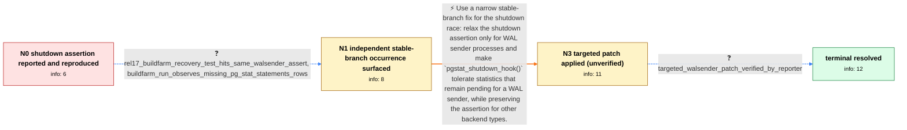

# Review: pg_bug_18158

**WAL sender hits pgstat_report_stat() shutdown assertion with pending statistics**

- source: https://www.postgresql.org/message-id/flat/aiIxB2oawj8pZeON%40paquier.xyz
- kind: LLM draft (needs review)
- reviewed: `False`
- graph: `data/pgsql_v0/graphs/pg_bug_18158.json` · raw thread: `data/pgsql_v0/raw/pg_bug_18158.json`

## Opening (body)

> On PostgreSQL 16.0 on Ubuntu 22.04, I found a server crash in the journal while running check-world repeatedly on a slow device, even though all tests reported success. The recovery test log contains `TRAP: failed Assert("!pgStatLocal.shmem->is_shutdown")` in `pgstat_report_stat()`, with a WAL sender exiting through `shmem_exit()`. It occurs when the WAL sender still has pending statistics during server shutdown. I can make it reproduce easily in `012_subtransactions.pl` by occasionally making a nowait call in `pgstat_flush_pending_entries()` behave as if it did not flush; the TAP test still passes, but the assertion appears in the server log.

## Satisfaction conditions

1. Must identify the root cause: on PostgreSQL 15 through 17, a WAL sender can reach its statistics shutdown hook with pending statistics after shared statistics have been marked shut down, violating an ordering assumption enforced by `pgstat_report_stat()`.
2. The diagnosis must be grounded in the WAL-sender stack, the forced nowait-flush reproduction, and the independent REL_17_STABLE occurrence rather than inferred from a generic shutdown crash alone.
3. The fix must be narrowly scoped: relax the shutdown assertion for WAL senders and make `pgstat_shutdown_hook()` cope with their remaining statistics while retaining the assertion for other process types.
4. Must not recommend wholesale backpatching of the substantially reworked shutdown sequence or removing the assertion for every backend; the thread deliberately chose the narrower stable-branch patch.
5. Must require the reporter's successful test with the forced pending-statistics reproducer before treating the issue as resolved; no tested patch or workaround was reported as failing.

## Edges

| edge | type | gates / info | payload |
|---|---|---|---|
| `e1_N0__N1` | clarification_only | asks: rel17_buildfarm_recovery_test_hits_same_walsender_assert, buildfarm_run_observes_missing_pg_stat_statements_rows | I found what looks like the same failure in a REL_17_STABLE buildfarm recovery run. Its primary log says the p / The run failed its `pg_stat_statements` contents check. I got only `CREATE\|f` and `SELECT\|t`, while the expect |
| `e4_N3__N_terminal` | clarification_only | asks: targeted_walsender_patch_verified_by_reporter | The patch works for me test-wise. With it applied, the recovery test completes without the assertion. |
| `e_fix_N1__N3` | solution_only | req_info: assert_occurs_in_walsender_exit_path, walsender_has_pending_stats_during_server_shutdown, rel17_buildfarm_recovery_test_hits_same_walsender_assert, empty_pending_stats_path_returns_before_assert elements: limits_assertion_relaxation_to_wal_senders, adjusts_pgstat_shutdown_hook_for_remaining_walsender_stats, preserves_assertion_for_other_process_types, identifies_shutdown_race_with_pending_walsender_statistics, requires_reporter_verification_before_resolution | Use a narrow stable-branch fix for the shutdown race: relax the shutdown assertion only for WAL sender processes and make `pgstat_shutdown_hook()` tolerate statistics that remain pending for a WAL sender, while preserving the assertion for other backend types. |

## Nodes

| node | terminal | volunteered | images | symptoms |
|---|---|---|---|---|
| `N0` |  | 2 | 0 | My check-world run reports that all tests passed, but the system journal and recovery log contain `TRAP: failed Assert("!pgStatLocal.shmem-> |
| `N1` |  | 0 | 0 | I found the same WAL-sender assertion in a REL_17_STABLE buildfarm recovery run. That run also reported fewer rows than expected when checki |
| `N3` |  | 1 | 0 | I've applied the targeted patch to my build; I haven't re-run the shutdown sequence yet. For what it's worth: injecting nowait failures via  |
| `N_terminal` | ✓ | 0 | 0 | The recovery test completes without the `pgStatLocal.shmem->is_shutdown` assertion when a WAL sender exits with pending statistics. |

## Machine review (audit pass, adversarially verified)

Auditor verdict: **minor_issues** · 1 of 2 findings survived independent refutation.

_This case tests whether an agent can take a passing-test-with-server-assertion report, establish that a WAL sender can reach pgstat_report_stat() with pending stats after shared stats are marked shut down, and land the narrow v15~v17 fix (assertion lifted only for WAL senders plus a pgstat_shutdown_hook adjustment) rather than backpatching the v18 rework. The graph is a faithful and well-shaped encoding of that chain: root cause, evidence grounding, solution scope, and verification requirement all match the thread, and the correct absence of blind paths reflects that nothing was tried and failed. Two fidelity gaps remain, neither of which inverts scoring: N3 claims a volunteered reproducer the node never states (erasing the maintainer's failed reproduction and the reporter's pg_prng/macOS-rand() correction), and satisfaction condition 4 prohibits an approach the thread argued away rather than falsified, using a rationale the agent cannot obtain in-graph._

### Confirmed findings

- [ ] 🟠 **unfaithful_reveal** (medium) — `graph.nodes.N3.volunteered_info[0] = "pg_prng_nowait_injection_is_reliable_reproducer" (vs graph.nodes.N3.symptoms_visible)`
  - claim: N3 declares that the user volunteers `pg_prng_nowait_injection_is_reliable_reproducer`, but the node's only utterance is "I've applied the targeted patch to my build; I haven't re-run the shutdown sequence yet." — there is no text conveying the improved reproducer, so the simulated user can never actually deliver the information the graph says it volunteers, and the thread's single real setback is erased.
  - thread evidence: c4 (participant3): "I cannot reproduce the failure re-using the trick sent by Alexander at the top of the thread." c5 (reporter/participant1): "Please try the following: ... +if (nowait && (pg_prng_double(&pg_global_prng_state) < 0.1)) ... As far as I can see, that rand() gives the same sequence on macOS each run, while on Linux I see different sequences." c6 (participant3): "Aye. I have used that before sending the patch, reproducing the failure before-patch, getting things to work after-patch." None of this — the failed reproduction attempt, nor the pg_prng replacement, nor the macOS-rand() explanation — appears anywhere in a node's symptoms_visible or in any clarification answer.
  - suggested fix: Add the reporter-voice text to N3.symptoms_visible, e.g. "The patch is applied on my build. Note the rand() trick I posted originally gives the same sequence every run on macOS but varies on Linux; use `pg_prng_double(&pg_global_prng_state) < 0.1` in pgstat_flush_pending_entries() instead if it doesn't reproduce for you." Optionally model the maintainer's failed reproduction as a preceding clarification edge ("I applied your patch but can't reproduce with your trick — how exactly are you injecting the flush failure?") so the information has a natural asking point.
  - verifier: Independently confirmed. N3.volunteered_info = ["pg_prng_nowait_injection_is_reliable_reproducer"] while N3.symptoms_visible contains exactly one line about applying the patch and not yet re-running; no node symptoms_visible and no clarification user_answer anywhere in the graph mentions pg_prng_double, pg_global_prng_state, macOS rand() determinism, or any improved injection trick (e1's answers c

### Refuted claims (auditor was wrong — do not act on these)

- ~~logistics_gate~~: The graph penalizes an approach that the thread never falsified and that the committer himself proposed, while the rationale for rejecting it (branch-invasiveness / the shutdown area having been reworked) is pure maintai
  - why refuted: Legitimate encoding under the contract. (1) The thread does not merely leave these moves untried — it rejects them with stated reasons and explicit consensus: c2 (participant3, the eventual committer) 'I fear such a change in the stable branches based on its invasiveness, particularly because the area of the code deali

## Review checklist

> The graph is the case's ANSWER KEY, not a transcript: edge order need
> not mirror thread chronology. Do not file chronology mismatch as a
> defect; what must be faithful is who knew what, when.

Structural (machine-checked by `scripts/validate.py`, re-verify after edits):

- [ ] validates: schema + info-containment + terminal reachability

Semantic (the defect catalog — check each against the source thread):

- [ ] **Faithful blind paths** — every `is_known_blind_path` edge corresponds
  to an attempt actually falsified in the thread (or a brush-off the
  reporter rejected). No invented failures; no ACCEPTED fix mislabeled as
  a blind path (the most common LLM defect class).
- [ ] **Gettable required info** — every id in any `solution.required_info`
  is obtainable: a clarification on some edge, or in the start node's
  info_state, or volunteered (with matching `volunteered_info` text).
  Engineer-only inference belongs in `info_inferred_by_engineer` /
  `inference_hint`, not in hard required_info.
- [ ] **Measurement-class rule** — handler-initiated measurements the user
  executed (bisections, test builds, config probes, version checks) are
  clarification edges, not solutions; their answers state what the
  measurement showed.
- [ ] **No logistics gates** — `required_elements_for_full_match` encode the
  technical diagnostic→fix chain, not release/packaging/scheduling
  remarks the engineer merely mentioned.
- [ ] **Coherent reveals** — each `user_answer_in_this_oncall` is consistent
  with the thread, delivers what it promises, and stays in the user's
  voice (no future knowledge, no diagnosis the user never made).
- [ ] **Symptoms are observations** — `symptoms_visible` contains only what
  the user can see; no causes or advice.
- [ ] **Terminal semantics** — satisfaction_conditions demand root cause +
  evidence grounding + prohibition of falsified moves + user verification;
  the terminal node is the verified-resolved state.
- [ ] **Image assignment** — referenced attachments exist and sit on the
  right hook (opening / node symptom / clarification evidence).
- [ ] **Persona** — matches the reporter's actual expertise and style.

## How to sign off

1. Edit the graph JSON if needed (authored fields only; keep
   `concrete_example` as the factual record).
2. `uv run scripts/validate.py '<graph path>'`
3. Set `metadata.hitl_reviewed: true` in the graph JSON.
4. Re-run `uv run scripts/make_review_docs.py` to refresh this page.
