# Review: pg_bug_18158

**Assert in pgstat_report_stat() fails when a backend shuts down with pending stats**

- source: https://www.postgresql.org/message-id/flat/aiIxB2oawj8pZeON%40paquier.xyz
- kind: LLM draft (needs review)
- reviewed: `False`
- graph: `data/pgsql_v0/graphs/pg_bug_18158.json` · raw thread: `data/pgsql_v0/raw/pg_bug_18158.json`

```mermaid
flowchart LR
    N0["<b>N0 shutdown assertion reported</b><br/><small>info: 5</small>"]
    N1["<b>N1 stable-branch recurrence confirmed</b><br/><small>info: 7</small>"]
    N2["<b>N2 targeted stable-branch patch proposed</b><br/><small>info: 10</small>"]
    N3["<b>N3 targeted patch verified</b><br/><small>info: 12</small>"]
    N_terminal["<b>terminal resolved</b><br/><small>info: 13</small>"]
    N0 -.->|"❓ rel17_buildfarm_recurrence, assertion_can_leave_expected_stats_missing"| N1
    linkStyle 0 stroke:#3b82f6,stroke-width:2px
    N1 ==>|"⚡ Prepare a conservative stable-branch fix that handles pending statistics during WAL sender shutdown without wholesale backpatching the invasive shutdown-sequence rework."| N2
    linkStyle 1 stroke:#f97316,stroke-width:2px
    N2 -.->|"❓ pg_prng_probe_reproduces_before_patch, targeted_patch_verified_no_assertion"| N3
    linkStyle 2 stroke:#3b82f6,stroke-width:2px
    N3 ==>|"⚡ Apply the verified targeted WAL sender shutdown fix to all affected stable branches."| N_terminal
    linkStyle 3 stroke:#f97316,stroke-width:2px
    class N0 start
    class N1 normal
    class N2 normal
    class N3 normal
    class N_terminal terminal
    classDef start fill:#fee2e2,stroke:#b91c1c,color:#000
    classDef terminal fill:#dcfce7,stroke:#15803d,color:#000
    classDef normal fill:#fef3c7,stroke:#a16207,color:#000
```

## Opening (body)

> On PostgreSQL 16.0 on Ubuntu 22.04, while running check-world repeatedly on a slow device, all tests passed but the system journal recorded a postgres crash. The recovery test log shows `Assert("!pgStatLocal.shmem->is_shutdown")` failing in `pgstat_report_stat()` during shutdown of a walsender with pending statistics. I can reproduce it in `t/012_subtransactions.pl` by occasionally making a nowait call in `pgstat_flush_pending_entries()` report that it did not flush; the test itself still reports PASS while the assertion appears in the server log.

## Satisfaction conditions

1. Must identify the root cause as a WAL sender reaching `pgstat_report_stat()` during shutdown with statistics still pending after shared pgstats shutdown, making the existing `!is_shutdown` assertion invalid for that shutdown ordering.
2. Must ground the diagnosis in the walsender stack through `shmem_exit()`, the independent REL_17_STABLE buildfarm occurrence, and the reliable `pg_prng_double()` forced-nowait-flush probe.
3. Must use the targeted stable-branch fix: lift the shutdown assertion for WAL senders while retaining it elsewhere, and make `pgstat_shutdown_hook()` cope with statistics that may remain for a WAL sender.
4. Must not replace the targeted fix with a wholesale backpatch of 87a6690cc69 or removal of the assertion for every backend; those broader approaches were rejected as unnecessarily invasive or imprecise for v15 through v17.
5. Must not treat failure to reproduce with the original `rand()` probe as evidence that the bug is absent, because its sequence can be unsuitable on macOS; use the PostgreSQL PRNG probe instead.
6. Must require verification that the reliable probe reproduces before the patch and no longer triggers the assertion after the patch before declaring resolution, followed by application as commit `4801610f7c66` to v15 through v17.

## Edges

| edge | type | gates / info | payload |
|---|---|---|---|
| `e1_N0__N1` | clarification_only | asks: rel17_buildfarm_recurrence, assertion_can_leave_expected_stats_missing | Yes. A skink REL_17_STABLE buildfarm run hit the same assertion in a walsender during `recovery/027_stream_reg / The recovery test expected CREATE, DELETE, INSERT, SELECT, and UPDATE entries from `pg_stat_statements`, but o |
| `e2_N1__N2` | solution_only | req_info: walsender_shutdown_with_pending_stats, rel17_buildfarm_recurrence, assertion_stack_reaches_pgstat_report_stat_from_shmem_exit elements: limits_the_assertion_change_to_wal_senders, handles_remaining_stats_in_pgstat_shutdown_hook, targets_v15_through_v17, avoids_wholesale_backpatch_of_87a6690cc69 | Prepare a conservative stable-branch fix that handles pending statistics during WAL sender shutdown without wholesale backpatching the invasive shutdown-sequence rework. |
| `e3_N2__N3` | clarification_only | asks: pg_prng_probe_reproduces_before_patch, targeted_patch_verified_no_assertion | Use `pg_prng_double(&pg_global_prng_state) < 0.1` for the occasional nowait flush failure. The original `rand( / The patch works for me test-wise. The maintainer also reproduced the failure before the patch with that probe  |
| `e4_N3__terminal` | solution_only | req_info: walsender_shutdown_with_pending_stats, shutdown_assertion_guarantee_invalid_for_walsenders, wholesale_87a6690_backpatch_too_invasive_for_stable_branches, pg_prng_probe_reproduces_before_patch, targeted_patch_verified_no_assertion elements: identifies_commit_4801610f7c66, states_backpatch_range_v15_through_v17, keeps_change_targeted_to_wal_sender_shutdown, requires_successful_before_and_after_verification | Apply the verified targeted WAL sender shutdown fix to all affected stable branches. |

## Nodes

| node | terminal | volunteered | images | symptoms |
|---|---|---|---|---|
| `N0` |  | 5 | 0 | A recovery test reports PASS, but its server log contains `TRAP: failed Assert("!pgStatLocal.shmem->is_shutdown")` from a walsender exiting  |
| `N1` |  | 2 | 0 | The same walsender assertion occurs on a REL_17_STABLE buildfarm run, where a recovery test also observes missing expected `pg_stat_statemen |
| `N2` |  | 0 | 0 | Unpatched v15 through v17 branches can still hit the shutdown assertion when a walsender retains pending statistics. |
| `N3` |  | 0 | 0 | Using the `pg_prng_double()` probe reproduces the assertion before the patch; with the targeted patch applied, the recovery test completes w |
| `N_terminal` | ✓ | 0 | 0 | The verified targeted fix is applied as commit `4801610f7c66` across the PostgreSQL v15 through v17 branches. |

## Machine review (audit pass, adversarially verified)

Auditor verdict: **needs_rework** · 5 of 5 findings survived independent refutation.

_The case is a PostgreSQL stable-branch bug: a walsender exiting with pending pgstats trips Assert("!pgStatLocal.shmem->is_shutdown"), reproduced by forcing occasional nowait flush failures, and fixed by a targeted v15~v17 patch (assertion lifted for WAL senders only + pgstat_shutdown_hook tolerance), committed as 4801610f7c66. The graph's spine (report -> REL_17 buildfarm recurrence -> targeted patch -> PRNG-probe before/after verification -> commit) is faithful to the thread, correctly models the patch test as a clarification edge, and states the right root cause with no future-knowledge leak in the Task body. However, the final solution hard-requires two info ids that no clarification, start state or volunteered_info ever grants (they are the maintainer's own judgments, and the reporter's actual 87a6690cc / REL_18 datum was dropped), which would fail an otherwise-correct agent. Secondary issues: the maintainer's own verification is put into the user's mouth, an unobtainable commit SHA is a scored required element, and two nodes' symptoms_visible carry diagnosis/process rather than observation._

### Confirmed findings

- [ ] 🟠 **required_but_ungettable** (medium) — `n/a`
  - claim: [required_but_ungettable / high] at edges[e4_N3__terminal].solution.required_info.L2 — The final solution hard-requires `shutdown_assertion_guarantee_invalid_for_walsenders` and `wholesale_87a6690_backpatch_too_invasive_for_stable_branches`, neither of which is a clarification info_id, in N0's info_state, or volunteered on any node (N2's volunteered_info is empty), so no agent can legitimately obtain them.
  - thread evidence: None
  - suggested fix: None
  - verifier: Mechanically verified against the graph: the only clarification info_ids in the whole graph are rel17_buildfarm_recurrence, assertion_can_leave_expected_stats_missing (e1), pg_prng_probe_reproduces_before_patch, targeted_patch_verified_no_assertion (e3). Neither disputed id is a clarification id, neither is in N0.info_state, and N2/N3/N_terminal all have volunteered_info=[]. Both ids appear ONLY i
- [ ] 🟠 **logistics_gate** (medium) — `n/a`
  - claim: [logistics_gate / medium] at edges[e4_N3__terminal].solution.required_elements_for_full_match[0] ('identifies_commit_4801610f7c66') — A scored required element demands the agent name the post-hoc commit SHA of the fix, which is packaging/bookkeeping rather than part of the diagnostic-to-fix chain and is unobtainable at solve time.
  - thread evidence: None
  - suggested fix: None
  - verifier: Confirmed against the thread: 4801610f7c66 appears exactly once, in c7 (participant3, 2026-06-06) 'Applied as of 4801610f7c66 in the v15~17 range.' It is the SHA the fix received when pushed, i.e. it comes into existence only as a consequence of the answer; no earlier message, no clarification, and no info_state entry other than the engineer-inferred fix_applied_as_4801610f7c66_to_v15_v17 carries 
- [ ] 🟡 **unfaithful_reveal** (low) — `n/a`
  - claim: [unfaithful_reveal / medium] at edges[e3_N2__N3].clarifications[targeted_patch_verified_no_assertion].user_answer_in_this_oncall — The user's answer reports the maintainer's own before/after verification back to the maintainer, giving the simulated user knowledge and a voice the reporter never had.
  - thread evidence: None
  - suggested fix: None
  - verifier: Verbatim check confirms the split. Reporter (participant1/Alexander, the user side) in c5 says only 'The patch works for me test-wise. Thank you for the fix!' plus the pg_prng_double snippet and the macOS rand() remark. The second clause of the drafted answer is c6, participant3/Michael: 'Aye. I have used that before sending the patch, reproducing the failure before-patch, getting things to work a
- [ ] 🟡 **symptom_contains_diagnosis** (low) — `n/a`
  - claim: [symptom_contains_diagnosis / medium] at nodes.N2.symptoms_visible[0] — N2's symptoms_visible states a causal diagnosis and a version-range conclusion rather than an observation in the user's words.
  - thread evidence: None
  - suggested fix: None
  - verifier: Half of the reviewer's evidence is wrong. The reviewer asserts 'the reporter only ever observed the TRAP line' and that the walsender-with-pending-stats mechanism is the engineers' conclusion from c2/c4. The raw body contradicts that: the reporter's OWN opening says 'My analysis shows that this Assert failed in a backend (walsender, in my case) when it has pending stats entries on a server shutdow
- [ ] 🟡 **terminal_semantics** (low) — `n/a`
  - claim: [terminal_semantics / low] at nodes.N_terminal.symptoms_visible[0] — The terminal node's symptoms_visible describes a maintainer/process event (a commit being applied) instead of the user-observable resolved state, so 'symptoms gone' is never stated in observational terms.
  - thread evidence: None
  - suggested fix: None
  - verifier: Confirmed. The drafted symptom ('The verified targeted fix is applied as commit 4801610f7c66 across the PostgreSQL v15 through v17 branches') is verbatim the content of c7, participant3's push announcement, i.e. handler-side process bookkeeping, and symptoms_visible is contract-bound to observable phenomena in the user's words. The user-observable resolved state that exists in the thread is c5 'Th

## Review checklist

Structural (machine-checked by `scripts/validate.py`, re-verify after edits):

- [ ] validates: schema + info-containment + terminal reachability

Semantic (the defect catalog — check each against the source thread):

- [ ] **Faithful blind paths** — every `is_known_blind_path` edge corresponds
  to an attempt actually falsified in the thread (or a brush-off the
  reporter rejected). No invented failures; no ACCEPTED fix mislabeled as
  a blind path (the most common LLM defect class).
- [ ] **Gettable required info** — every id in any `solution.required_info`
  is obtainable: a clarification on some edge, or in the start node's
  info_state, or volunteered (with matching `volunteered_info` text).
  Engineer-only inference belongs in `info_inferred_by_engineer` /
  `inference_hint`, not in hard required_info.
- [ ] **Measurement-class rule** — handler-initiated measurements the user
  executed (bisections, test builds, config probes, version checks) are
  clarification edges, not solutions; their answers state what the
  measurement showed.
- [ ] **No logistics gates** — `required_elements_for_full_match` encode the
  technical diagnostic→fix chain, not release/packaging/scheduling
  remarks the engineer merely mentioned.
- [ ] **Coherent reveals** — each `user_answer_in_this_oncall` is consistent
  with the thread, delivers what it promises, and stays in the user's
  voice (no future knowledge, no diagnosis the user never made).
- [ ] **Symptoms are observations** — `symptoms_visible` contains only what
  the user can see; no causes or advice.
- [ ] **Terminal semantics** — satisfaction_conditions demand root cause +
  evidence grounding + prohibition of falsified moves + user verification;
  the terminal node is the verified-resolved state.
- [ ] **Image assignment** — referenced attachments exist and sit on the
  right hook (opening / node symptom / clarification evidence).
- [ ] **Persona** — matches the reporter's actual expertise and style.

## How to sign off

1. Edit the graph JSON if needed (authored fields only; keep
   `concrete_example` as the factual record).
2. `uv run scripts/validate.py '<graph path>'`
3. Set `metadata.hitl_reviewed: true` in the graph JSON.
4. Re-run `uv run scripts/make_review_docs.py` to refresh this page.
