# Review: pg_bug_18158

**Assert in pgstat_report_stat() fails when a backend shuts down with stats pending**

- source: https://www.postgresql.org/message-id/flat/aiIxB2oawj8pZeON%40paquier.xyz
- kind: LLM draft (needs review)
- reviewed: `True`
- graph: `data/pgsql_v0/graphs/pg_bug_18158.json` · raw thread: `data/pgsql_v0/raw/pg_bug_18158.json`

```mermaid
flowchart LR
    N0["<b>N0 shutdown assertion reported and reproduced</b><br/><small>info: 8</small>"]
    N1["<b>N1 stable-branch recurrence established</b><br/><small>info: 10</small>"]
    N2["<b>N2 stable-branch scoped patch proposed</b><br/><small>info: 12</small>"]
    N3["<b>N3 candidate patch verified</b><br/><small>info: 15</small>"]
    N_terminal["<b>terminal resolved</b><br/><small>info: 15</small>"]
    N0 -.->|"❓ buildfarm_rel17_walsender_reproduces_same_assert, buildfarm_test_observes_missing_pg_stat_statements_rows"| N1
    linkStyle 0 stroke:#3b82f6,stroke-width:2px
    N1 ==>|"⚡ Use a narrow stable-branch correction rather than backpatching the newer shutdown-sequencing redesign: tolerate pending statistics during WAL-sender shutdown while retaining the assertion for other backend types, and make the shutdown hook safely handle remaining WAL-sender statistics."| N2
    linkStyle 1 stroke:#f97316,stroke-width:2px
    N2 -.->|"❓ candidate_patch_passes_for_reporter, pg_prng_reproducer_varies_flush_failures, maintainer_reproduces_before_patch_and_not_after_patch"| N3
    linkStyle 2 stroke:#3b82f6,stroke-width:2px
    N3 ==>|"⚡ Apply the verified narrow stable-branch fix: permit WAL senders to reach statistics shutdown with entries still pending, safely deal with those entries in pgstat_shutdown_hook, and preserve the shutdown assertion for other backend processes."| N_terminal
    linkStyle 3 stroke:#f97316,stroke-width:2px
    class N0 start
    class N1 normal
    class N2 normal
    class N3 normal
    class N_terminal terminal
    classDef start fill:#fee2e2,stroke:#b91c1c,color:#000
    classDef terminal fill:#dcfce7,stroke:#15803d,color:#000
    classDef normal fill:#fef3c7,stroke:#a16207,color:#000
```

## Opening (body)

> I am running PostgreSQL 16.0 on Ubuntu 22.04. While looping check-world on a slow device, all tests passed, but the system journal reported a postgres crash. I reproduced it in the recovery-test logs: a walsender hit Assert("!pgStatLocal.shmem->is_shutdown") in pgstat_report_stat() during shutdown. The stack trace reaches pgstat_report_stat() through shmem_exit(). It appears when the backend still has pending statistics after statistics shutdown; with no pending entries, pgstat_report_stats() returns before the assertion. Making pgstat_flush_pending_entries() randomly leave a nowait entry unflushed reproduces the assertion easily while t/012_subtransactions.pl still reports PASS.

## Satisfaction conditions

1. Must identify the accepted root cause: a WAL sender can still have pending statistics when shared statistics shutdown has already been marked complete, so its exit-time pgstat_report_stat() call reaches an assertion whose invariant is not valid for that shutdown ordering.
2. Diagnosis must be grounded in the walsender stack trace, the pending-entry reproducer, and the recurrence on a stable-branch buildfarm run.
3. The fix must be narrowly scoped to WAL senders: relax the shutdown assertion for that process type, retain it for other backends, and safely handle remaining WAL-sender statistics in pgstat_shutdown_hook.
4. Must not recommend wholesale backpatching of the newer shutdown-sequence redesign as the stable-branch fix; maintainers considered that approach too invasive.
5. Must use the reporter's successful candidate-patch run with the forced reproducer as verification before treating the issue as resolved.

## Edges

| edge | type | gates / info | payload |
|---|---|---|---|
| `e1_N0__N1` | clarification_only | asks: buildfarm_rel17_walsender_reproduces_same_assert, buildfarm_test_observes_missing_pg_stat_statements_rows | I found the same failure in a REL_17_STABLE buildfarm recovery run. Its primary log shows a walsender releasin / The recovery test expected CREATE, DELETE, INSERT, SELECT and UPDATE rows in pg_stat_statements, but it got on |
| `e2_N1__N2` | solution_only | req_info: walsender_hits_is_shutdown_assert_during_exit, reporter_analysis_pending_stats_remain_after_stats_shutdown, buildfarm_rel17_walsender_reproduces_same_assert, stack_reaches_pgstat_report_stat_through_shmem_exit, empty_pending_stats_path_returns_before_assert elements: limits_the_assertion_exception_to_wal_senders, keeps_the_assertion_for_other_backend_types, handles_remaining_walsender_stats_in_the_shutdown_hook, avoids_invasive_shutdown_sequence_backpatch | Use a narrow stable-branch correction rather than backpatching the newer shutdown-sequencing redesign: tolerate pending statistics during WAL-sender shutdown while retaining the assertion for other backend types, and make the shutdown hook safely handle remaining WAL-sender statistics. |
| `e3_N2__N3` | clarification_only | asks: candidate_patch_passes_for_reporter, pg_prng_reproducer_varies_flush_failures, maintainer_reproduces_before_patch_and_not_after_patch | The patch works for me test-wise. With it applied, the forced recovery test passes and I do not get the assert / I used pg_prng_double(&pg_global_prng_state) for the one-in-ten forced failure. rand() gave me the same sequen / Yes. The forced test reproduces the failure before the patch and runs without it after the patch. |
| `e4_N3__N_terminal` | solution_only | req_info: walsender_hits_is_shutdown_assert_during_exit, reporter_analysis_pending_stats_remain_after_stats_shutdown, buildfarm_rel17_walsender_reproduces_same_assert, stack_reaches_pgstat_report_stat_through_shmem_exit, empty_pending_stats_path_returns_before_assert, candidate_patch_passes_for_reporter elements: identifies_pending_walsender_statistics_after_stats_shutdown_as_the_trigger, permits_the_walsender_shutdown_case_without_removing_the_assertion_globally, handles_remaining_statistics_in_pgstat_shutdown_hook, relies_on_reporter_verification_with_the_forced_reproducer | Apply the verified narrow stable-branch fix: permit WAL senders to reach statistics shutdown with entries still pending, safely deal with those entries in pgstat_shutdown_hook, and preserve the shutdown assertion for other backend processes. |

## Nodes

| node | terminal | volunteered | images | symptoms |
|---|---|---|---|---|
| `N0` |  | 3 | 0 | My check-world run reports that every test passed, but the system journal and recovery-test log contain a postgres crash. The log shows a wa |
| `N1` |  | 0 | 0 | I found the same walsender assertion in a REL_17_STABLE buildfarm recovery-test log. That run also reported fewer pg_stat_statements rows th |
| `N2` |  | 0 | 0 | The unpatched recovery-test log can still contain the walsender shutdown assertion even when the test command reports success. |
| `N3` |  | 1 | 0 | With the candidate patch applied, my forced recovery test passes without the shutdown assertion appearing. Using PostgreSQL's PRNG for the f |
| `N_terminal` | ✓ | 0 | 0 | The forced shutdown test completes without a walsender assertion when run with the verified patch. |

## Machine review (audit pass, adversarially verified)

Auditor verdict: **n/a** · 0 of 0 findings survived independent refutation.

__

## Review checklist

> The graph is the case's ANSWER KEY, not a transcript: edge order need
> not mirror thread chronology. Do not file chronology mismatch as a
> defect; what must be faithful is who knew what, when.

Structural (machine-checked by `scripts/validate.py`, re-verify after edits):

- [ ] validates: schema + info-containment + terminal reachability

Semantic (the defect catalog — check each against the source thread):

- [ ] **Faithful blind paths** — every `is_known_blind_path` edge corresponds
  to an attempt actually falsified in the thread (or a brush-off the
  reporter rejected). No invented failures; no ACCEPTED fix mislabeled as
  a blind path (the most common LLM defect class).
- [ ] **Gettable required info** — every id in any `solution.required_info`
  is obtainable: a clarification on some edge, or in the start node's
  info_state, or volunteered (with matching `volunteered_info` text).
  Engineer-only inference belongs in `info_inferred_by_engineer` /
  `inference_hint`, not in hard required_info.
- [ ] **Measurement-class rule** — handler-initiated measurements the user
  executed (bisections, test builds, config probes, version checks) are
  clarification edges, not solutions; their answers state what the
  measurement showed.
- [ ] **No logistics gates** — `required_elements_for_full_match` encode the
  technical diagnostic→fix chain, not release/packaging/scheduling
  remarks the engineer merely mentioned.
- [ ] **Coherent reveals** — each `user_answer_in_this_oncall` is consistent
  with the thread, delivers what it promises, and stays in the user's
  voice (no future knowledge, no diagnosis the user never made).
- [ ] **Symptoms are observations** — `symptoms_visible` contains only what
  the user can see; no causes or advice.
- [ ] **Terminal semantics** — satisfaction_conditions demand root cause +
  evidence grounding + prohibition of falsified moves + user verification;
  the terminal node is the verified-resolved state.
- [ ] **Image assignment** — referenced attachments exist and sit on the
  right hook (opening / node symptom / clarification evidence).
- [ ] **Persona** — matches the reporter's actual expertise and style.

## How to sign off

1. Edit the graph JSON if needed (authored fields only; keep
   `concrete_example` as the factual record).
2. `uv run scripts/validate.py '<graph path>'`
3. Set `metadata.hitl_reviewed: true` in the graph JSON.
4. Re-run `uv run scripts/make_review_docs.py` to refresh this page.
