# Review: pg_bug_18897

**Logical replication primary-key conflict after pg_createsubscriber under heavy load**

- source: https://www.postgresql.org/message-id/flat/18897-d3db67535860dddb%40postgresql.org
- kind: LLM draft (needs review)
- reviewed: `True`
- graph: `data/pgsql_v0/graphs/pg_bug_18897.json` · raw thread: `data/pgsql_v0/raw/pg_bug_18897.json`

```mermaid
flowchart LR
    N0["<b>N0 intermittent replication conflict reported</b><br/><small>info: 6</small>"]
    N1["<b>N1 apply-worker conflict confirmed</b><br/><small>info: 8</small>"]
    N2_x["<b>N2_x waiting-for-catchup aftermath</b><br/><small>info: 9</small>"]
    N3["<b>N3 duplicate replay mechanism established</b><br/><small>info: 13</small>"]
    N_terminal["<b>terminal fix pushed without reporter retest</b><br/><small>info: 13</small>"]
    N0 -.->|"❓ apply_worker_duplicate_key_error_confirmed"| N1
    linkStyle 0 stroke:#3b82f6,stroke-width:2px
    N1 ==>|"💥 blind: Treat the row-count mismatch as ordinary replication lag and wait for subscription synchronization before comparing the databases."| N2_x
    linkStyle 1 stroke:#ef4444,stroke-width:2px
    N2_x ==>|"⚡ Diagnose the conflict as the same transaction being applied once during physical recovery and then emitted again by logical decoding when the consistent LSN points to the start of a COMMIT record."| N3
    linkStyle 2 stroke:#f97316,stroke-width:2px
    N3 ==>|"⚡ Change pg_createsubscriber's recovery setup so recovery stops before the record at the consistent LSN, preventing that transaction from being applied physically before logical replication starts, and ask the reporter to verify a build containing the fix."| N_terminal
    linkStyle 3 stroke:#f97316,stroke-width:2px
    class N0 start
    class N1 normal
    class N2_x normal
    class N3 normal
    class N_terminal terminal
    classDef start fill:#fee2e2,stroke:#b91c1c,color:#000
    classDef terminal fill:#dcfce7,stroke:#15803d,color:#000
    classDef normal fill:#fef3c7,stroke:#a16207,color:#000
```

## Opening (body)

> I am converting PostgreSQL 17.4 databases on RHEL 9 from pglogical to native logical replication. In rare cases, after converting a physical replica with pg_createsubscriber while the primary remains live and under load, the logical replica starts with replication stuck on a conflicting primary key even though the replica received no client connections and only received changes from that primary. I have a shell script that repeatedly creates a primary and physical replica, generates concurrent inserts, converts the replica to logical replication, and compares row counts. Reproduction can take minutes or hours; NUM_THREADS=40 and INSERT_WIDTH=1000 is a useful starting point on a powerful machine. The script was pasted into the report and then supplied again because email formatting may have damaged it.

## Satisfaction conditions

1. Must identify the final accepted root cause: the slot's consistent LSN can be the start address of a COMMIT record, and inclusive recovery applies that transaction physically before logical decoding sends it again, causing the duplicate-key conflict.
2. Diagnosis must be grounded in the reporter's apply-worker duplicate-key evidence and the WAL-boundary analysis, rather than treating the row-count mismatch as ordinary replication lag.
3. Must not recommend merely waiting longer or only using subscription synchronization as the fix; the apply worker was persistently failing on an existing primary key.
4. Must not solve the issue by blindly advancing to the next WAL record, because the thread identified a risk of skipping data.
5. The accepted technical fix must stop recovery before the record at the consistent LSN by making the recovery target non-inclusive.
6. Must ask the affected reporter to verify a build containing the fix and must not claim user-verified resolution, because only maintainers tested the patch and reported that it was pushed.

## Edges

| edge | type | gates / info | payload |
|---|---|---|---|
| `e1_N0__N1` | clarification_only | asks: apply_worker_duplicate_key_error_confirmed | I confirmed from the replica log that the logical replication apply worker is exiting on a duplicate-key viola |
| `e2_N1__N2_x` | solution_only **BLIND** | req_info: reproduction_can_take_minutes_or_hours elements: suggests_waiting_for_subscription_synchronization | Treat the row-count mismatch as ordinary replication lag and wait for subscription synchronization before comparing the databases. |
| `e3_N2_x__N3` | solution_only | req_info: live_primary_under_concurrent_insert_load, waiting_longer_does_not_clear_duplicate_conflict, replica_received_no_client_connections, apply_worker_duplicate_key_error_confirmed elements: identifies_same_transaction_applied_physically_and_logically, connects_duplicate_replay_to_consistent_lsn_at_commit_start, distinguishes_permanent_apply_conflict_from_replication_lag | Diagnose the conflict as the same transaction being applied once during physical recovery and then emitted again by logical decoding when the consistent LSN points to the start of a COMMIT record. |
| `e4_N3__N_terminal` | solution_only | req_info: live_primary_under_concurrent_insert_load, replica_received_no_client_connections, apply_worker_duplicate_key_error_confirmed elements: sets_recovery_target_inclusive_to_false, explains_that_recovery_must_stop_before_the_consistent_lsn_record, avoids_skipping_to_the_next_wal_record, asks_user_to_verify_on_a_build_containing_the_fix, does_not_declare_reporter_verified_resolution | Change pg_createsubscriber's recovery setup so recovery stops before the record at the consistent LSN, preventing that transaction from being applied physically before logical replication starts, and ask the reporter to verify a build containing the fix. |

## Nodes

| node | terminal | volunteered | images | symptoms |
|---|---|---|---|---|
| `N0` |  | 2 | 0 | In rare runs after converting the physical replica with pg_createsubscriber, logical replication stops on a conflicting primary key. The rep |
| `N1` |  | 1 | 0 | The logical replication apply worker repeatedly exits with a duplicate-key violation for a primary-key value that is already present on the  |
| `N2_x` |  | 1 | 0 | Even after allowing more time for synchronization, the apply worker remains unable to proceed because the same insert encounters an existing |
| `N3` |  | 0 | 0 | The converted replica still contains the row before logical replication tries to insert that same primary-key value again. |
| `N_terminal` | ✓ | 0 | 0 | A maintainer reports that the fix has been pushed, but I have not retested a build containing it on my own system. |

## Machine review (audit pass, adversarially verified)

Auditor verdict: **n/a** · 0 of 0 findings survived independent refutation.

__

## Review checklist

> The graph is the case's ANSWER KEY, not a transcript: edge order need
> not mirror thread chronology. Do not file chronology mismatch as a
> defect; what must be faithful is who knew what, when.

Structural (machine-checked by `scripts/validate.py`, re-verify after edits):

- [ ] validates: schema + info-containment + terminal reachability

Semantic (the defect catalog — check each against the source thread):

- [ ] **Faithful blind paths** — every `is_known_blind_path` edge corresponds
  to an attempt actually falsified in the thread (or a brush-off the
  reporter rejected). No invented failures; no ACCEPTED fix mislabeled as
  a blind path (the most common LLM defect class).
- [ ] **Gettable required info** — every id in any `solution.required_info`
  is obtainable: a clarification on some edge, or in the start node's
  info_state, or volunteered (with matching `volunteered_info` text).
  Engineer-only inference belongs in `info_inferred_by_engineer` /
  `inference_hint`, not in hard required_info.
- [ ] **Measurement-class rule** — handler-initiated measurements the user
  executed (bisections, test builds, config probes, version checks) are
  clarification edges, not solutions; their answers state what the
  measurement showed.
- [ ] **No logistics gates** — `required_elements_for_full_match` encode the
  technical diagnostic→fix chain, not release/packaging/scheduling
  remarks the engineer merely mentioned.
- [ ] **Coherent reveals** — each `user_answer_in_this_oncall` is consistent
  with the thread, delivers what it promises, and stays in the user's
  voice (no future knowledge, no diagnosis the user never made).
- [ ] **Symptoms are observations** — `symptoms_visible` contains only what
  the user can see; no causes or advice.
- [ ] **Terminal semantics** — satisfaction_conditions demand root cause +
  evidence grounding + prohibition of falsified moves + user verification;
  the terminal node is the verified-resolved state.
- [ ] **Image assignment** — referenced attachments exist and sit on the
  right hook (opening / node symptom / clarification evidence).
- [ ] **Persona** — matches the reporter's actual expertise and style.

## How to sign off

1. Edit the graph JSON if needed (authored fields only; keep
   `concrete_example` as the factual record).
2. `uv run scripts/validate.py '<graph path>'`
3. Set `metadata.hitl_reviewed: true` in the graph JSON.
4. Re-run `uv run scripts/make_review_docs.py` to refresh this page.
