# Review: pg_bug_18897

**Logical replication duplicate-key conflict after pg_createsubscriber under heavy load**

- source: https://www.postgresql.org/message-id/flat/18897-d3db67535860dddb%40postgresql.org
- kind: LLM draft (needs review)
- reviewed: `True`
- graph: `data/pgsql_v0/graphs/pg_bug_18897.json` · raw thread: `data/pgsql_v0/raw/pg_bug_18897.json`

```mermaid
flowchart LR
    N0["<b>N0 intermittent conflict reported</b><br/><small>info: 6</small>"]
    N1["<b>N1 persistent apply conflict confirmed</b><br/><small>info: 8</small>"]
    N2_x["<b>N2_x wait-for-catch-up aftermath</b><br/><small>info: 9</small>"]
    N2["<b>N2 double-application mechanism identified</b><br/><small>info: 12</small>"]
    N3["<b>N3 candidate patch verified</b><br/><small>info: 14</small>"]
    N_terminal["<b>terminal resolved</b><br/><small>info: 15</small>"]
    N0 -.->|"❓ reporter_log_shows_apply_worker_duplicate_key_conflict"| N1
    linkStyle 0 stroke:#3b82f6,stroke-width:2px
    N1 ==>|"💥 blind: Treat the mismatch as ordinary replication lag and wait longer, preferably using wait_for_subscription_sync before comparing row counts."| N2_x
    linkStyle 1 stroke:#ef4444,stroke-width:2px
    N2_x ==>|"⚡ Diagnose the conflict as double application of a transaction at the pg_createsubscriber recovery boundary: physical recovery includes the COMMIT at the consistent LSN, then logical decoding emits that transaction again."| N2
    linkStyle 2 stroke:#f97316,stroke-width:2px
    N2 -.->|"❓ patched_stress_runs_show_commit_consistent_lsn_without_conflict, patched_runs_verified_on_head_and_pg17"| N3
    linkStyle 3 stroke:#3b82f6,stroke-width:2px
    N3 ==>|"⚡ Fix pg_createsubscriber by making recovery stop before the consistent-LSN record, using recovery_target_inclusive=false, so logical replication alone applies transactions beginning at that consistent point."| N_terminal
    linkStyle 4 stroke:#f97316,stroke-width:2px
    class N0 start
    class N1 normal
    class N2_x normal
    class N2 normal
    class N3 normal
    class N_terminal terminal
    classDef start fill:#fee2e2,stroke:#b91c1c,color:#000
    classDef terminal fill:#dcfce7,stroke:#15803d,color:#000
    classDef normal fill:#fef3c7,stroke:#a16207,color:#000
```

## Opening (body)

> I am converting PostgreSQL 17 databases from pglogical to native logical replication. Under load, I can rarely convert a physical replica with pg_createsubscriber and then find that logical replication is stuck on a primary-key conflict, even though the replica received no client connections and decoded changes only from the primary. I assumed pg_createsubscriber supports converting a stopped physical replica of a live primary. I supplied a shell script that repeatedly creates a primary and physical replica, generates concurrent inserts, converts the replica to logical replication, waits, and compares row counts. The failure can take minutes or hours to reproduce. I reproduced it on PostgreSQL 17.4 on RHEL 9 VMs ranging from 2 cores and 2 GB RAM to 12 cores and 256 GB RAM; NUM_THREADS=40 and INSERT_WIDTH=1000 is a useful starting load on a powerful machine.

## Satisfaction conditions

1. Must identify the root cause: pg_createsubscriber used the slot's consistent LSN as an inclusive physical recovery target; when that LSN begins a COMMIT record, physical recovery applies the transaction and logical decoding later sends the same transaction again, causing the duplicate-key conflict.
2. The diagnosis must be grounded in the persistent logical apply-worker error and the WAL/consistent-LSN boundary analysis, not attributed to ordinary subscriber lag.
3. Must not treat waiting longer or wait_for_subscription_sync as the fix; that direction was falsified by the apply worker remaining stuck on a duplicate-key violation.
4. The fix must set recovery_target_inclusive=false in pg_createsubscriber's recovery setup so physical recovery stops before the consistent-point record; blindly advancing to the next WAL record is not an acceptable substitute because it can skip data.
5. Must ask for verification with the original stress scenario on a build containing the fix and must not declare resolution until the run completes without a duplicate-key conflict or row-count mismatch.

## Edges

| edge | type | gates / info | payload |
|---|---|---|---|
| `e1_N0__N1` | clarification_only | asks: reporter_log_shows_apply_worker_duplicate_key_conflict | It is not merely catching up slowly. My log shows the logical replication apply worker stopping on a duplicate |
| `e2_N1__N2_x` | solution_only **BLIND** | req_info: concurrent_insert_stress_reproducer_supplied, reporter_log_shows_apply_worker_duplicate_key_conflict elements: attributes_mismatch_to_temporary_replication_lag, suggests_waiting_for_subscription_sync | Treat the mismatch as ordinary replication lag and wait longer, preferably using wait_for_subscription_sync before comparing row counts. |
| `e3_N2_x__N2` | solution_only | req_info: live_primary_with_stopped_physical_replica, replica_received_no_client_connections, concurrent_insert_stress_reproducer_supplied, rare_primary_key_conflict_after_pg_createsubscriber, reporter_log_shows_apply_worker_duplicate_key_conflict elements: identifies_transaction_as_applied_by_both_physical_recovery_and_logical_replication, connects_boundary_error_to_consistent_lsn_and_inclusive_recovery, explains_why_duplicate_key_is_persistent_not_lag | Diagnose the conflict as double application of a transaction at the pg_createsubscriber recovery boundary: physical recovery includes the COMMIT at the consistent LSN, then logical decoding emits that transaction again. |
| `e4_N2__N3` | clarification_only | asks: patched_stress_runs_show_commit_consistent_lsn_without_conflict, patched_runs_verified_on_head_and_pg17 | I verified the original case with the diagnostic patch. The consistent LSN was set to a COMMIT record, but wit / I ran the patched test on both HEAD and PostgreSQL 17. The longer stress runs completed without reproducing th |
| `e5_N3__terminal` | solution_only | req_info: live_primary_with_stopped_physical_replica, concurrent_insert_stress_reproducer_supplied, rare_primary_key_conflict_after_pg_createsubscriber, reporter_log_shows_apply_worker_duplicate_key_conflict, patched_stress_runs_show_commit_consistent_lsn_without_conflict, patched_runs_verified_on_head_and_pg17 elements: sets_recovery_target_inclusive_to_false, explains_that_physical_recovery_must_stop_before_the_consistent_lsn_record, preserves_logical_decoding_from_the_consistent_point, avoids_blindly_advancing_to_the_next_wal_record, asks_user_to_verify_on_a_build_containing_the_fix | Fix pg_createsubscriber by making recovery stop before the consistent-LSN record, using recovery_target_inclusive=false, so logical replication alone applies transactions beginning at that consistent point. |

## Nodes

| node | terminal | volunteered | images | symptoms |
|---|---|---|---|---|
| `N0` |  | 2 | 0 | After converting a physical replica with pg_createsubscriber under concurrent insert load, logical replication can become stuck on a conflic |
| `N1` |  | 1 | 0 | The logical replication apply worker repeatedly stops with a duplicate-key violation instead of continuing to catch up. |
| `N2_x` |  | 1 | 0 | Even after allowing more time, the logical apply worker remains stuck on the duplicate-key violation rather than catching up. |
| `N2` |  | 0 | 0 | The converted subscriber remains unable to apply changes because an INSERT is replayed for a primary key already present from physical recov |
| `N3` |  | 0 | 0 | In patched stress-test runs, the recorded consistent LSN can still correspond to a COMMIT record, but the converted subscriber no longer rep |
| `N_terminal` | ✓ | 0 | 0 | With a build containing the fix, the stress conversion completes without the logical apply worker hitting a duplicate-key conflict, and the  |

## Machine review (audit pass, adversarially verified)

Auditor verdict: **n/a** · 0 of 0 findings survived independent refutation.

__

## Review checklist

> The graph is the case's ANSWER KEY, not a transcript: edge order need
> not mirror thread chronology. Do not file chronology mismatch as a
> defect; what must be faithful is who knew what, when.

Structural (machine-checked by `scripts/validate.py`, re-verify after edits):

- [ ] validates: schema + info-containment + terminal reachability

Semantic (the defect catalog — check each against the source thread):

- [ ] **Faithful blind paths** — every `is_known_blind_path` edge corresponds
  to an attempt actually falsified in the thread (or a brush-off the
  reporter rejected). No invented failures; no ACCEPTED fix mislabeled as
  a blind path (the most common LLM defect class).
- [ ] **Gettable required info** — every id in any `solution.required_info`
  is obtainable: a clarification on some edge, or in the start node's
  info_state, or volunteered (with matching `volunteered_info` text).
  Engineer-only inference belongs in `info_inferred_by_engineer` /
  `inference_hint`, not in hard required_info.
- [ ] **Measurement-class rule** — handler-initiated measurements the user
  executed (bisections, test builds, config probes, version checks) are
  clarification edges, not solutions; their answers state what the
  measurement showed.
- [ ] **No logistics gates** — `required_elements_for_full_match` encode the
  technical diagnostic→fix chain, not release/packaging/scheduling
  remarks the engineer merely mentioned.
- [ ] **Coherent reveals** — each `user_answer_in_this_oncall` is consistent
  with the thread, delivers what it promises, and stays in the user's
  voice (no future knowledge, no diagnosis the user never made).
- [ ] **Symptoms are observations** — `symptoms_visible` contains only what
  the user can see; no causes or advice.
- [ ] **Terminal semantics** — satisfaction_conditions demand root cause +
  evidence grounding + prohibition of falsified moves + user verification;
  the terminal node is the verified-resolved state.
- [ ] **Image assignment** — referenced attachments exist and sit on the
  right hook (opening / node symptom / clarification evidence).
- [ ] **Persona** — matches the reporter's actual expertise and style.

## How to sign off

1. Edit the graph JSON if needed (authored fields only; keep
   `concrete_example` as the factual record).
2. `uv run scripts/validate.py '<graph path>'`
3. Set `metadata.hitl_reviewed: true` in the graph JSON.
4. Re-run `uv run scripts/make_review_docs.py` to refresh this page.
