# Review: pg_bug_19078

**Segfaults in tts_minimal_store_tuple() following pg_upgrade**

- source: https://www.postgresql.org/message-id/flat/19078-dfd62f840a2c0766%40postgresql.org
- kind: LLM draft (needs review)
- reviewed: `True`
- graph: `data/pgsql_v0/graphs/pg_bug_19078.json` · raw thread: `data/pgsql_v0/raw/pg_bug_19078.json`

```mermaid
flowchart LR
    N0["<b>N0 intermittent PostgreSQL 18 crashes reported</b><br/><small>info: 9</small>"]
    N1["<b>N1 two crash classes separated</b><br/><small>info: 13</small>"]
    N2["<b>N2 partition crash reduced to test case</b><br/><small>info: 15</small>"]
    N3["<b>N3 partition patch verified</b><br/><small>info: 16</small>"]
    N4["<b>N4 partition fix landed, HashAgg crash remains</b><br/><small>info: 18</small>"]
    N5["<b>N5 HashAgg iterator defect reproduced and candidate fix verified</b><br/><small>info: 22</small>"]
    N_terminal["<b>terminal both PostgreSQL 18 crash defects resolved</b><br/><small>info: 24</small>"]
    N0 -.->|"❓ non_hashagg_partition_plan_confirmed_crashing, hashagg_off_stops_tts_crashes_for_hashagg_query_subset, partition_crash_reproduced_on_clean_install_without_third_party_extensions, reported_postgresql_prefixed_gucs_were_only_a_typo"| N1
    linkStyle 0 stroke:#3b82f6,stroke-width:2px
    N1 -.->|"❓ self_contained_partition_update_reproducer, sixteen_loop_reproducer_segfaults_within_minutes"| N2
    linkStyle 1 stroke:#3b82f6,stroke-width:2px
    N2 -.->|"❓ partition_patch_test_has_no_segfaults_on_original_case"| N3
    linkStyle 2 stroke:#3b82f6,stroke-width:2px
    N3 ==>|"⚡ Fix the non-HashAgg partition-pruning crash by restoring the missing EPQ partition-directory handling needed for runtime partition pruning, then land the regression test and patch."| N4
    linkStyle 3 stroke:#f97316,stroke-width:2px
    N4 -.->|"❓ hash_dump_iterator_end_43_table_size_16, first_hash_assertion_patch_triggers_on_original_queries, second_hash_fix_patch_runs_original_queries_without_crash_or_assert, hash_fix_tested_with_assertions_and_original_data"| N5
    linkStyle 4 stroke:#3b82f6,stroke-width:2px
    N5 ==>|"⚡ Fix the remaining PostgreSQL 18 HashAgg grouping-sets crash by resetting each grouping set's iterator with its own hash table rather than the previous set's table, after verifying the patch against the reporter's original workload."| N_terminal
    linkStyle 5 stroke:#f97316,stroke-width:2px
    class N0 start
    class N1 normal
    class N2 normal
    class N3 normal
    class N4 normal
    class N5 normal
    class N_terminal terminal
    classDef start fill:#fee2e2,stroke:#b91c1c,color:#000
    classDef terminal fill:#dcfce7,stroke:#15803d,color:#000
    classDef normal fill:#fef3c7,stroke:#a16207,color:#000
```

## Opening (body)

> After upgrading several Debian systems from PostgreSQL 17 to PostgreSQL 18 with pg_upgradecluster --method link, I began seeing intermittent backend segfaults during SELECT and UPDATE queries. The affected queries access a partitioned table with more than 100 partitions and use partition pruning; some traces end in tts_minimal_store_tuple(). The same behavior occurs on multiple physical hosts, usually under load, and individual queries normally succeed, so the crashes are difficult to reproduce consistently. Disabling huge pages and JIT, changing checkpoint and WAL settings, selecting synchronous I/O, reindexing, running pg_repack, and checking the databases with pg_amcheck did not eliminate the crashes. I have just disabled enable_hashagg for some affected queries, but have not yet confirmed whether that addresses every crash class. I included a comparatively simple non-HashAgg plan that may exhibit the problem, along with stack traces.

## Satisfaction conditions

1. Must distinguish the two PostgreSQL 18 defects: the non-HashAgg crash is an EPQ execution-time partition-pruning bug involving missing partition-directory handling, while the tts_minimal_store_tuple HashAgg crash is a separate grouping-sets iterator/table mismatch.
2. The HashAgg root cause must identify that nodeAgg.c switched to the next perhash entry but reset its iterator using the previous hash table; the fix must use perhash->hashtable with perhash->hashiter.
3. The diagnosis must be grounded in the collected evidence: the standalone concurrent partition reproducer, enable_hashagg A/B result, out-of-range iterator value, assertion failure, and successful candidate-patch tests.
4. Must not present disabling huge pages or JIT, changing checkpoint/WAL/I/O settings, reindexing, pg_repack, or pg_amcheck as the fix; those actions did not eliminate the crashes.
5. Must not treat enable_hashagg=off as the permanent resolution; it only isolated and temporarily avoided the HashAgg crash subset.
6. Must require reporter verification of each candidate fix on the relevant workload before treating that crash class as resolved.

## Edges

| edge | type | gates / info | payload |
|---|---|---|---|
| `e1_N0__N1` | clarification_only | asks: non_hashagg_partition_plan_confirmed_crashing, hashagg_off_stops_tts_crashes_for_hashagg_query_subset, partition_crash_reproduced_on_clean_install_without_third_party_extensions, reported_postgresql_prefixed_gucs_were_only_a_typo | Yes. I reproduced the crash with the simpler non-HashAgg plan by running multiple infinite loops of BEGIN, UPD / I am sure for the subset of queries that used hash aggregation. Setting enable_hashagg=off stopped all of thos / Yes. I restored the two relevant tables and their partitions into a clean Debian 13 and PostgreSQL 18 installa / It was a typo in my message, sorry about that. In postgresql.conf they are stated correctly as effective_cache |
| `e2_N1__N2` | clarification_only | asks: self_contained_partition_update_reproducer, sixteen_loop_reproducer_segfaults_within_minutes | I found a smaller reproducer. My create.sql builds the partitioned test data, and crash.sql runs an UPDATE who / With 16 infinite loops, five processes died with segfaults in one or two minutes. |
| `e3_N2__N3` | clarification_only | asks: partition_patch_test_has_no_segfaults_on_original_case | I tested pruning on the original case with the patch you sent and confirm that the segfaults went away. |
| `e4_N3__N4` | solution_only | req_info: affected_queries_use_large_partitioned_tables_and_pruning, non_hashagg_partition_plan_confirmed_crashing, partition_crash_reproduced_on_clean_install_without_third_party_extensions, self_contained_partition_update_reproducer, sixteen_loop_reproducer_segfaults_within_minutes, partition_patch_test_has_no_segfaults_on_original_case elements: identifies_non_hashagg_crash_as_epq_runtime_partition_pruning_bug, restores_required_partition_directory_handling, keeps_hashagg_crash_as_a_separate_unresolved_issue, lands_only_after_reporter_verifies_the_candidate_patch | Fix the non-HashAgg partition-pruning crash by restoring the missing EPQ partition-directory handling needed for runtime partition pruning, then land the regression test and patch. |
| `e5_N4__N5` | clarification_only | asks: hash_dump_iterator_end_43_table_size_16, first_hash_assertion_patch_triggers_on_original_queries, second_hash_fix_patch_runs_original_queries_without_crash_or_assert, hash_fix_tested_with_assertions_and_original_data | In the dump, perhash->hashiter->end is 43 and hashtable->hashtab->size is 16. I noticed that 43 minus 16 is 0x / Yes. I tested with assertions and my original data and queries. With the first patch, the assertions trigger a / No more crashing occurs. I tested the second patch with assertions and the original data and queries, and saw  / I used an assertions-enabled build with the original data and queries. |
| `e6_N5__N_terminal` | solution_only | req_info: opening_traces_include_tts_minimal_store_tuple, hashagg_off_stops_tts_crashes_for_hashagg_query_subset, hash_dump_iterator_end_43_table_size_16, first_hash_assertion_patch_triggers_on_original_queries, second_hash_fix_patch_runs_original_queries_without_crash_or_assert elements: identifies_mismatched_grouping_set_hash_table_and_iterator, uses_perhash_hashtable_when_resetting_perhash_hashiter, distinguishes_this_hashagg_bug_from_the_partition_epq_bug, requires_successful_assertion_enabled_testing_on_the_original_workload_before_resolution | Fix the remaining PostgreSQL 18 HashAgg grouping-sets crash by resetting each grouping set's iterator with its own hash table rather than the previous set's table, after verifying the patch against the reporter's original workload. |

## Nodes

| node | terminal | volunteered | images | symptoms |
|---|---|---|---|---|
| `N0` |  | 3 | 0 | After the PostgreSQL 17 to 18 link upgrade, my backends intermittently exit with signal 11 while running SELECT or UPDATE queries against ta |
| `N1` |  | 0 | 0 | I can make the simpler non-HashAgg UPDATE crash by running concurrent BEGIN, UPDATE, and ROLLBACK loops while other clients modify the table |
| `N2` |  | 0 | 0 | Using my self-contained schema and UPDATE script in 16 concurrent psql loops, five backend processes segfaulted within one or two minutes. |
| `N3` |  | 0 | 0 | I tested the original partition-pruning case with the supplied patch and no longer saw its segfaults. |
| `N4` |  | 0 | 0 | The patched partition-pruning workload no longer crashes, but my separate HashAgg-associated queries can still crash intermittently with ena |
| `N5` |  | 0 | 0 | In the existing dump I found hashiter->end equal to 43 while hashtab->size was 16. With assertions and my original data and queries, the fir |
| `N_terminal` | ✓ | 0 | 0 | With the second patch applied I tested my original data and queries with assertions and no more crashing occurs; the earlier patch had alrea |

## Machine review (audit pass, adversarially verified)

Auditor verdict: **minor_issues** · 3 of 3 findings survived independent refutation.

_Wave-1 sampling audit: PostgreSQL 18 segfaults (partition pruning + HashAgg grouping sets). Three lows; required-info reachability was verified programmatically with zero gaps and 4d timing is clean. Terminal symptom de-labeled and the redundant third split-id dropped from required_info._

### Confirmed findings

- [ ] 🟡 **symptom_contains_diagnosis** (low) — `N_terminal symptom`
  - claim: User-voice terminal carried the engineer-side "grouping sets" label and an untested on-fix-builds claim; rewritten to the reporter's actual statements.
  - thread evidence: None
  - suggested fix: None
  - verifier: 
- [ ] 🟡 **structural** (low) — `N1.volunteered_info`
  - claim: GUC-typo correction was a direct answer to a maintainer question, modeled as volunteered; harmless (no dependency) and now speakable via the runtime fix.
  - thread evidence: None
  - suggested fix: None
  - verifier: 
- [ ] 🟡 **scoring_artifact** (low) — `e5 clarifications + e6.required_info.L3`
  - claim: One reporter sentence split into three separately gated L3 ids; redundant third removed from required_info.
  - thread evidence: None
  - suggested fix: None
  - verifier: 

## Review checklist

> The graph is the case's ANSWER KEY, not a transcript: edge order need
> not mirror thread chronology. Do not file chronology mismatch as a
> defect; what must be faithful is who knew what, when.

Structural (machine-checked by `scripts/validate.py`, re-verify after edits):

- [ ] validates: schema + info-containment + terminal reachability

Semantic (the defect catalog — check each against the source thread):

- [ ] **Faithful blind paths** — every `is_known_blind_path` edge corresponds
  to an attempt actually falsified in the thread (or a brush-off the
  reporter rejected). No invented failures; no ACCEPTED fix mislabeled as
  a blind path (the most common LLM defect class).
- [ ] **Gettable required info** — every id in any `solution.required_info`
  is obtainable: a clarification on some edge, or in the start node's
  info_state, or volunteered (with matching `volunteered_info` text).
  Engineer-only inference belongs in `info_inferred_by_engineer` /
  `inference_hint`, not in hard required_info.
- [ ] **Measurement-class rule** — handler-initiated measurements the user
  executed (bisections, test builds, config probes, version checks) are
  clarification edges, not solutions; their answers state what the
  measurement showed.
- [ ] **No logistics gates** — `required_elements_for_full_match` encode the
  technical diagnostic→fix chain, not release/packaging/scheduling
  remarks the engineer merely mentioned.
- [ ] **Coherent reveals** — each `user_answer_in_this_oncall` is consistent
  with the thread, delivers what it promises, and stays in the user's
  voice (no future knowledge, no diagnosis the user never made).
- [ ] **Symptoms are observations** — `symptoms_visible` contains only what
  the user can see; no causes or advice.
- [ ] **Terminal semantics** — satisfaction_conditions demand root cause +
  evidence grounding + prohibition of falsified moves + user verification;
  the terminal node is the verified-resolved state.
- [ ] **Image assignment** — referenced attachments exist and sit on the
  right hook (opening / node symptom / clarification evidence).
- [ ] **Persona** — matches the reporter's actual expertise and style.

## How to sign off

1. Edit the graph JSON if needed (authored fields only; keep
   `concrete_example` as the factual record).
2. `uv run scripts/validate.py '<graph path>'`
3. Set `metadata.hitl_reviewed: true` in the graph JSON.
4. Re-run `uv run scripts/make_review_docs.py` to refresh this page.
