# Review: pg_bug_19078

**BUG #19078: Segfaults in tts_minimal_store_tuple() following pg_upgrade**

- source: https://www.postgresql.org/message-id/flat/19078-dfd62f840a2c0766%40postgresql.org
- kind: LLM draft (needs review)
- reviewed: `True`
- graph: `data/pgsql_v0/graphs/pg_bug_19078.json` · raw thread: `data/pgsql_v0/raw/pg_bug_19078.json`

```mermaid
flowchart LR
    N0["<b>N0 intermittent post-upgrade HashAgg crash reported</b><br/><small>info: 5</small>"]
    N1["<b>N1 HashAgg dependency confirmed</b><br/><small>info: 6</small>"]
    N2["<b>N2 inconsistent HashAgg state values captured</b><br/><small>info: 7</small>"]
    N3["<b>N3 candidate HashAgg correction verified</b><br/><small>info: 9</small>"]
    N_terminal["<b>N_terminal fix pushed after candidate verification</b><br/><small>info: 12</small>"]
    N0 -.->|"❓ hashagg_off_prevented_crashes_in_affected_query_subset"| N1
    linkStyle 0 stroke:#3b82f6,stroke-width:2px
    N1 -.->|"❓ hashagg_dump_iterator_end_43_table_size_16_firsttuple_0x1b"| N2
    linkStyle 1 stroke:#3b82f6,stroke-width:2px
    N2 -.->|"❓ diagnostic_assert_patch_triggers_on_original_workload, candidate_hashagg_patch_stops_crashes_in_assert_build"| N3
    linkStyle 2 stroke:#3b82f6,stroke-width:2px
    N3 ==>|"⚡ Correct the HashAgg grouping-sets transition so the iterator for the newly selected grouping set is reset against that same set's hash table, then ship the correction on the affected PostgreSQL branch and have the reporter verify a build containing it."| N_terminal
    linkStyle 3 stroke:#f97316,stroke-width:2px
    class N0 start
    class N1 normal
    class N2 normal
    class N3 normal
    class N_terminal terminal
    classDef start fill:#fee2e2,stroke:#b91c1c,color:#000
    classDef terminal fill:#dcfce7,stroke:#15803d,color:#000
    classDef normal fill:#fef3c7,stroke:#a16207,color:#000
```

## Opening (body)

> We are encountering intermittent PostgreSQL backend segfaults in tts_minimal_store_tuple() after upgrading clusters from PostgreSQL 17 to PostgreSQL 18 with pg_upgradecluster --method link on Debian 13. The affected SELECT and UPDATE queries usually succeed but can crash across multiple physical hosts, with frequency depending on cluster size and load. Disabling huge pages and JIT, changing checkpoint and I/O settings, reindexing, repacking affected tables, and running pg_amcheck did not stop the crashes. I have just disabled enable_hashagg for some affected queries, but do not yet know whether that prevents them.

## Satisfaction conditions

1. Must identify the final accepted root cause: during a HashAgg grouping-sets transition, PostgreSQL reset the newly selected set's tuple-hash iterator using the previous set's hash table, allowing iteration beyond the bucket array and producing the invalid firstTuple access.
2. Diagnosis must be grounded in the collected evidence: crashes depend on HashAgg, hashiter->end exceeds the hash-table size in the dump, the diagnostic assertion fires, and the candidate corrected build survives the reporter's original workload.
3. The fix must pair perhash->hashiter with the current perhash->hashtable when resetting the iterator; enable_hashagg=off may be offered only as a temporary crash-avoidance measure.
4. Must not conflate this HashAgg defect with the separately reproduced partition-pruning/EPQ crash; the earlier pruning patch was explicitly reported not to address tts_minimal_store_tuple().
5. Must ask the reporter to verify a build containing the shipped correction and complete production monitoring before declaring the issue fully resolved.

## Edges

| edge | type | gates / info | payload |
|---|---|---|---|
| `e1_N0__N1` | clarification_only | asks: hashagg_off_prevented_crashes_in_affected_query_subset | I am sure for the subset of queries that uses hash aggregation. I A/B tested them over a few days, and enable_ |
| `e2_N1__N2` | clarification_only | asks: hashagg_dump_iterator_end_43_table_size_16_firsttuple_0x1b | In the dump I get perhash->hashiter->end=43 and hashtable->hashtab->size=16. Their difference is 0x1b, which i |
| `e3_N2__N3` | clarification_only | asks: diagnostic_assert_patch_triggers_on_original_workload, candidate_hashagg_patch_stops_crashes_in_assert_build | I tested with assertions and my original data and queries. With the first patch, the assertions trigger as soo / With the second patch there are no issues and no more crashing. I tested it with assertions and the original d |
| `e4_N3__N_terminal` | solution_only | req_info: intermittent_tts_minimal_store_tuple_segfaults, crashes_started_after_pg17_to_pg18_pg_upgrade, hashagg_off_prevented_crashes_in_affected_query_subset, hashagg_dump_iterator_end_43_table_size_16_firsttuple_0x1b, diagnostic_assert_patch_triggers_on_original_workload, candidate_hashagg_patch_stops_crashes_in_assert_build elements: identifies_mismatched_hash_table_and_iterator_during_grouping_set_transition, resets_the_iterator_using_the_current_perhash_hashtable, treats_enable_hashagg_off_only_as_a_temporary_mitigation, distinguishes_this_hashagg_bug_from_the_separate_partition_pruning_epq_crash, asks_user_to_verify_on_a_build_containing_the_fix_before_full_resolution | Correct the HashAgg grouping-sets transition so the iterator for the newly selected grouping set is reset against that same set's hash table, then ship the correction on the affected PostgreSQL branch and have the reporter verify a build containing it. |

## Nodes

| node | terminal | volunteered | images | symptoms |
|---|---|---|---|---|
| `N0` |  | 1 | 0 | After upgrading from PostgreSQL 17 to 18, my SELECT and UPDATE workloads intermittently terminate backends with signal 11 and a stack trace  |
| `N1` |  | 0 | 0 | In several days of A/B testing, the affected hash-aggregation queries crashed when hash aggregation was enabled, while disabling enable_hash |
| `N2` |  | 0 | 0 | In the existing crash dump, I see perhash->hashiter->end equal to 43, hashtable->hashtab->size equal to 16, and the invalid firstTuple value |
| `N3` |  | 0 | 0 | With assertions enabled and my original data and queries, the first diagnostic patch triggers its assertions immediately. With the second ca |
| `N_terminal` | ✓ | 0 | 0 | The build with the HashAgg correction no longer crashes under my original assertion-enabled tests, but I have not yet completed longer-term  |

## Machine review (audit pass, adversarially verified)

Auditor verdict: **n/a** · 0 of 0 findings survived independent refutation.

__

## Review checklist

> The graph is the case's ANSWER KEY, not a transcript: edge order need
> not mirror thread chronology. Do not file chronology mismatch as a
> defect; what must be faithful is who knew what, when.

Structural (machine-checked by `scripts/validate.py`, re-verify after edits):

- [ ] validates: schema + info-containment + terminal reachability

Semantic (the defect catalog — check each against the source thread):

- [ ] **Faithful blind paths** — every `is_known_blind_path` edge corresponds
  to an attempt actually falsified in the thread (or a brush-off the
  reporter rejected). No invented failures; no ACCEPTED fix mislabeled as
  a blind path (the most common LLM defect class).
- [ ] **Gettable required info** — every id in any `solution.required_info`
  is obtainable: a clarification on some edge, or in the start node's
  info_state, or volunteered (with matching `volunteered_info` text).
  Engineer-only inference belongs in `info_inferred_by_engineer` /
  `inference_hint`, not in hard required_info.
- [ ] **Measurement-class rule** — handler-initiated measurements the user
  executed (bisections, test builds, config probes, version checks) are
  clarification edges, not solutions; their answers state what the
  measurement showed.
- [ ] **No logistics gates** — `required_elements_for_full_match` encode the
  technical diagnostic→fix chain, not release/packaging/scheduling
  remarks the engineer merely mentioned.
- [ ] **Coherent reveals** — each `user_answer_in_this_oncall` is consistent
  with the thread, delivers what it promises, and stays in the user's
  voice (no future knowledge, no diagnosis the user never made).
- [ ] **Symptoms are observations** — `symptoms_visible` contains only what
  the user can see; no causes or advice.
- [ ] **Terminal semantics** — satisfaction_conditions demand root cause +
  evidence grounding + prohibition of falsified moves + user verification;
  the terminal node is the verified-resolved state.
- [ ] **Image assignment** — referenced attachments exist and sit on the
  right hook (opening / node symptom / clarification evidence).
- [ ] **Persona** — matches the reporter's actual expertise and style.

## How to sign off

1. Edit the graph JSON if needed (authored fields only; keep
   `concrete_example` as the factual record).
2. `uv run scripts/validate.py '<graph path>'`
3. Set `metadata.hitl_reviewed: true` in the graph JSON.
4. Re-run `uv run scripts/make_review_docs.py` to refresh this page.
