# Review: pg_bug_19086

**pg_dump --data-only spends hours collecting index definitions with ignore_system_indexes enabled**

- source: https://www.postgresql.org/message-id/flat/19086-871ff11017d03dc5%40postgresql.org
- kind: LLM draft (needs review)
- reviewed: `True`
- graph: `data/pgsql_v0/graphs/pg_bug_19086.json` · raw thread: `data/pgsql_v0/raw/pg_bug_19086.json`

```mermaid
flowchart LR
    N0["<b>N0 pathological data-only dump reported</b><br/><small>info: 6</small>"]
    N1["<b>N1 real recovery incident established</b><br/><small>info: 7</small>"]
    N2_x["<b>N2_x catalog-maintenance aftermath</b><br/><small>info: 9</small>"]
    N3["<b>N3 emergency recovery completed</b><br/><small>info: 10</small>"]
    N4["<b>N4 general query bottlenecks analyzed</b><br/><small>info: 13</small>"]
    N_terminal["<b>terminal personal recovery complete, upstream optimization unverified</b><br/><small>info: 17</small>"]
    N0 -.->|"❓ real_corrupted_database_rescue_blocked_over_three_hours"| N1
    linkStyle 0 stroke:#3b82f6,stroke-width:2px
    N1 ==>|"💥 blind: Try repairing or compacting the affected system catalogs with system reindex and VACUUM FULL before running the dump again."| N2_x
    linkStyle 1 stroke:#ef4444,stroke-width:2px
    N2_x ==>|"⚡ For this emergency data-only rescue, use the reporter's modified pg_dump that omits index collection, while treating it as a narrowly scoped recovery workaround rather than an established general pg_dump change."| N3
    linkStyle 2 stroke:#f97316,stroke-width:2px
    N3 ==>|"⚡ Optimize getIndexes generally by replacing its three correlated pg_attribute target-list subqueries with one left join and grouped aggregates, while recognizing that definition-function calls on a cold catalog cache are another major cost."| N4
    linkStyle 3 stroke:#f97316,stroke-width:2px
    N4 ==>|"⚡ Complete the general getIndexes optimization by conditionally computing definition strings only when pg_dump consumes them: pg_get_indexdef for plain secondary indexes and pg_get_constraintdef for exclusion constraints, combined with the single pg_attribute join."| N_terminal
    linkStyle 4 stroke:#f97316,stroke-width:2px
    class N0 start
    class N1 normal
    class N2_x normal
    class N3 normal
    class N4 normal
    class N_terminal terminal
    classDef start fill:#fee2e2,stroke:#b91c1c,color:#000
    classDef terminal fill:#dcfce7,stroke:#15803d,color:#000
    classDef normal fill:#fef3c7,stroke:#a16207,color:#000
```

## Opening (body)

> I am using PostgreSQL 18.0 on Debian 12. When system indexes are corrupted, collecting index definitions can take a very long time even for a data-only dump. In a synthetic database with 15,000 tables and five indexes per table, with ignore_system_indexes = on, `pg_dump --data-only test` took 62m44.582s. The logged getIndexes query alone took 3474423.683 ms. I made a simple patch that skips getIndexes() and flagInhIndexes() for data-only dumps, and it passes the tests.

## Satisfaction conditions

1. Must identify the final accepted performance diagnosis: getIndexes performs repeated pg_attribute work and unnecessarily invokes expensive pg_get_indexdef or pg_get_constraintdef calls, which becomes pathological with ignore_system_indexes and cold catalog caches.
2. Must ground the diagnosis in the reporter's observed timing and query plus the engineer-side query analysis and benchmarks; it must not be asserted from `--data-only` alone.
3. The general fix direction must combine a single pg_attribute join or equivalent grouped aggregation with conditional definition-function calls only for objects whose definition strings pg_dump actually uses.
4. Must not present system reindex or VACUUM FULL as the solution; both were tried on the reporter's database without making the recovery usable.
5. May mention skipping index collection as the successful emergency workaround when only data was needed, but must not claim the thread proved that unconditional omission safe for all data-only dumps because dependency and dump-order effects were not established.
6. Must ask the reporter to verify a stock build containing the query optimization and must not declare the upstream issue resolved or the patch landed; the thread only confirms personal data recovery with a modified pg_dump and a promising unverified optimization.

## Edges

| edge | type | gates / info | payload |
|---|---|---|---|
| `e1_N0__N1` | clarification_only | asks: real_corrupted_database_rescue_blocked_over_three_hours | The problem is real. We were trying to rescue data from a large corrupted database, and we could not wait for  |
| `e2_N1__N2_x` | solution_only **BLIND** | req_info: ignore_system_indexes_enabled, real_corrupted_database_rescue_blocked_over_three_hours elements: suggests_catalog_reindex_or_vacuum_full | Try repairing or compacting the affected system catalogs with system reindex and VACUUM FULL before running the dump again. |
| `e3_N2_x__N3` | solution_only | req_info: proposed_skip_indexes_for_data_only_patch_passes_tests, schema_and_indexes_not_needed_for_rescue, real_corrupted_database_rescue_blocked_over_three_hours elements: uses_modified_pg_dump_for_emergency_data_rescue, limits_workaround_to_case_where_schema_and_indexes_are_not_needed, does_not_claim_general_upstream_safety | For this emergency data-only rescue, use the reporter's modified pg_dump that omits index collection, while treating it as a narrowly scoped recovery workaround rather than an established general pg_dump change. |
| `e4_N3__N4` | solution_only | req_info: getindexes_query_took_3474423_ms, synthetic_15000_tables_five_indexes_each, data_only_dump_spends_over_hour_collecting_indexes, real_corrupted_database_rescue_blocked_over_three_hours elements: replaces_repeated_pg_attribute_subqueries_with_one_join, recognizes_definition_function_calls_as_a_separate_cost, targets_general_getindexes_efficiency | Optimize getIndexes generally by replacing its three correlated pg_attribute target-list subqueries with one left join and grouped aggregates, while recognizing that definition-function calls on a cold catalog cache are another major cost. |
| `e5_N4__N_terminal` | solution_only | req_info: getindexes_query_took_3474423_ms, proposed_skip_indexes_for_data_only_patch_passes_tests, data_only_dump_spends_over_hour_collecting_indexes, real_corrupted_database_rescue_blocked_over_three_hours elements: calls_index_definition_function_only_for_plain_indexes, calls_constraint_definition_function_only_for_exclusion_constraints, combines_conditional_calls_with_single_pg_attribute_join, asks_user_to_verify_on_a_build_containing_the_query_optimization, does_not_claim_the_upstream_fix_is_already_landed_or_verified | Complete the general getIndexes optimization by conditionally computing definition strings only when pg_dump consumes them: pg_get_indexdef for plain secondary indexes and pg_get_constraintdef for exclusion constraints, combined with the single pg_attribute join. |

## Nodes

| node | terminal | volunteered | images | symptoms |
|---|---|---|---|---|
| `N0` |  | 1 | 0 | With ignore_system_indexes enabled, `pg_dump --data-only` takes 62m44.582s on my synthetic database, and the logged index-information query  |
| `N1` |  | 0 | 0 | On the real large corrupted database, I could not wait for the index-definition query after it had run for more than three hours. |
| `N2_x` |  | 2 | 0 | System reindex and VACUUM FULL did not make the stock dump usable for this recovery; I only needed the table data, not the schema or indexes |
| `N3` |  | 1 | 0 | The modified pg_dump completed the data rescue, and the required data has been recovered. |
| `N4` |  | 0 | 0 | My data is recovered with the modified pg_dump, while the original stock getIndexes query remains pathologically slow when ignore_system_ind |
| `N_terminal` | ✓ | 0 | 0 | I recovered my data using the modified pg_dump, but I have not retested a stock upstream build containing the proposed general query optimiz |

## Machine review (audit pass, adversarially verified)

Auditor verdict: **n/a** · 0 of 0 findings survived independent refutation.

__

## Review checklist

> The graph is the case's ANSWER KEY, not a transcript: edge order need
> not mirror thread chronology. Do not file chronology mismatch as a
> defect; what must be faithful is who knew what, when.

Structural (machine-checked by `scripts/validate.py`, re-verify after edits):

- [ ] validates: schema + info-containment + terminal reachability

Semantic (the defect catalog — check each against the source thread):

- [ ] **Faithful blind paths** — every `is_known_blind_path` edge corresponds
  to an attempt actually falsified in the thread (or a brush-off the
  reporter rejected). No invented failures; no ACCEPTED fix mislabeled as
  a blind path (the most common LLM defect class).
- [ ] **Gettable required info** — every id in any `solution.required_info`
  is obtainable: a clarification on some edge, or in the start node's
  info_state, or volunteered (with matching `volunteered_info` text).
  Engineer-only inference belongs in `info_inferred_by_engineer` /
  `inference_hint`, not in hard required_info.
- [ ] **Measurement-class rule** — handler-initiated measurements the user
  executed (bisections, test builds, config probes, version checks) are
  clarification edges, not solutions; their answers state what the
  measurement showed.
- [ ] **No logistics gates** — `required_elements_for_full_match` encode the
  technical diagnostic→fix chain, not release/packaging/scheduling
  remarks the engineer merely mentioned.
- [ ] **Coherent reveals** — each `user_answer_in_this_oncall` is consistent
  with the thread, delivers what it promises, and stays in the user's
  voice (no future knowledge, no diagnosis the user never made).
- [ ] **Symptoms are observations** — `symptoms_visible` contains only what
  the user can see; no causes or advice.
- [ ] **Terminal semantics** — satisfaction_conditions demand root cause +
  evidence grounding + prohibition of falsified moves + user verification;
  the terminal node is the verified-resolved state.
- [ ] **Image assignment** — referenced attachments exist and sit on the
  right hook (opening / node symptom / clarification evidence).
- [ ] **Persona** — matches the reporter's actual expertise and style.

## How to sign off

1. Edit the graph JSON if needed (authored fields only; keep
   `concrete_example` as the factual record).
2. `uv run scripts/validate.py '<graph path>'`
3. Set `metadata.hitl_reviewed: true` in the graph JSON.
4. Re-run `uv run scripts/make_review_docs.py` to refresh this page.
