# Review: pg_bug_19086

**pg_dump --data-only spends hours collecting unused index definitions from a corrupted database**

- source: https://www.postgresql.org/message-id/flat/19086-871ff11017d03dc5%40postgresql.org
- kind: LLM draft (needs review)
- reviewed: `True`
- graph: `data/pgsql_v0/graphs/pg_bug_19086.json` · raw thread: `data/pgsql_v0/raw/pg_bug_19086.json`

```mermaid
flowchart LR
    N0["<b>N0 prolonged data-only dump reported</b><br/><small>info: 7</small>"]
    N1["<b>N1 real recovery incident confirmed</b><br/><small>info: 9</small>"]
    N2_x["<b>N2_x catalog maintenance aftermath</b><br/><small>info: 10</small>"]
    N2["<b>N2 data-only recovery scope established</b><br/><small>info: 12</small>"]
    N_terminal["<b>terminal data recovered</b><br/><small>info: 15</small>"]
    N0 -.->|"❓ real_large_corrupted_database_rescue, index_definition_query_waited_over_three_hours"| N1
    linkStyle 0 stroke:#3b82f6,stroke-width:2px
    N1 ==>|"💥 blind: Repair the damaged system catalogs first by running VACUUM FULL on some or all system catalogs, then retry the ordinary data-only dump."| N2_x
    linkStyle 1 stroke:#ef4444,stroke-width:2px
    N2_x -.->|"❓ stock_dump_still_blocked_after_catalog_maintenance"| N2
    linkStyle 2 stroke:#3b82f6,stroke-width:2px
    N2 ==>|"⚡ For this emergency table-data-only recovery, use the tested modified pg_dump that bypasses getIndexes() and inherited-index flagging when data-only mode is selected, then verify that the dump completes and the required data can be restored."| N_terminal
    linkStyle 3 stroke:#f97316,stroke-width:2px
    class N0 start
    class N1 normal
    class N2_x normal
    class N2 normal
    class N_terminal terminal
    classDef start fill:#fee2e2,stroke:#b91c1c,color:#000
    classDef terminal fill:#dcfce7,stroke:#15803d,color:#000
    classDef normal fill:#fef3c7,stroke:#a16207,color:#000
```

## Opening (body)

> I am using PostgreSQL 18 on Debian 12. With corrupted system indexes and ignore_system_indexes=on, pg_dump --data-only still collects index definitions even though the dump does not use them. In a synthetic database with 15,000 tables and five indexes per table, the dump took 62m44.582s; about 3,474,423.683 ms was spent in the getIndexes query containing pg_get_indexdef(), pg_get_constraintdef(), and repeated pg_attribute subqueries. I have a simple patch that skips getIndexes() and flagInhIndexes() for a data-only dump, and it passes the tests.

## Satisfaction conditions

1. Must identify the incident cause: pg_dump --data-only still performs getIndexes() catalog work, and with corrupted or ignored system indexes its index/constraint definition calls and repeated catalog access can take hours even though this recovery does not need schema or index definitions.
2. The recommendation must be grounded in the measured query runtime, the real three-hour recovery stall, and the fact that only table data was required.
3. For this resolved incident, must recommend the tested modified data-only pg_dump that bypasses index collection, while keeping the recommendation scoped to emergency data recovery rather than asserting that indexes can always be ignored without dependency analysis.
4. Must not present system reindex or VACUUM FULL as the fix; both were tried in this case and the stock dump remained stalled.
5. Must ask the reporter to verify that the modified dump completes and that the required data can be recovered before declaring resolution.

## Edges

| edge | type | gates / info | payload |
|---|---|---|---|
| `e1_N0__N1` | clarification_only | asks: real_large_corrupted_database_rescue, index_definition_query_waited_over_three_hours | The problem is real. We encountered it while trying to rescue data from a large corrupted database. / We could not wait for the index-definition query for more than three hours. |
| `e2_N1__N2_x` | solution_only **BLIND** | req_info: corrupted_system_indexes_with_ignore_system_indexes_on, real_large_corrupted_database_rescue elements: recommends_vacuum_full_on_system_catalogs | Repair the damaged system catalogs first by running VACUUM FULL on some or all system catalogs, then retry the ordinary data-only dump. |
| `e3_N2_x__N2` | clarification_only | asks: stock_dump_still_blocked_after_catalog_maintenance | No. System reindex and VACUUM FULL did not change the situation; the ordinary dump still spends hours on that  |
| `e4_N2__terminal` | solution_only | req_info: data_only_dump_collects_unused_index_definitions, corrupted_system_indexes_with_ignore_system_indexes_on, proposed_data_only_skip_indexes_patch_passes_tests, getindexes_query_elapsed_3474423_ms, real_large_corrupted_database_rescue, index_definition_query_waited_over_three_hours, stock_dump_still_blocked_after_catalog_maintenance, recovery_only_requires_table_data_not_schema_or_indexes elements: uses_modified_data_only_pg_dump_that_bypasses_index_collection, scopes_the_approach_to_recovery_where_only_table_data_is_required, does_not_claim_vacuum_full_or_system_reindex_resolved_the_delay, asks_user_to_verify_dump_completion_and_recovered_data | For this emergency table-data-only recovery, use the tested modified pg_dump that bypasses getIndexes() and inherited-index flagging when data-only mode is selected, then verify that the dump completes and the required data can be restored. |

## Nodes

| node | terminal | volunteered | images | symptoms |
|---|---|---|---|---|
| `N0` |  | 1 | 0 | With ignore_system_indexes=on, pg_dump --data-only takes 62m44.582s on my synthetic schema, with roughly 3,474 seconds spent in the query th |
| `N1` |  | 0 | 0 | While rescuing a large corrupted database, the index-definition query was still running after more than three hours. |
| `N2_x` |  | 1 | 0 | After system reindex and VACUUM FULL, the stock data-only dump still remains stuck on the index-definition work for hours. |
| `N2` |  | 1 | 0 | The normal data-only dump still cannot get past the lengthy index-definition query; for this recovery I only need the table data, not the sc |
| `N_terminal` | ✓ | 1 | 0 | The modified data-only pg_dump completed, and I recovered the required table data without waiting for the index-definition query. |

## Machine review (audit pass, adversarially verified)

Auditor verdict: **n/a** · 0 of 0 findings survived independent refutation.

__

## Review checklist

> The graph is the case's ANSWER KEY, not a transcript: edge order need
> not mirror thread chronology. Do not file chronology mismatch as a
> defect; what must be faithful is who knew what, when.

Structural (machine-checked by `scripts/validate.py`, re-verify after edits):

- [ ] validates: schema + info-containment + terminal reachability

Semantic (the defect catalog — check each against the source thread):

- [ ] **Faithful blind paths** — every `is_known_blind_path` edge corresponds
  to an attempt actually falsified in the thread (or a brush-off the
  reporter rejected). No invented failures; no ACCEPTED fix mislabeled as
  a blind path (the most common LLM defect class).
- [ ] **Gettable required info** — every id in any `solution.required_info`
  is obtainable: a clarification on some edge, or in the start node's
  info_state, or volunteered (with matching `volunteered_info` text).
  Engineer-only inference belongs in `info_inferred_by_engineer` /
  `inference_hint`, not in hard required_info.
- [ ] **Measurement-class rule** — handler-initiated measurements the user
  executed (bisections, test builds, config probes, version checks) are
  clarification edges, not solutions; their answers state what the
  measurement showed.
- [ ] **No logistics gates** — `required_elements_for_full_match` encode the
  technical diagnostic→fix chain, not release/packaging/scheduling
  remarks the engineer merely mentioned.
- [ ] **Coherent reveals** — each `user_answer_in_this_oncall` is consistent
  with the thread, delivers what it promises, and stays in the user's
  voice (no future knowledge, no diagnosis the user never made).
- [ ] **Symptoms are observations** — `symptoms_visible` contains only what
  the user can see; no causes or advice.
- [ ] **Terminal semantics** — satisfaction_conditions demand root cause +
  evidence grounding + prohibition of falsified moves + user verification;
  the terminal node is the verified-resolved state.
- [ ] **Image assignment** — referenced attachments exist and sit on the
  right hook (opening / node symptom / clarification evidence).
- [ ] **Persona** — matches the reporter's actual expertise and style.

## How to sign off

1. Edit the graph JSON if needed (authored fields only; keep
   `concrete_example` as the factual record).
2. `uv run scripts/validate.py '<graph path>'`
3. Set `metadata.hitl_reviewed: true` in the graph JSON.
4. Re-run `uv run scripts/make_review_docs.py` to refresh this page.
