# Review: pg_bug_19449

**Massive performance degradation for complex query on PostgreSQL 16+**

- source: https://www.postgresql.org/message-id/flat/19449-4fac687c06cc7def%40postgresql.org
- kind: LLM draft (needs review)
- reviewed: `True`
- graph: `data/pgsql_v0/graphs/pg_bug_19449.json` · raw thread: `data/pgsql_v0/raw/pg_bug_19449.json`

```mermaid
flowchart LR
    N0["<b>N0 severe PostgreSQL 16+ regression reported</b><br/><small>info: 5</small>"]
    N1["<b>N1 memory and memoize probes completed</b><br/><small>info: 7</small>"]
    N2["<b>N2 comparable dataset and memory threshold established</b><br/><small>info: 11</small>"]
    N3["<b>N3 parallel hash batching explosion isolated</b><br/><small>info: 15</small>"]
    N4["<b>N4 null-key hash-join fix identified</b><br/><small>info: 19</small>"]
    N_terminal["<b>terminal fix identified but reporter has not retested</b><br/><small>info: 19</small>"]
    N0 -.->|"❓ work_mem_128mb_makes_query_fast_on_pg16_and_pg18, memoize_disabled_with_128mb_also_fast"| N1
    linkStyle 0 stroke:#3b82f6,stroke-width:2px
    N1 -.->|"❓ initial_test_data_came_from_older_production_copy, updated_larger_reproducer_dataset_shared, pg16_4mb_aborted_but_32mb_completes_on_updated_data"| N2
    linkStyle 1 stroke:#3b82f6,stroke-width:2px
    N2 ==>|"⚡ Reproduce the query independently, compare parallel and non-parallel execution, and inspect hash-join batching and temporary-file usage rather than treating increased work_mem as the root fix."| N3
    linkStyle 2 stroke:#f97316,stroke-width:2px
    N3 ==>|"⚡ Bisect the PostgreSQL 16 regression, minimize the query to the failing outer parallel hash join, and validate whether the existing null-join-key handling change prevents the runaway repartitioning."| N4
    linkStyle 3 stroke:#f97316,stroke-width:2px
    N4 ==>|"⚡ Use a PostgreSQL build containing the parallel hash join null-key handling fix, retain higher work_mem only as a temporary workaround, and ask the reporter to verify the original query before declaring the production issue resolved."| N_terminal
    linkStyle 4 stroke:#f97316,stroke-width:2px
    class N0 start
    class N1 normal
    class N2 normal
    class N3 normal
    class N4 normal
    class N_terminal terminal
    classDef start fill:#fee2e2,stroke:#b91c1c,color:#000
    classDef terminal fill:#dcfce7,stroke:#15803d,color:#000
    classDef normal fill:#fef3c7,stroke:#a16207,color:#000
```

## Opening (body)

> I maintain and develop Indico, and a statistics query that takes a few seconds on PostgreSQL 14/15 takes over three hours on our PostgreSQL 16.11 production database. With the supplied container reproducer, PostgreSQL 14 works, PostgreSQL 15 works when the container has increased shared memory, and PostgreSQL 16 and newer produce massive CPU and disk usage, so I stopped those reproducer runs early. I included EXPLAIN ANALYZE links from PostgreSQL 14 and 16, a compressed structure-and-dummy-data SQL file, and the problematic query. I am running PostgreSQL 18.3 on Linux for the reported reproduction.

## Satisfaction conditions

1. Must identify the final accepted root cause: a PostgreSQL 16-era parallel hash outer-join path can repeatedly repartition in the presence of null join keys, reaching hundreds of thousands of batches and causing extreme temporary-file, disk, CPU, and runtime growth.
2. Must ground the diagnosis in the surfaced evidence: the issue disappears when parallel execution is disabled, higher work_mem avoids it, the failing join grows to 262144 batches with roughly two million temporary files and about 70GB of temporary writes, and current master succeeds while reverting the null-key handling improvement restores the failure.
3. Must recommend testing or using a build containing the hash-join null-key handling fix; increased work_mem may be offered as a practical temporary workaround but not as the underlying fix.
4. Must not present memoize, ordinary data-size differences, or planner join order alone as the final root cause.
5. Must ask the reporter to rerun the original workload on a build containing the fix and must not declare the reporter's production issue verified or resolved before that retest.

## Edges

| edge | type | gates / info | payload |
|---|---|---|---|
| `e1_N0__N1` | clarification_only | asks: work_mem_128mb_makes_query_fast_on_pg16_and_pg18, memoize_disabled_with_128mb_also_fast | I set work_mem to 128MB and the query worked fine on both PostgreSQL 16 and PostgreSQL 18. Here are the EXPLAI / On PostgreSQL 18, with work_mem still at 128MB, it also worked with enable_memoize set to 0: https://<redacted |
| `e2_N1__N2` | clarification_only | asks: initial_test_data_came_from_older_production_copy, updated_larger_reproducer_dataset_shared, pg16_4mb_aborted_but_32mb_completes_on_updated_data | Good catch: I generated the original test data from an older production copy rather than a recent one. / I reran it with a larger database and replaced the compressed SQL file from my initial report with the latest  / PostgreSQL 14 completes normally. On PostgreSQL 16 at 4MB, CPU and disk usage become massive, so I aborted it  |
| `e3_N2__N3` | solution_only | req_info: indico_statistics_query_seconds_on_pg14_pg15, pg16_plus_reproducer_massive_cpu_and_disk_usage, work_mem_128mb_makes_query_fast_on_pg16_and_pg18, pg16_4mb_aborted_but_32mb_completes_on_updated_data elements: compares_parallel_and_nonparallel_execution, measures_temporary_file_growth, inspects_parallel_hash_batch_count | Reproduce the query independently, compare parallel and non-parallel execution, and inspect hash-join batching and temporary-file usage rather than treating increased work_mem as the root fix. |
| `e4_N3__N4` | solution_only | req_info: work_mem_128mb_makes_query_fast_on_pg16_and_pg18, pg16_4mb_aborted_but_32mb_completes_on_updated_data elements: bisects_the_version_regression, reduces_to_a_parallel_hash_left_join, tests_null_join_key_handling_by_revert | Bisect the PostgreSQL 16 regression, minimize the query to the failing outer parallel hash join, and validate whether the existing null-join-key handling change prevents the runaway repartitioning. |
| `e5_N4__N_terminal` | solution_only | req_info: indico_statistics_query_seconds_on_pg14_pg15, indico_statistics_query_over_three_hours_on_pg16_production, pg16_plus_reproducer_massive_cpu_and_disk_usage, work_mem_128mb_makes_query_fast_on_pg16_and_pg18, pg16_4mb_aborted_but_32mb_completes_on_updated_data elements: identifies_runaway_parallel_hash_repartitioning, connects_the_failure_to_null_join_key_handling, recommends_a_build_containing_the_hash_join_fix, treats_increased_work_mem_as_a_workaround_not_the_root_fix, asks_user_to_verify_on_a_build_containing_the_fix | Use a PostgreSQL build containing the parallel hash join null-key handling fix, retain higher work_mem only as a temporary workaround, and ask the reporter to verify the original query before declaring the production issue resolved. |

## Nodes

| node | terminal | volunteered | images | symptoms |
|---|---|---|---|---|
| `N0` |  | 2 | 0 | My Indico statistics query takes only a few seconds on PostgreSQL 14 and 15, but it took more than three hours on our PostgreSQL 16.11 produ |
| `N1` |  | 0 | 0 | The query finishes normally on PostgreSQL 16 and 18 when I set work_mem to 128MB. With work_mem still at 128MB, PostgreSQL 18 also finishes  |
| `N2` |  | 1 | 0 | Using the updated larger dataset, PostgreSQL 14 finishes normally. On PostgreSQL 16 with work_mem at 4MB, CPU and disk use rise rapidly and  |
| `N3` |  | 0 | 0 | The original query remains extremely slow and disk-intensive on my affected PostgreSQL 16 setup at low work_mem. |
| `N4` |  | 0 | 0 | My affected production version still requires increased work_mem to avoid the multi-hour behavior; I have not tested a build containing the  |
| `N_terminal` | ✓ | 0 | 0 | A maintainer reports that the original simplified query no longer fails on current master and that reverting the null-key hash-join change m |

## Machine review (audit pass, adversarially verified)

Auditor verdict: **n/a** · 0 of 0 findings survived independent refutation.

__

## Review checklist

> The graph is the case's ANSWER KEY, not a transcript: edge order need
> not mirror thread chronology. Do not file chronology mismatch as a
> defect; what must be faithful is who knew what, when.

Structural (machine-checked by `scripts/validate.py`, re-verify after edits):

- [ ] validates: schema + info-containment + terminal reachability

Semantic (the defect catalog — check each against the source thread):

- [ ] **Faithful blind paths** — every `is_known_blind_path` edge corresponds
  to an attempt actually falsified in the thread (or a brush-off the
  reporter rejected). No invented failures; no ACCEPTED fix mislabeled as
  a blind path (the most common LLM defect class).
- [ ] **Gettable required info** — every id in any `solution.required_info`
  is obtainable: a clarification on some edge, or in the start node's
  info_state, or volunteered (with matching `volunteered_info` text).
  Engineer-only inference belongs in `info_inferred_by_engineer` /
  `inference_hint`, not in hard required_info.
- [ ] **Measurement-class rule** — handler-initiated measurements the user
  executed (bisections, test builds, config probes, version checks) are
  clarification edges, not solutions; their answers state what the
  measurement showed.
- [ ] **No logistics gates** — `required_elements_for_full_match` encode the
  technical diagnostic→fix chain, not release/packaging/scheduling
  remarks the engineer merely mentioned.
- [ ] **Coherent reveals** — each `user_answer_in_this_oncall` is consistent
  with the thread, delivers what it promises, and stays in the user's
  voice (no future knowledge, no diagnosis the user never made).
- [ ] **Symptoms are observations** — `symptoms_visible` contains only what
  the user can see; no causes or advice.
- [ ] **Terminal semantics** — satisfaction_conditions demand root cause +
  evidence grounding + prohibition of falsified moves + user verification;
  the terminal node is the verified-resolved state.
- [ ] **Image assignment** — referenced attachments exist and sit on the
  right hook (opening / node symptom / clarification evidence).
- [ ] **Persona** — matches the reporter's actual expertise and style.

## How to sign off

1. Edit the graph JSON if needed (authored fields only; keep
   `concrete_example` as the factual record).
2. `uv run scripts/validate.py '<graph path>'`
3. Set `metadata.hitl_reviewed: true` in the graph JSON.
4. Re-run `uv run scripts/make_review_docs.py` to refresh this page.
