# Review: pg_bug_19449

**Massive performance degradation for complex query on PostgreSQL 16+**

- source: https://www.postgresql.org/message-id/flat/19449-4fac687c06cc7def%40postgresql.org
- kind: LLM draft (needs review)
- reviewed: `False`
- graph: `data/pgsql_v0/graphs/pg_bug_19449.json` · raw thread: `data/pgsql_v0/raw/pg_bug_19449.json`

```mermaid
flowchart LR
    N0["<b>N0 severe version-dependent slowdown reported</b><br/><small>info: 4</small>"]
    N1["<b>N1 memory and memoize probes completed</b><br/><small>info: 6</small>"]
    N2["<b>N2 data mismatch controlled and regression retained</b><br/><small>info: 8</small>"]
    N3["<b>N3 parallel hash and temporary-file explosion measured</b><br/><small>info: 12</small>"]
    N4["<b>N4 first bad build and minimal join isolated</b><br/><small>info: 15</small>"]
    N5["<b>N5 null-key handling fix experimentally verified</b><br/><small>info: 17</small>"]
    N_terminal["<b>terminal resolved</b><br/><small>info: 19</small>"]
    N0 -.->|"❓ work_mem_128mb_makes_query_fast_pg16_pg18, memoize_disabled_with_128mb_plan_shared"| N1
    linkStyle 0 stroke:#3b82f6,stroke-width:2px
    N1 -.->|"❓ latest_same_dataset_still_regresses_after_pg15, pg16_4mb_aborted_while_32mb_completes"| N2
    linkStyle 1 stroke:#3b82f6,stroke-width:2px
    N2 -.->|"❓ parallel_enabled_benchmark_regresses_from_pg16, parallel_disabled_benchmark_has_no_version_regression, pg16_creates_about_two_million_temp_files_and_70gb, parallel_hash_join_expands_to_262144_batches"| N3
    linkStyle 2 stroke:#3b82f6,stroke-width:2px
    N3 -.->|"❓ git_bisect_first_bad_output_is_11c2d6_parallel_hash_full_join, single_left_join_reproducer_retains_failure, failing_run_can_raise_invalid_dsa_allocation_error"| N4
    linkStyle 3 stroke:#3b82f6,stroke-width:2px
    N4 -.->|"❓ current_master_succeeds_and_reverting_1811f1af_restores_failure"| N5
    linkStyle 4 stroke:#3b82f6,stroke-width:2px
    N5 ==>|"⚡ Use a PostgreSQL build containing commit 1811f1af98fb237fdd5adb588cd4b57c433b75f8, which corrects hash join handling of tuples with null join keys and prevents the parallel hash join from exploding to hundreds of thousands of batches."| N_terminal
    linkStyle 5 stroke:#f97316,stroke-width:2px
    class N0 start
    class N1 normal
    class N2 normal
    class N3 normal
    class N4 normal
    class N5 normal
    class N_terminal terminal
    classDef start fill:#fee2e2,stroke:#b91c1c,color:#000
    classDef terminal fill:#dcfce7,stroke:#15803d,color:#000
    classDef normal fill:#fef3c7,stroke:#a16207,color:#000
```

## Opening (body)

> I maintain Indico and found that a statistics query which takes only a few seconds on PostgreSQL 14/15 can take more than three hours on PostgreSQL 16.11, with massive CPU and disk usage. The supplied container reproducer behaves well on 14, and on 15 with increased shared memory, but becomes impractical on 16 through 18. I shared the SQL data set, the query, and EXPLAIN ANALYZE outputs from PostgreSQL 14 and 16.

## Satisfaction conditions

1. Must identify the root cause as a PostgreSQL 16-era parallel hash join regression involving tuples with null join keys: futile repartitioning grows the join to hundreds of thousands of batches and creates millions of temporary files and tens of gigabytes of temporary data.
2. The diagnosis must be grounded in the collected evidence: the same-data version comparison, disappearance of the regression when parallel query is disabled, temporary-file counters, 262144-batch instrumentation, the minimized LEFT JOIN, the 11c2d6 bisection output, and the 1811f1af revert test.
3. Must recommend a PostgreSQL build containing commit 1811f1af98fb237fdd5adb588cd4b57c433b75f8 or its equivalent null-join-key hash-join fix; larger work_mem or disabling parallel query may be offered only as temporary mitigations.
4. Must not attribute the root cause to Memoize or to the original data-snapshot mismatch: Memoize was not determinative, and the regression remained after repeating the comparison with the same updated data.
5. Must not declare resolution from the workaround alone; the fixed code path must be verified with the supplied reproducer, as demonstrated by current master succeeding and the failure returning when 1811f1af is reverted.

## Edges

| edge | type | gates / info | payload |
|---|---|---|---|
| `e1_N0__N1` | clarification_only | asks: work_mem_128mb_makes_query_fast_pg16_pg18, memoize_disabled_with_128mb_plan_shared | I tried work_mem=128MB, and the query worked fine on both PostgreSQL 16 and PostgreSQL 18. I shared the EXPLAI / I also ran PostgreSQL 18 with work_mem=128MB and enable_memoize=0, and shared the resulting plan at https://ex |
| `e2_N1__N2` | clarification_only | asks: latest_same_dataset_still_regresses_after_pg15, pg16_4mb_aborted_while_32mb_completes | Good catch: my first test data came from an older production copy. I regenerated a larger current data set and / On PostgreSQL 16 at 4MB, CPU and disk usage became massive, so I aborted after a few seconds. At 32MB it compl |
| `e3_N2__N3` | clarification_only | asks: parallel_enabled_benchmark_regresses_from_pg16, parallel_disabled_benchmark_has_no_version_regression, pg16_creates_about_two_million_temp_files_and_70gb, parallel_hash_join_expands_to_262144_batches | I reproduced it with the supplied scripts. My timings were 1551.363ms on 14, 1385.414ms on 15, 161571.400ms on / With parallel query disabled, I got 3990.439ms on 14, 3518.453ms on 15, 3606.460ms on 16, 3591.039ms on 17, an / Both runs began at 112 temp files and 1942275280 temp bytes. PostgreSQL 15 ended at 721 files and 2755839184 b / With a warning added to ExecParallelHashJoinSetUpBatches, I saw it repeatedly initialize larger counts: 128, 2 |
| `e4_N3__N4` | clarification_only | asks: git_bisect_first_bad_output_is_11c2d6_parallel_hash_full_join, single_left_join_reproducer_retains_failure, failing_run_can_raise_invalid_dsa_allocation_error | I bisected with the full query. The first failing revision was 11c2d6fdf5af1aacec9ca2005543f1b0fc4cc364, dated / I reduced it to a single LEFT OUTER JOIN between attachments.folders and events.contributions. With parallel_s / One run ended with 'ERROR: invalid DSA memory alloc request size 1811939328' and 'CONTEXT: parallel worker'. I |
| `e5_N4__N5` | clarification_only | asks: current_master_succeeds_and_reverting_1811f1af_restores_failure | With the original simplified query, I get no failures on current master. It starts failing again after I rever |
| `e6_N5__N_terminal` | solution_only | req_info: complex_statistics_query_fast_pg14_15_slow_pg16_plus, pg16_plus_reproducer_has_massive_cpu_and_disk_usage, latest_same_dataset_still_regresses_after_pg15, parallel_disabled_benchmark_has_no_version_regression, pg16_creates_about_two_million_temp_files_and_70gb, parallel_hash_join_expands_to_262144_batches, git_bisect_first_bad_output_is_11c2d6_parallel_hash_full_join, single_left_join_reproducer_retains_failure, current_master_succeeds_and_reverting_1811f1af_restores_failure elements: identifies_parallel_hash_batch_explosion, connects_failure_to_null_join_key_handling, names_commit_1811f1af_or_equivalent_fixed_build, treats_work_mem_and_disabling_parallelism_as_workarounds_not_root_fix | Use a PostgreSQL build containing commit 1811f1af98fb237fdd5adb588cd4b57c433b75f8, which corrects hash join handling of tuples with null join keys and prevents the parallel hash join from exploding to hundreds of thousands of batches. |

## Nodes

| node | terminal | volunteered | images | symptoms |
|---|---|---|---|---|
| `N0` |  | 1 | 0 | The statistics query finishes in a few seconds on PostgreSQL 14/15 but took more than three hours on our PostgreSQL 16.11 production databas |
| `N1` |  | 0 | 0 | With work_mem set to 128MB, the query finishes normally on PostgreSQL 16 and 18. The PostgreSQL 18 run with work_mem at 128MB also completes |
| `N2` |  | 0 | 0 | Using the updated larger data set, PostgreSQL 14 remains fast. On PostgreSQL 16 with 4MB work_mem, CPU and disk usage explode and I abort af |
| `N3` |  | 0 | 0 | With parallel query enabled, the reproducer takes about 1.4 seconds on PostgreSQL 15 but about 160 seconds on PostgreSQL 16 through 18. With |
| `N4` |  | 0 | 0 | The git-bisected build starts showing the same temporary-file explosion at commit 11c2d6fdf5af1aacec9ca2005543f1b0fc4cc364, whose subject is |
| `N5` |  | 1 | 0 | The original simplified query no longer fails on current master. After reverting commit 1811f1af98fb237fdd5adb588cd4b57c433b75f8, the origin |
| `N_terminal` | ✓ | 0 | 0 | On a PostgreSQL build containing the null-join-key hash-join fix, the supplied query completes without runaway batch growth, millions of tem |

## Review checklist

> The graph is the case's ANSWER KEY, not a transcript: edge order need
> not mirror thread chronology. Do not file chronology mismatch as a
> defect; what must be faithful is who knew what, when.

Structural (machine-checked by `scripts/validate.py`, re-verify after edits):

- [ ] validates: schema + info-containment + terminal reachability

Semantic (the defect catalog — check each against the source thread):

- [ ] **Faithful blind paths** — every `is_known_blind_path` edge corresponds
  to an attempt actually falsified in the thread (or a brush-off the
  reporter rejected). No invented failures; no ACCEPTED fix mislabeled as
  a blind path (the most common LLM defect class).
- [ ] **Gettable required info** — every id in any `solution.required_info`
  is obtainable: a clarification on some edge, or in the start node's
  info_state, or volunteered (with matching `volunteered_info` text).
  Engineer-only inference belongs in `info_inferred_by_engineer` /
  `inference_hint`, not in hard required_info.
- [ ] **Measurement-class rule** — handler-initiated measurements the user
  executed (bisections, test builds, config probes, version checks) are
  clarification edges, not solutions; their answers state what the
  measurement showed.
- [ ] **No logistics gates** — `required_elements_for_full_match` encode the
  technical diagnostic→fix chain, not release/packaging/scheduling
  remarks the engineer merely mentioned.
- [ ] **Coherent reveals** — each `user_answer_in_this_oncall` is consistent
  with the thread, delivers what it promises, and stays in the user's
  voice (no future knowledge, no diagnosis the user never made).
- [ ] **Symptoms are observations** — `symptoms_visible` contains only what
  the user can see; no causes or advice.
- [ ] **Terminal semantics** — satisfaction_conditions demand root cause +
  evidence grounding + prohibition of falsified moves + user verification;
  the terminal node is the verified-resolved state.
- [ ] **Image assignment** — referenced attachments exist and sit on the
  right hook (opening / node symptom / clarification evidence).
- [ ] **Persona** — matches the reporter's actual expertise and style.

## How to sign off

1. Edit the graph JSON if needed (authored fields only; keep
   `concrete_example` as the factual record).
2. `uv run scripts/validate.py '<graph path>'`
3. Set `metadata.hitl_reviewed: true` in the graph JSON.
4. Re-run `uv run scripts/make_review_docs.py` to refresh this page.
