# Review: pg_bug_19449

**Massive performance degradation for complex query on PostgreSQL 16+**

- source: https://www.postgresql.org/message-id/flat/19449-4fac687c06cc7def%40postgresql.org
- kind: LLM draft (needs review)
- reviewed: `False`
- graph: `data/pgsql_v0/graphs/pg_bug_19449.json` · raw thread: `data/pgsql_v0/raw/pg_bug_19449.json`

```mermaid
flowchart LR
    N0["<b>N0 severe PostgreSQL 16+ regression reported</b><br/><small>info: 3</small>"]
    N1["<b>N1 memory and memoize probes completed</b><br/><small>info: 5</small>"]
    N2["<b>N2 data-version explanation ruled out</b><br/><small>info: 7</small>"]
    N3["<b>N3 parallel hash batch explosion isolated</b><br/><small>info: 10</small>"]
    N4["<b>N4 regressor bisected and query minimized</b><br/><small>info: 13</small>"]
    N5["<b>N5 null-key hash join fix verified</b><br/><small>info: 16</small>"]
    N_terminal["<b>terminal resolved</b><br/><small>info: 16</small>"]
    N0 -.->|"❓ work_mem_128mb_restores_fast_execution_on_pg16_and_pg18, memoize_disabled_with_128mb_also_finishes_quickly"| N1
    linkStyle 0 stroke:#3b82f6,stroke-width:2px
    N1 -.->|"❓ refreshed_same_dataset_still_regresses_on_pg16, pg16_4mb_aborted_but_32mb_completes"| N2
    linkStyle 1 stroke:#3b82f6,stroke-width:2px
    N2 -.->|"❓ regression_requires_parallel_query, pg16_parallel_run_creates_millions_of_temp_files, parallel_hash_join_expands_to_262144_batches"| N3
    linkStyle 2 stroke:#3b82f6,stroke-width:2px
    N3 -.->|"❓ bisect_points_to_parallel_hash_full_join_commit, minimal_left_join_reproduces_with_forced_parallel_hash_join, null_join_keys_are_required_for_minimal_failure"| N4
    linkStyle 3 stroke:#3b82f6,stroke-width:2px
    N4 -.->|"❓ current_master_with_null_key_hash_join_fix_passes, reverting_commit_1811f1af98_restores_failure"| N5
    linkStyle 4 stroke:#3b82f6,stroke-width:2px
    N5 ==>|"⚡ Use the hash-join null-key handling fix represented by commit 1811f1af98, backport the applicable fix to affected supported PostgreSQL branches, and retain increased work_mem or disabled parallel query only as temporary workarounds until a fixed minor release is installed."| N_terminal
    linkStyle 5 stroke:#f97316,stroke-width:2px
    class N0 start
    class N1 normal
    class N2 normal
    class N3 normal
    class N4 normal
    class N5 normal
    class N_terminal terminal
    classDef start fill:#fee2e2,stroke:#b91c1c,color:#000
    classDef terminal fill:#dcfce7,stroke:#15803d,color:#000
    classDef normal fill:#fef3c7,stroke:#a16207,color:#000
```

## Opening (body)

> I maintain Indico and noticed that a statistics query became extremely slow on newer PostgreSQL versions: it takes over three hours on our PostgreSQL 16.11 production database instead of a few seconds on PostgreSQL 14/15. A containerized reproducer shows normal performance on 14 and 15, while 16, 17, and 18 produce massive CPU and disk usage. I have provided the schema, dummy data, query, and EXPLAIN ANALYZE results.

## Satisfaction conditions

1. Must identify the true root cause as pathological parallel hash join handling of null join keys, which prevents effective termination of repartitioning and drives the join to 262144 batches, millions of temporary files, and tens of gigabytes of temporary I/O.
2. Must ground the diagnosis in the collected evidence: the regression disappears without parallel query, the minimized LEFT JOIN depends on nullable keys, current master with commit 1811f1af98 passes, and reverting that commit restores the failure.
3. Must not attribute the regression to the earlier production-data snapshot difference; the reporter regenerated an apples-to-apples dataset and PostgreSQL 14 remained fast while PostgreSQL 16 still regressed.
4. Must not present increased work_mem, disabling parallel query, or disabling memoize as the actual fix. Increased work_mem and disabled parallelism are temporary workarounds; memoize was not established as the cause.
5. The resolution must use the null-join-key hash join fix represented by commit 1811f1af98 and address applying or backporting the applicable fix to affected supported branches without promising availability before the relevant branch builds or minor releases contain it.
6. Must treat the issue as resolved only after the original or faithful minimized query is verified on a build containing the fix; the in-thread pass-with-commit and fail-after-revert test provides that verification.

## Edges

| edge | type | gates / info | payload |
|---|---|---|---|
| `e1_N0__N1` | clarification_only | asks: work_mem_128mb_restores_fast_execution_on_pg16_and_pg18, memoize_disabled_with_128mb_also_finishes_quickly | Yes. With work_mem set to 128MB, it works fine on both PostgreSQL 16 and PostgreSQL 18. / On PostgreSQL 18 with 128MB work_mem and enable_memoize=0, the query also works and I provided the resulting p |
| `e2_N1__N2` | clarification_only | asks: refreshed_same_dataset_still_regresses_on_pg16, pg16_4mb_aborted_but_32mb_completes | The original plans used different production snapshots, so I regenerated the larger test data and replaced the / At 4MB on PostgreSQL 16 there is massive CPU and disk activity, so I abort it after a few seconds. At 32MB it  |
| `e3_N2__N3` | clarification_only | asks: regression_requires_parallel_query, pg16_parallel_run_creates_millions_of_temp_files, parallel_hash_join_expands_to_262144_batches | With parallel query, PostgreSQL 15 takes about 1.4 seconds and PostgreSQL 16-18 take roughly 156-161 seconds.  / PostgreSQL 15 adds hundreds of temporary files, but PostgreSQL 16 reaches about 2,078,995 files and 70GB of te / Instrumentation shows repeated growth through 128, 256, 512 and so on until the join initializes 262144 batche |
| `e4_N3__N4` | clarification_only | asks: bisect_points_to_parallel_hash_full_join_commit, minimal_left_join_reproduces_with_forced_parallel_hash_join, null_join_keys_are_required_for_minimal_failure | The full-query bisection starts failing at commit 11c2d6fdf5af, 'Parallel Hash Full Join'. The failing run sti / Yes. After adjusting planner costs and disabling nested loops, a single LEFT OUTER JOIN between attachments.fo / The minimized original query fails, but alternative forms using IS NOT NULL complete normally, indicating that |
| `e5_N4__N5` | clarification_only | asks: current_master_with_null_key_hash_join_fix_passes, reverting_commit_1811f1af98_restores_failure | Yes. I get no failures with the original simplified query on current master. / Yes. The original simplified query starts failing again after I revert commit 1811f1af98. The IS NOT NULL alte |
| `e6_N5__N_terminal` | solution_only | req_info: complex_statistics_query_seconds_on_pg14_15_hours_on_pg16_plus, refreshed_same_dataset_still_regresses_on_pg16, work_mem_128mb_restores_fast_execution_on_pg16_and_pg18, regression_requires_parallel_query, null_join_keys_are_required_for_minimal_failure, pg16_parallel_run_creates_millions_of_temp_files, parallel_hash_join_expands_to_262144_batches, bisect_points_to_parallel_hash_full_join_commit, current_master_with_null_key_hash_join_fix_passes, reverting_commit_1811f1af98_restores_failure elements: identifies_parallel_hash_null_key_handling_as_root_cause, connects_root_cause_to_runaway_batching_and_temp_files, names_or_unambiguously_describes_commit_1811f1af98_fix, calls_for_applicable_backport_to_affected_supported_branches, labels_work_mem_or_disabled_parallelism_as_temporary_workarounds, requires_verification_with_original_query_before_resolution | Use the hash-join null-key handling fix represented by commit 1811f1af98, backport the applicable fix to affected supported PostgreSQL branches, and retain increased work_mem or disabled parallel query only as temporary workarounds until a fixed minor release is installed. |

## Nodes

| node | terminal | volunteered | images | symptoms |
|---|---|---|---|---|
| `N0` |  | 3 | 0 | The statistics query finishes in a few seconds on PostgreSQL 14/15 but takes over three hours on PostgreSQL 16.11; reproductions on PostgreS |
| `N1` |  | 0 | 0 | With work_mem set to 128MB, the query finishes quickly on PostgreSQL 16 and 18; it also finishes quickly on PostgreSQL 18 with memoize disab |
| `N2` |  | 2 | 0 | Using a refreshed, larger copy of the same test data, PostgreSQL 14 remains fast; PostgreSQL 16 at 4MB work_mem immediately produces heavy C |
| `N3` |  | 0 | 0 | Independent runs take about 1.4 seconds on PostgreSQL 15 but about 160 seconds on PostgreSQL 16-18; disabling parallel query makes all teste |
| `N4` |  | 0 | 0 | A git bisection first shows the failure at commit 11c2d6fdf5af, and a reduced single LEFT JOIN reproduces the temporary-file and batch explo |
| `N5` |  | 0 | 0 | The original simplified query completes without failure on current master containing commit 1811f1af98; reverting that commit makes the same |
| `N_terminal` | ✓ | 0 | 0 | On a build containing the null-join-key hash join fix, the reported query completes without the runaway batch and temporary-file explosion. |

## Review checklist

Structural (machine-checked by `scripts/validate.py`, re-verify after edits):

- [ ] validates: schema + info-containment + terminal reachability

Semantic (the defect catalog — check each against the source thread):

- [ ] **Faithful blind paths** — every `is_known_blind_path` edge corresponds
  to an attempt actually falsified in the thread (or a brush-off the
  reporter rejected). No invented failures; no ACCEPTED fix mislabeled as
  a blind path (the most common LLM defect class).
- [ ] **Gettable required info** — every id in any `solution.required_info`
  is obtainable: a clarification on some edge, or in the start node's
  info_state, or volunteered (with matching `volunteered_info` text).
  Engineer-only inference belongs in `info_inferred_by_engineer` /
  `inference_hint`, not in hard required_info.
- [ ] **Measurement-class rule** — handler-initiated measurements the user
  executed (bisections, test builds, config probes, version checks) are
  clarification edges, not solutions; their answers state what the
  measurement showed.
- [ ] **No logistics gates** — `required_elements_for_full_match` encode the
  technical diagnostic→fix chain, not release/packaging/scheduling
  remarks the engineer merely mentioned.
- [ ] **Coherent reveals** — each `user_answer_in_this_oncall` is consistent
  with the thread, delivers what it promises, and stays in the user's
  voice (no future knowledge, no diagnosis the user never made).
- [ ] **Symptoms are observations** — `symptoms_visible` contains only what
  the user can see; no causes or advice.
- [ ] **Terminal semantics** — satisfaction_conditions demand root cause +
  evidence grounding + prohibition of falsified moves + user verification;
  the terminal node is the verified-resolved state.
- [ ] **Image assignment** — referenced attachments exist and sit on the
  right hook (opening / node symptom / clarification evidence).
- [ ] **Persona** — matches the reporter's actual expertise and style.

## How to sign off

1. Edit the graph JSON if needed (authored fields only; keep
   `concrete_example` as the factual record).
2. `uv run scripts/validate.py '<graph path>'`
3. Set `metadata.hitl_reviewed: true` in the graph JSON.
4. Re-run `uv run scripts/make_review_docs.py` to refresh this page.
