# Review: pg_bug_19490

**Streaming standby on PostgreSQL 16.14 stops applying WAL at MultiXactOffsetSLRU when primary is 16.8**

- source: https://www.postgresql.org/message-id/flat/19490-9c59c6a583513b99%40postgresql.org
- kind: LLM draft (needs review)
- reviewed: `True`
- graph: `data/pgsql_v0/graphs/pg_bug_19490.json` · raw thread: `data/pgsql_v0/raw/pg_bug_19490.json`

```mermaid
flowchart LR
    N0["<b>N0 cross-version WAL replay stall reported</b><br/><small>info: 10</small>"]
    N1_x["<b>N1_x downgrade aftermath</b><br/><small>info: 11</small>"]
    N2["<b>N2 startup backtrace collected</b><br/><small>info: 11</small>"]
    N3["<b>N3 matching WAL record identified</b><br/><small>info: 13</small>"]
    N4["<b>N4 candidate patch verified in reproductions</b><br/><small>info: 15</small>"]
    N_terminal["<b>terminal fix applied upstream without reporter retest</b><br/><small>info: 17</small>"]
    N0 ==>|"💥 blind: Keep the standby pinned to PostgreSQL 16.12 as the durable resolution for the 16.14 replay stall."| N1_x
    linkStyle 0 stroke:#ef4444,stroke-width:2px
    N0 -.->|"❓ debug_backtrace_simplelruwriteall_from_recordnewmultixact_redo"| N2
    linkStyle 1 stroke:#3b82f6,stroke-width:2px
    N1_x -.->|"❓ debug_backtrace_simplelruwriteall_from_recordnewmultixact_redo, waldump_create_id_79871_offset_218449"| N3
    linkStyle 2 stroke:#3b82f6,stroke-width:2px
    N2 -.->|"❓ waldump_create_id_79871_offset_218449"| N3
    linkStyle 3 stroke:#3b82f6,stroke-width:2px
    N3 -.->|"❓ cross_version_reproduction_unpatched_deadlocks_patched_catches_up, independent_16_8_to_16_14_patch_test_catches_up"| N4
    linkStyle 4 stroke:#3b82f6,stroke-width:2px
    N4 ==>|"⚡ Fix the back-branch recovery compatibility path by delaying acquisition of the MultiXact offsets SLRU lock until after the flush and missing-page check, matching the newer-branch locking order and preserving the protective flush."| N_terminal
    linkStyle 5 stroke:#f97316,stroke-width:2px
    class N0 start
    class N1_x normal
    class N2 normal
    class N3 normal
    class N4 normal
    class N_terminal terminal
    classDef start fill:#fee2e2,stroke:#b91c1c,color:#000
    classDef terminal fill:#dcfce7,stroke:#15803d,color:#000
    classDef normal fill:#fef3c7,stroke:#a16207,color:#000
```

## Opening (body)

> I accidentally ran a PostgreSQL 16.14 physical streaming standby against a non-upgraded 16.8 primary on Ubuntu 22.04. WAL continues arriving and receive/write/flush remain current, but replay stops and the lag grows to about 9 GB. The startup process repeatedly reports wait_event_type LWLock and wait_event MultiXactOffsetSLRU and is parked in futex_wait_queue. After resetting SLRU statistics and waiting under live streaming, pg_stat_slru reports no MultiXactOffset or MultiXactMember reads, writes, hits, or zeroing. There are no standby readers, MultiXact age on the primary is small, and other 16.8 replicas are unaffected. Restarting only clears the block until the standby catches up and encounters it again. Downgrading this standby to 16.12 with the same data directory restored replay initially.

## Satisfaction conditions

1. Must identify the final accepted root cause: during cross-version MultiXact CREATE_ID replay at an offsets page boundary, RecordNewMultiXact holds MultiXactOffsetSLRULock and calls SimpleLruWriteAll, which attempts to acquire the same SLRU control lock and self-deadlocks before any SLRU I/O.
2. The diagnosis must be grounded in the collected evidence: frozen replay with advancing receive, the MultiXactOffsetSLRU wait with zero SLRU activity, the SimpleLruWriteAll-to-RecordNewMultiXact backtrace, and the matching CREATE_ID WAL record.
3. The fix must move the original lock acquisition later so the flush and physical-page existence check occur without recursively acquiring the same lock, while preserving the flush needed to account for dirty SLRU pages.
4. Must not present restarting the standby or remaining downgraded on the older binary as a durable resolution; restart recurred and the downgraded standby later failed recovery.
5. Must not recommend simply removing SimpleLruWriteAll: that preliminary approach was withdrawn because out-of-order replay can leave a relevant dirty offsets page that is not yet visible to the physical-file check.
6. Must ask the original reporter to verify on a build containing the fix before declaring their deployment resolved; separate reproduction tests and upstream application do not constitute reporter confirmation.

## Edges

| edge | type | gates / info | payload |
|---|---|---|---|
| `e1_N0__N1_x` | solution_only **BLIND** | req_info: standby_downgraded_to_16_12_initially_replays elements: recommends_remaining_on_the_older_standby_binary | Keep the standby pinned to PostgreSQL 16.12 as the durable resolution for the 16.14 replay stall. |
| `e2_N0__N2` | clarification_only | asks: debug_backtrace_simplelruwriteall_from_recordnewmultixact_redo | I captured the blocked startup process. The PostgreSQL frames are LWLockAcquire in exclusive mode, called by S |
| `e3_N1_x__N3` | clarification_only | asks: debug_backtrace_simplelruwriteall_from_recordnewmultixact_redo, waldump_create_id_79871_offset_218449 | The trace enters LWLockAcquire from SimpleLruWriteAll(MultiXactOffsetCtl, false), called by RecordNewMultiXact / The matching pg_waldump entry is a MultiXact CREATE_ID record for multi 79871 at offset 218449 with two member |
| `e4_N2__N3` | clarification_only | asks: waldump_create_id_79871_offset_218449 | The dump has a matching MultiXact CREATE_ID record: multi 79871, offset 218449, two members. Those values also |
| `e5_N3__N4` | clarification_only | asks: cross_version_reproduction_unpatched_deadlocks_patched_catches_up, independent_16_8_to_16_14_patch_test_catches_up | I generated 2500 MultiXacts on an older primary, took a base backup, generated another 2500, and started the n / In a fresh setup with a 16.8 primary and an assertion-enabled 16.14 standby, about 2300 MultiXacts crossed the |
| `e6_N4__N_terminal` | solution_only | req_info: primary_16_8_standby_16_14_cross_minor_setup, standby_replay_frozen_while_wal_receive_advances, startup_waits_on_multixact_offset_slru, zero_multixact_slru_activity_during_wait, debug_backtrace_simplelruwriteall_from_recordnewmultixact_redo, waldump_create_id_79871_offset_218449, cross_version_reproduction_unpatched_deadlocks_patched_catches_up, independent_16_8_to_16_14_patch_test_catches_up elements: identifies_self_deadlock_from_reacquiring_the_same_multixact_offset_slru_lock, moves_the_outer_lock_acquisition_after_the_flush_and_page_existence_check, preserves_the_flush_needed_for_dirty_slru_pages, asks_user_to_verify_on_a_build_containing_the_fix | Fix the back-branch recovery compatibility path by delaying acquisition of the MultiXact offsets SLRU lock until after the flush and missing-page check, matching the newer-branch locking order and preserving the protective flush. |

## Nodes

| node | terminal | volunteered | images | symptoms |
|---|---|---|---|---|
| `N0` |  | 0 | 0 | On the 16.14 standby, receive LSN keeps advancing while replay LSN remains frozen and replay lag grows to about 9 GB. The startup process re |
| `N1_x` |  | 1 | 0 | After more than 12 hours on 16.12, recovery stops with 'could not access status of transaction' and a short read from pg_multixact/offsets/0 |
| `N2` |  | 0 | 0 | The affected startup process remains parked while replaying WAL, with receive continuing ahead of replay. |
| `N3` |  | 1 | 0 | The 16.14 startup process is waiting in SimpleLruWriteAll while replaying a MultiXact CREATE_ID WAL record. The temporary 16.12 downgrade la |
| `N4` |  | 0 | 0 | In the cross-version reproductions, the unpatched standby stops at the MultiXact offsets page boundary, while the provided patched build rep |
| `N_terminal` | ✓ | 2 | 0 | I have not yet retested my affected standby with a build containing the landed locking fix. |

## Machine review (audit pass, adversarially verified)

Auditor verdict: **n/a** · 0 of 0 findings survived independent refutation.

__

## Review checklist

> The graph is the case's ANSWER KEY, not a transcript: edge order need
> not mirror thread chronology. Do not file chronology mismatch as a
> defect; what must be faithful is who knew what, when.

Structural (machine-checked by `scripts/validate.py`, re-verify after edits):

- [ ] validates: schema + info-containment + terminal reachability

Semantic (the defect catalog — check each against the source thread):

- [ ] **Faithful blind paths** — every `is_known_blind_path` edge corresponds
  to an attempt actually falsified in the thread (or a brush-off the
  reporter rejected). No invented failures; no ACCEPTED fix mislabeled as
  a blind path (the most common LLM defect class).
- [ ] **Gettable required info** — every id in any `solution.required_info`
  is obtainable: a clarification on some edge, or in the start node's
  info_state, or volunteered (with matching `volunteered_info` text).
  Engineer-only inference belongs in `info_inferred_by_engineer` /
  `inference_hint`, not in hard required_info.
- [ ] **Measurement-class rule** — handler-initiated measurements the user
  executed (bisections, test builds, config probes, version checks) are
  clarification edges, not solutions; their answers state what the
  measurement showed.
- [ ] **No logistics gates** — `required_elements_for_full_match` encode the
  technical diagnostic→fix chain, not release/packaging/scheduling
  remarks the engineer merely mentioned.
- [ ] **Coherent reveals** — each `user_answer_in_this_oncall` is consistent
  with the thread, delivers what it promises, and stays in the user's
  voice (no future knowledge, no diagnosis the user never made).
- [ ] **Symptoms are observations** — `symptoms_visible` contains only what
  the user can see; no causes or advice.
- [ ] **Terminal semantics** — satisfaction_conditions demand root cause +
  evidence grounding + prohibition of falsified moves + user verification;
  the terminal node is the verified-resolved state.
- [ ] **Image assignment** — referenced attachments exist and sit on the
  right hook (opening / node symptom / clarification evidence).
- [ ] **Persona** — matches the reporter's actual expertise and style.

## How to sign off

1. Edit the graph JSON if needed (authored fields only; keep
   `concrete_example` as the factual record).
2. `uv run scripts/validate.py '<graph path>'`
3. Set `metadata.hitl_reviewed: true` in the graph JSON.
4. Re-run `uv run scripts/make_review_docs.py` to refresh this page.
