# Review: pg_bug_19490

**Streaming standby on 16.14 stops applying WAL on MultiXactOffsetSLRU when primary is 16.8**

- source: https://www.postgresql.org/message-id/flat/19490-9c59c6a583513b99%40postgresql.org
- kind: LLM draft (needs review)
- reviewed: `False`
- graph: `data/pgsql_v0/graphs/pg_bug_19490.json` · raw thread: `data/pgsql_v0/raw/pg_bug_19490.json`

```mermaid
flowchart LR
    N0["<b>N0 cross-minor WAL replay stall reported</b><br/><small>info: 7</small>"]
    N1_x["<b>N1_x downgrade workaround aftermath</b><br/><small>info: 8</small>"]
    N2["<b>N2 hanging replay stack and WAL record collected</b><br/><small>info: 10</small>"]
    N3["<b>N3 self-deadlock isolated</b><br/><small>info: 13</small>"]
    N4["<b>N4 locking patch verified by cross-version replay</b><br/><small>info: 15</small>"]
    N_terminal["<b>terminal resolved</b><br/><small>info: 16</small>"]
    N0 ==>|"💥 blind: Avoid the 16.14 replay stall by pinning the standby binary to PostgreSQL 16.12 while leaving the existing data directory in place."| N1_x
    linkStyle 0 stroke:#ef4444,stroke-width:2px
    N1_x -.->|"❓ startup_backtrace_enters_simple_lru_write_all_from_record_new_multixact, wal_dump_matches_multixact_create_id_at_offsets_page_boundary"| N2
    linkStyle 1 stroke:#3b82f6,stroke-width:2px
    N2 ==>|"⚡ Diagnose the hang as a self-deadlock in the back-branch recovery compatibility code introduced by commit 77dff5d937b1, while preserving the flush needed for safe page-existence checks."| N3
    linkStyle 2 stroke:#f97316,stroke-width:2px
    N3 -.->|"❓ delayed_lock_acquisition_patch_verified_cross_version, bug_reproduces_on_14_15_16_but_not_17_18"| N4
    linkStyle 3 stroke:#3b82f6,stroke-width:2px
    N4 ==>|"⚡ Fix PostgreSQL 14 through 16 by moving acquisition of MultiXactOffsetSLRULock later in RecordNewMultiXact, matching PostgreSQL 17 and 18, so SimpleLruWriteAll can safely flush before the physical-page check without recursively acquiring the lock."| N_terminal
    linkStyle 4 stroke:#f97316,stroke-width:2px
    class N0 start
    class N1_x normal
    class N2 normal
    class N3 normal
    class N4 normal
    class N_terminal terminal
    classDef start fill:#fee2e2,stroke:#b91c1c,color:#000
    classDef terminal fill:#dcfce7,stroke:#15803d,color:#000
    classDef normal fill:#fef3c7,stroke:#a16207,color:#000
```

## Opening (body)

> A physical streaming standby running PostgreSQL 16.14 stops advancing WAL replay while WAL continues arriving from a 16.8 primary. Receive, write, and flush remain current, but replay is frozen with about 9 GB buffered. The startup process repeatedly shows wait_event = LWLock:MultiXactOffsetSLRU and is parked in futex_wait_queue, while pg_stat_slru reports no MultiXact reads or writes. Restarting only clears the block temporarily and it returns after catch-up. Downgrading the standby binary to 16.12 against the same data directory initially restored replay under the same workload. The primary has low MultiXact age, and there are no hot-standby readers.

## Satisfaction conditions

1. Must identify the true root cause: the back-branch compatibility path introduced by commit 77dff5d937b1 calls SimpleLruWriteAll while RecordNewMultiXact already holds MultiXactOffsetSLRULock, causing the startup process to try to acquire the same lock and self-deadlock.
2. Must ground the diagnosis in the collected evidence: the startup stack through SimpleLruWriteAll and RecordNewMultiXact, the matching MultiXact CREATE_ID record at an offsets-page boundary, the MultiXactOffsetSLRU wait, and the absence of SLRU I/O.
3. Must not present restarting or pinning the standby to 16.12 as a resolution: restart only postpones recurrence, and 16.12 later failed recovery with a pg_multixact offsets short-read error.
4. Must not fix the deadlock by simply removing SimpleLruWriteAll, because out-of-order MultiXact replay can leave a relevant dirty SLRU page that a disk-only physical-page check would miss.
5. The fix must move MultiXactOffsetSLRULock acquisition later in RecordNewMultiXact, preserve the flush-before-physical-page-check behavior, and align PostgreSQL 14-16 with the locking structure already used by 17 and 18.
6. Must require successful user-side cross-version replay testing, including crossing a MultiXact offsets-page boundary and catching up, before declaring the issue resolved.

## Edges

| edge | type | gates / info | payload |
|---|---|---|---|
| `e1_N0__N1_x` | solution_only **BLIND** | req_info: downgrade_to_16_12_initially_restores_replay, primary_16_8_standby_16_14_cross_minor_replay elements: suggests_pinning_or_downgrading_standby_to_16_12 | Avoid the 16.14 replay stall by pinning the standby binary to PostgreSQL 16.12 while leaving the existing data directory in place. |
| `e2_N1_x__N2` | clarification_only | asks: startup_backtrace_enters_simple_lru_write_all_from_record_new_multixact, wal_dump_matches_multixact_create_id_at_offsets_page_boundary | The debug backtrace shows PGSemaphoreLock, LWLockAcquire, SimpleLruWriteAll(MultiXactOffsetCtl, false), Record / The WAL dump matches the stack: it stops on a MultiXact CREATE_ID record. The detailed reproduction identifies |
| `e3_N2__N3` | solution_only | req_info: startup_waits_on_multixact_offset_slru, zero_multixact_slru_activity_during_wait, wal_dump_matches_multixact_create_id_at_offsets_page_boundary, startup_backtrace_enters_simple_lru_write_all_from_record_new_multixact elements: identifies_same_lock_self_deadlock, connects_record_new_multixact_to_simple_lru_write_all, attributes_regression_to_commit_77dff5d937b1_compatibility_path, explains_why_zero_slru_io_is_expected, preserves_flush_before_physical_page_check | Diagnose the hang as a self-deadlock in the back-branch recovery compatibility code introduced by commit 77dff5d937b1, while preserving the flush needed for safe page-existence checks. |
| `e4_N3__N4` | clarification_only | asks: delayed_lock_acquisition_patch_verified_cross_version, bug_reproduces_on_14_15_16_but_not_17_18 | Yes. A REL_16_0 primary and REL_16_STABLE standby were driven across MultiXact offsets-page boundaries: withou / The test reproduces the deadlock on PostgreSQL 14, 15, and 16. PostgreSQL 17 and 18 already acquire the lock l |
| `e5_N4__N_terminal` | solution_only | req_info: primary_16_8_standby_16_14_cross_minor_replay, wal_received_but_replay_frozen, wal_dump_matches_multixact_create_id_at_offsets_page_boundary, bug_reproduces_on_14_15_16_but_not_17_18, startup_backtrace_enters_simple_lru_write_all_from_record_new_multixact, delayed_lock_acquisition_patch_verified_cross_version elements: moves_multixact_offset_lock_acquisition_later, does_not_remove_required_slru_flush, aligns_v14_v16_locking_with_v17_plus, applies_fix_to_postgresql_14_15_16, requires_successful_cross_version_replay_verification | Fix PostgreSQL 14 through 16 by moving acquisition of MultiXactOffsetSLRULock later in RecordNewMultiXact, matching PostgreSQL 17 and 18, so SimpleLruWriteAll can safely flush before the physical-page check without recursively acquiring the lock. |

## Nodes

| node | terminal | volunteered | images | symptoms |
|---|---|---|---|---|
| `N0` |  | 3 | 0 | The 16.14 standby continues receiving and flushing WAL from the 16.8 primary, but its replay LSN remains frozen and the replay lag grows to  |
| `N1_x` |  | 1 | 0 | After more than 12 hours on the 16.12 binary, recovery terminates with a FATAL error reading too few bytes from pg_multixact/offsets/017C wh |
| `N2` |  | 0 | 0 | The hanging startup process backtrace ends in LWLockAcquire called by SimpleLruWriteAll, RecordNewMultiXact, and multixact_redo. The matchin |
| `N3` |  | 0 | 0 | On the unpatched back branches, replay of the page-boundary MultiXact record remains indefinitely blocked in the startup process on LWLock:M |
| `N4` |  | 0 | 0 | Without the patch, cross-version replay stops at the MultiXact offsets-page boundary on PostgreSQL 14, 15, and 16. With the patch, a 16.14 s |
| `N_terminal` | ✓ | 0 | 0 | The locking change has been applied to PostgreSQL 14, 15, and 16, and the cross-version replay test now completes successfully on every test |

## Review checklist

Structural (machine-checked by `scripts/validate.py`, re-verify after edits):

- [ ] validates: schema + info-containment + terminal reachability

Semantic (the defect catalog — check each against the source thread):

- [ ] **Faithful blind paths** — every `is_known_blind_path` edge corresponds
  to an attempt actually falsified in the thread (or a brush-off the
  reporter rejected). No invented failures; no ACCEPTED fix mislabeled as
  a blind path (the most common LLM defect class).
- [ ] **Gettable required info** — every id in any `solution.required_info`
  is obtainable: a clarification on some edge, or in the start node's
  info_state, or volunteered (with matching `volunteered_info` text).
  Engineer-only inference belongs in `info_inferred_by_engineer` /
  `inference_hint`, not in hard required_info.
- [ ] **Measurement-class rule** — handler-initiated measurements the user
  executed (bisections, test builds, config probes, version checks) are
  clarification edges, not solutions; their answers state what the
  measurement showed.
- [ ] **No logistics gates** — `required_elements_for_full_match` encode the
  technical diagnostic→fix chain, not release/packaging/scheduling
  remarks the engineer merely mentioned.
- [ ] **Coherent reveals** — each `user_answer_in_this_oncall` is consistent
  with the thread, delivers what it promises, and stays in the user's
  voice (no future knowledge, no diagnosis the user never made).
- [ ] **Symptoms are observations** — `symptoms_visible` contains only what
  the user can see; no causes or advice.
- [ ] **Terminal semantics** — satisfaction_conditions demand root cause +
  evidence grounding + prohibition of falsified moves + user verification;
  the terminal node is the verified-resolved state.
- [ ] **Image assignment** — referenced attachments exist and sit on the
  right hook (opening / node symptom / clarification evidence).
- [ ] **Persona** — matches the reporter's actual expertise and style.

## How to sign off

1. Edit the graph JSON if needed (authored fields only; keep
   `concrete_example` as the factual record).
2. `uv run scripts/validate.py '<graph path>'`
3. Set `metadata.hitl_reviewed: true` in the graph JSON.
4. Re-run `uv run scripts/make_review_docs.py` to refresh this page.
