# Review: pg_bug_19490

**Streaming standby on 16.14 stops applying WAL on MultiXactOffsetSLRU when primary is 16.8**

- source: https://www.postgresql.org/message-id/flat/19490-9c59c6a583513b99%40postgresql.org
- kind: LLM draft (needs review)
- reviewed: `False`
- graph: `data/pgsql_v0/graphs/pg_bug_19490.json` · raw thread: `data/pgsql_v0/raw/pg_bug_19490.json`

```mermaid
flowchart LR
    N0["<b>N0 cross-minor WAL replay stall reported</b><br/><small>info: 7</small>"]
    N1_x["<b>N1_x downgrade workaround aftermath</b><br/><small>info: 8</small>"]
    N2["<b>N2 hanging replay stack and WAL record collected</b><br/><small>info: 10</small>"]
    N3["<b>N3 self-deadlock isolated</b><br/><small>info: 13</small>"]
    N4["<b>N4 locking patch verified by cross-version replay</b><br/><small>info: 15</small>"]
    N_terminal["<b>terminal resolved</b><br/><small>info: 16</small>"]
    N0 ==>|"💥 blind: Avoid the 16.14 replay stall by pinning the standby binary to PostgreSQL 16.12 while leaving the existing data directory in place."| N1_x
    linkStyle 0 stroke:#ef4444,stroke-width:2px
    N1_x -.->|"❓ startup_backtrace_enters_simple_lru_write_all_from_record_new_multixact, wal_dump_matches_multixact_create_id_at_offsets_page_boundary"| N2
    linkStyle 1 stroke:#3b82f6,stroke-width:2px
    N2 ==>|"⚡ Diagnose the hang as a self-deadlock in the back-branch recovery compatibility code introduced by commit 77dff5d937b1, while preserving the flush needed for safe page-existence checks."| N3
    linkStyle 2 stroke:#f97316,stroke-width:2px
    N3 -.->|"❓ delayed_lock_acquisition_patch_verified_cross_version, bug_reproduces_on_14_15_16_but_not_17_18"| N4
    linkStyle 3 stroke:#3b82f6,stroke-width:2px
    N4 ==>|"⚡ Fix PostgreSQL 14 through 16 by moving acquisition of MultiXactOffsetSLRULock later in RecordNewMultiXact, matching PostgreSQL 17 and 18, so SimpleLruWriteAll can safely flush before the physical-page check without recursively acquiring the lock."| N_terminal
    linkStyle 4 stroke:#f97316,stroke-width:2px
    class N0 start
    class N1_x normal
    class N2 normal
    class N3 normal
    class N4 normal
    class N_terminal terminal
    classDef start fill:#fee2e2,stroke:#b91c1c,color:#000
    classDef terminal fill:#dcfce7,stroke:#15803d,color:#000
    classDef normal fill:#fef3c7,stroke:#a16207,color:#000
```

## Opening (body)

> A physical streaming standby running PostgreSQL 16.14 stops advancing WAL replay while WAL continues arriving from a 16.8 primary. Receive, write, and flush remain current, but replay is frozen with about 9 GB buffered. The startup process repeatedly shows wait_event = LWLock:MultiXactOffsetSLRU and is parked in futex_wait_queue, while pg_stat_slru reports no MultiXact reads or writes. Restarting only clears the block temporarily and it returns after catch-up. Downgrading the standby binary to 16.12 against the same data directory initially restored replay under the same workload. The primary has low MultiXact age, and there are no hot-standby readers.

## Satisfaction conditions

1. Must identify the true root cause: the back-branch compatibility path introduced by commit 77dff5d937b1 calls SimpleLruWriteAll while RecordNewMultiXact already holds MultiXactOffsetSLRULock, causing the startup process to try to acquire the same lock and self-deadlock.
2. Must ground the diagnosis in the collected evidence: the startup stack through SimpleLruWriteAll and RecordNewMultiXact, the matching MultiXact CREATE_ID record at an offsets-page boundary, the MultiXactOffsetSLRU wait, and the absence of SLRU I/O.
3. Must not present restarting or pinning the standby to 16.12 as a resolution: restart only postpones recurrence, and 16.12 later failed recovery with a pg_multixact offsets short-read error.
4. Must not fix the deadlock by simply removing SimpleLruWriteAll, because out-of-order MultiXact replay can leave a relevant dirty SLRU page that a disk-only physical-page check would miss.
5. The fix must move MultiXactOffsetSLRULock acquisition later in RecordNewMultiXact, preserve the flush-before-physical-page-check behavior, and align PostgreSQL 14-16 with the locking structure already used by 17 and 18.
6. Must require successful user-side cross-version replay testing, including crossing a MultiXact offsets-page boundary and catching up, before declaring the issue resolved.

## Edges

| edge | type | gates / info | payload |
|---|---|---|---|
| `e1_N0__N1_x` | solution_only **BLIND** | req_info: downgrade_to_16_12_initially_restores_replay, primary_16_8_standby_16_14_cross_minor_replay elements: suggests_pinning_or_downgrading_standby_to_16_12 | Avoid the 16.14 replay stall by pinning the standby binary to PostgreSQL 16.12 while leaving the existing data directory in place. |
| `e2_N1_x__N2` | clarification_only | asks: startup_backtrace_enters_simple_lru_write_all_from_record_new_multixact, wal_dump_matches_multixact_create_id_at_offsets_page_boundary | The debug backtrace shows PGSemaphoreLock, LWLockAcquire, SimpleLruWriteAll(MultiXactOffsetCtl, false), Record / The WAL dump matches the stack: it stops on a MultiXact CREATE_ID record. The detailed reproduction identifies |
| `e3_N2__N3` | solution_only | req_info: startup_waits_on_multixact_offset_slru, zero_multixact_slru_activity_during_wait, wal_dump_matches_multixact_create_id_at_offsets_page_boundary, startup_backtrace_enters_simple_lru_write_all_from_record_new_multixact elements: identifies_same_lock_self_deadlock, connects_record_new_multixact_to_simple_lru_write_all, attributes_regression_to_commit_77dff5d937b1_compatibility_path, explains_why_zero_slru_io_is_expected, preserves_flush_before_physical_page_check | Diagnose the hang as a self-deadlock in the back-branch recovery compatibility code introduced by commit 77dff5d937b1, while preserving the flush needed for safe page-existence checks. |
| `e4_N3__N4` | clarification_only | asks: delayed_lock_acquisition_patch_verified_cross_version, bug_reproduces_on_14_15_16_but_not_17_18 | Yes. A REL_16_0 primary and REL_16_STABLE standby were driven across MultiXact offsets-page boundaries: withou / The test reproduces the deadlock on PostgreSQL 14, 15, and 16. PostgreSQL 17 and 18 already acquire the lock l |
| `e5_N4__N_terminal` | solution_only | req_info: primary_16_8_standby_16_14_cross_minor_replay, wal_received_but_replay_frozen, wal_dump_matches_multixact_create_id_at_offsets_page_boundary, bug_reproduces_on_14_15_16_but_not_17_18, startup_backtrace_enters_simple_lru_write_all_from_record_new_multixact, delayed_lock_acquisition_patch_verified_cross_version elements: moves_multixact_offset_lock_acquisition_later, does_not_remove_required_slru_flush, aligns_v14_v16_locking_with_v17_plus, applies_fix_to_postgresql_14_15_16, requires_successful_cross_version_replay_verification | Fix PostgreSQL 14 through 16 by moving acquisition of MultiXactOffsetSLRULock later in RecordNewMultiXact, matching PostgreSQL 17 and 18, so SimpleLruWriteAll can safely flush before the physical-page check without recursively acquiring the lock. |

## Nodes

| node | terminal | volunteered | images | symptoms |
|---|---|---|---|---|
| `N0` |  | 3 | 0 | The 16.14 standby continues receiving and flushing WAL from the 16.8 primary, but its replay LSN remains frozen and the replay lag grows to  |
| `N1_x` |  | 1 | 0 | After more than 12 hours on the 16.12 binary, recovery terminates with a FATAL error reading too few bytes from pg_multixact/offsets/017C wh |
| `N2` |  | 0 | 0 | The hanging startup process backtrace ends in LWLockAcquire called by SimpleLruWriteAll, RecordNewMultiXact, and multixact_redo. The matchin |
| `N3` |  | 0 | 0 | On the unpatched back branches, replay of the page-boundary MultiXact record remains indefinitely blocked in the startup process on LWLock:M |
| `N4` |  | 0 | 0 | Without the patch, cross-version replay stops at the MultiXact offsets-page boundary on PostgreSQL 14, 15, and 16. With the patch, a 16.14 s |
| `N_terminal` | ✓ | 0 | 0 | The locking change has been applied to PostgreSQL 14, 15, and 16, and the cross-version replay test now completes successfully on every test |

## Machine review (audit pass, adversarially verified)

Auditor verdict: **needs_rework** · 4 of 5 findings survived independent refutation.

_The case tests whether an agent can drive a cross-minor PostgreSQL streaming-replication replay stall (16.8 primary, 16.14 standby) from raw symptoms to the real root cause — a self-deadlock in RecordNewMultiXact()'s back-branch compatibility path added by 77dff5d937b1 — and land on the accepted fix (acquire MultiXactOffsetSLRULock later, as v17+ does) instead of the two falsified moves (pin 16.12, or simply delete the SimpleLruWriteAll flush). The diagnostic chain, the evidence, and the root cause are faithful to the thread. The dominant problem is structural: the start node's only outgoing edge is the known-blind-path 16.12 downgrade, so the canonical path cannot be reached without first taking a dead end that the graph's own satisfaction_conditions prohibit, while the thread's actual first handler turn was the backtrace/WAL-dump request. Three fidelity leaks compound this: engineer analysis placed in the reporter's WAL-dump answer, post-commit "all five branches pass" knowledge sitting on the pre-fix node N4, and an "initially" hedge in the opening report that telegraphs the workaround's later failure._

### Confirmed findings

- [ ] 🔴 **graph_shape** (high) — `graph.nodes.N0 (only outgoing edge) / edges[0] edge_id=e1_N0__N1_x`
  - claim: The start node's ONLY outgoing edge is the known-blind-path edge (downgrade/pin the standby to 16.12), so the canonical path to the terminal can only be reached by first taking the scored dead end — and that dead end is exactly what satisfaction_conditions forbid.
  - thread evidence: The thread's actual first handler turn is not a downgrade proposal: c0 (participant1) responds to the report with the diagnostic request — "Can you get a backtrace of hanging startup process with debug symbols? Or obtain last replayed LSN and do a WAL dump in the area of deadlocked startup." — and c1 supplies the backtrace immediately, before any 16.12 aftermath is reported (that comes later, in c4). Meanwhile satisfaction_conditions[2] of the graph says "Must not present restarting or pinning the standby to 16.12 as a resolution". Also note the reporter had already performed the 16.12 downgrade himself before opening the report (body: "Downgrading the standby binary to 16.12 ... restored normal replay"), so it was never an assistant-proposed step.
  - suggested fix: Add a clarification_only edge N0 -> N2 carrying the two e2 clarifications (debug backtrace, last-replayed-LSN / WAL dump), matching c0->c1/c5, and keep e1_N0__N1_x plus e2_N1_x__N2 as the optional blind branch that rejoins at N2. That way an agent that goes straight for the evidence can advance, and one that proposes pinning 16.12 lands on the aftermath node.
  - verifier: Independently confirmed against the graph: the edges array has exactly one edge with from=N0, e1_N0__N1_x, edge_type solution_only, solution.is_known_blind_path=true, and every other edge chains N1_x->N2->N3->N4->N_terminal. There is no alternative exit from the start node, so the only route to the terminal runs through the blind path, while satisfaction_conditions[2] says 'Must not present restar
- [ ] 🟠 **unfaithful_reveal** (medium) — `n/a`
  - claim: The user's answer to the WAL-dump request hands back the engineer's analysis (79871 ... is the last MultiXact on its offsets page, so the record enters the next-page compatibility path) instead of the raw dump the reporter actually produced; that inference is the crux the agent is supposed to derive at edge e3.
  - thread evidence: None
  - suggested fix: None
  - verifier: Verified in both directions. c5 is posted by participant4 (the reporter — c4 and the body are both signed 'Radim') and is purely raw material: 'Altough the culprit is known, I've got more data as requested' followed by the gdb stack and the pg_waldump excerpt 'rmgr: MultiXact ... desc: CREATE_ID 79871 offset 218449 nmembers 2' surrounded by Btree INSERT_LEAF and Heap LOCK records. No page-boundary
- [ ] 🟠 **future_knowledge_leak** (medium) — `nodes.N4.symptoms_visible[2] and edges[3] e4_N3__N4 .clarifications[1].user_answer_in_this_oncall (info_id=bug_reproduces_on_14_15_16_but_not_17_18)`
  - claim: N4 — the node reached BEFORE the fix edge e5 — already states that the change was applied and that all five branches pass, which is post-commit knowledge and pre-announces the answer e5 is supposed to be scored on.
  - thread evidence: At the point this measurement was reported (c13) the module only "reproduces the deadlock on 14, 15, and 16; 17 and 18 pass" — no fix was committed yet. The all-branches-green result exists only after Heikki's commit in c16 ("I have applied this to v14 - v16.") and is reported in c17: "I can confirm that all 5 branches are now passing new buildfarm test module. While 14-16 were failing it this morning." The graph itself models that commit as edge e5 into N_terminal, whose symptom duplicates the same sentence.
  - suggested fix: At N4/e4 keep only the pre-commit facts: the module reproduces the deadlock on 14/15/16 while 17/18 pass, and the demo patch fixes the 16.8->16.14 and REL_16_0->REL_16_STABLE runs locally. Move "after applying the equivalent change, all five tested branches pass" exclusively to N_terminal / fix_applied_to_postgresql_14_through_16.
  - verifier: Confirmed against the timeline. The measurement modeled at e4 is c13 (participant1), which reports only pre-commit facts: the buildfarm module 'reproduces the deadlock on 14, 15, and 16; 17 and 18 pass' — with 17/18 passing because they already acquire the lock later, not because anything was applied. c15 adds a local demo.diff test on a 16.8 primary / 16.14 standby. The commit happens later, in c
- [ ] 🟡 **future_knowledge_leak** (low) — `n/a`
  - claim: The opening report is worded as 'Downgrading ... to 16.12 ... INITIALLY restored replay' / 'running the 16.12 binary initially allows replay to continue', pre-announcing at turn zero that the workaround will later fail.
  - thread evidence: None
  - suggested fix: None
  - verifier: The textual facts check out. The reporter's opening post states the downgrade unqualified, twice: 'Downgrading the standby binary to 16.12 (same data directory) resolved the symptom under the same workload' and, under Workarounds, '...against the same data directory restored normal replay. After 60s under the same workload pg_stat_slru shows only 2 hits / 0 reads on MultiXact.' The failure of that

### Refuted claims (auditor was wrong — do not act on these)

- ~~graph_shape~~: N1_x is reached through a solution_only edge that swaps the standby binary (16.14 -> 16.12) — a real change to the user's system — yet it keeps N0's system_state_id S1.
  - why refuted: The premise that the binary swap happens on this edge is not supported by the source. The reporter had already run the downgrade before filing: the opening body lists it under 'Workarounds' as something done ('Downgrading the standby binary to 16.12 (same data directory) restored normal replay'), and the graph encodes 

## Review checklist

Structural (machine-checked by `scripts/validate.py`, re-verify after edits):

- [ ] validates: schema + info-containment + terminal reachability

Semantic (the defect catalog — check each against the source thread):

- [ ] **Faithful blind paths** — every `is_known_blind_path` edge corresponds
  to an attempt actually falsified in the thread (or a brush-off the
  reporter rejected). No invented failures; no ACCEPTED fix mislabeled as
  a blind path (the most common LLM defect class).
- [ ] **Gettable required info** — every id in any `solution.required_info`
  is obtainable: a clarification on some edge, or in the start node's
  info_state, or volunteered (with matching `volunteered_info` text).
  Engineer-only inference belongs in `info_inferred_by_engineer` /
  `inference_hint`, not in hard required_info.
- [ ] **Measurement-class rule** — handler-initiated measurements the user
  executed (bisections, test builds, config probes, version checks) are
  clarification edges, not solutions; their answers state what the
  measurement showed.
- [ ] **No logistics gates** — `required_elements_for_full_match` encode the
  technical diagnostic→fix chain, not release/packaging/scheduling
  remarks the engineer merely mentioned.
- [ ] **Coherent reveals** — each `user_answer_in_this_oncall` is consistent
  with the thread, delivers what it promises, and stays in the user's
  voice (no future knowledge, no diagnosis the user never made).
- [ ] **Symptoms are observations** — `symptoms_visible` contains only what
  the user can see; no causes or advice.
- [ ] **Terminal semantics** — satisfaction_conditions demand root cause +
  evidence grounding + prohibition of falsified moves + user verification;
  the terminal node is the verified-resolved state.
- [ ] **Image assignment** — referenced attachments exist and sit on the
  right hook (opening / node symptom / clarification evidence).
- [ ] **Persona** — matches the reporter's actual expertise and style.

## How to sign off

1. Edit the graph JSON if needed (authored fields only; keep
   `concrete_example` as the factual record).
2. `uv run scripts/validate.py '<graph path>'`
3. Set `metadata.hitl_reviewed: true` in the graph JSON.
4. Re-run `uv run scripts/make_review_docs.py` to refresh this page.
