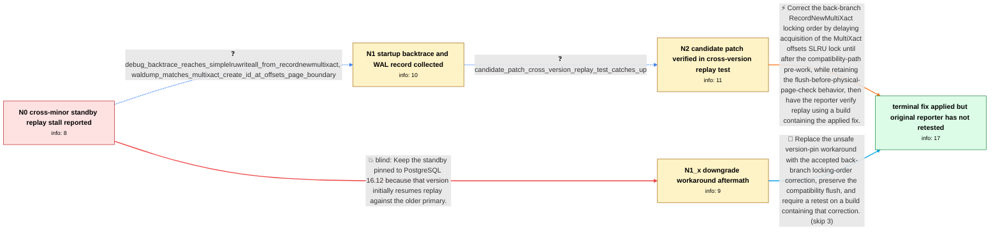

# Review: pg_bug_19490

**Streaming standby on PostgreSQL 16.14 stops applying WAL at MultiXactOffsetSLRU when primary is 16.8**

- source: https://www.postgresql.org/message-id/flat/19490-9c59c6a583513b99%40postgresql.org
- kind: LLM draft (needs review)
- reviewed: `False`
- graph: `data/pgsql_v0/graphs/pg_bug_19490.json` · raw thread: `data/pgsql_v0/raw/pg_bug_19490.json`

## Opening (body)

> I accidentally ran a PostgreSQL 16.14 physical streaming standby against a 16.8 primary on Ubuntu 22.04. WAL continues to arrive and receive/write/flush stay current, but replay stops and the lag grows to about 9 GB. The standby startup process repeatedly reports wait_event_type = LWLock and wait_event = MultiXactOffsetSLRU and is parked in futex_wait_queue. After resetting pg_stat_slru and waiting 60 seconds under live streaming, both MultiXactMember and MultiXactOffset show zero reads, writes, hits, or zeroed blocks. The replay LSN remains frozen while the receive LSN advances. There are no hot-standby readers, MultiXact ages on the primary are small, and the other 16.8 replicas are unaffected. Restarting clears the block temporarily, but it recurs after catch-up. Downgrading this standby to 16.12 with the same data directory initially restored normal replay.

## Satisfaction conditions

1. Must identify the final accepted root cause: during back-branch cross-version MultiXact redo, RecordNewMultiXact already holds the MultiXact offsets SLRU lock when SimpleLruWriteAll attempts to acquire that same control lock, causing the startup process to self-deadlock before any SLRU I/O occurs.
2. The diagnosis must be grounded in the frozen replay with advancing receive LSN, zero MultiXact SLRU activity, the startup backtrace through SimpleLruWriteAll and RecordNewMultiXact, and the matching MultiXact CREATE_ID WAL record.
3. Must describe the accepted fix as moving the initial MultiXact offsets SLRU lock acquisition later, consistent with newer branches, while preserving the flush-before-physical-page-check compatibility behavior.
4. Must not recommend permanently pinning the standby to 16.12: that workaround later failed recovery with a pg_multixact offsets short read.
5. Must not present removing SimpleLruWriteAll as the fix, because the thread withdrew that approach after identifying WAL orderings where dirty buffered pages must be flushed before the physical-page check.
6. Must ask the original reporter to retest a build containing the applied fix and confirm that replay catches up before declaring the production incident resolved; separate test and buildfarm success are supporting evidence, not the reporter's own verification.

## Edges

| edge | type | gates / info | payload |
|---|---|---|---|
| `e1_N0__N1` | clarification_only | asks: debug_backtrace_reaches_simplelruwriteall_from_recordnewmultixact, waldump_matches_multixact_create_id_at_offsets_page_boundary | The backtrace ends in PGSemaphoreLock, then LWLockAcquire in exclusive mode, SimpleLruWriteAll with MultiXactO / My WAL dump shows the matching MultiXact CREATE_ID record: multi 79871, offset 218449, nmembers 2. The debugge |
| `e2_N1__N2` | clarification_only | asks: candidate_patch_cross_version_replay_test_catches_up | I tested a fresh REL_16_8 primary with a REL_16_14 standby built with assertions and generated about 2300 Mult |
| `e3_N2__N_terminal` | solution_only | req_info: primary_16_8_standby_16_14_cross_minor_replay, wal_receive_advances_while_replay_lsn_frozen, startup_waits_on_multixact_offset_slru_lwlock, multixact_slru_counters_remain_zero, debug_backtrace_reaches_simplelruwriteall_from_recordnewmultixact, waldump_matches_multixact_create_id_at_offsets_page_boundary, candidate_patch_cross_version_replay_test_catches_up elements: identifies_same_backend_reacquisition_of_the_multixact_offset_slru_lock_as_the_deadlock, moves_initial_multixact_offset_slru_lock_acquisition_after_the_compatibility_prework, preserves_the_flush_before_the_physical_page_existence_check, asks_user_to_verify_on_a_build_containing_the_fix_before_declaring_resolution | Correct the back-branch RecordNewMultiXact locking order by delaying acquisition of the MultiXact offsets SLRU lock until after the compatibility-path pre-work, while retaining the flush-before-physical-page-check behavior, then have the reporter verify replay using a build containing the applied fix. |
| `e4_N0__N1_x` | solution_only **BLIND** | req_info: downgrade_to_16_12_initially_restored_replay elements: recommends_pinning_the_standby_to_16_12 | Keep the standby pinned to PostgreSQL 16.12 because that version initially resumes replay against the older primary. |
| `e5_N1_x__N_terminal` | solution_only | req_info: primary_16_8_standby_16_14_cross_minor_replay, startup_waits_on_multixact_offset_slru_lwlock, multixact_slru_counters_remain_zero, standby_16_12_later_fails_recovery_on_multixact_offset_file elements: rejects_the_16_12_pin_as_a_durable_fix, identifies_the_multixact_offset_slru_self_deadlock, uses_the_later_lock_acquisition_order_without_removing_the_compatibility_flush, asks_user_to_verify_on_a_build_containing_the_fix_before_declaring_resolution | Replace the unsafe version-pin workaround with the accepted back-branch locking-order correction, preserve the compatibility flush, and require a retest on a build containing that correction. |

## Nodes

| node | terminal | volunteered | images | symptoms |
|---|---|---|---|---|
| `N0` |  | 3 | 0 | My 16.14 standby keeps receiving WAL from the 16.8 primary, but its replay LSN remains frozen and the locally buffered WAL grows to about 9  |
| `N1_x` |  | 1 | 0 | With the standby pinned to 16.12, replay initially runs normally, but after more than 12 hours recovery terminates with 'could not access st |
| `N1` |  | 0 | 0 | The affected startup process is still blocked on the MultiXactOffsetSLRU lock while replaying a MultiXact CREATE_ID record. |
| `N2` |  | 0 | 0 | In a fresh 16.8-primary and 16.14-standby test, the unpatched startup process blocks when the MultiXact offsets page boundary is crossed, wh |
| `N_terminal` | ✓ | 3 | 0 | A separate cross-version test standby catches up with the patch, and maintainers report that the change has been applied to the affected bra |

## Machine review (audit pass, adversarially verified)

Auditor verdict: **n/a** · 0 of 0 findings survived independent refutation.

__

## Review checklist

> The graph is the case's ANSWER KEY, not a transcript: edge order need
> not mirror thread chronology. Do not file chronology mismatch as a
> defect; what must be faithful is who knew what, when.

Structural (machine-checked by `scripts/validate.py`, re-verify after edits):

- [ ] validates: schema + info-containment + terminal reachability

Semantic (the defect catalog — check each against the source thread):

- [ ] **Faithful blind paths** — every `is_known_blind_path` edge corresponds
  to an attempt actually falsified in the thread (or a brush-off the
  reporter rejected). No invented failures; no ACCEPTED fix mislabeled as
  a blind path (the most common LLM defect class).
- [ ] **Gettable required info** — every id in any `solution.required_info`
  is obtainable: a clarification on some edge, or in the start node's
  info_state, or volunteered (with matching `volunteered_info` text).
  Engineer-only inference belongs in `info_inferred_by_engineer` /
  `inference_hint`, not in hard required_info.
- [ ] **Measurement-class rule** — handler-initiated measurements the user
  executed (bisections, test builds, config probes, version checks) are
  clarification edges, not solutions; their answers state what the
  measurement showed.
- [ ] **No logistics gates** — `required_elements_for_full_match` encode the
  technical diagnostic→fix chain, not release/packaging/scheduling
  remarks the engineer merely mentioned.
- [ ] **Coherent reveals** — each `user_answer_in_this_oncall` is consistent
  with the thread, delivers what it promises, and stays in the user's
  voice (no future knowledge, no diagnosis the user never made).
- [ ] **Symptoms are observations** — `symptoms_visible` contains only what
  the user can see; no causes or advice.
- [ ] **Terminal semantics** — satisfaction_conditions demand root cause +
  evidence grounding + prohibition of falsified moves + user verification;
  the terminal node is the verified-resolved state.
- [ ] **Image assignment** — referenced attachments exist and sit on the
  right hook (opening / node symptom / clarification evidence).
- [ ] **Persona** — matches the reporter's actual expertise and style.

## How to sign off

1. Edit the graph JSON if needed (authored fields only; keep
   `concrete_example` as the factual record).
2. `uv run scripts/validate.py '<graph path>'`
3. Set `metadata.hitl_reviewed: true` in the graph JSON.
4. Re-run `uv run scripts/make_review_docs.py` to refresh this page.
