# Review: pg_bug_19490

**Streaming standby on PostgreSQL 16.14 stops applying WAL at MultiXactOffsetSLRU when primary is 16.8**

- source: https://www.postgresql.org/message-id/flat/19490-9c59c6a583513b99%40postgresql.org
- kind: LLM draft (needs review)
- reviewed: `False`
- graph: `data/pgsql_v0/graphs/pg_bug_19490.json` · raw thread: `data/pgsql_v0/raw/pg_bug_19490.json`

```mermaid
flowchart LR
    N0["<b>N0 cross-minor WAL replay stall reported</b><br/><small>info: 7</small>"]
    N1["<b>N1 startup backtrace and WAL record collected</b><br/><small>info: 8</small>"]
    N2_x["<b>N2_x downgrade workaround aftermath</b><br/><small>info: 8</small>"]
    N3["<b>N3 self-deadlock diagnosed and lock-placement fix proposed</b><br/><small>info: 13</small>"]
    N4["<b>N4 patch verified with cross-version replay</b><br/><small>info: 14</small>"]
    N_terminal["<b>terminal resolved</b><br/><small>info: 14</small>"]
    N0 -.->|"❓ startup_backtrace_and_multixact_wal_record_collected"| N1
    linkStyle 0 stroke:#3b82f6,stroke-width:2px
    N1 ==>|"⚡ Diagnose the back-branch MultiXact replay self-deadlock and patch RecordNewMultiXact by moving acquisition of MultiXactOffsetSLRULock later, matching PostgreSQL 17 and 18, while retaining the required SimpleLruWriteAll flush."| N3
    linkStyle 1 stroke:#f97316,stroke-width:2px
    N3 -.->|"❓ patched_cross_version_replay_test_catches_up"| N4
    linkStyle 2 stroke:#3b82f6,stroke-width:2px
    N4 ==>|"⚡ Use the corrected PostgreSQL 14-16 back-branch implementation that performs the compatibility flush and physical-page check before acquiring MultiXactOffsetSLRULock, eliminating the self-deadlock during cross-version WAL replay."| N_terminal
    linkStyle 3 stroke:#f97316,stroke-width:2px
    N0 ==>|"💥 blind: Keep the standby pinned to PostgreSQL 16.12 as the permanent workaround because it initially avoids the MultiXactOffsetSLRU wait."| N2_x
    linkStyle 4 stroke:#ef4444,stroke-width:2px
    class N0 start
    class N1 normal
    class N2_x normal
    class N3 normal
    class N4 normal
    class N_terminal terminal
    classDef start fill:#fee2e2,stroke:#b91c1c,color:#000
    classDef terminal fill:#dcfce7,stroke:#15803d,color:#000
    classDef normal fill:#fef3c7,stroke:#a16207,color:#000
```

## Opening (body)

> I accidentally ran a PostgreSQL 16.14 physical streaming standby against a primary still on 16.8. WAL continues to arrive and is written and flushed, but replay stops and the lag grows to about 9 GB. The startup process remains parked in futex_wait_queue with wait_event LWLock:MultiXactOffsetSLRU, while pg_stat_slru shows no MultiXact reads or writes. Restarting only clears it temporarily before it repeats. Downgrading the standby binary to 16.12 with the same data directory initially restored replay under the same workload.

## Satisfaction conditions

1. Must identify the root cause: on PostgreSQL 14-16 back branches, the compatibility path added by commit 77dff5d937b1 calls SimpleLruWriteAll while RecordNewMultiXact already holds MultiXactOffsetSLRULock; SimpleLruWriteAll attempts to acquire the same SLRU control lock, causing the startup process to self-deadlock.
2. The diagnosis must be grounded in the collected evidence: receive and flush advance while replay is frozen, no SLRU I/O occurs, and the backtrace places LWLockAcquire and SimpleLruWriteAll beneath RecordNewMultiXact during MultiXact WAL redo.
3. The fix must move acquisition of MultiXactOffsetSLRULock later, matching v17 and v18, while preserving SimpleLruWriteAll before the physical-page check; simply deleting the flush is unsafe because dirty buffered offsets pages could otherwise be mistaken for missing pages.
4. Must not present restarting the standby or permanently pinning it to 16.12 as the resolution: restart only delays recurrence, and 16.12 later failed recovery with a pg_multixact offsets short read.
5. Must require successful cross-version replay verification across a MultiXact offsets page boundary before declaring the issue resolved.

## Edges

| edge | type | gates / info | payload |
|---|---|---|---|
| `e1_N0__N1` | clarification_only | asks: startup_backtrace_and_multixact_wal_record_collected | I captured another occurrence. The relevant frames are: PGSemaphoreLock; LWLockAcquire(..., LW_EXCLUSIVE); Sim |
| `e2_N1__N3` | solution_only | req_info: standby_1614_replays_wal_from_primary_168, startup_waits_on_multixact_offset_slru_futex, zero_multixact_slru_activity_during_wait, startup_backtrace_and_multixact_wal_record_collected elements: identifies_recursive_acquisition_of_multixact_offset_slru_lock, connects_deadlock_to_simplelruwriteall_inside_recordnewmultixact, moves_outer_lock_acquisition_later, preserves_simplelruwriteall_flush | Diagnose the back-branch MultiXact replay self-deadlock and patch RecordNewMultiXact by moving acquisition of MultiXactOffsetSLRULock later, matching PostgreSQL 17 and 18, while retaining the required SimpleLruWriteAll flush. |
| `e3_N3__N4` | clarification_only | asks: patched_cross_version_replay_test_catches_up | I tested the patch in a fresh environment with a REL_16_8 primary and a REL_16_14 standby built with --enable- |
| `e4_N4__N_terminal` | solution_only | req_info: standby_1614_replays_wal_from_primary_168, receive_write_flush_advance_while_replay_is_frozen, startup_waits_on_multixact_offset_slru_futex, zero_multixact_slru_activity_during_wait, commit_77dff5d_added_compatibility_flush_path, recordnewmultixact_self_deadlocks_by_reacquiring_same_slru_lock, multixact_page_boundary_triggers_compatibility_path, simplelruwriteall_flush_must_be_preserved, move_multixact_offset_lock_acquisition_later, startup_backtrace_and_multixact_wal_record_collected, patched_cross_version_replay_test_catches_up elements: identifies_same_backend_recursive_lwlock_acquisition_as_root_cause, moves_multixact_offset_lock_acquisition_after_compatibility_flush_check, retains_simplelruwriteall_to_protect_dirty_slru_page_handling, requires_successful_cross_version_replay_verification | Use the corrected PostgreSQL 14-16 back-branch implementation that performs the compatibility flush and physical-page check before acquiring MultiXactOffsetSLRULock, eliminating the self-deadlock during cross-version WAL replay. |
| `e5_N0__N2_x` | solution_only **BLIND** | req_info: downgrade_to_1612_initially_restores_replay elements: recommends_1612_as_permanent_workaround | Keep the standby pinned to PostgreSQL 16.12 as the permanent workaround because it initially avoids the MultiXactOffsetSLRU wait. |

## Nodes

| node | terminal | volunteered | images | symptoms |
|---|---|---|---|---|
| `N0` |  | 4 | 0 | On my 16.14 standby receiving WAL from a 16.8 primary, receive, write, and flush stay current while replay remains frozen and the local WAL  |
| `N1` |  | 0 | 0 | Replay is still stopped, and my startup-process backtrace is blocked in SimpleLruWriteAll called from RecordNewMultiXact during multixact_re |
| `N2_x` |  | 1 | 0 | After more than 12 hours on 16.12, recovery stops with FATAL: could not access status of transaction 24958976 because pg_multixact/offsets/0 |
| `N3` |  | 0 | 0 | The unpatched standby remains capable of parking forever on MultiXactOffsetSLRU when it replays the affected MultiXact record. |
| `N4` |  | 0 | 0 | In the 16.8-primary to 16.14-standby reproduction, the unpatched startup process deadlocks when the workload crosses a MultiXact offsets pag |
| `N_terminal` | ✓ | 0 | 0 | With the corrected lock placement, the standby replays the cross-version WAL through the MultiXact offsets page boundary and catches up with |

## Review checklist

> The graph is the case's ANSWER KEY, not a transcript: edge order need
> not mirror thread chronology. Do not file chronology mismatch as a
> defect; what must be faithful is who knew what, when.

Structural (machine-checked by `scripts/validate.py`, re-verify after edits):

- [ ] validates: schema + info-containment + terminal reachability

Semantic (the defect catalog — check each against the source thread):

- [ ] **Faithful blind paths** — every `is_known_blind_path` edge corresponds
  to an attempt actually falsified in the thread (or a brush-off the
  reporter rejected). No invented failures; no ACCEPTED fix mislabeled as
  a blind path (the most common LLM defect class).
- [ ] **Gettable required info** — every id in any `solution.required_info`
  is obtainable: a clarification on some edge, or in the start node's
  info_state, or volunteered (with matching `volunteered_info` text).
  Engineer-only inference belongs in `info_inferred_by_engineer` /
  `inference_hint`, not in hard required_info.
- [ ] **Measurement-class rule** — handler-initiated measurements the user
  executed (bisections, test builds, config probes, version checks) are
  clarification edges, not solutions; their answers state what the
  measurement showed.
- [ ] **No logistics gates** — `required_elements_for_full_match` encode the
  technical diagnostic→fix chain, not release/packaging/scheduling
  remarks the engineer merely mentioned.
- [ ] **Coherent reveals** — each `user_answer_in_this_oncall` is consistent
  with the thread, delivers what it promises, and stays in the user's
  voice (no future knowledge, no diagnosis the user never made).
- [ ] **Symptoms are observations** — `symptoms_visible` contains only what
  the user can see; no causes or advice.
- [ ] **Terminal semantics** — satisfaction_conditions demand root cause +
  evidence grounding + prohibition of falsified moves + user verification;
  the terminal node is the verified-resolved state.
- [ ] **Image assignment** — referenced attachments exist and sit on the
  right hook (opening / node symptom / clarification evidence).
- [ ] **Persona** — matches the reporter's actual expertise and style.

## How to sign off

1. Edit the graph JSON if needed (authored fields only; keep
   `concrete_example` as the factual record).
2. `uv run scripts/validate.py '<graph path>'`
3. Set `metadata.hitl_reviewed: true` in the graph JSON.
4. Re-run `uv run scripts/make_review_docs.py` to refresh this page.
