# Review: bugsrepo_trial_bmo_1822845

**macOS Automator workflow on selected text stopped working in Firefox 111.0 release**

- source: bugzilla.mozilla.org bug 1822845 (BugsRepo public-data trial, annotated 2026-07-29; leak-repair pass 2026-07-31)
- kind: hand-annotated pilot
- reviewed: `False`
- graph: `data/trial/graphs/bmo_1822845.json` · raw thread: `data/trial/raw/bmo_1822845.json`

```mermaid
flowchart LR
    N0["<b>N0 service error reported</b><br/><small>info: 3</small>"]
    N1_x["<b>N1_x permission-regrant aftermath</b><br/><small>info: 4</small>"]
    N2["<b>N2 regression established</b><br/><small>info: 5</small>"]
    N3["<b>N3 regressor bisected</b><br/><small>info: 7</small>"]
    N4["<b>N4 fix verified on try build</b><br/><small>info: 8</small>"]
    N_terminal["<b>terminal resolved</b><br/><small>info: 8</small>"]
    N0 ==>|"💥 blind: Treat it as a macOS permissions problem after an OS update: re-grant Firefox the relevant service permissions in System Settings."| N1_x
    linkStyle 0 stroke:#ef4444,stroke-width:2px
    N0 -.->|"❓ worked_in_earlier_firefox_and_other_apps_daily_use, workflow_details_default_actions_js_open_url"| N2
    linkStyle 1 stroke:#3b82f6,stroke-width:2px
    N2 -.->|"❓ mozregression_points_to_graphicsport_cgcontext_change"| N3
    linkStyle 2 stroke:#3b82f6,stroke-width:2px
    N3 -.->|"❓ try_build_with_partial_revert_verified_fixed"| N4
    linkStyle 3 stroke:#3b82f6,stroke-width:2px
    N4 ==>|"⚡ Land the partial revert of the graphics-context change scoped to the macOS Services pasteboard path, after the reporter has verified it on a provided build."| N_terminal
    linkStyle 4 stroke:#f97316,stroke-width:2px
    class N0 start
    class N1_x normal
    class N2 normal
    class N3 normal
    class N4 normal
    class N_terminal terminal
    classDef start fill:#fee2e2,stroke:#b91c1c,color:#000
    classDef terminal fill:#dcfce7,stroke:#15803d,color:#000
    classDef normal fill:#fef3c7,stroke:#a16207,color:#000
```

## Opening (body)

> I use a macOS Automator workflow that translates selected text. It stopped working in Firefox 111.0: invoking the service on selected text now shows an error saying the service could not be used. Expected: the selected text is supplied to the workflow, which opens a Safari popup with the translation. Screenshot of the error attached.

## Satisfaction conditions

1. Must identify the regression: Firefox 111's replacement of NSGraphicsContext graphicsPort with CGContext broke macOS Services pasteboard writing; this is a Firefox regression, not a macOS permission problem.
2. Must not settle on the macOS-permission direction: it is falsified in-case (no applicable toggle; same workflow works in other apps and worked in earlier Firefox).
3. The fix must be verified by the reporter on a provided build before landing; communicating the release vehicle or GA timeline is a courtesy, not a scored requirement.
4. Must treat the issue as resolved only after user verification.

## Edges

| edge | type | gates / info | payload |
|---|---|---|---|
| `e1_N0__N1_x` | solution_only **BLIND** | req_info: automator_service_error_since_ff111 elements: mentions_regranting_macos_permissions | Treat it as a macOS permissions problem after an OS update: re-grant Firefox the relevant service permissions in System Settings. |
| `e2_N0__N2` | clarification_only | asks: worked_in_earlier_firefox_and_other_apps_daily_use, workflow_details_default_actions_js_open_url | Yes — I use it multiple times a day, so I'd notice a breakage immediately; it worked before the 111 update and / Only default actions: receive current text from any application, run a small JavaScript that builds a translat |
| `e3_N2__N3` | clarification_only | asks: mozregression_points_to_graphicsport_cgcontext_change | Ran mozregression: the last working build is 0a665be7, and the log's final entry names the commit 'Bug 1779478 |
| `e4_N3__N4` | clarification_only | asks: try_build_with_partial_revert_verified_fixed | It works! The workflow opens the translation popup normally again — confirmed on both of our machines. |
| `e5_N4__terminal` | solution_only | req_info: worked_in_earlier_firefox_and_other_apps_daily_use, try_build_with_partial_revert_verified_fixed, mozregression_points_to_graphicsport_cgcontext_change elements: mentions_partial_revert_of_regressing_change, scopes_fix_to_macos_services_path | Land the partial revert of the graphics-context change scoped to the macOS Services pasteboard path, after the reporter has verified it on a provided build. |

## Nodes

| node | terminal | volunteered | images | symptoms |
|---|---|---|---|---|
| `N0` |  | 1 | 0 | Invoking the Automator selected-text service from Firefox 111.0 fails with 'service could not be used'; the workflow previously opened a tra |
| `N1_x` |  | 1 | 0 | I went through the macOS privacy settings and found no permission toggle for Firefox that applies to this service; the linked article is abo |
| `N2` |  | 0 | 0 | The service error still occurs in Firefox 111; the same workflow works in other applications and worked in earlier Firefox versions. |
| `N3` |  | 1 | 0 | The service error still occurs on the installed release build; URL-based selected-text workflows fail the same way. |
| `N4` |  | 0 | 0 | The provided try build (target.dmg) runs the workflow correctly on both of our machines; the installed release build still shows the error. |
| `N_terminal` | ✓ | 0 | 0 | The Automator workflow works again on builds containing the fix; the 'service could not be used' error no longer appears. |

## Review checklist

> The graph is the case's ANSWER KEY, not a transcript: edge order need
> not mirror thread chronology. Do not file chronology mismatch as a
> defect; what must be faithful is who knew what, when.

Structural (machine-checked by `scripts/validate.py`, re-verify after edits):

- [ ] validates: schema + info-containment + terminal reachability

Semantic (the defect catalog — check each against the source thread):

- [ ] **Faithful blind paths** — every `is_known_blind_path` edge corresponds
  to an attempt actually falsified in the thread (or a brush-off the
  reporter rejected). No invented failures; no ACCEPTED fix mislabeled as
  a blind path (the most common LLM defect class).
- [ ] **Gettable required info** — every id in any `solution.required_info`
  is obtainable: a clarification on some edge, or in the start node's
  info_state, or volunteered (with matching `volunteered_info` text).
  Engineer-only inference belongs in `info_inferred_by_engineer` /
  `inference_hint`, not in hard required_info.
- [ ] **Measurement-class rule** — handler-initiated measurements the user
  executed (bisections, test builds, config probes, version checks) are
  clarification edges, not solutions; their answers state what the
  measurement showed.
- [ ] **No logistics gates** — `required_elements_for_full_match` encode the
  technical diagnostic→fix chain, not release/packaging/scheduling
  remarks the engineer merely mentioned.
- [ ] **Coherent reveals** — each `user_answer_in_this_oncall` is consistent
  with the thread, delivers what it promises, and stays in the user's
  voice (no future knowledge, no diagnosis the user never made).
- [ ] **Symptoms are observations** — `symptoms_visible` contains only what
  the user can see; no causes or advice.
- [ ] **Terminal semantics** — satisfaction_conditions demand root cause +
  evidence grounding + prohibition of falsified moves + user verification;
  the terminal node is the verified-resolved state.
- [ ] **Image assignment** — referenced attachments exist and sit on the
  right hook (opening / node symptom / clarification evidence).
- [ ] **Persona** — matches the reporter's actual expertise and style.

## How to sign off

1. Edit the graph JSON if needed (authored fields only; keep
   `concrete_example` as the factual record).
2. `uv run scripts/validate.py '<graph path>'`
3. Set `metadata.hitl_reviewed: true` in the graph JSON.
4. Re-run `uv run scripts/make_review_docs.py` to refresh this page.
