# Review: bugsrepo_trial_bmo_1829487

**Hardware accelerated UI rendering broken (Sony Vaio VPCCA2S0E gen6 gt2)**

- source: bugzilla.mozilla.org bug 1829487 (BugsRepo public-data trial, annotated 2026-07-29; leak-repair pass 2026-07-31)
- kind: hand-annotated pilot
- reviewed: `False`
- graph: `data/trial/graphs/bmo_1829487.json` · raw thread: `data/trial/raw/bmo_1829487.json`

```mermaid
flowchart LR
    N0["<b>N0 expert report with self-bisection</b><br/><small>info: 8</small>"]
    N1_x["<b>N1_x partial-fix aftermath</b><br/><small>info: 9</small>"]
    N2_x["<b>N2_x revert-more measurement outcome</b><br/><small>info: 10</small>"]
    N3["<b>N3 device-scoped decision ready</b><br/><small>info: 12</small>"]
    N_terminal["<b>terminal resolved</b><br/><small>info: 12</small>"]
    N0 ==>|"💥 blind: Update to the latest Nightly containing the clip-mask rendering revert (bug 1830691), expected to temporarily resolve the corruption."| N1_x
    linkStyle 0 stroke:#ef4444,stroke-width:2px
    N1_x -.->|"❓ revert_more_try_build_no_effect_both_arches"| N2_x
    linkStyle 1 stroke:#3b82f6,stroke-width:2px
    N2_x -.->|"❓ driver_is_latest_available_for_eol_sandybridge, motionmark_benchmark_compares_hw_unopt_and_software_paths"| N3
    linkStyle 2 stroke:#3b82f6,stroke-width:2px
    N3 ==>|"⚡ Block the shader-optimization feature on Windows + SandyBridge via the gfx blocklist (keeping hardware WebRender enabled), verify on a provided test build, then update to the Nightly carrying the blocklist entry."| N_terminal
    linkStyle 3 stroke:#f97316,stroke-width:2px
    N0 ==>|"🚀 Block the shader-optimization feature on Windows + SandyBridge via the gfx blocklist (keeping hardware WebRender enabled), verify on a provided test build, then update to the Nightly carrying the blocklist entry. (skip 4)"| N_terminal
    linkStyle 4 stroke:#0ea5e9,stroke-width:2px
    class N0 start
    class N1_x normal
    class N2_x normal
    class N3 normal
    class N_terminal terminal
    classDef start fill:#fee2e2,stroke:#b91c1c,color:#000
    classDef terminal fill:#dcfce7,stroke:#15803d,color:#000
    classDef normal fill:#fef3c7,stroke:#a16207,color:#000
```

## Opening (body)

> Following a recent Nightly update, the whole Firefox UI renders unreadably as soon as I start it (screenshot attached); turning hardware acceleration off renders fine (reference screenshot attached). Reproduces with a fresh profile (mozregression-gui). So far I've only tried 32-bit Firefox. Hardware is a Sony Vaio VPCCA2S0E with Intel gen6 gt2 (SandyBridge HD3000) graphics. I already bisected: first broken build is 1c58e874. I also poked gfx.webrender prefs one at a time: gfx.webrender.use-optimized-shaders=false fixes it, gfx.webrender.software=true fixes it, nine other webrender prefs have no effect. Troubleshooting report (fresh profile, JSON) attached.

## Satisfaction conditions

1. Must identify the root cause class: the optimized-shader path from the relanded shader change miscompiles on the end-of-life Intel SandyBridge (gen6 gt2 / HD3000) driver via ANGLE->D3D11; this is device/driver-specific, not a general WebRender failure.
2. The final fix must be scoped to the affected device class (blocklist optimized shaders on SandyBridge) rather than disabling hardware acceleration or WebRender globally, using the performance-comparison evidence to justify the scope.
3. Must build on the reporter's self-collected evidence (pref bisection, regression window) and must not re-propose the already-falsified move (the clip-mask-revert update); the broader-revert try build was a diagnostic measurement whose negative result must be respected.
4. Must have the reporter verify on a test build or updated Nightly (blocklist entry visible in about:support) before treating the issue as resolved.

## Edges

| edge | type | gates / info | payload |
|---|---|---|---|
| `e1_N0__N1_x` | solution_only **BLIND** | req_info: pref_bisection_use_optimized_shaders_false_fixes elements: mentions_update_to_nightly_with_revert | Update to the latest Nightly containing the clip-mask rendering revert (bug 1830691), expected to temporarily resolve the corruption. |
| `e2_N1_x__N2_x` | clarification_only | asks: revert_more_try_build_no_effect_both_arches | Both zip files (32-bit and 64-bit) still show the problem. I made a blank profile for testing; both report ver |
| `e3_N2_x__N3` | clarification_only | asks: driver_is_latest_available_for_eol_sandybridge, motionmark_benchmark_compares_hw_unopt_and_software_paths | Pretty sure this is the latest: the processor is 2nd-generation Intel Core and end-of-life. Intel's site lists / Ran MotionMark 1.2 on latest Nightly: overall 135.67 ±8.59% on default h/w, 140.15 ±7.74% with optimized shade |
| `e4_N3__terminal` | solution_only | req_info: driver_is_latest_available_for_eol_sandybridge, pref_bisection_use_optimized_shaders_false_fixes, motionmark_benchmark_compares_hw_unopt_and_software_paths elements: mentions_blocklist_optimized_shaders_on_sandybridge, mentions_keeping_hw_webrender_not_full_swgl, mentions_verification_on_test_build_or_updated_nightly | Block the shader-optimization feature on Windows + SandyBridge via the gfx blocklist (keeping hardware WebRender enabled), verify on a provided test build, then update to the Nightly carrying the blocklist entry. |
| `e5_N0__terminal_shortcut` | solution_only | req_info: driver_is_latest_available_for_eol_sandybridge, pref_bisection_use_optimized_shaders_false_fixes, motionmark_benchmark_compares_hw_unopt_and_software_paths elements: mentions_blocklist_optimized_shaders_on_sandybridge, mentions_keeping_hw_webrender_not_full_swgl, mentions_verification_on_test_build_or_updated_nightly | Block the shader-optimization feature on Windows + SandyBridge via the gfx blocklist (keeping hardware WebRender enabled), verify on a provided test build, then update to the Nightly carrying the blocklist entry. |

## Nodes

| node | terminal | volunteered | images | symptoms |
|---|---|---|---|---|
| `N0` |  | 4 | 0 | The entire Firefox UI renders unreadably as soon as Firefox starts with hardware acceleration enabled; disabling hardware acceleration rende |
| `N1_x` |  | 1 | 2 | After updating to the Nightly containing the clip-mask revert, more of the UI works (notably many buttons), but backgrounds and text-on-back |
| `N2_x` |  | 1 | 0 | The provided try builds (32-bit and 64-bit) that revert more of the shader change still show the broken background rendering (verified in a  |
| `N3` |  | 0 | 0 | Broken background rendering persists in default configuration; workarounds (optimized shaders off, or software WebRender) both render correc |
| `N_terminal` | ✓ | 0 | 0 | UI renders correctly on the updated Nightly with default settings; about:support shows WEBRENDER_OPTIMIZED_SHADERS blocklisted due to known  |

## Review checklist

> The graph is the case's ANSWER KEY, not a transcript: edge order need
> not mirror thread chronology. Do not file chronology mismatch as a
> defect; what must be faithful is who knew what, when.

Structural (machine-checked by `scripts/validate.py`, re-verify after edits):

- [ ] validates: schema + info-containment + terminal reachability

Semantic (the defect catalog — check each against the source thread):

- [ ] **Faithful blind paths** — every `is_known_blind_path` edge corresponds
  to an attempt actually falsified in the thread (or a brush-off the
  reporter rejected). No invented failures; no ACCEPTED fix mislabeled as
  a blind path (the most common LLM defect class).
- [ ] **Gettable required info** — every id in any `solution.required_info`
  is obtainable: a clarification on some edge, or in the start node's
  info_state, or volunteered (with matching `volunteered_info` text).
  Engineer-only inference belongs in `info_inferred_by_engineer` /
  `inference_hint`, not in hard required_info.
- [ ] **Measurement-class rule** — handler-initiated measurements the user
  executed (bisections, test builds, config probes, version checks) are
  clarification edges, not solutions; their answers state what the
  measurement showed.
- [ ] **No logistics gates** — `required_elements_for_full_match` encode the
  technical diagnostic→fix chain, not release/packaging/scheduling
  remarks the engineer merely mentioned.
- [ ] **Coherent reveals** — each `user_answer_in_this_oncall` is consistent
  with the thread, delivers what it promises, and stays in the user's
  voice (no future knowledge, no diagnosis the user never made).
- [ ] **Symptoms are observations** — `symptoms_visible` contains only what
  the user can see; no causes or advice.
- [ ] **Terminal semantics** — satisfaction_conditions demand root cause +
  evidence grounding + prohibition of falsified moves + user verification;
  the terminal node is the verified-resolved state.
- [ ] **Image assignment** — referenced attachments exist and sit on the
  right hook (opening / node symptom / clarification evidence).
- [ ] **Persona** — matches the reporter's actual expertise and style.

## How to sign off

1. Edit the graph JSON if needed (authored fields only; keep
   `concrete_example` as the factual record).
2. `uv run scripts/validate.py '<graph path>'`
3. Set `metadata.hitl_reviewed: true` in the graph JSON.
4. Re-run `uv run scripts/make_review_docs.py` to refresh this page.
