# Review: bugsrepo_trial_bmo_1865928

**YouTube videos all green with hardware accel enabled in FF 120**

- source: bugzilla.mozilla.org bug 1865928 (BugsRepo public-data trial, annotated 2026-07-29; leak-repair pass 2026-07-31)
- kind: hand-annotated pilot
- reviewed: `False`
- graph: `data/trial/graphs/bmo_1865928.json` · raw thread: `data/trial/raw/bmo_1865928.json`

```mermaid
flowchart LR
    N0["<b>N0 green video reported</b><br/><small>info: 6</small>"]
    N1["<b>N1 media log read</b><br/><small>info: 9</small>"]
    N2["<b>N2 regressor windowed</b><br/><small>info: 10</small>"]
    N2_x["<b>N2_x wrong prefs aftermath</b><br/><small>info: 11</small>"]
    N3["<b>N3 mechanism confirmed</b><br/><small>info: 11</small>"]
    N4["<b>N4 fix verified on test build</b><br/><small>info: 12</small>"]
    N_terminal["<b>terminal resolved</b><br/><small>info: 12</small>"]
    N0 -.->|"❓ media_profile_shows_dav1d_rdd_errors_and_dxva_d3d11_failure, about_support_shows_zero_copy_and_overlay_blocked_on_old_amd, codec_switch_avc1_test_still_green"| N1
    linkStyle 0 stroke:#3b82f6,stroke-width:2px
    N1 -.->|"❓ mozregression_window_pushlog_2023_11_07_to_11_21"| N2
    linkStyle 1 stroke:#3b82f6,stroke-width:2px
    N2 -.->|"❓ pref_nv12_image_host_false_confirmed_avoids_green"| N3
    linkStyle 2 stroke:#3b82f6,stroke-width:2px
    N3 -.->|"❓ findfix_run_and_beta_test_build_display_video_correctly"| N4
    linkStyle 3 stroke:#3b82f6,stroke-width:2px
    N4 ==>|"⚡ Update Firefox instead of living with degraded config: take the 120.0.1 dot release (regressing pref change backed out) or 121+/122 which contain the NV12 support check fix; keep hardware acceleration enabled."| N_terminal
    linkStyle 4 stroke:#f97316,stroke-width:2px
    N2 ==>|"💥 blind: Flip the other NV12-related prefs (layers.iosurfaceimage.use-nv12, media.wmf.use-nv12-format, media.wmf.zero-copy-nv12-textures) to false to stop the green video."| N2_x
    linkStyle 5 stroke:#ef4444,stroke-width:2px
    class N0 start
    class N1 normal
    class N2 normal
    class N2_x normal
    class N3 normal
    class N4 normal
    class N_terminal terminal
    classDef start fill:#fee2e2,stroke:#b91c1c,color:#000
    classDef terminal fill:#dcfce7,stroke:#15803d,color:#000
    classDef normal fill:#fef3c7,stroke:#a16207,color:#000
```

## Opening (body)

> After updating to Firefox 120 on Windows 10, every YouTube video displays as a solid green frame while audio plays normally. Tested with a brand-new profile with no add-ons; hardware acceleration enabled (default). Disabling hardware acceleration makes video display correctly. Videos on Twitter/X and Instagram are unaffected. Screenshots of both states attached, plus my about:support output and a Firefox Profiler link recorded with the Graphics preset.

## Satisfaction conditions

1. Must identify the root cause: Firefox 120 enabled YUV->NV12 conversion (gfx.video.convert-yuv-to-nv12.image-host-win) on hardware whose GPU/driver path lacks NV12 support (older AMD, D3D11 decoder device creation fails), producing green frames.
2. Diagnosis must be grounded in collected evidence (media-playback profile, about:support gfx flags, mozregression window), not asserted from the symptom alone.
3. The final recommendation must restore correct playback without permanently disabling hardware acceleration: update to 120.0.1 or 121+ (pref flip acceptable only as an explicitly temporary workaround).
4. Must not recommend the other NV12-related prefs (layers.iosurfaceimage.use-nv12, media.wmf.use-nv12-format, media.wmf.zero-copy-nv12-textures) as the fix — they were tried in-case with no effect.
5. Must have the reporter verify the fix (test build or updated release) before treating the issue as resolved.

## Edges

| edge | type | gates / info | payload |
|---|---|---|---|
| `e1_N0__N1` | clarification_only | asks: media_profile_shows_dav1d_rdd_errors_and_dxva_d3d11_failure, about_support_shows_zero_copy_and_overlay_blocked_on_old_amd, codec_switch_avc1_test_still_green | Done. Logging preset: 'Media playback', 15s of green video playback, all upload boxes checked. https://share.f / In the attached about:support, HW_DECODED_VIDEO_ZERO_COPY and VIDEO_HARDWARE_OVERLAY show as blocked, and ther / Stats for nerds screenshot attached: the codec probe did not help — video stays green either way. |
| `e2_N1__N2` | clarification_only | asks: mozregression_window_pushlog_2023_11_07_to_11_21 | Ran mozregression with Good 2023-11-07 and Bad 2023-11-21 (log and progress screenshot attached). I got 6 bad  |
| `e3_N2__N3` | clarification_only | asks: pref_nv12_image_host_false_confirmed_avoids_green | Yes. Tried this in my test profile with FF 120: video displayed green when the pref is true and displayed corr |
| `e4_N3__N4` | clarification_only | asks: findfix_run_and_beta_test_build_display_video_correctly | Ran mozregression --find-fix from build 120 (last bad): the runs start coming up good at the 2023-11-21 nightl |
| `e5_N4__terminal` | solution_only | req_info: pref_nv12_image_host_false_confirmed_avoids_green, findfix_run_and_beta_test_build_display_video_correctly, mozregression_window_pushlog_2023_11_07_to_11_21 elements: mentions_update_to_fixed_release, mentions_regressor_backed_out_or_nv12_support_check, does_not_permanently_disable_hwa | Update Firefox instead of living with degraded config: take the 120.0.1 dot release (regressing pref change backed out) or 121+/122 which contain the NV12 support check fix; keep hardware acceleration enabled. |
| `e6_N2__N2_x` | solution_only **BLIND** | req_info: mozregression_window_pushlog_2023_11_07_to_11_21 elements: mentions_flipping_other_nv12_prefs | Flip the other NV12-related prefs (layers.iosurfaceimage.use-nv12, media.wmf.use-nv12-format, media.wmf.zero-copy-nv12-textures) to false to stop the green video. |

## Nodes

| node | terminal | volunteered | images | symptoms |
|---|---|---|---|---|
| `N0` |  | 2 | 0 | All YouTube videos render as a solid green frame in Firefox 120 with hardware acceleration on; audio is normal; the white channel watermark  |
| `N1` |  | 0 | 0 | Green video persists on YouTube with hardware acceleration on. |
| `N2` |  | 0 | 0 | Green video persists on YouTube with hardware acceleration on. |
| `N2_x` |  | 1 | 0 | Green video unchanged after flipping layers.iosurfaceimage.use-nv12, media.wmf.use-nv12-format and media.wmf.zero-copy-nv12-textures to fals |
| `N3` |  | 0 | 0 | Green video persists in default configuration; setting gfx.video.convert-yuv-to-nv12.image-host-win to false in a test profile displays vide |
| `N4` |  | 0 | 0 | Green video persists on the installed release build; the provided beta test build plays the same video correctly. |
| `N_terminal` | ✓ | 0 | 0 | YouTube video plays correctly with hardware acceleration enabled after updating Firefox. |

## Review checklist

> The graph is the case's ANSWER KEY, not a transcript: edge order need
> not mirror thread chronology. Do not file chronology mismatch as a
> defect; what must be faithful is who knew what, when.

Structural (machine-checked by `scripts/validate.py`, re-verify after edits):

- [ ] validates: schema + info-containment + terminal reachability

Semantic (the defect catalog — check each against the source thread):

- [ ] **Faithful blind paths** — every `is_known_blind_path` edge corresponds
  to an attempt actually falsified in the thread (or a brush-off the
  reporter rejected). No invented failures; no ACCEPTED fix mislabeled as
  a blind path (the most common LLM defect class).
- [ ] **Gettable required info** — every id in any `solution.required_info`
  is obtainable: a clarification on some edge, or in the start node's
  info_state, or volunteered (with matching `volunteered_info` text).
  Engineer-only inference belongs in `info_inferred_by_engineer` /
  `inference_hint`, not in hard required_info.
- [ ] **Measurement-class rule** — handler-initiated measurements the user
  executed (bisections, test builds, config probes, version checks) are
  clarification edges, not solutions; their answers state what the
  measurement showed.
- [ ] **No logistics gates** — `required_elements_for_full_match` encode the
  technical diagnostic→fix chain, not release/packaging/scheduling
  remarks the engineer merely mentioned.
- [ ] **Coherent reveals** — each `user_answer_in_this_oncall` is consistent
  with the thread, delivers what it promises, and stays in the user's
  voice (no future knowledge, no diagnosis the user never made).
- [ ] **Symptoms are observations** — `symptoms_visible` contains only what
  the user can see; no causes or advice.
- [ ] **Terminal semantics** — satisfaction_conditions demand root cause +
  evidence grounding + prohibition of falsified moves + user verification;
  the terminal node is the verified-resolved state.
- [ ] **Image assignment** — referenced attachments exist and sit on the
  right hook (opening / node symptom / clarification evidence).
- [ ] **Persona** — matches the reporter's actual expertise and style.

## How to sign off

1. Edit the graph JSON if needed (authored fields only; keep
   `concrete_example` as the factual record).
2. `uv run scripts/validate.py '<graph path>'`
3. Set `metadata.hitl_reviewed: true` in the graph JSON.
4. Re-run `uv run scripts/make_review_docs.py` to refresh this page.
