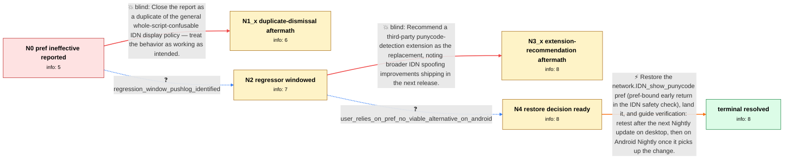

# Review: bugsrepo_trial_bmo_1913022

**network.IDN_show_punycode stopped working**

- source: bugzilla.mozilla.org bug 1913022 (BugsRepo public-data trial, annotated 2026-07-29; leak-repair pass 2026-07-31)
- kind: hand-annotated pilot
- reviewed: `True`
- graph: `data/trial/graphs/bmo_1913022.json` · raw thread: `data/trial/raw/bmo_1913022.json`

## Opening (body)

> I set network.IDN_show_punycode to true in about:config, but visiting https://www.xn--80ak6aa92e.com still shows the URL bar as apple.com instead of the punycode form. Tested on Firefox 130.0b4 64-bit on Windows; Firefox Developer for Android is affected too. This pref is how I protect myself from IDN homograph phishing (Chrome alerts about such domains natively; Firefox does not). Screen recording attached. Please tell me how I can show punycode for dangerous lookalike domains again.

## Satisfaction conditions

1. Must identify that the pref stopped working because the IDN display rework intentionally removed its code path (later cleanup deleted the pref definition) — not user error, not a per-site issue.
2. Must not resolve by dismissal: closing as duplicate of generic homograph handling and recommending the third-party extension are both falsified in this case (extension covers few domains and is unavailable on Android).
3. The resolution must restore an opt-in punycode display equivalent to the old pref, with the reporter verifying on a build that actually contains the patch (release cadence and per-platform rollout details are courtesy information, not scored requirements).
4. Must treat the issue as resolved only after the reporter confirms on an updated build.

## Edges

| edge | type | gates / info | payload |
|---|---|---|---|
| `e1_N0__N1_x` | solution_only **BLIND** | req_info: pref_idn_show_punycode_true_has_no_effect elements: mentions_closing_as_duplicate_or_by_design | Close the report as a duplicate of the general whole-script-confusable IDN display policy — treat the behavior as working as intended. |
| `e2_N0__N2` | clarification_only | asks: regression_window_pushlog_identified | I followed the mozregression guide someone linked me — it finished with this pushlog link: https://hg.mozilla. |
| `e3_N2__N3_x` | solution_only **BLIND** | req_info: pref_idn_show_punycode_true_has_no_effect elements: mentions_third_party_extension_as_replacement | Recommend a third-party punycode-detection extension as the replacement, noting broader IDN spoofing improvements shipping in the next release. |
| `e4_N2__N4` | clarification_only | asks: user_relies_on_pref_no_viable_alternative_on_android | Security guides recommend enabling it manually since Firefox shows no alert (Chrome does natively). On Android |
| `e5_N4__terminal` | solution_only | req_info: user_relies_on_pref_no_viable_alternative_on_android, regression_window_pushlog_identified elements: mentions_restoring_the_pref, asks_user_to_verify_on_a_build_containing_the_patch | Restore the network.IDN_show_punycode pref (pref-bound early return in the IDN safety check), land it, and guide verification: retest after the next Nightly update on desktop, then on Android Nightly once it picks up the change. |

## Nodes

| node | terminal | volunteered | images | symptoms |
|---|---|---|---|---|
| `N0` |  | 2 | 0 | With network.IDN_show_punycode=true, homograph domains (e.g. xn--80ak6aa92e.com) still display in their lookalike unicode form in the URL ba |
| `N1_x` |  | 1 | 0 | The report was marked resolved but flipping the pref still changes nothing — homograph domains still display as apple.com. |
| `N2` |  | 0 | 0 | Setting the pref still has no effect; homograph domains keep displaying in their lookalike form. |
| `N3_x` |  | 1 | 0 | I installed the recommended punycode extension: it flags only a few domains and misses my test cases; on my Android I can't install extensio |
| `N4` |  | 0 | 0 | I set the pref again and homograph domains still show as apple.com; on Android stable there's no about:config and the punycode extensions wo |
| `N_terminal` | ✓ | 0 | 0 | After updating to a Nightly containing the restored pref, flipping network.IDN_show_punycode=true shows homograph domains in punycode form i |

## Review checklist

> The graph is the case's ANSWER KEY, not a transcript: edge order need
> not mirror thread chronology. Do not file chronology mismatch as a
> defect; what must be faithful is who knew what, when.

Structural (machine-checked by `scripts/validate.py`, re-verify after edits):

- [ ] validates: schema + info-containment + terminal reachability

Semantic (the defect catalog — check each against the source thread):

- [ ] **Faithful blind paths** — every `is_known_blind_path` edge corresponds
  to an attempt actually falsified in the thread (or a brush-off the
  reporter rejected). No invented failures; no ACCEPTED fix mislabeled as
  a blind path (the most common LLM defect class).
- [ ] **Gettable required info** — every id in any `solution.required_info`
  is obtainable: a clarification on some edge, or in the start node's
  info_state, or volunteered (with matching `volunteered_info` text).
  Engineer-only inference belongs in `info_inferred_by_engineer` /
  `inference_hint`, not in hard required_info.
- [ ] **Measurement-class rule** — handler-initiated measurements the user
  executed (bisections, test builds, config probes, version checks) are
  clarification edges, not solutions; their answers state what the
  measurement showed.
- [ ] **No logistics gates** — `required_elements_for_full_match` encode the
  technical diagnostic→fix chain, not release/packaging/scheduling
  remarks the engineer merely mentioned.
- [ ] **Coherent reveals** — each `user_answer_in_this_oncall` is consistent
  with the thread, delivers what it promises, and stays in the user's
  voice (no future knowledge, no diagnosis the user never made).
- [ ] **Symptoms are observations** — `symptoms_visible` contains only what
  the user can see; no causes or advice.
- [ ] **Terminal semantics** — satisfaction_conditions demand root cause +
  evidence grounding + prohibition of falsified moves + user verification;
  the terminal node is the verified-resolved state.
- [ ] **Image assignment** — referenced attachments exist and sit on the
  right hook (opening / node symptom / clarification evidence).
- [ ] **Persona** — matches the reporter's actual expertise and style.

## How to sign off

1. Edit the graph JSON if needed (authored fields only; keep
   `concrete_example` as the factual record).
2. `uv run scripts/validate.py '<graph path>'`
3. Set `metadata.hitl_reviewed: true` in the graph JSON.
4. Re-run `uv run scripts/make_review_docs.py` to refresh this page.
